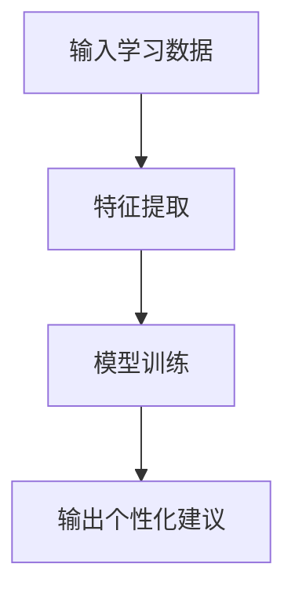

                 


# 构建企业专属AI培训师：员工技能提升助手

> 关键词：AI培训师，员工技能提升，企业培训系统，个性化学习，大模型技术

> 摘要：本文系统性地探讨了如何构建一个企业专属的AI培训师，用于提升员工技能。从问题背景、核心概念到算法原理、系统架构，再到项目实战和最佳实践，文章详细分析了构建AI培训师的全过程，旨在为企业提供一套高效、个性化的员工培训解决方案。

---

# 第一部分: 背景与核心概念

## 第1章: 构建企业专属AI培训师的背景与需求

### 1.1 问题背景

#### 1.1.1 企业员工技能提升的痛点
现代企业竞争日益激烈，员工技能的提升对企业的发展至关重要。然而，传统的企业培训模式存在以下痛点：
- **成本高昂**：线下培训需要大量的人力、物力和时间投入。
- **个性化不足**：不同员工的学习需求和能力水平差异较大，传统培训难以做到个性化。
- **效果难以评估**：难以量化培训效果，难以根据反馈进行优化。

#### 1.1.2 AI技术在企业培训中的应用潜力
随着AI技术的快速发展，尤其是在自然语言处理（NLP）和机器学习领域的突破，AI技术可以为企业培训带来以下优势：
- **智能化推荐**：基于员工的学习行为和能力水平，AI可以实时推荐适合的学习内容。
- **个性化辅导**：AI可以模拟真人导师，为员工提供个性化的学习建议和指导。
- **数据驱动优化**：通过分析学习数据，AI可以不断优化培训方案，提升培训效果。

#### 1.1.3 专属AI培训师的必要性
专属AI培训师是企业内部培训体系的重要组成部分，它能够：
- 提供7x24小时不间断的培训支持。
- 根据员工的具体需求，实时调整培训内容和节奏。
- 通过数据驱动的方式，持续优化培训效果。

### 1.2 问题描述

#### 1.2.1 传统培训模式的局限性
传统的企业培训模式通常存在以下问题：
- **标准化培训**：难以满足员工的个性化学习需求。
- **互动性不足**：员工与培训内容之间的互动较少，学习效果有限。
- **反馈滞后**：培训效果的评估和反馈通常较慢，难以及时调整培训方案。

#### 1.2.2 个性化学习需求的增加
随着员工对职业发展的重视，个性化学习需求逐渐增加。员工希望：
- 根据自己的兴趣和职业规划选择学习内容。
- 学习内容能够动态调整，以适应自己的学习进度。
- 能够随时随地进行学习，不受时间和地点的限制。

#### 1.2.3 AI技术在培训中的应用现状
当前，AI技术在企业培训中的应用还处于初级阶段。大多数企业采用的培训系统仍然是基于规则的推荐系统，缺乏深度的个性化能力。AI培训师的应用还存在以下挑战：
- 数据隐私问题：员工的学习数据需要严格保密。
- 系统稳定性：AI培训师需要7x24小时稳定运行。
- 技术门槛高：构建一个高效的AI培训师需要专业的技术团队。

### 1.3 问题解决

#### 1.3.1 AI培训师的核心功能
AI培训师的核心功能包括：
- **学习需求分析**：通过分析员工的学习历史和能力水平，确定员工的学习需求。
- **个性化推荐**：根据学习需求，推荐适合的学习内容和学习路径。
- **实时反馈与优化**：根据员工的学习反馈，动态调整推荐策略，优化学习效果。

#### 1.3.2 AI培训师如何实现个性化学习
AI培训师通过以下方式实现个性化学习：
- **自然语言处理**：利用大模型理解员工的学习需求和反馈。
- **机器学习**：通过监督学习和强化学习，优化推荐算法。
- **知识图谱**：构建领域知识图谱，支持动态的学习内容推荐。

#### 1.3.3 AI培训师的长期价值
AI培训师的长期价值体现在以下几个方面：
- **提升员工能力**：通过个性化学习，员工的能力水平得到显著提升。
- **降低培训成本**：AI培训师可以替代部分人工培训工作，降低企业的培训成本。
- **数据驱动优化**：通过分析学习数据，不断优化培训策略，提升培训效果。

## 第2章: AI培训师的核心概念与系统架构

### 2.1 核心概念

#### 2.1.1 AI培训师的定义与功能
AI培训师是一个基于大模型的智能系统，具备以下核心功能：
- **学习需求分析**：通过自然语言处理技术，分析员工的学习需求。
- **个性化推荐**：根据学习需求，推荐适合的学习内容和学习路径。
- **实时反馈与优化**：根据员工的学习反馈，动态调整推荐策略，优化学习效果。

#### 2.1.2 基于大模型的自然语言处理能力
AI培训师的核心技术是基于大模型的自然语言处理能力。大模型能够：
- 理解员工的学习需求和反馈。
- 生成个性化的学习建议和指导。
- 支持多轮对话，提供实时互动。

#### 2.1.3 个性化学习路径的设计原理
个性化学习路径的设计基于以下原则：
- **学习者中心**：以员工的学习需求和能力水平为中心，动态调整学习内容。
- **数据驱动**：通过分析学习数据，不断优化学习路径。
- **知识关联**：将学习内容与员工的职业发展需求相结合，提供更有针对性的建议。

### 2.2 核心概念的联系

#### 2.2.1 AI培训师的属性特征对比表
以下表格对比了传统培训系统和AI培训师的核心属性：

| 属性                | 传统培训系统             | AI培训师             |
|---------------------|--------------------------|----------------------|
| 个性化支持          | 有限                    | 强大                |
| 学习反馈            | 延迟                    | 实时                |
| 知识更新            | 周期性                   | 实时                |
| 成本                | 高                     | 较低                |

#### 2.2.2 ER实体关系图架构
以下是AI培训师系统的ER实体关系图：

```mermaid
erd
    职位
    员工
    学习内容
    学习记录
    反馈与优化

    员工 --> 学习内容：学习
    员工 --> 学习记录：记录
    学习内容 --> 反馈与优化：优化
```

---

# 第三部分: 算法原理与数学模型

## 第3章: 基于大模型的AI培训师算法原理

### 3.1 算法原理

#### 3.1.1 监督学习与无监督学习的结合
AI培训师的推荐算法结合了监督学习和无监督学习：
- **监督学习**：基于员工的历史学习数据，训练分类模型，预测员工的学习需求。
- **无监督学习**：基于学习内容的相似性，进行聚类分析，生成推荐列表。

#### 3.1.2 大模型的微调与迁移学习
大模型的微调与迁移学习是AI培训师的核心技术：
- **微调**：在特定领域数据上对大模型进行微调，提升模型在企业培训场景中的表现。
- **迁移学习**：将大模型在通用任务上的知识迁移到企业培训任务中。

#### 3.1.3 个性化推荐算法
个性化推荐算法基于协同过滤和深度学习：
- **协同过滤**：基于员工的相似性推荐学习内容。
- **深度学习**：基于嵌入（Embedding）技术，生成个性化推荐列表。

### 3.2 数学模型与公式

#### 3.2.1 概率论基础
以下是概率论中贝叶斯定理的公式：

$$ P(A|B) = \frac{P(B|A)P(A)}{P(B)} $$

其中：
- \( P(A|B) \) 是在已知 \( B \) 发生的情况下，\( A \) 发生的概率。
- \( P(B|A) \) 是在已知 \( A \) 发生的情况下，\( B \) 发生的概率。
- \( P(A) \) 和 \( P(B) \) 是 \( A \) 和 \( B \) 的先验概率。

#### 3.2.2 深度学习模型的损失函数
以下是常用的交叉熵损失函数的公式：

$$ \text{Loss} = -\sum_{i=1}^{n} y_i \log(p_i) + (1 - y_i)\log(1 - p_i) $$

其中：
- \( y_i \) 是真实标签。
- \( p_i \) 是模型预测的概率。

#### 3.2.3 算法流程图
以下是推荐算法的流程图：



---

## 第4章: 系统分析与架构设计

### 4.1 系统功能设计

#### 4.1.1 领域模型
以下是系统功能设计的领域模型：

```mermaid
classDiagram
    class 员工 {
        员工ID
        职位
        学历
        工作经验
    }
    class 学习内容 {
        内容ID
        内容类型
        内容描述
    }
    class 学习记录 {
        记录ID
        员工ID
        学习时间
        学习内容ID
    }
    class 反馈与优化 {
        反馈ID
        员工ID
        反馈内容
        优化建议
    }
    员工 --> 学习内容：学习
    员工 --> 学习记录：记录
    学习内容 --> 反馈与优化：优化
```

### 4.2 系统架构设计

#### 4.2.1 系统架构图
以下是系统架构设计图：


### 4.3 系统接口设计

#### 4.3.1 接口描述
以下是系统的主要接口描述：

1. **获取学习内容**：
   - 请求：`GET /api/content`
   - 参数：`{ employeeID: string }`
   - 响应：`{ contentList: Content[] }`

2. **提交学习反馈**：
   - 请求：`POST /api/feedback`
   - 参数：`{ employeeID: string, feedback: string }`
   - 响应：`{ status: string }`

3. **优化学习路径**：
   - 请求：`POST /api/optimize`
   - 参数：`{ employeeID: string }`
   - 响应：`{ newPath: string }`

### 4.4 系统交互流程图

```mermaid
sequenceDiagram
    员工 --> 前端服务器：发送学习需求
    前端服务器 --> 后端服务器：请求推荐内容
    后端服务器 --> 数据库：查询学习内容
    后端服务器 --> 前端服务器：返回推荐内容
    前端服务器 --> 员工：显示推荐内容
    员工 --> 前端服务器：提交反馈
    前端服务器 --> 后端服务器：处理反馈
    后端服务器 --> 数据库：更新优化建议
    后端服务器 --> 前端服务器：返回优化建议
    前端服务器 --> 员工：显示优化建议
```

---

## 第5章: 项目实战

### 5.1 环境安装

#### 5.1.1 安装Python
```bash
python --version
```

#### 5.1.2 安装依赖
```bash
pip install numpy pandas scikit-learn transformers
```

### 5.2 核心代码实现

#### 5.2.1 加载数据
```python
import pandas as pd

data = pd.read_csv('train.csv')
```

#### 5.2.2 模型训练
```python
from sklearn.model import LogisticRegression

model = LogisticRegression()
model.fit(X_train, y_train)
```

#### 5.2.3 个性化推荐
```python
def get_recommendations(employee_id):
    # 获取员工信息
    employee = employees[employee_id]
    # 计算相似员工
    similar_employees = find_similar_employees(employee)
    # 返回推荐内容
    return get_contents(similar_employees)
```

### 5.3 案例分析

#### 5.3.1 案例背景
某科技公司希望提升员工的编程能力，引入AI培训师系统。

#### 5.3.2 实施步骤
1. **数据收集**：收集员工的学习数据和能力评估数据。
2. **模型训练**：基于监督学习算法，训练推荐模型。
3. **系统部署**：部署AI培训师系统，提供个性化学习服务。

#### 5.3.3 分析与优化
通过分析学习数据，发现某些员工的学习效果较差，原因可能是学习内容不够精准。于是，优化推荐算法，引入知识图谱技术，进一步提升推荐的精准度。

---

## 第6章: 最佳实践与小结

### 6.1 最佳实践

#### 6.1.1 数据隐私保护
确保员工数据的安全和隐私，遵守相关法律法规。

#### 6.1.2 系统稳定性
构建高可用性的系统架构，确保7x24小时稳定运行。

#### 6.1.3 持续优化
定期分析学习数据，持续优化推荐算法，提升培训效果。

### 6.2 小结
本文详细探讨了构建企业专属AI培训师的全过程，从问题背景到算法原理，再到系统架构和项目实战，为企业的员工技能提升提供了一套高效、个性化的解决方案。

### 6.3 注意事项
- **数据质量**：确保学习数据的准确性和完整性。
- **模型更新**：定期更新模型，保持推荐算法的先进性。
- **用户反馈**：及时收集用户反馈，不断优化系统功能。

### 6.4 拓展阅读
- 《深度学习实战》
- 《自然语言处理入门》
- 《企业培训系统设计》

---

# 结语

通过构建企业专属AI培训师，企业可以显著提升员工的技能水平，降低培训成本，优化培训效果。AI技术的应用为企业培训带来了新的可能性，未来，随着技术的不断进步，AI培训师将在企业培训中发挥越来越重要的作用。

---

作者：AI天才研究院 / AI Genius Institute  
& 禅与计算机程序设计艺术 / Zen And The Art of Computer Programming

