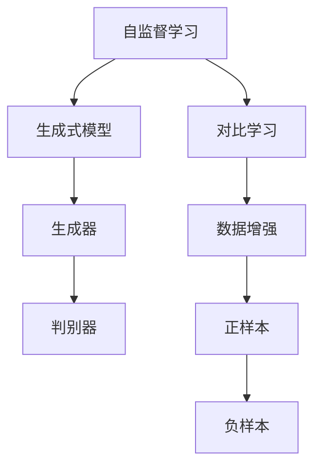
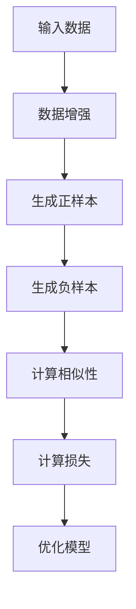
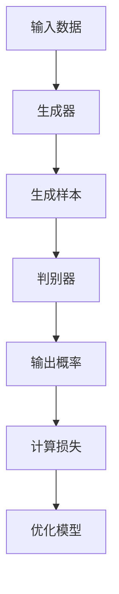
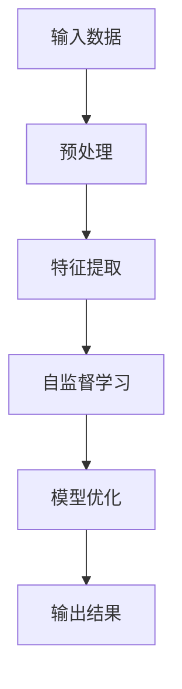
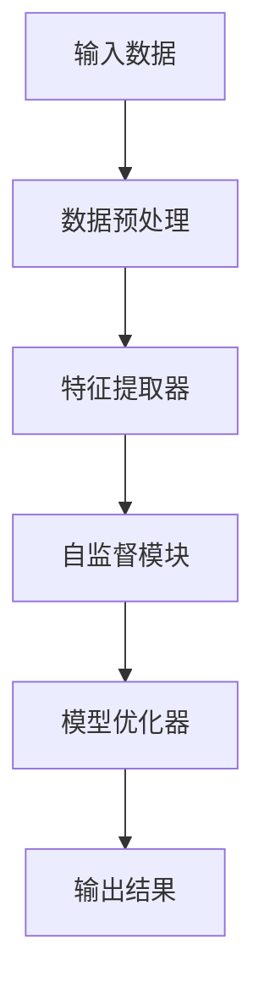
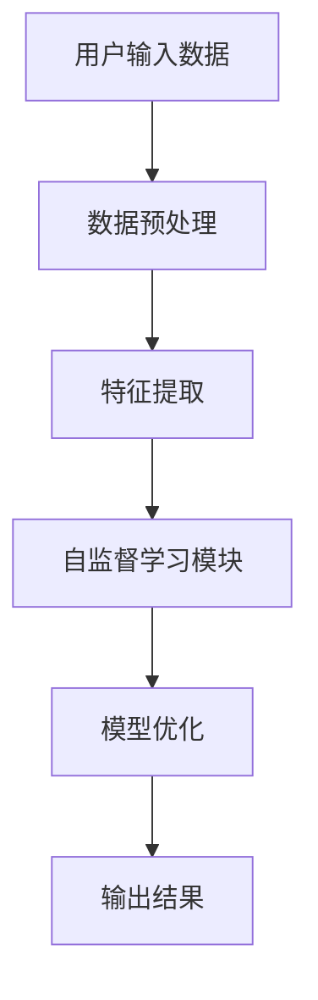

                 


# 自监督学习：减少AI Agent对标注数据的依赖

> 关键词：自监督学习，AI Agent，标注数据，无监督学习，对比学习，生成式模型

> 摘要：自监督学习是一种新兴的学习范式，旨在减少AI Agent对标注数据的依赖。本文从背景、核心概念、算法原理、系统设计、项目实战和最佳实践等多方面，详细阐述了自监督学习的理论与实践。通过对比分析和实际案例，展示了如何利用自监督学习技术降低对标注数据的依赖，同时保持或提升模型性能。

---

# 第一部分: 自监督学习的背景与核心概念

## 第1章: 自监督学习的背景与问题背景

### 1.1 自监督学习的背景

自监督学习（Self-Supervised Learning, SSL）是近年来人工智能领域的重要研究方向之一。随着深度学习技术的快速发展，标注数据的需求量越来越大，但标注数据的获取成本也在急剧上升。这种矛盾促使研究者们探索新的学习范式，以减少对标注数据的依赖。

在监督学习（Supervised Learning）中，模型需要大量标注数据进行训练，这使得训练成本居高不下。无监督学习（Unsupervised Learning）虽然不需要标注数据，但在处理复杂任务时表现有限。自监督学习作为一种折中的方法，通过利用未标注数据中的内在结构信息，以较低的成本实现了接近或超越监督学习的性能。

---

### 1.2 问题背景与问题描述

#### 1.2.1 AI Agent对标注数据的依赖问题

AI Agent的训练通常依赖于大量标注数据，但标注数据的获取需要专业人员的参与，成本高昂。此外，标注数据的质量、数量和代表性也对模型性能有直接影响。在实际应用中，许多场景缺乏足够的标注数据，导致模型难以有效训练。

#### 1.2.2 标注数据的获取成本与挑战

标注数据的获取面临以下挑战：
- **成本高昂**：标注数据需要人工介入，时间与金钱成本较高。
- **数据稀缺性**：某些领域或任务中，标注数据难以获取。
- **数据偏差**：标注数据可能存在偏差，影响模型的泛化能力。

#### 1.2.3 自监督学习如何解决标注数据依赖

自监督学习的核心思想是利用未标注数据中的内在关系，通过预训练任务（pretext tasks）提取有用的特征，从而减少对标注数据的依赖。通过这种方式，模型可以在无监督或弱监督的条件下进行有效学习。

---

### 1.3 自监督学习的核心概念与边界

#### 1.3.1 自监督学习的定义与核心要素

自监督学习是一种无监督学习的变体，其核心思想是通过构造伪标签（pseudo-labels）来监督模型的学习过程。伪标签通常基于模型对未标注数据的预测结果生成，从而形成闭环的自监督机制。

自监督学习的四个核心要素包括：
1. **未标注数据**：模型学习的基础，通常来自大规模未标注数据集。
2. **预训练任务**：通过特定任务生成伪标签，例如对比学习中的图像重建任务。
3. **自监督目标函数**：衡量模型预测与伪标签之间一致性的损失函数。
4. **模型更新**：通过优化目标函数，更新模型参数以提升性能。

#### 1.3.2 自监督学习的边界与外延

自监督学习的边界主要体现在以下几个方面：
- **与监督学习的边界**：自监督学习需要一定形式的监督信号，但这种信号通常来源于未标注数据。
- **与无监督学习的边界**：自监督学习通过构造伪标签引入了弱监督机制，区别于完全无监督学习。
- **与半监督学习的边界**：自监督学习虽然也需要未标注数据，但其监督机制完全依赖于模型的预测结果，与半监督学习中的标注数据辅助有所不同。

#### 1.3.3 自监督学习与其他学习范式的对比

通过对比分析，可以更清晰地理解自监督学习的独特性：

| 学习范式 | 标注数据需求 | 监督信号来源 | 代表方法 |
|----------|--------------|--------------|----------|
| 监督学习 | 高 | 标签 | 线性回归、SVM |
| 无监督学习 | 无 | 数据内在结构 | K-means、聚类 |
| 半监督学习 | 低 | 标签 + 数据 | 图拉普利准则 |
| 自监督学习 | 低 | 数据内在结构 + 预训练任务 | 对比学习、生成式模型 |

---

## 第2章: 自监督学习的核心概念与联系

### 2.1 自监督学习的核心原理

#### 2.1.1 对比学习

对比学习是一种典型的自监督学习方法，其核心思想是通过最大化正样本对的相似性，同时最小化负样本对的相似性。具体实现中，通常将输入数据划分为两个不同的视图（views），并使用对比损失函数衡量这两个视图之间的关系。

对比学习的两个关键步骤：
1. **数据增强**：通过对输入数据进行不同的增强方式，生成正样本对和负样本对。
2. **损失函数设计**：通过对比损失函数，衡量模型对正样本和负样本的区分能力。

对比学习的优势在于其简单高效，能够在大规模数据上快速收敛。

#### 2.1.2 生成式模型

生成式模型是另一种重要的自监督学习方法，其核心思想是通过生成未标注数据来构建监督信号。生成式模型可以通过对抗训练或变分推断等方法，学习数据的生成分布。

生成式模型的两个典型代表：
1. **变分自编码器（VAE）**：通过最大化似然函数和KL散度，学习数据的生成分布。
2. **生成对抗网络（GAN）**：通过生成器和判别器的对抗训练，生成高质量的数据样本。

生成式模型的优势在于其能够生成多样化的数据，但训练过程通常较为复杂。

#### 2.1.3 其他自监督学习方法

除了对比学习和生成式模型，自监督学习还包括许多其他方法，例如：
- **知识蒸馏**：通过教师模型指导学生模型学习。
- **自监督聚类**：通过自适应聚类策略生成伪标签。
- **预训练任务**：例如在NLP任务中，通过遮蔽部分词进行预测。

---

### 2.2 核心概念对比分析

通过对比分析，可以更好地理解不同自监督学习方法的优缺点：

| 方法 | 优势 | 劣势 | 适用场景 |
|------|------|------|----------|
| 对比学习 | 实现简单，收敛快 | 易受数据增强策略影响 | 图像分类、推荐系统 |
| 生成式模型 | 数据生成能力强 | 训练过程复杂 | 文本生成、图像生成 |
| 知识蒸馏 | 易扩展 | 显著依赖教师模型 | 模型压缩、知识迁移 |

---

### 2.3 ER实体关系图架构

通过ER图可以清晰展示自监督学习的核心要素及其关系：



---

## 第3章: 自监督学习的算法原理

### 3.1 对比学习的数学模型

#### 3.1.1 信息量的计算

信息量的计算是对比学习中的重要组成部分。通过最大化正样本对的相似性，可以提升模型对数据分布的学习能力。

信息量公式：
$$ I(x, y) = \frac{1}{\log(1 + \tau)} \cdot \log \left( \frac{p(x,y)}{p(x)p(y)} \right) $$
其中，$\tau$ 是温度参数，用于调节对比强度。

---

#### 3.1.2 对比损失函数

对比损失函数通常由两部分组成：正样本对的损失和负样本对的损失。

对比损失函数：
$$ L = -\log \left( \frac{\exp(s_p / \tau)}{\exp(s_p / \tau) + \sum_{i=1}^{N} \exp(s_i / \tau)} \right) $$
其中，$s_p$ 是正样本对的相似性得分，$s_i$ 是负样本对的相似性得分，$\tau$ 是温度参数。

---

#### 3.1.3 对比学习的优化目标

对比学习的目标是最小化对比损失函数，从而最大化正样本对的相似性。

优化目标：
$$ \min_{\theta} \mathbb{E}_{(x, y) \sim P} \left[ -\log \left( \frac{\exp(s_p / \tau)}{\exp(s_p / \tau) + \sum_{i=1}^{N} \exp(s_i / \tau)} \right) \right] $$

---

### 3.2 生成式模型的数学公式

#### 3.2.1 变分自编码器（VAE）

VAE的目标是最小化证据下界（ELBO）：
$$ \mathcal{L} = \mathbb{E}_{z \sim Q(z|x)} \left[ \log p(x|z) \right] - \mathbb{KL}(Q(z|x) || P(z)) $$

其中，$Q(z|x)$ 是后验分布，$P(z)$ 是先验分布。

---

#### 3.2.2 生成对抗网络（GAN）

GAN由生成器和判别器组成，目标是最小化生成器的损失函数：
$$ \min_{G} \max_{D} \mathbb{E}_{x \sim P} \left[ \log D(x) \right] + \mathbb{E}_{z \sim Q} \left[ \log (1 - D(G(z))) \right] $$

---

### 3.3 算法原理的详细讲解

#### 3.3.1 对比学习的流程图



---

#### 3.3.2 生成式模型的流程图



---

#### 3.3.3 通过Python代码详细阐述

以下是一个简单的对比学习代码示例：

```python
import torch
import torch.nn as nn

class ContrastiveLoss(nn.Module):
    def __init__(self, temperature=1.0):
        super(ContrastiveLoss, self).__init__()
        self.temperature = temperature

    def forward(self, features, labels):
        # 计算正样本对的相似性
        positive_pairs = torch.mean(torch.exp(features[:, labels] / self.temperature))
        # 计算负样本对的相似性
        negative_pairs = torch.mean(torch.exp(features[:, ~labels] / self.temperature))
        # 计算损失
        loss = -torch.log(positive_pairs / (positive_pairs + negative_pairs))
        return loss

# 示例用法
features = torch.randn(100, 128)
labels = torch.zeros(100, dtype=torch.bool)
labels[:50] = 1
loss = ContrastiveLoss()(features, labels)
```

---

## 第4章: 系统分析与架构设计

### 4.1 问题场景介绍

在实际应用中，许多AI Agent需要处理大规模未标注数据。例如，在自然语言处理中，许多任务（如文本分类、问答系统）通常需要大量标注数据。通过自监督学习，可以在预训练阶段利用未标注数据进行特征提取，然后在微调阶段利用少量标注数据进行任务优化。

---

### 4.2 项目介绍

#### 4.2.1 项目目标

本项目旨在通过自监督学习技术，减少AI Agent对标注数据的依赖。具体目标包括：
1. 探索对比学习和生成式模型在不同任务中的表现。
2. 优化自监督学习算法，提升模型性能。
3. 推动自监督学习在实际场景中的应用。

#### 4.2.2 项目范围

项目范围包括：
- 数据收集与预处理
- 模型设计与实现
- 实验分析与结果展示
- 代码实现与文档编写

---

### 4.3 系统功能设计

#### 4.3.1 领域模型（领域模型）



---

#### 4.3.2 系统架构设计



---

### 4.4 系统接口设计

#### 4.4.1 输入接口

- 数据格式：未标注数据集，例如文本、图像等。
- 数据量：大规模未标注数据。

#### 4.4.2 输出接口

- 模型权重：经过自监督学习训练后的模型参数。
- 特征表示：模型对未标注数据的特征提取结果。

---

### 4.5 系统交互流程



---

## 第5章: 项目实战

### 5.1 环境安装与配置

#### 5.1.1 安装依赖

```bash
pip install torch==2.0.0+cu113
pip install numpy==1.21.4
pip install matplotlib==3.5.1
```

#### 5.1.2 配置GPU环境

```bash
export CUDA_VISIBLE_DEVICES="0"
```

---

### 5.2 系统核心实现源代码

#### 5.2.1 数据预处理代码

```python
import torch
import numpy as np

def preprocess_data(data):
    # 数据增强
    transformed_data = []
    for x in data:
        # 随机裁剪
        crop_size = np.random.randint(0, 224)
        x = x[crop_size:crop_size+224, crop_size:crop_size+224]
        transformed_data.append(x)
    return np.array(transformed_data)
```

#### 5.2.2 模型实现代码

```python
import torch
import torch.nn as nn

class ContrastiveModel(nn.Module):
    def __init__(self, embedding_dim=128):
        super(ContrastiveModel, self).__init__()
        self.encoder = nn.Sequential(
            nn.Conv2d(3, 64, kernel_size=3, stride=2),
            nn.ReLU(),
            nn.Conv2d(64, 128, kernel_size=3, stride=2),
            nn.ReLU()
        )
        self.fc = nn.Linear(128, embedding_dim)

    def forward(self, x):
        features = self.encoder(x)
        features = features.view(features.size(0), -1)
        features = self.fc(features)
        return features

model = ContrastiveModel()
```

---

### 5.3 代码应用解读与分析

#### 5.3.1 数据预处理分析

数据预处理代码对输入数据进行了随机裁剪，生成不同的视图（views）。这一步是对比学习中的关键步骤，通过数据增强生成正样本对和负样本对。

#### 5.3.2 模型实现分析

模型实现代码中，编码器部分通过卷积层提取特征，并通过全连接层生成低维嵌入。对比学习的目标是通过优化嵌入空间的相似性，提升模型对数据分布的学习能力。

---

### 5.4 实际案例分析

#### 5.4.1 案例背景

假设我们有一个图像分类任务，但标注数据非常有限。通过自监督学习，可以在预训练阶段利用大规模未标注图像数据进行特征提取，然后在微调阶段利用少量标注数据进行任务优化。

#### 5.4.2 案例分析

1. **预训练阶段**：
   - 使用对比学习方法，对未标注图像数据进行特征提取。
   - 通过数据增强生成正样本对和负样本对，优化对比损失函数。

2. **微调阶段**：
   - 使用少量标注图像数据，对预训练模型进行微调。
   - 通过交叉熵损失函数优化模型，提升分类性能。

---

### 5.5 项目小结

通过本项目，我们展示了自监督学习在减少标注数据依赖方面的巨大潜力。通过对比学习和生成式模型的结合，可以在大规模未标注数据上高效训练模型，同时通过微调任务进一步提升性能。

---

## 第6章: 最佳实践与小结

### 6.1 最佳实践

1. **选择合适的预训练任务**：根据具体任务需求，选择适合的预训练任务，例如对比学习、生成式模型等。
2. **处理未标注数据的质量问题**：未标注数据可能存在噪声或偏差，需通过数据清洗或增强技术进行处理。
3. **模型调优**：通过调整温度参数、学习率等超参数，优化模型性能。

---

### 6.2 小结

本文系统地介绍了自监督学习的背景、核心概念、算法原理、系统设计和项目实战。通过对比分析和实际案例，展示了如何利用自监督学习技术降低对标注数据的依赖，同时保持或提升模型性能。未来，随着自监督学习技术的不断发展，其在AI Agent中的应用将更加广泛和深入。

---

## 作者

作者：AI天才研究院/AI Genius Institute & 禅与计算机程序设计艺术 /Zen And The Art of Computer Programming

