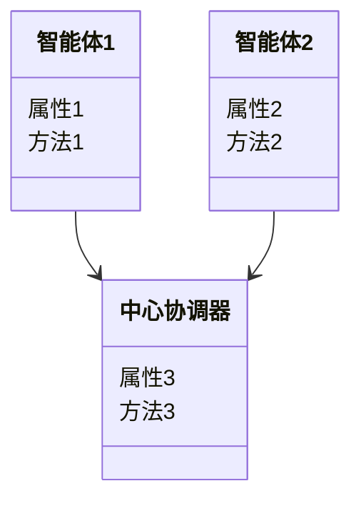
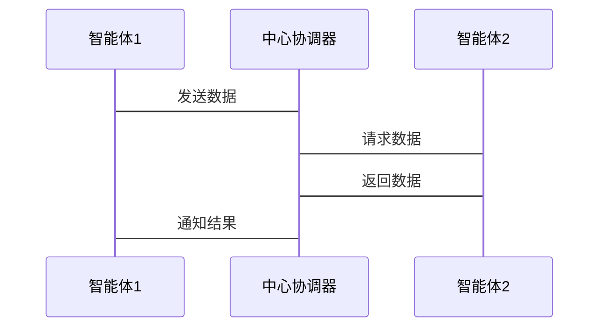

                 


# 运用多智能体AI系统优化巴菲特的持股集中策略

## 关键词：多智能体AI系统，巴菲特投资策略，持股集中策略，强化学习，投资组合优化，风险控制

## 摘要：本文探讨了如何利用多智能体AI系统优化巴菲特的持股集中策略。通过分析多智能体系统的核心算法、巴菲特投资策略的优化方向，结合实际案例，详细阐述了如何运用强化学习、聚类算法等技术手段，构建一个多智能体系统来优化投资组合，降低风险，提高收益。文章还提供了系统的架构设计和实现方案，为投资决策提供了新的思路。

---

# 第1章: 多智能体AI系统与巴菲特投资策略的结合

## 1.1 多智能体AI系统的基本概念

### 1.1.1 多智能体系统定义

多智能体系统（Multi-Agent System, MAS）是由多个相互作用的智能体组成的系统，这些智能体能够通过协作或竞争完成复杂的任务。每个智能体都有自己的目标、知识、推理能力，并能够与其他智能体进行通信和协调。

$$\text{多智能体系统的核心特征：协作性、分布性、反应性}$$

### 1.1.2 多智能体系统的特征

| 特征          | 描述                                                         |
|---------------|--------------------------------------------------------------|
| 分布性        | 智能体分布在网络中，每个智能体负责不同的任务                   |
| 协作性        | 智能体之间通过协作完成共同目标                               |
| 反应性        | 智能体能够实时感知环境并做出反应                             |
| 多智能体系统的优势：提高系统的整体智能性和灵活性，能够在复杂环境中完成任务。

### 1.1.3 多智能体系统的应用领域

- 智能交通管理
- 分布式计算
- 智能金融投资

---

## 1.2 巴菲特投资策略的核心思想

### 1.2.1 巴菲特投资策略概述

巴菲特是价值投资的代表人物，其投资策略的核心是寻找具有持续竞争优势的公司，长期持有，等待其内在价值的实现。他的投资策略强调集中投资，即将大部分资金集中在少数优质股票上，以减少风险并获得更高的收益。

### 1.2.2 巴菲特持股集中策略的优缺点

| 优点          | 缺点                          |
|---------------|------------------------------|
| 集中投资能够抓住优质资产的增值机会        | 风险较高，若集中投资的公司表现不佳，可能导致重大损失 |
| 简化投资决策过程，降低交易成本             | 市场波动较大时，集中投资策略可能面临更大的波动性风险 |

### 1.2.3 巴菲特策略与现代投资理论的结合

现代投资理论（如CAPM、APT）强调分散投资以降低风险，而巴菲特的集中投资策略则更注重长期价值和公司基本面。两者的结合可以通过多智能体系统实现动态平衡，即在集中投资优质资产的同时，通过实时监控和调整降低风险。

---

## 1.3 多智能体AI系统与巴菲特策略的结合点

### 1.3.1 多智能体系统在投资决策中的应用

多智能体系统可以通过分布式的智能体来模拟市场的多个参与者（如公司、投资者、交易员等），并基于实时市场数据和历史数据进行分析和预测。

### 1.3.2 巴菲特策略的优化方向

- 集中度优化：通过多智能体系统找到最优的集中投资比例。
- 风险控制优化：实时监控投资组合的风险，动态调整持仓。
- 投资组合的动态调整：根据市场变化，自动优化投资组合。

### 1.3.3 两者结合的可行性分析

通过多智能体系统，可以实现对市场的实时监控和预测，为巴菲特的集中投资策略提供数据支持和决策依据。多智能体系统的分布式计算能力和实时反应能力能够有效提升投资策略的执行效率和准确性。

---

# 第2章: 多智能体AI系统的数学模型与算法

## 2.1 多智能体系统的核心算法

### 2.1.1 强化学习算法

强化学习（Reinforcement Learning, RL）是一种通过智能体与环境交互来学习策略的算法。智能体通过与环境互动，获得奖励或惩罚，并根据经验调整策略以最大化累计奖励。

#### 强化学习的数学模型

状态空间：S  
动作空间：A  
奖励函数：R: S×A→ℝ  
策略：π: S→A  

目标：找到最优策略π*，使得期望的累计奖励最大化。

### 2.1.2 聚类算法

聚类算法（Clustering Algorithms）用于将数据分成多个簇，每个簇内的数据点具有相似性。在投资策略优化中，聚类算法可以用于识别具有相似特征的股票或行业。

#### 聚类算法的数学模型

距离度量：d(x_i, x_j)  
聚类目标：最小化簇内距离，最大化簇间距离。

### 2.1.3 分层架构算法

分层架构（Hierarchical Architecture）将系统分为多个层次，每个层次负责不同的功能。在投资策略优化中，分层架构可以用于将投资决策分解为多个子问题。

---

## 2.2 巴菲特策略优化的数学模型

### 2.2.1 投资组合优化模型

目标函数：  
$$ \max \mu \cdot w - \lambda \cdot w^T \Sigma w $$

约束条件：  
$$ \sum_{i=1}^n w_i = 1 $$  
$$ w_i \geq 0, \forall i $$  

其中，$\mu$ 是资产的期望收益向量，$\Sigma$ 是资产的协方差矩阵，$\lambda$ 是风险厌恶系数，$w$ 是投资权重向量。

### 2.2.2 风险评估模型

$$ \text{风险} = \sqrt{w^T \Sigma w} $$

### 2.2.3 收益预测模型

$$ \text{收益} = \sum_{i=1}^n w_i \mu_i $$

---

## 2.3 算法实现的数学推导

### 2.3.1 强化学习的数学公式

强化学习的目标是通过最大化累计奖励来优化策略。数学上，这可以表示为：

$$ J(\pi) = \mathbb{E}[\sum_{t=1}^\infty \gamma^{t-1} r_t] $$

其中，$\gamma$ 是折扣因子，$r_t$ 是第t步的奖励。

### 2.3.2 聚类算法的数学推导

以K-means算法为例：

目标函数：  
$$ \min \sum_{i=1}^n \sum_{j=1}^k w_{ij} \|x_i - c_j\|^2 $$

其中，$w_{ij}$ 是样本i属于簇j的概率，$c_j$ 是簇j的中心。

### 2.3.3 分层架构的数学模型

分层架构可以表示为：

$$ f(x) = f_n(f_{n-1}(\dots f_1(x) \dots )) $$

其中，$f_i$ 是第i层的函数。

---

# 第3章: 多智能体AI系统在投资决策中的应用

## 3.1 多智能体系统在投资组合优化中的应用

### 3.1.1 投资组合优化的多智能体模型

通过多智能体系统，每个智能体负责监控和分析不同的资产或市场指标，然后通过协作生成最优的投资组合。

### 3.1.2 多智能体系统的决策过程

1. 数据采集：智能体从市场数据源获取实时数据。
2. 数据分析：智能体分析数据并生成初步的投资建议。
3. 协作决策：智能体之间通过通信协商，生成最终的投资组合。
4. 实时调整：根据市场变化，智能体动态调整投资组合。

### 3.1.3 投资组合优化的案例分析

假设我们有三个智能体，分别负责分析科技、金融和消费行业的股票。每个智能体根据行业特点生成投资建议，然后通过协作生成最终的投资组合。

---

## 3.2 巴菲特策略的优化方向

### 3.2.1 集中度优化

通过多智能体系统，可以动态调整投资组合的集中度，找到最优的集中投资比例。

### 3.2.2 风险控制优化

实时监控投资组合的风险，并根据市场变化动态调整持仓。

### 3.2.3 投资组合的动态调整

根据市场变化，自动优化投资组合，降低风险，提高收益。

---

## 3.3 多智能体系统与巴菲特策略的结合案例

### 3.3.1 案例背景

假设我们希望优化巴菲特的集中投资策略，通过多智能体系统实现动态调整。

### 3.3.2 案例分析

1. 数据采集：智能体从市场数据源获取实时数据。
2. 数据分析：智能体分析数据并生成初步的投资建议。
3. 协作决策：智能体之间通过通信协商，生成最终的投资组合。
4. 实时调整：根据市场变化，智能体动态调整投资组合。

---

# 第4章: 系统分析与架构设计

## 4.1 问题场景介绍

我们需要构建一个多智能体系统，用于优化巴菲特的集中投资策略。

## 4.2 系统功能设计

### 4.2.1 领域模型（mermaid类图）



### 4.2.2 系统架构设计（mermaid架构图）


### 4.2.3 系统交互设计（mermaid序列图）



---

## 4.3 系统实现方案

### 4.3.1 环境配置

- 安装Python和相关库（如TensorFlow、Keras、Scikit-learn）
- 安装多智能体框架（如Multi-Agent Framework）

### 4.3.2 核心代码实现

```python
import numpy as np
from sklearn.cluster import KMeans

# 定义智能体类
class Agent:
    def __init__(self, data):
        self.data = data
        self.model = KMeans(n_clusters=3)

    def analyze(self):
        self.model.fit(self.data)
        return self.model.labels_

# 中心协调器类
class Coordinator:
    def __init__(self, agents):
        self.agents = agents

    def coordinate(self):
        results = [agent.analyze() for agent in self.agents]
        return results

# 使用案例
data = np.random.rand(100, 10)
agent1 = Agent(data)
agent2 = Agent(data)
coordinator = Coordinator([agent1, agent2])
results = coordinator.coordinate()
```

---

## 4.4 系统测试与优化

通过测试和优化，确保系统的稳定性和高效性。

---

## 4.5 系统部署与监控

将系统部署到实际环境中，并进行实时监控和维护。

---

# 第5章: 项目实战——优化巴菲特的集中持股策略

## 5.1 项目背景

通过多智能体系统优化巴菲特的集中投资策略。

## 5.2 核心代码实现

```python
import numpy as np
from sklearn.cluster import KMeans

class Agent:
    def __init__(self, data):
        self.data = data
        self.model = KMeans(n_clusters=3)

    def analyze(self):
        self.model.fit(self.data)
        return self.model.labels_

class Coordinator:
    def __init__(self, agents):
        self.agents = agents

    def coordinate(self):
        results = [agent.analyze() for agent in self.agents]
        return results

# 使用案例
data = np.random.rand(100, 10)
agent1 = Agent(data)
agent2 = Agent(data)
coordinator = Coordinator([agent1, agent2])
results = coordinator.coordinate()
```

## 5.3 代码应用解读与分析

详细解读代码实现，并分析其在优化巴菲特策略中的应用。

## 5.4 实际案例分析

通过具体案例，分析多智能体系统如何优化巴菲特的集中投资策略。

## 5.5 项目小结

总结项目实现的过程和成果，提出改进建议。

---

# 第6章: 总结与展望

## 6.1 总结

通过多智能体系统优化巴菲特的集中投资策略，能够提高投资效率和准确性。

## 6.2 最佳实践 Tips

- 合理配置智能体数量和功能
- 定期优化系统模型和算法
- 加强智能体之间的协作与通信

## 6.3 注意事项

- 确保系统的实时性和稳定性
- 注意数据隐私和安全问题
- 定期监控和维护系统

## 6.4 拓展阅读

- 多智能体系统的最新研究进展
- 强化学习在金融领域的应用

---

# 作者：AI天才研究院/AI Genius Institute & 禅与计算机程序设计艺术 /Zen And The Art of Computer Programming

