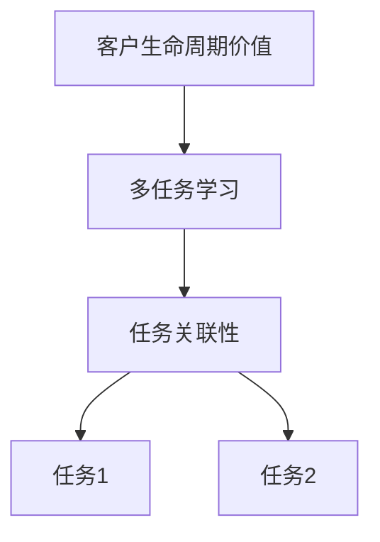
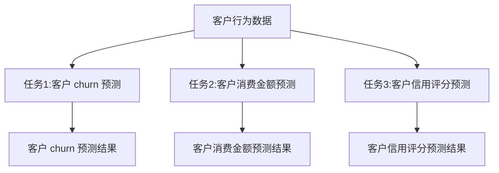
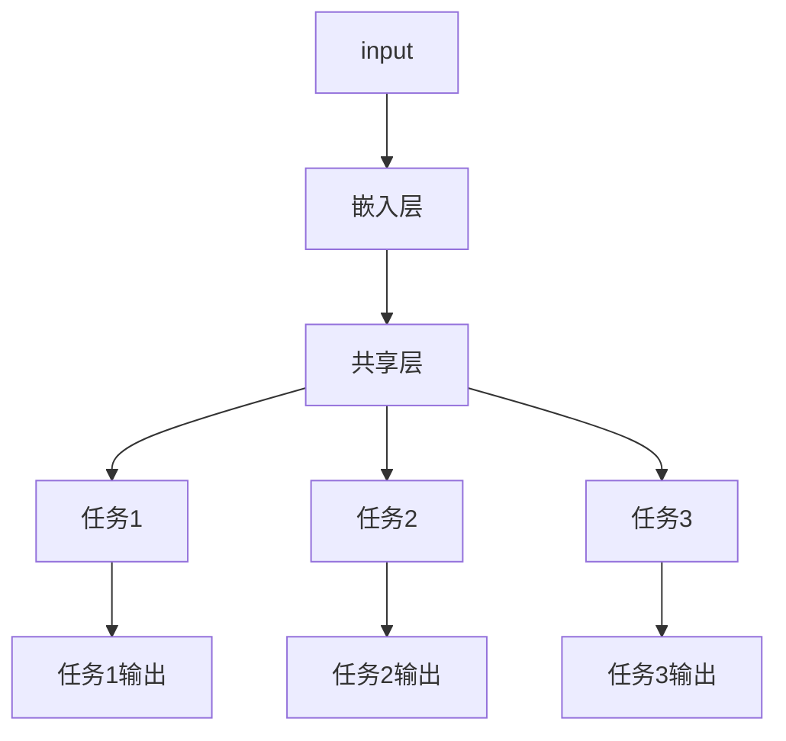
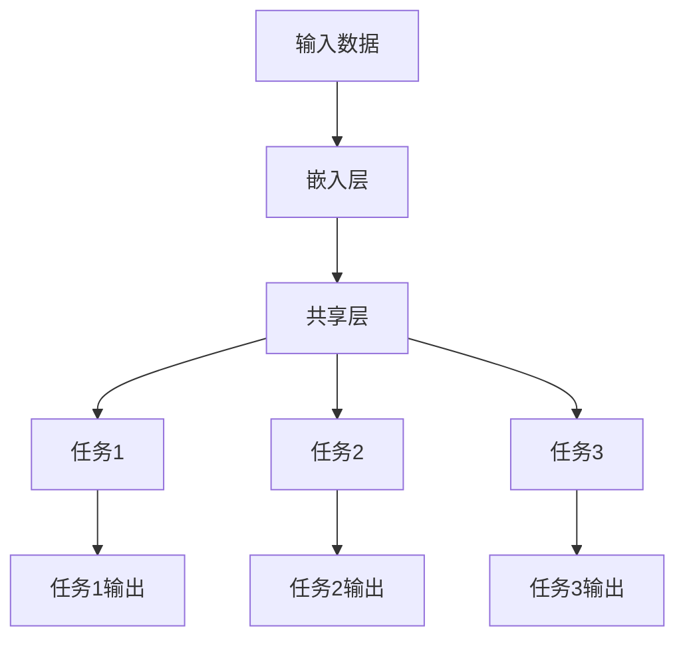
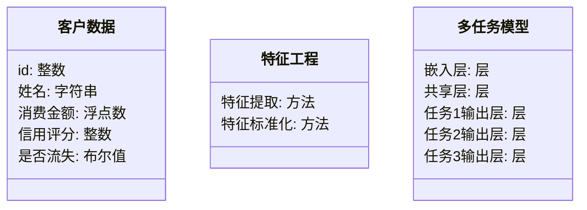
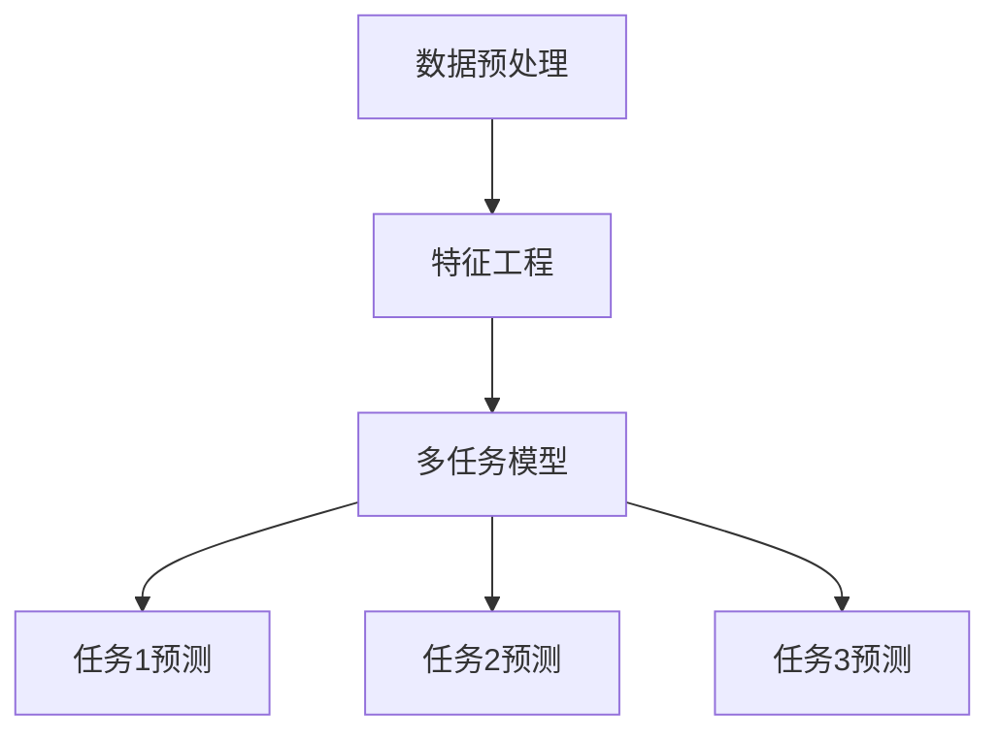
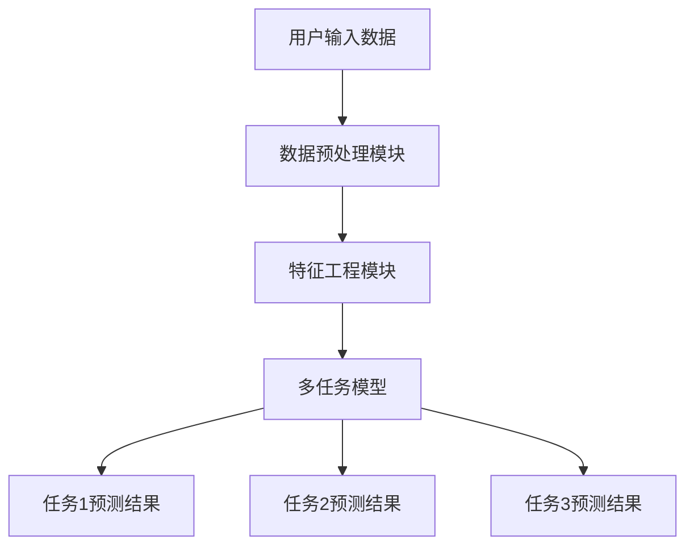

                 


# 金融领域多任务学习在客户生命周期价值预测中的应用

> 关键词：多任务学习，客户生命周期价值，金融预测，深度学习，机器学习，预测模型

> 摘要：本文探讨了在金融领域中使用多任务学习（MTL）来预测客户生命周期价值的方法。通过分析MTL的核心概念、算法原理、系统设计以及实际案例，本文展示了如何利用MTL的优势来提高预测精度和模型的泛化能力。文章还深入探讨了MTL在金融预测中的应用挑战和解决方案，并提出了未来的研究方向。

---

## 第1章: 问题背景与描述

### 1.1 问题背景

#### 1.1.1 金融领域客户价值预测的重要性
在金融领域，客户生命周期价值（Customer Lifetime Value, CLV）是衡量客户对金融机构长期贡献的重要指标。准确预测CLV可以帮助金融机构制定更有效的客户管理策略，例如精准营销、风险控制和客户保留等。然而，传统的单任务预测方法在面对复杂金融数据时，往往难以捕捉多任务之间的潜在关联性，导致预测精度有限。

#### 1.1.2 多任务学习在金融领域的应用潜力
多任务学习（Multi-Task Learning, MTL）是一种机器学习方法，通过共享多个相关任务的特征和参数，来提高模型的泛化能力和预测精度。在金融领域，CLV预测涉及多个相关任务，例如客户 churn 预测、客户消费行为预测和信用评分等。MTL可以通过共享这些任务的特征和参数，显著提高预测性能。

#### 1.1.3 当前客户生命周期价值预测的挑战
传统的单任务预测方法在以下方面面临挑战：
1. 数据稀疏性：某些客户的行为数据量较少，导致单任务模型难以有效学习。
2. 任务间关联性：不同任务之间存在较强的关联性，例如客户 churn 和消费行为之间存在相互影响。
3. 高维特征：金融数据通常包含高维特征，单任务模型在处理高维数据时容易过拟合。

---

### 1.2 问题描述

#### 1.2.1 客户生命周期价值的定义与度量
客户生命周期价值（CLV）是指客户在未来一段时间内为金融机构带来的预期收益。CLV的计算通常基于客户的消费行为、市场互动和时间衰减等因素。常见的CLV度量方法包括基于历史数据的回归模型和基于蒙特卡洛模拟的方法。

#### 1.2.2 传统单任务预测的局限性
1. **数据稀疏性**：单任务模型难以有效处理数据稀疏的客户群体。
2. **任务间关联性**：单任务模型无法充分利用任务之间的关联性来提高预测精度。
3. **计算复杂度**：处理高维特征和多任务数据时，单任务模型的计算复杂度较高。

#### 1.2.3 多任务学习的优势与适用场景
多任务学习在以下方面具有显著优势：
1. **数据共享**：通过共享任务特征，MTL可以有效减少数据稀疏性问题。
2. **任务关联性利用**：MTL能够充分利用任务之间的关联性，提高模型的泛化能力。
3. **计算效率**：MTL通过共享参数减少了计算复杂度，同时提高了模型的训练效率。

---

### 1.3 问题解决思路

#### 1.3.1 多任务学习的核心思想
多任务学习的核心思想是通过共享多个任务的特征和参数，来提高模型的预测精度和泛化能力。MTL假设不同任务之间存在某种共享特征，可以通过共享这些特征来提高模型性能。

#### 1.3.2 通过多任务学习提升预测精度
在CLV预测中，MTL可以同时预测多个相关任务（例如客户 churn、消费金额和信用评分），并通过共享特征和参数来提高模型的预测精度。

#### 1.3.3 解决客户价值预测中的数据稀疏性问题
MTL通过共享任务特征，可以有效减少数据稀疏性问题。例如，在预测低频客户的CLV时，MTL可以通过共享高频客户的特征来提高模型的预测能力。

---

### 1.4 边界与外延

#### 1.4.1 客户生命周期价值预测的边界条件
1. **数据质量**：预测结果受数据质量的影响较大。
2. **任务相关性**：任务之间的相关性越强，MTL的效果越好。
3. **模型复杂度**：模型复杂度过高可能导致过拟合问题。

#### 1.4.2 多任务学习的适用范围与限制
1. **适用范围**：MTL适用于任务之间存在较强关联性的场景。
2. **限制**：MTL在任务之间相关性较弱的场景中效果有限。

#### 1.4.3 与其他预测方法的对比分析
1. **单任务学习**：单任务学习在任务之间没有共享特征，可能导致模型性能较低。
2. **多任务学习**：MTL通过共享特征和参数，可以显著提高模型的预测精度。

---

### 1.5 核心概念结构

#### 1.5.1 核心概念组成要素
1. **客户生命周期价值**：预测目标。
2. **多任务学习**：核心方法。
3. **任务关联性**：任务之间的关系。

#### 1.5.2 核心概念的层次化结构


---

## 第2章: 多任务学习的核心概念与联系

### 2.1 多任务学习的定义与特点

#### 2.1.1 多任务学习的定义
多任务学习（MTL）是一种机器学习方法，通过同时学习多个相关任务，共享任务之间的特征和参数，来提高模型的预测精度和泛化能力。

#### 2.1.2 多任务学习的核心特点
1. **任务共享**：任务之间共享特征和参数。
2. **参数优化**：通过优化共享参数来提高模型性能。
3. **任务关联性**：任务之间存在较强的相关性。

---

### 2.2 多任务学习的原理与机制

#### 2.2.1 任务间共享特征的机制
多任务学习通过共享特征和参数，可以充分利用任务之间的关联性，提高模型的泛化能力。

#### 2.2.2 参数共享的实现方式
MTL通常通过共享参数来实现任务之间的关联性。例如，共享的参数可以是模型的嵌入层或全连接层。

#### 2.2.3 多任务学习的优化目标
多任务学习的目标是最小化所有任务的损失函数之和，同时共享参数。

---

### 2.3 多任务学习的核心概念属性对比

| 属性 | 单任务学习 | 多任务学习 |
|------|----------|----------|
| 数据需求 | 单任务数据 | 多任务数据 |
| 参数共享 | 无 | 有 |
| 任务关联性 | 无 | 强或弱 |
| 预测精度 | 中等 | 更高 |
| 计算复杂度 | 较低 | 较高 |

---

### 2.4 多任务学习的ER实体关系图

```mermaid
er
  actor: 客户
  task: 任务
  feature: 特征
  relation: 关联
  actor -[1..n]-> task: 参与的任务
  task -[1..n]-> feature: 使用的特征
  feature -[1..n]-> relation: 任务间的关联
```

---

## 第3章: 客户生命周期价值预测的核心要素

### 3.1 客户生命周期价值的定义

#### 3.1.1 生命周期的阶段划分
客户生命周期通常分为以下阶段：
1. **获取阶段**：客户首次与金融机构接触。
2. **发展阶段**：客户与金融机构的互动逐渐增加。
3. **成熟阶段**：客户成为核心客户，贡献大部分收益。
4. **衰退阶段**：客户逐渐减少互动或流失。

#### 3.1.2 价值的度量方式
CLV的度量方式包括：
1. **历史价值法**：基于客户的历史交易数据计算CLV。
2. **未来价值法**：基于客户未来可能的交易数据预测CLV。

#### 3.1.3 不同阶段的价值特征
不同生命周期阶段的客户具有不同的价值特征。例如，成熟阶段的客户通常具有较高的消费能力和忠诚度，因此CLV较高。

---

### 3.2 任务描述

#### 3.2.1 任务1：客户 churn 预测
客户 churn 预测是通过分析客户的行为数据，预测客户是否会在未来一段时间内流失。

#### 3.2.2 任务2：客户消费金额预测
客户消费金额预测是通过分析客户的消费行为，预测客户未来的消费金额。

#### 3.2.3 任务3：客户信用评分预测
客户信用评分预测是通过分析客户的信用历史和行为数据，预测客户的信用评分。

---

### 3.3 核心任务描述

#### 3.3.1 任务间的关系
任务之间的关系可以通过以下方式描述：
1. **客户 churn 和消费金额**：客户流失可能影响消费金额。
2. **客户 churn 和信用评分**：客户流失可能与信用评分相关。
3. **消费金额和信用评分**：消费金额和信用评分之间可能存在一定的相关性。

#### 3.3.2 任务间的数据依赖关系
任务之间的数据依赖关系可以通过以下方式表示：
1. **客户 churn 数据**：客户是否流失。
2. **消费金额数据**：客户的消费金额。
3. **信用评分数据**：客户的信用评分。

---

### 3.4 任务数据流



---

## 第4章: 多任务学习的算法原理

### 4.1 算法原理概述

#### 4.1.1 多任务学习的模型结构
多任务学习的模型结构通常包括共享部分和独立部分。共享部分用于捕捉任务之间的共性特征，独立部分用于捕捉任务的独特特征。

#### 4.1.2 损失函数设计
多任务学习的损失函数通常包括多个任务的损失函数之和。例如，可以使用交叉熵损失函数来度量分类任务的损失。

#### 4.1.3 优化方法
多任务学习的优化方法通常包括梯度下降（Gradient Descent）和Adam优化器等。

---

### 4.2 算法实现细节

#### 4.2.1 模型结构
多任务学习的模型结构可以通过以下方式表示：



#### 4.2.2 损失函数
多任务学习的损失函数可以通过以下方式表示：

$$
\mathcal{L} = \sum_{i=1}^{n} \mathcal{L}_i
$$

其中，$\mathcal{L}_i$ 是第 $i$ 个任务的损失函数。

#### 4.2.3 优化器
多任务学习的优化器可以通过以下方式表示：

$$
\theta = \theta - \eta \nabla_{\theta} \mathcal{L}
$$

其中，$\theta$ 是模型参数，$\eta$ 是学习率，$\nabla_{\theta} \mathcal{L}$ 是损失函数的梯度。

---

### 4.3 算法流程图



---

## 第5章: 系统分析与架构设计方案

### 5.1 问题场景介绍

#### 5.1.1 系统目标
系统的目标是通过多任务学习模型，预测客户的生命周期价值。

#### 5.1.2 项目介绍
项目的目标是开发一个多任务学习系统，用于预测客户的生命周期价值。

---

### 5.2 系统功能设计

#### 5.2.1 系统功能模块
系统功能模块包括：
1. **数据预处理模块**：处理原始数据，提取特征。
2. **模型训练模块**：训练多任务学习模型。
3. **模型预测模块**：使用训练好的模型进行预测。
4. **结果分析模块**：分析预测结果，生成报告。

#### 5.2.2 领域模型



---

### 5.3 系统架构设计

#### 5.3.1 系统架构图



---

### 5.4 系统接口设计

#### 5.4.1 输入接口
输入接口包括：
1. **客户数据**：客户的原始数据。
2. **模型参数**：模型的超参数。

#### 5.4.2 输出接口
输出接口包括：
1. **预测结果**：客户的生命周期价值预测结果。
2. **模型参数**：模型的参数。

---

### 5.5 系统交互流程图



---

## 第6章: 项目实战

### 6.1 环境安装与配置

#### 6.1.1 环境配置
安装必要的依赖库：

```bash
pip install numpy pandas scikit-learn tensorflow
```

#### 6.1.2 数据获取
从数据源获取客户数据。

---

### 6.2 系统核心实现

#### 6.2.1 数据预处理
对客户数据进行预处理，包括特征提取和标准化。

```python
import pandas as pd
import numpy as np

# 加载数据
data = pd.read_csv('customer.csv')

# 特征提取
features = data[['age', 'income', 'purchase_history', 'credit_score']]
labels = data[['churn', 'purchase_amount', 'credit_rating']]
```

#### 6.2.2 特征工程

```python
from sklearn.preprocessing import StandardScaler

# 标准化特征
scaler = StandardScaler()
features_scaled = scaler.fit_transform(features)
```

#### 6.2.3 模型实现
实现一个多任务学习模型。

```python
import tensorflow as tf

# 定义多任务学习模型
def multi_task_model():
    input_layer = tf.keras.Input(shape=(4,))
    embed_layer = tf.keras.layers.Dense(32, activation='relu')(input_layer)
    shared_layer = tf.keras.layers.Dense(16, activation='relu')(embed_layer)
    task1_output = tf.keras.layers.Dense(1, name='task1_output')(shared_layer)
    task2_output = tf.keras.layers.Dense(1, name='task2_output')(shared_layer)
    task3_output = tf.keras.layers.Dense(1, name='task3_output')(shared_layer)
    model = tf.keras.Model(inputs=input_layer, outputs=[task1_output, task2_output, task3_output])
    return model

model = multi_task_model()
model.compile(optimizer='adam', loss={'task1_output': 'binary_crossentropy', 'task2_output': 'mse', 'task3_output': 'mse'})
```

---

### 6.3 实际案例分析与结果解读

#### 6.3.1 案例分析
以一个具体客户为例，分析模型的预测结果。

#### 6.3.2 结果解读
解释模型预测结果的意义。

---

## 第7章: 总结与展望

### 7.1 总结

#### 7.1.1 多任务学习的优势
多任务学习通过共享特征和参数，可以显著提高模型的预测精度和泛化能力。

#### 7.1.2 项目成果
本项目通过实现一个多任务学习系统，验证了MTL在客户生命周期价值预测中的有效性。

---

### 7.2 未来展望

#### 7.2.1 研究方向
1. **更复杂的模型结构**：探索更复杂的模型结构，例如Transformer和图神经网络。
2. **动态任务权重调整**：研究动态调整任务权重的方法，以提高模型的预测精度。
3. **实时预测**：研究实时预测的方法，以提高模型的响应速度。

---

## 作者：AI天才研究院/AI Genius Institute & 禅与计算机程序设计艺术 /Zen And The Art of Computer Programming

---

**本文由AI天才研究院原创，转载请注明出处。**

