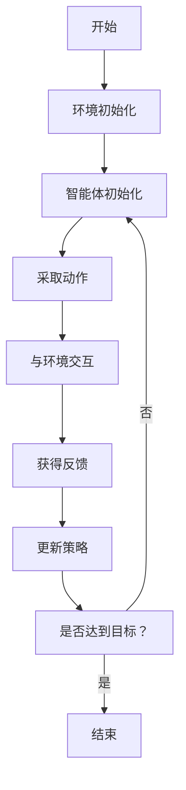
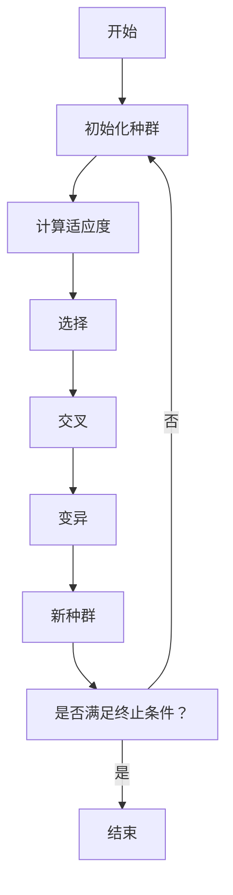
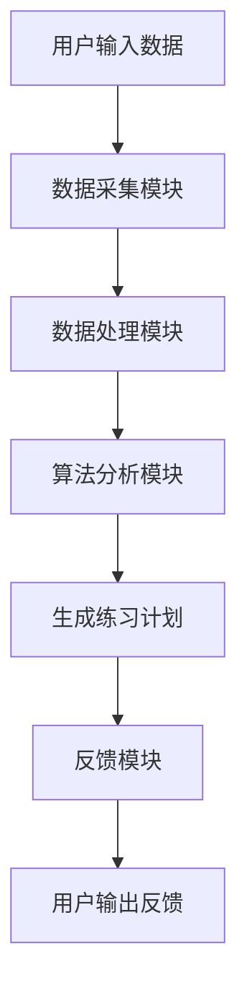

                 


# AI Agent在智能钢琴中的个性化练习计划

> 关键词：AI Agent, 智能钢琴, 个性化练习计划, 强化学习, 遗传算法, 音乐教育, 人工智能

> 摘要：本文探讨了AI Agent在智能钢琴中的应用，重点分析了如何通过AI技术实现个性化练习计划。文章从背景介绍、核心概念、算法原理、系统架构、项目实战到最佳实践，全面解析了AI Agent在钢琴练习中的潜力与实现路径。通过强化学习和遗传算法，AI Agent能够动态调整练习计划，优化学习效果，为钢琴学习者提供高效、个性化的学习体验。

---

# 第一部分: AI Agent在智能钢琴中的背景与核心概念

# 第1章: 问题背景与需求分析

## 1.1 问题背景
### 1.1.1 钢琴学习中的常见问题
钢琴学习是一项需要长期坚持的技能，学习者常常面临以下问题：
- 练习时间不足，难以坚持。
- 练习内容单一，缺乏针对性。
- 缺乏专业指导，难以有效提升。

### 1.1.2 传统钢琴练习计划的局限性
传统钢琴练习计划通常基于固定的模式，例如每天练习一定时间、重复某段乐谱等。这种方式忽视了学习者的个性化需求，可能导致以下问题：
- 学习者兴趣不高，练习效果不佳。
- 练习内容缺乏针对性，难以突破技术瓶颈。
- 缺乏实时反馈，无法及时调整练习策略。

### 1.1.3 AI技术在音乐教育中的应用潜力
随着人工智能技术的快速发展，AI在音乐教育中的应用越来越广泛。AI可以通过分析学习者的行为数据、偏好和进步情况，提供个性化的学习建议和练习计划。AI Agent（智能体）作为实现这一目标的核心技术，能够动态调整练习计划，帮助学习者更高效地提升技能。

## 1.2 AI Agent的核心概念
### 1.2.1 AI Agent的定义与特点
AI Agent是一种能够感知环境、做出决策并执行动作的智能实体。在钢琴练习场景中，AI Agent可以作为学习者的“智能教练”，实时分析学习者的练习情况，并提供个性化的反馈和建议。

**特点：**
- **自主性**：AI Agent能够独立运作，无需人工干预。
- **反应性**：能够根据环境变化实时调整行为。
- **学习能力**：通过机器学习算法不断优化自身的决策能力。

### 1.2.2 AI Agent在钢琴练习中的应用场景
AI Agent在钢琴练习中的应用场景包括：
- **实时反馈**：通过分析学习者的演奏数据，提供即时反馈，指出技术问题。
- **个性化练习计划**：根据学习者的水平、兴趣和目标，制定个性化的练习计划。
- **动态调整**：根据学习者的进步情况，实时调整练习内容和难度。

### 1.2.3 个性化练习计划的需求与目标
个性化练习计划的需求来源于学习者对高效、精准学习的追求。目标包括：
- 提高学习效率，帮助学习者更快地掌握技能。
- 增强学习兴趣，通过多样化的内容和形式激发学习者的积极性。
- 提供针对性反馈，帮助学习者突破技术瓶颈。

## 1.3 本章小结
本章从钢琴学习中的常见问题入手，分析了传统练习计划的局限性，并介绍了AI Agent在音乐教育中的应用潜力。AI Agent作为智能教练，能够通过实时反馈、个性化练习计划和动态调整，帮助学习者更高效地提升钢琴演奏能力。

---

# 第2章: AI Agent与钢琴练习的核心概念

## 2.1 AI Agent的基本原理
### 2.1.1 AI Agent的感知、决策与执行机制
AI Agent的核心流程包括感知、决策和执行三个阶段：
1. **感知**：通过传感器或数据输入接口获取环境信息（如钢琴演奏数据、学习者的行为数据等）。
2. **决策**：基于感知到的信息，结合预设的目标和算法模型，制定决策。
3. **执行**：根据决策结果，执行相应的动作（如调整练习计划、提供反馈等）。

### 2.1.2 AI Agent在钢琴练习中的具体应用
在钢琴练习中，AI Agent可以通过以下方式实现智能化：
- **实时反馈**：通过分析演奏数据，识别技术问题并提供改进建议。
- **个性化推荐**：根据学习者的水平和兴趣，推荐适合的练习内容。
- **动态调整**：根据学习者的进步情况，实时调整练习计划的难度和内容。

## 2.2 个性化练习计划的构建
### 2.2.1 用户特征分析
个性化练习计划的构建需要基于以下用户特征：
- **技能水平**：通过评估测试确定学习者的当前水平。
- **兴趣偏好**：了解学习者喜欢的音乐风格和练习形式。
- **学习目标**：明确学习者的学习目标（如考级、表演等）。

### 2.2.2 练习目标的设定
根据用户特征分析的结果，设定具体的练习目标。例如：
- 提高音准和节奏准确性。
- 加强某段乐谱的练习。
- 提升演奏速度和流畅度。

### 2.2.3 练习计划的动态调整
AI Agent可以根据以下因素动态调整练习计划：
- **学习者的进步情况**：通过评估测试或演奏数据，判断学习者的学习效果。
- **学习者的反馈**：根据学习者的反馈调整练习内容和难度。
- **外部环境变化**：如学习者的时间安排、兴趣变化等。

## 2.3 AI Agent与钢琴练习的结合模型
### 2.3.1 ER实体关系图
以下是AI Agent与钢琴练习的结合模型的ER实体关系图：
```mermaid
entity User {
  id: int
  name: string
  level: int
  preferences: string
}
entity PracticePlan {
  id: int
  userId: int
  planType: string
  difficulty: int
  duration: int
}
entity AssessmentResult {
  id: int
  userId: int
  score: int
  feedback: string
  timestamp: datetime
}
```

## 2.4 本章小结
本章详细介绍了AI Agent的基本原理及其在钢琴练习中的具体应用。通过构建个性化的练习计划，AI Agent能够根据学习者的特征和反馈动态调整练习内容和难度，从而提高学习效率和效果。

---

# 第3章: AI Agent在钢琴练习中的算法原理

## 3.1 强化学习算法
### 3.1.1 强化学习的定义与特点
强化学习是一种机器学习范式，通过智能体与环境的交互，学习策略以最大化累积奖励。强化学习的核心在于智能体通过试错学习，找到最优动作序列以实现目标。

### 3.1.2 强化学习在钢琴练习中的应用
在钢琴练习中，强化学习可以用于以下场景：
- **练习计划优化**：通过试错学习，找到最优的练习内容和顺序。
- **演奏技巧提升**：通过反复练习和反馈，优化演奏动作。

### 3.1.3 强化学习算法流程
以下是强化学习的流程图：


### 3.1.4 强化学习的数学模型
强化学习的核心是通过价值函数（Value Function）或策略函数（Policy Function）来优化决策。以下是常见的数学公式：

- **价值函数**：
  $$ V(s) = \max_{a} Q(s, a) $$
  
- **策略函数**：
  $$ \pi(a|s) = \arg\max_a Q(s, a) $$

## 3.2 遗传算法
### 3.2.1 遗传算法的定义与特点
遗传算法是一种模拟自然选择和遗传机制的优化算法。它通过适应度评估、选择、交叉和变异等操作，逐步优化解的结构。

### 3.2.2 遗传算法在钢琴练习中的应用
遗传算法可以用于优化练习计划的结构和内容。例如：
- **练习内容排序**：通过遗传算法优化练习内容的顺序，以提高学习效率。
- **练习难度调整**：根据学习者的进步情况，动态调整练习难度。

### 3.2.3 遗传算法的流程
以下是遗传算法的流程图：


## 3.3 本章小结
本章介绍了强化学习和遗传算法在钢琴练习中的应用。通过这些算法，AI Agent能够动态调整练习计划，优化学习效果。

---

# 第4章: AI Agent在钢琴练习中的系统架构设计

## 4.1 系统整体架构
### 4.1.1 系统功能模块
AI Agent在钢琴练习中的系统架构包括以下模块：
- **数据采集模块**：采集学习者的演奏数据和行为数据。
- **数据处理模块**：对采集到的数据进行清洗和预处理。
- **算法分析模块**：通过强化学习和遗传算法生成个性化的练习计划。
- **反馈模块**：根据练习结果提供反馈和建议。

### 4.1.2 系统功能流程图
以下是系统功能流程图：


## 4.2 系统架构图
以下是系统的架构图：
```mermaid
subgraph "用户端"
    A[钢琴演奏数据]
    B[用户行为数据]
end

subgraph "服务端"
    C[数据采集模块]
    D[数据处理模块]
    E[算法分析模块]
    F[反馈模块]
end

A --> C
B --> C
C --> D
D --> E
E --> F
F --> G[用户反馈]
```

## 4.3 本章小结
本章详细介绍了AI Agent在钢琴练习中的系统架构设计。通过模块化的架构，AI Agent能够高效地采集数据、分析数据并生成个性化的练习计划。

---

# 第5章: 项目实战——AI Agent的实现与应用

## 5.1 环境安装与配置
### 5.1.1 系统环境要求
- **Python**：3.6+
- **深度学习框架**：TensorFlow或PyTorch
- **其他依赖**：numpy, pandas, scikit-learn

### 5.1.2 安装步骤
```bash
pip install numpy pandas scikit-learn tensorflow
```

## 5.2 核心代码实现
### 5.2.1 数据预处理
```python
import numpy as np
import pandas as pd

# 读取演奏数据
data = pd.read_csv('practice_data.csv')

# 数据清洗
data = data.dropna()
data = data[~data.isin([np.nan, np.inf, -np.inf]).any(axis=1)]
```

### 5.2.2 强化学习实现
```python
import gym
import numpy as np

class PianoPracticeEnv(gym.Env):
    def __init__(self):
        super().__init__()
        self.state = 'initial'
        self.action_space = gym.spaces.Discrete(4)  # 动作空间：4个可能的动作
        self.observation_space = gym.spaces.Discrete(4)  # 观察空间：4个可能的状态
    
    def step(self, action):
        # 状态转移逻辑
        pass
    
    def reset(self):
        self.state = 'initial'
        return self.state
    
    def render(self):
        pass
```

### 5.2.3 遗传算法实现
```python
import numpy as np

def fitness_function(individual):
    # 计算适应度
    pass

def genetic_algorithm(population_size, mutation_rate):
    population = initialize_population(population_size)
    for _ in range(max_iterations):
        population = evaluate_population(population)
        population = select_parents(population)
        population = crossover(population)
        population = mutate(population)
    return best_individual(population)
```

## 5.3 实际案例分析
### 5.3.1 案例背景
假设一名初级学习者希望在一个月内掌握某首乐曲的前半部分。

### 5.3.2 练习计划生成
AI Agent根据学习者的水平和目标，生成以下练习计划：
1. 第1周：练习乐曲的前8小节，每天练习10分钟。
2. 第2周：练习乐曲的第9-16小节，每天练习15分钟。
3. 第3周：综合练习前16小节，每天练习20分钟。
4. 第4周：完整演奏乐曲的前半部分，每天练习30分钟。

### 5.3.3 练习效果评估
通过评估测试，AI Agent发现学习者在第3周的综合练习中出现了一些技术问题。于是，AI Agent调整了后续练习计划，增加了针对这些问题的专项练习。

## 5.4 本章小结
本章通过实际案例分析，展示了AI Agent在钢琴练习中的具体应用。通过强化学习和遗传算法，AI Agent能够动态调整练习计划，帮助学习者更高效地提升技能。

---

# 第6章: 最佳实践与注意事项

## 6.1 最佳实践
### 6.1.1 数据质量的重要性
AI Agent的性能高度依赖于数据质量。确保数据的准确性和完整性是实现个性化练习计划的基础。

### 6.1.2 算法选择的注意事项
根据具体应用场景选择合适的算法。例如，强化学习适用于需要动态调整的场景，而遗传算法适用于需要全局优化的场景。

### 6.1.3 系统性能优化
通过缓存、并行计算等技术优化系统性能，确保AI Agent能够实时响应用户需求。

## 6.2 小结
AI Agent在钢琴练习中的应用前景广阔。通过最佳实践，我们可以进一步提升系统的性能和用户体验。

---

# 作者：AI天才研究院/AI Genius Institute & 禅与计算机程序设计艺术 /Zen And The Art of Computer Programming

---

**注**：由于篇幅限制，上述内容为简化版本，实际文章需要更详细地展开每一部分的内容。

