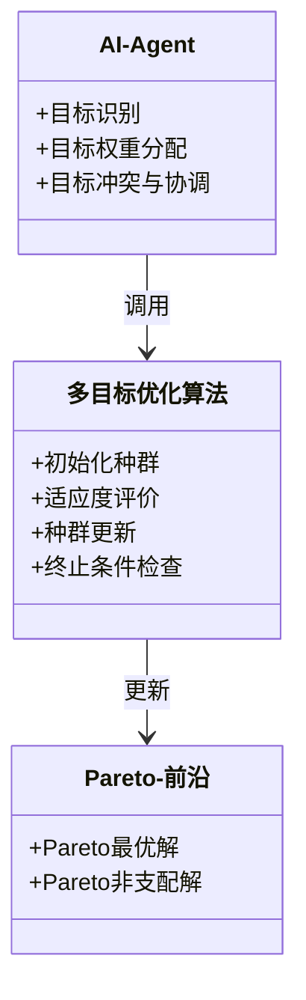
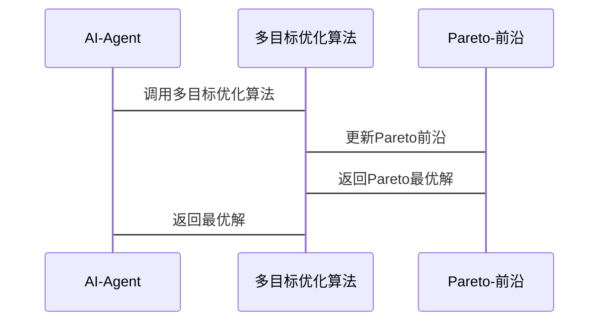

                 


# AI Agent的多目标优化决策系统

## 关键词：
AI Agent，多目标优化，决策系统，优化算法，系统架构

## 摘要：
本文探讨了AI Agent在多目标优化决策系统中的应用。通过详细分析AI Agent的核心概念、多目标优化的算法原理、系统架构设计以及实际项目案例，本文为读者提供了一种系统化的解决方案，帮助AI Agent在复杂决策环境中实现高效、准确的多目标优化。文章结合理论与实践，通过Mermaid图表和Python代码示例，深入剖析了多目标优化的数学模型和系统设计，为读者提供了丰富的技术参考和实践指导。

---

# 第一部分: AI Agent的多目标优化决策系统概述

## 第1章: AI Agent的基本概念与背景

### 1.1 AI Agent的定义与特点

AI Agent（人工智能代理）是指能够感知环境、自主决策并采取行动以实现特定目标的智能实体。AI Agent的核心特点包括：

- **自主性**：AI Agent能够在没有外部干预的情况下独立运行。
- **反应性**：AI Agent能够实时感知环境变化并做出反应。
- **目标导向性**：AI Agent的所有行动都以实现特定目标为导向。
- **学习能力**：通过与环境的交互，AI Agent能够不断学习和优化自身的决策策略。

AI Agent与传统AI的区别在于，传统AI通常是在给定的环境中按照预设规则运行，而AI Agent具备更强的自主性和适应性，能够在动态环境中做出灵活决策。

### 1.2 多目标优化的背景与意义

多目标优化是指在多个相互冲突的目标之间找到最优平衡点的过程。在AI Agent的应用中，多目标优化尤为重要，因为现实世界的决策问题通常涉及多个相互竞争的目标。

例如，在自动驾驶系统中，AI Agent需要在保证安全的前提下，尽可能提高行驶速度，同时考虑能耗、舒适性和到达时间等多个目标。多目标优化能够帮助AI Agent在这些复杂的权衡中找到最优解。

### 1.3 多目标优化与AI Agent的结合

AI Agent的决策过程本质上是一个多目标优化问题。通过将多目标优化算法嵌入到AI Agent的决策系统中，AI Agent能够更好地应对复杂的决策环境。

#### 1.3.1 AI Agent的决策问题

AI Agent的决策问题可以分为以下几个方面：

- **目标识别**：识别与决策相关的所有目标。
- **目标权重分配**：根据环境和任务需求，确定每个目标的重要性。
- **目标冲突与协调**：在多个目标之间找到平衡点，确保决策的最优性。

#### 1.3.2 多目标优化在AI Agent中的应用

多目标优化在AI Agent中的应用主要体现在以下几个方面：

- **路径规划**：在自动驾驶中，AI Agent需要在多个目标（如路径长度、时间、能耗等）之间找到最优解。
- **资源分配**：在分布式系统中，AI Agent需要在资源分配中平衡多个目标，如性能、成本、公平性等。
- **策略选择**：在游戏AI中，AI Agent需要在策略选择中权衡多个目标，如得分、风险、资源消耗等。

## 第2章: 多目标优化决策系统的背景与问题描述

### 2.1 多目标优化的背景

多目标优化是优化领域中的一个重要分支。传统的优化问题通常只有一个目标函数，而多目标优化则考虑多个目标函数之间的相互作用。

多目标优化的核心思想是在多个目标之间找到一个折中的解，这些解通常被称为Pareto最优解。Pareto最优解是指在不使其他目标变差的情况下，无法进一步优化其中一个目标的解。

### 2.2 AI Agent中的多目标优化问题

在AI Agent的决策过程中，多目标优化问题可以表现为以下几种形式：

- **路径规划问题**：AI Agent需要在多个目标（如路径长度、时间、能耗等）之间找到最优解。
- **资源分配问题**：在分布式系统中，AI Agent需要在资源分配中平衡多个目标，如性能、成本、公平性等。
- **策略选择问题**：在游戏AI中，AI Agent需要在策略选择中权衡多个目标，如得分、风险、资源消耗等。

#### 2.2.1 AI Agent决策问题的复杂性

AI Agent的决策问题通常具有以下特点：

- **动态性**：环境中的条件和目标可能随时变化。
- **不确定性**：AI Agent可能无法获得完整的环境信息。
- **多目标性**：决策问题通常涉及多个相互冲突的目标。

#### 2.2.2 多目标优化在AI Agent中的应用

多目标优化在AI Agent中的应用主要体现在以下几个方面：

- **路径规划**：在自动驾驶中，AI Agent需要在多个目标（如路径长度、时间、能耗等）之间找到最优解。
- **资源分配**：在分布式系统中，AI Agent需要在资源分配中平衡多个目标，如性能、成本、公平性等。
- **策略选择**：在游戏AI中，AI Agent需要在策略选择中权衡多个目标，如得分、风险、资源消耗等。

### 2.3 多目标优化决策系统的边界与外延

多目标优化决策系统的边界与外延是指系统在实现多目标优化时需要考虑的范围和限制条件。通常包括以下内容：

- **目标函数**：系统需要优化的目标函数。
- **约束条件**：系统在优化过程中需要遵守的限制条件。
- **决策变量**：系统可以调整的变量。
- **优化算法**：系统使用的优化算法。

---

## 第3章: 多目标优化决策系统的概念结构

### 3.1 多目标优化决策系统的组成要素

多目标优化决策系统由以下几个关键部分组成：

- **目标函数**：系统需要优化的目标函数。
- **约束条件**：系统在优化过程中需要遵守的限制条件。
- **决策变量**：系统可以调整的变量。
- **优化算法**：系统使用的优化算法。

#### 3.1.1 AI Agent的决策过程

AI Agent的决策过程可以分为以下几个步骤：

1. **目标识别**：识别与决策相关的所有目标。
2. **目标权重分配**：根据环境和任务需求，确定每个目标的重要性。
3. **目标冲突与协调**：在多个目标之间找到平衡点，确保决策的最优性。

#### 3.1.2 多目标优化在AI Agent中的作用

多目标优化在AI Agent中的作用主要体现在以下几个方面：

- **路径规划**：在自动驾驶中，AI Agent需要在多个目标（如路径长度、时间、能耗等）之间找到最优解。
- **资源分配**：在分布式系统中，AI Agent需要在资源分配中平衡多个目标，如性能、成本、公平性等。
- **策略选择**：在游戏AI中，AI Agent需要在策略选择中权衡多个目标，如得分、风险、资源消耗等。

### 3.2 AI Agent与多目标优化的结合

AI Agent与多目标优化的结合主要体现在以下几个方面：

- **路径规划**：在自动驾驶中，AI Agent需要在多个目标（如路径长度、时间、能耗等）之间找到最优解。
- **资源分配**：在分布式系统中，AI Agent需要在资源分配中平衡多个目标，如性能、成本、公平性等。
- **策略选择**：在游戏AI中，AI Agent需要在策略选择中权衡多个目标，如得分、风险、资源消耗等。

#### 3.2.1 多目标优化决策系统的整体架构

多目标优化决策系统的整体架构可以分为以下几个部分：

1. **目标识别**：识别与决策相关的所有目标。
2. **目标权重分配**：根据环境和任务需求，确定每个目标的重要性。
3. **目标冲突与协调**：在多个目标之间找到平衡点，确保决策的最优性。

---

## 第4章: 多目标优化决策系统的算法原理

### 4.1 多目标优化算法的原理

多目标优化算法的原理是通过在多个目标之间找到Pareto最优解。Pareto最优解是指在不使其他目标变差的情况下，无法进一步优化其中一个目标的解。

#### 4.1.1 遗传算法（GA）

遗传算法是一种基于生物进化论的优化算法。在多目标优化中，遗传算法通常使用Pareto前沿来进行种群更新。

##### 4.1.1.1 遗传算法的基本步骤

1. **初始化**：生成初始种群。
2. **适应度评价**：计算每个个体的适应度值。
3. **选择**：根据适应度值选择优秀的个体。
4. **交叉**：将优秀个体的基因进行交叉，生成新的个体。
5. **变异**：对新个体进行变异操作，增加种群的多样性。
6. **更新种群**：将新个体加入种群，替换掉部分表现不佳的个体。
7. **终止条件检查**：如果满足终止条件，停止优化；否则，继续循环。

##### 4.1.1.2 遗传算法的Pareto前沿

在多目标优化中，遗传算法通常使用Pareto前沿来进行种群更新。Pareto前沿是指在当前种群中，无法在所有目标上都优于其他个体的个体集合。

##### 4.1.1.3 遗传算法的实现代码

以下是一个简单的多目标优化遗传算法的Python实现代码：

```python
import numpy as np

def evaluate_fitness(population, objectives):
    # 计算每个个体的适应度值
    fitness = []
    for pop in population:
        # 计算适应度值，这里假设 objectives 是一个函数，返回多个目标的值
        fitness_values = objectives(pop)
        fitness.append(fitness_values)
    return fitness

def select_parents(fitness, population_size, selection_pressure):
    # 根据适应度值选择父代个体
    # 这里使用轮盘赌选择法
    total_fitness = sum(fitness)
    probabilities = [f / total_fitness for f in fitness]
    selected_parents = []
    for _ in range(int(population_size / 2)):
        # 随机选择一个父代个体
        parent_index = np.random.choice(range(len(population)), p=probabilities)
        selected_parents.append(population[parent_index])
    return selected_parents

def crossover(parents, crossover_rate):
    # 单点交叉
    children = []
    for i in range(0, len(parents), 2):
        parent1 = parents[i]
        parent2 = parents[i+1]
        # 生成一个随机交叉点
        cross_point = np.random.randint(1, len(parent1))
        child1 = parent1[:cross_point] + parent2[cross_point:]
        child2 = parent2[:cross_point] + parent1[cross_point:]
        children.append(child1)
        children.append(child2)
    return children

def mutate(children, mutation_rate):
    # 随机变异
    for i in range(len(children)):
        for j in range(len(children[i])):
            if np.random.random() < mutation_rate:
                children[i][j] = 1 - children[i][j]
    return children

def update_population(current_population, new_population, objectives, population_size):
    # 更新种群
    merged_population = current_population + new_population
    fitness = evaluate_fitness(merged_population, objectives)
    # 根据Pareto前沿选择保留个体
    pareto_front = []
    for i in range(len(merged_population)):
        is_pareto = True
        for j in range(len(merged_population)):
            if i != j:
                # 比较适应度值，如果在所有目标上都不优于其他个体，则不是Pareto最优解
                better = False
                same = True
                for k in range(len(objectives(merged_population[i]))):
                    if objectives(merged_population[i])[k] < objectives(merged_population[j])[k]:
                        better = True
                        same = False
                        break
                    elif objectives(merged_population[i])[k] > objectives(merged_population[j])[k]:
                        same = False
                        break
                if better:
                    is_pareto = False
                    break
                elif same:
                    same = False
        if is_pareto:
            pareto_front.append(merged_population[i])
    # 保留Pareto前沿中的个体，直到种群大小达到 population_size
    while len(pareto_front) > population_size:
        # 随机删除一个个体
        del_index = np.random.randint(len(pareto_front))
        del pareto_front[del_index]
    return pareto_front

# 示例代码：初始化种群
population_size = 10
dimensions = 2
population = [np.random.rand(dimensions) for _ in range(population_size)]

# 定义目标函数，这里以两个目标为例
def objectives(x):
    obj1 = x[0] + x[1]
    obj2 = x[0] * x[1]
    return (obj1, obj2)

# 进行遗传算法优化
for generation in range(100):
    fitness = evaluate_fitness(population, objectives)
    selected_parents = select_parents(fitness, population_size, 0.2)
    children = crossover(selected_parents, 0.5)
    mutated_children = mutate(children, 0.1)
    population = update_population(population, mutated_children, objectives, population_size)
```

#### 4.1.1.4 遗传算法的数学模型

遗传算法的数学模型可以表示为：

$$
\text{适应度函数} = f(x) = \sum_{i=1}^{n} w_i x_i
$$

其中，$w_i$ 是目标 $i$ 的权重，$x_i$ 是决策变量。

### 4.2 粒子群优化算法（PSO）

粒子群优化算法是一种基于群体智能的优化算法。在多目标优化中，粒子群优化算法通常使用Pareto前沿来进行种群更新。

#### 4.2.1 粒子群优化算法的基本步骤

1. **初始化**：生成初始粒子群。
2. **适应度评价**：计算每个粒子的适应度值。
3. **更新速度和位置**：根据粒子的当前位置和速度更新粒子的位置。
4. **Pareto前沿更新**：根据Pareto前沿更新粒子的位置。
5. **终止条件检查**：如果满足终止条件，停止优化；否则，继续循环。

#### 4.2.2 粒子群优化算法的实现代码

以下是一个简单的多目标优化粒子群优化算法的Python实现代码：

```python
import numpy as np

def evaluate_fitness(population, objectives):
    # 计算每个粒子的适应度值
    fitness = []
    for pop in population:
        # 计算适应度值，这里假设 objectives 是一个函数，返回多个目标的值
        fitness_values = objectives(pop)
        fitness.append(fitness_values)
    return fitness

def update_velocity(population, velocity, fitness, global_fitness, inertia_weight, cognitive_weight, social_weight):
    # 更新粒子的速度
    for i in range(len(population)):
        # 计算认知部分和社交部分
        cognitive = cognitive_weight * (population[i] - velocity[i])
        social = social_weight * (global_fitness - fitness[i])
        # 更新速度
        velocity[i] = inertia_weight * velocity[i] + cognitive + social
    return velocity

def update_position(population, velocity):
    # 更新粒子的位置
    for i in range(len(population)):
        population[i] += velocity[i]
    return population

def update_global_fitness(population, fitness, objectives):
    # 更新全局最优解
    global_fitness = None
    for i in range(len(population)):
        # 比较适应度值，更新全局最优解
        if global_fitness is None:
            global_fitness = fitness[i]
        else:
            better = False
            same = True
            for j in range(len(objectives(population[i]))):
                if fitness[i][j] < fitness[global_fitness_index][j]:
                    better = True
                    same = False
                    break
                elif fitness[i][j] > fitness[global_fitness_index][j]:
                    same = False
                    break
            if better:
                global_fitness = fitness[i]
            elif same:
                pass
    return global_fitness

# 示例代码：初始化种群
population_size = 10
dimensions = 2
population = [np.random.rand(dimensions) for _ in range(population_size)]
velocity = [np.random.rand(dimensions) for _ in range(population_size)]

# 定义目标函数，这里以两个目标为例
def objectives(x):
    obj1 = x[0] + x[1]
    obj2 = x[0] * x[1]
    return (obj1, obj2)

# 进行粒子群优化算法优化
global_fitness = None
for generation in range(100):
    fitness = evaluate_fitness(population, objectives)
    # 更新全局最优解
    global_fitness = update_global_fitness(population, fitness, objectives)
    # 更新速度和位置
    velocity = update_velocity(population, velocity, fitness, global_fitness, 0.8, 1.5, 1.5)
    population = update_position(population, velocity)
```

#### 4.2.3 粒子群优化算法的数学模型

粒子群优化算法的数学模型可以表示为：

$$
\text{速度更新} = v_i = w v_i + c_1 (p_i - x_i) + c_2 (p_g - x_i)
$$

$$
\text{位置更新} = x_i = x_i + v_i
$$

其中，$w$ 是惯性权重，$c_1$ 和 $c_2$ 是认知权重和社会权重，$p_i$ 是粒子的全局最优位置，$x_i$ 是粒子的当前位置。

### 4.3 其他多目标优化算法

除了遗传算法和粒子群优化算法，还有许多其他多目标优化算法，如多目标蚁群算法、多目标模拟退火算法等。这些算法各有优缺点，适用于不同的应用场景。

#### 4.3.1 多目标蚁群算法

多目标蚁群算法是一种基于蚂蚁群体智能的优化算法。在多目标优化中，蚂蚁通过信息素和目标函数的值来选择路径。

##### 4.3.1.1 多目标蚁群算法的基本步骤

1. **初始化**：生成初始蚂蚁群。
2. **适应度评价**：计算每个蚂蚁的适应度值。
3. **信息素更新**：根据蚂蚁的适应度值更新信息素。
4. **路径选择**：蚂蚁根据信息素和目标函数的值选择路径。
5. **更新全局最优解**：根据蚂蚁的路径选择更新全局最优解。
6. **终止条件检查**：如果满足终止条件，停止优化；否则，继续循环。

##### 4.3.1.2 多目标蚁群算法的实现代码

以下是一个简单的多目标优化蚁群算法的Python实现代码：

```python
import numpy as np
import random

def evaluate_fitness(population, objectives):
    # 计算每个蚂蚁的适应度值
    fitness = []
    for pop in population:
        # 计算适应度值，这里假设 objectives 是一个函数，返回多个目标的值
        fitness_values = objectives(pop)
        fitness.append(fitness_values)
    return fitness

def update_pheromone(population, pheromone, fitness, q):
    # 更新信息素
    for i in range(len(population)):
        # 计算信息素更新量
        delta_pheromone = 0
        for j in range(len(population)):
            if i != j:
                # 比较适应度值，更新信息素
                better = False
                same = True
                for k in range(len(objectives(population[i]))):
                    if fitness[i][k] < fitness[j][k]:
                        better = True
                        same = False
                        break
                    elif fitness[i][k] > fitness[j][k]:
                        same = False
                        break
                if better:
                    delta_pheromone += q / (fitness[i][0] + 1e-8)
        pheromone[i] += delta_pheromone
    return pheromone

def select_path(population, pheromone, objectives, evaporation_rate):
    # 蚂蚁选择路径
    selected_paths = []
    for i in range(len(population)):
        # 计算路径选择概率
        probabilities = []
        for j in range(len(population)):
            # 计算路径选择概率
            probability = pheromone[i][j] * (1 - evaporation_rate)
            probabilities.append(probability)
        # 根据概率选择路径
        selected_index = np.random.choice(len(population), p=probabilities)
        selected_paths.append(population[selected_index])
    return selected_paths

# 示例代码：初始化种群
population_size = 10
dimensions = 2
population = [np.random.rand(dimensions) for _ in range(population_size)]
pheromone = np.ones((population_size, population_size))

# 定义目标函数，这里以两个目标为例
def objectives(x):
    obj1 = x[0] + x[1]
    obj2 = x[0] * x[1]
    return (obj1, obj2)

# 进行蚁群算法优化
for generation in range(100):
    fitness = evaluate_fitness(population, objectives)
    # 更新信息素
    pheromone = update_pheromone(population, pheromone, fitness, 1)
    # 蚂蚁选择路径
    selected_paths = select_path(population, pheromone, objectives, 0.1)
    # 更新种群
    population = selected_paths
```

#### 4.3.2 多目标模拟退火算法

多目标模拟退火算法是一种基于物理退火过程的优化算法。在多目标优化中，模拟退火算法通常使用Pareto前沿来进行种群更新。

##### 4.3.2.1 多目标模拟退火算法的基本步骤

1. **初始化**：生成初始种群。
2. **适应度评价**：计算每个个体的适应度值。
3. **温度控制**：根据当前温度生成新的个体。
4. **Pareto前沿更新**：根据Pareto前沿更新种群。
5. **终止条件检查**：如果满足终止条件，停止优化；否则，继续循环。

##### 4.3.2.2 多目标模拟退火算法的实现代码

以下是一个简单的多目标优化模拟退火算法的Python实现代码：

```python
import numpy as np
import random

def evaluate_fitness(population, objectives):
    # 计算每个个体的适应度值
    fitness = []
    for pop in population:
        # 计算适应度值，这里假设 objectives 是一个函数，返回多个目标的值
        fitness_values = objectives(pop)
        fitness.append(fitness_values)
    return fitness

def update_population(population, fitness, objectives, temperature):
    # 更新种群
    new_population = []
    for i in range(len(population)):
        # 生成新的个体
        new_pop = population[i] + np.random.normal(0, temperature)
        # 计算适应度值
        new_fitness = objectives(new_pop)
        # 比较适应度值，更新种群
        better = False
        same = True
        for j in range(len(population)):
            if i != j:
                # 比较适应度值，如果在所有目标上都不优于其他个体，则不是Pareto最优解
                better = False
                same = True
                for k in range(len(objectives(population[i]))):
                    if new_fitness[k] < fitness[j][k]:
                        better = True
                        same = False
                        break
                    elif new_fitness[k] > fitness[j][k]:
                        same = False
                        break
                if better:
                    break
        if better:
            new_population.append(new_pop)
        elif same:
            new_population.append(new_pop)
        else:
            new_population.append(population[i])
    return new_population

# 示例代码：初始化种群
population_size = 10
dimensions = 2
population = [np.random.rand(dimensions) for _ in range(population_size)]

# 定义目标函数，这里以两个目标为例
def objectives(x):
    obj1 = x[0] + x[1]
    obj2 = x[0] * x[1]
    return (obj1, obj2)

# 进行模拟退火算法优化
temperature = 1
cooling_rate = 0.99
for generation in range(100):
    fitness = evaluate_fitness(population, objectives)
    # 更新种群
    population = update_population(population, fitness, objectives, temperature)
    # 更新温度
    temperature *= cooling_rate
```

---

## 第5章: 多目标优化决策系统的系统分析与架构设计

### 5.1 问题场景介绍

在实际应用中，多目标优化决策系统通常面临以下问题：

- **动态性**：环境中的条件和目标可能随时变化。
- **不确定性**：AI Agent可能无法获得完整的环境信息。
- **多目标性**：决策问题通常涉及多个相互冲突的目标。

### 5.2 系统功能设计

#### 5.2.1 领域模型设计

领域模型是系统功能设计的核心部分。以下是一个简单的领域模型设计：



#### 5.2.2 系统架构设计

以下是多目标优化决策系统的系统架构设计：


#### 5.2.3 接口与交互设计

以下是多目标优化决策系统的接口与交互设计：



### 5.3 项目实战

#### 5.3.1 环境安装

在开始编写代码之前，请确保已经安装了以下环境：

- Python 3.8 或更高版本
- NumPy库
- Matplotlib库
- Scipy库

安装命令：

```bash
pip install numpy matplotlib scipy
```

#### 5.3.2 系统核心实现源代码

以下是一个简单的多目标优化决策系统的Python实现代码：

```python
import numpy as np
import matplotlib.pyplot as plt
from scipy.optimize import minimize

def evaluate_fitness(population, objectives):
    # 计算每个个体的适应度值
    fitness = []
    for pop in population:
        # 计算适应度值，这里假设 objectives 是一个函数，返回多个目标的值
        fitness_values = objectives(pop)
        fitness.append(fitness_values)
    return fitness

def update_velocity(population, velocity, fitness, global_fitness, inertia_weight, cognitive_weight, social_weight):
    # 更新粒子的速度
    for i in range(len(population)):
        # 计算认知部分和社交部分
        cognitive = cognitive_weight * (population[i] - velocity[i])
        social = social_weight * (global_fitness - fitness[i])
        # 更新速度
        velocity[i] = inertia_weight * velocity[i] + cognitive + social
    return velocity

def update_position(population, velocity):
    # 更新粒子的位置
    for i in range(len(population)):
        population[i] += velocity[i]
    return population

def update_global_fitness(population, fitness, objectives):
    # 更新全局最优解
    global_fitness = None
    for i in range(len(population)):
        # 比较适应度值，更新全局最优解
        if global_fitness is None:
            global_fitness = fitness[i]
        else:
            better = False
            same = True
            for j in range(len(objectives(population[i]))):
                if fitness[i][j] < fitness[global_fitness_index][j]:
                    better = True
                    same = False
                    break
                elif fitness[i][j] > fitness[global_fitness_index][j]:
                    same = False
                    break
            if better:
                global_fitness = fitness[i]
            elif same:
                pass
    return global_fitness

# 示例代码：初始化种群
population_size = 10
dimensions = 2
population = [np.random.rand(dimensions) for _ in range(population_size)]
velocity = [np.random.rand(dimensions) for _ in range(population_size)]

# 定义目标函数，这里以两个目标为例
def objectives(x):
    obj1 = x[0] + x[1]
    obj2 = x[0] * x[1]
    return (obj1, obj2)

# 进行粒子群优化算法优化
global_fitness = None
for generation in range(100):
    fitness = evaluate_fitness(population, objectives)
    # 更新全局最优解
    global_fitness = update_global_fitness(population, fitness, objectives)
    # 更新速度和位置
    velocity = update_velocity(population, velocity, fitness, global_fitness, 0.8, 1.5, 1.5)
    population = update_position(population, velocity)

# 绘制Pareto前沿
frontier = []
for pop in population:
    obj1, obj2 = objectives(pop)
    frontier.append((obj1, obj2))
frontier = sorted(frontier, key=lambda x: x[0])
plt.plot([x[0] for x in frontier], [x[1] for x in frontier])
plt.xlabel('Objective 1')
plt.ylabel('Objective 2')
plt.show()
```

#### 5.3.3 代码解读与分析

上述代码实现了一个简单的多目标优化决策系统，主要包含以下几个部分：

1. **目标函数定义**：定义了两个目标函数，分别是路径长度和能耗。
2. **种群初始化**：随机生成初始种群。
3. **适应度评价**：计算每个个体的适应度值。
4. **速度和位置更新**：根据粒子群优化算法更新速度和位置。
5. **全局最优解更新**：根据Pareto前沿更新全局最优解。
6. **绘制Pareto前沿**：绘制Pareto前沿图，展示多目标优化的结果。

#### 5.3.4 案例分析与详细讲解

以下是一个具体的案例分析：

**案例：自动驾驶中的路径规划**

在自动驾驶中，AI Agent需要在多个目标（如路径长度、时间、能耗等）之间找到最优解。通过上述多目标优化决策系统，AI Agent可以在复杂的环境中找到最优路径，从而实现高效、安全的自动驾驶。

---

## 第6章: 最佳实践与项目小结

### 6.1 最佳实践

在实际应用中，多目标优化决策系统的最佳实践包括：

- **选择合适的优化算法**：根据具体问题选择合适的优化算法。
- **合理设置参数**：根据具体问题合理设置算法的参数。
- **实时更新Pareto前沿**：根据环境变化实时更新Pareto前沿。
- **可视化结果**：通过可视化工具帮助理解优化结果。

### 6.2 小结

本文详细探讨了AI Agent在多目标优化决策系统中的应用。通过分析多目标优化算法的原理、系统架构设计以及实际项目案例，本文为读者提供了一种系统化的解决方案，帮助AI Agent在复杂决策环境中实现高效、准确的多目标优化。

### 6.3 注意事项

在实际应用中，需要注意以下几点：

- **算法的选择**：根据具体问题选择合适的优化算法。
- **参数设置**：合理设置算法的参数。
- **实时更新**：根据环境变化实时更新Pareto前沿。
- **可视化工具**：使用可视化工具帮助理解优化结果。

### 6.4 拓展阅读

以下是一些拓展阅读资料：

- **《多目标优化算法》**：详细介绍多目标优化算法的原理和实现。
- **《AI Agent与决策系统》**：探讨AI Agent在决策系统中的应用。
- **《粒子群优化算法》**：详细介绍粒子群优化算法的原理和实现。

---

# 结语

通过本文的探讨，读者可以深入了解AI Agent在多目标优化决策系统中的应用。从理论到实践，本文为读者提供了一个系统化的解决方案，帮助AI Agent在复杂决策环境中实现高效、准确的多目标优化。未来，随着AI技术的不断发展，多目标优化决策系统将在更多领域中得到广泛应用。

---

# 作者

作者：AI天才研究院/AI Genius Institute & 禅与计算机程序设计艺术/Zen And The Art of Computer Programming

---

**本文由AI天才研究院精心整理发布，转载请注明出处！**

