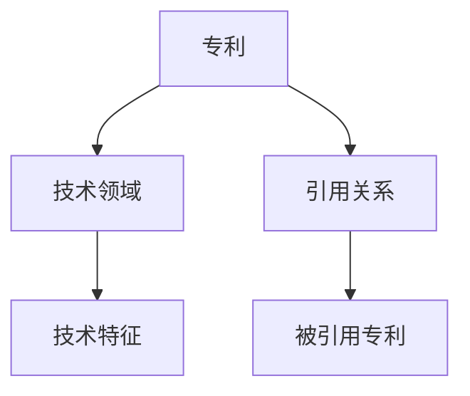
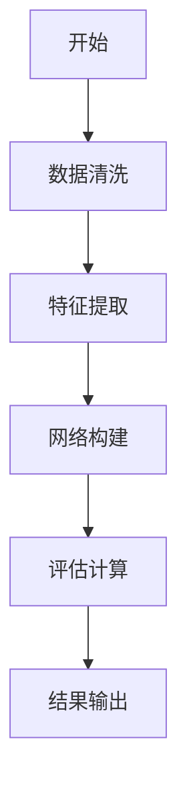
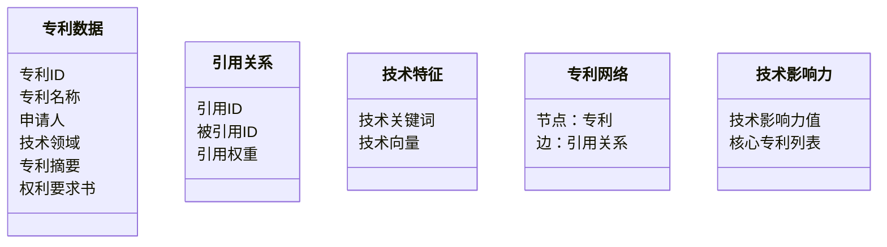
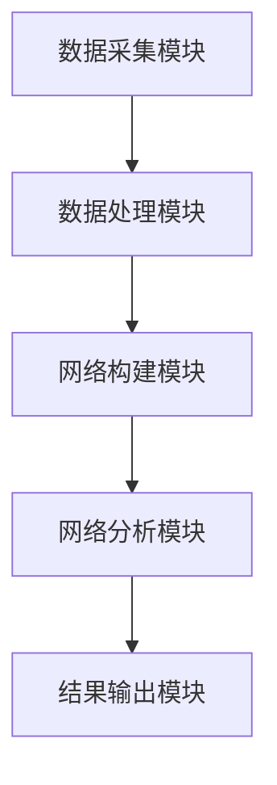
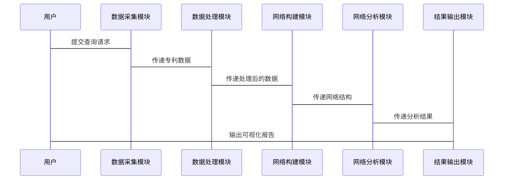

                 


# AI协作分析公司专利引用网络：评估技术领先地位

> 关键词：AI协作分析、专利引用网络、技术领先地位、网络分析、AI算法

> 摘要：本文详细探讨了如何利用AI协作分析公司专利引用网络，以评估其技术领先地位。通过分析专利引用网络的结构、AI算法在其中的应用，以及实际案例的分析，本文揭示了如何利用AI技术提升专利分析的效率和准确性，为企业制定技术战略提供有力支持。

---

## 第一部分：AI协作分析公司专利引用网络概述

### 第1章：背景介绍

#### 1.1 问题背景

##### 1.1.1 专利引用网络的定义
专利引用网络是指一组专利之间的引用关系构成的网络，其中每个节点代表一个专利，边表示专利之间的引用关系。专利引用网络是技术领域知识图谱的重要组成部分，能够反映技术发展的趋势和企业的技术布局。

##### 1.1.2 技术领先地位的评估需求
在全球化竞争日益激烈的今天，技术领先地位是企业核心竞争力的重要体现。通过分析专利引用网络，可以评估企业在特定技术领域的影响力和技术储备，帮助企业制定技术发展战略。

##### 1.1.3 AI在专利分析中的作用
传统专利分析方法依赖人工阅读和统计，效率低下且难以捕捉隐含的技术关系。AI技术（如自然语言处理、图谱构建和网络分析）能够高效地处理海量专利数据，发现潜在的技术关联，为技术领先地位的评估提供支持。

#### 1.2 问题描述

##### 1.2.1 专利引用网络的复杂性
专利引用网络通常包含大量的专利节点和复杂的引用关系，数据规模大、结构复杂，人工分析难度较高。

##### 1.2.2 传统专利分析的局限性
传统专利分析方法依赖人工操作，效率低、成本高，且难以发现隐含的技术关联和趋势。

##### 1.2.3 AI协作分析的优势
AI协作分析能够快速处理海量专利数据，发现潜在的技术关系，评估技术影响力，为企业提供高效的决策支持。

#### 1.3 问题解决

##### 1.3.1 AI协作分析的核心目标
通过AI技术，构建专利引用网络，量化技术影响力，评估技术领先地位。

##### 1.3.2 通过AI提升专利分析的效率
利用自然语言处理技术自动提取专利文本中的技术特征，构建专利引用网络，分析技术关联。

##### 1.3.3 实现技术领先地位的动态评估
基于专利引用网络的动态变化，评估技术领域的竞争态势，为企业制定技术战略提供依据。

#### 1.4 边界与外延

##### 1.4.1 专利引用网络的边界
专利引用网络的边界包括专利文本、引用关系和相关技术领域，不包括非专利数据（如论文、技术标准）。

##### 1.4.2 相关领域的外延
专利引用网络分析与技术领域知识图谱、技术预测、技术竞争分析等密切相关。

##### 1.4.3 与其他技术分析方法的对比
与基于文本挖掘的技术分析方法相比，专利引用网络分析更加注重技术关联和影响力评估。

#### 1.5 概念结构与核心要素

##### 1.5.1 专利引用网络的构成要素
- 专利节点：代表具体专利。
- 引用关系：表示专利之间的引用关系。
- 技术领域：专利所属的技术领域。
- 技术特征：专利文本中的技术关键词。

##### 1.5.2 AI协作分析的关键环节
- 数据采集：获取专利数据。
- 数据清洗：处理 noisy 数据。
- 特征提取：提取技术关键词。
- 网络构建：构建专利引用网络。
- 网络分析：评估技术影响力。

##### 1.5.3 技术领先地位的评估指标
- 专利数量：企业在技术领域的专利持有量。
- 引用次数：专利被引用的次数。
- 技术关联度：专利之间的技术关联性。
- 技术领域分布：企业在不同技术领域的分布情况。

---

### 第2章：核心概念与联系

#### 2.1 专利引用网络的结构

##### 2.1.1 专利引用网络的节点与边
- 节点：专利。
- 边：引用关系。

##### 2.1.2 专利引用网络的权重计算
专利引用关系的权重可以通过专利被引用的次数和时间因素进行计算。例如，较新的专利被引用的概率更高。

##### 2.1.3 专利引用网络的特征提取
通过自然语言处理技术，提取专利文本中的技术关键词，构建技术特征向量。

#### 2.2 AI协作分析的原理

##### 2.2.1 自然语言处理在专利文本中的应用
利用NLP技术（如TF-IDF、Word2Vec）提取专利文本中的技术关键词，构建技术特征向量。

##### 2.2.2 图谱构建与网络分析
基于专利引用关系，构建专利引用网络，分析网络的结构特征（如度分布、聚类系数）。

##### 2.2.3 AI驱动的动态评估模型
通过机器学习算法（如pagerank）对专利进行影响力排序，评估技术领域的核心专利。

#### 2.3 核心概念对比表格

| 对比维度       | 传统专利分析         | AI协作分析           |
|----------------|----------------------|----------------------|
| 数据处理       | 人工阅读、统计       | 自动提取、处理       |
| 分析效率       | 低效                 | 高效                 |
| 技术关联性     | 简单                 | 复杂                 |
| 结果精度       | 低                   | 高                   |

#### 2.4 ER实体关系图



---

### 第3章：算法原理讲解

#### 3.1 专利引用网络的构建

##### 3.1.1 数据清洗与预处理
- 数据清洗：去除重复数据、噪声数据。
- 数据预处理：提取专利ID、专利名称、申请日期、申请人、技术领域、专利摘要、权利要求书。

##### 3.1.2 专利文本的特征提取
- 利用NLP技术（如TF-IDF、Word2Vec）提取专利文本中的技术关键词。

##### 3.1.3 引用关系的构建与权重计算
- 引用关系的构建：基于专利ID匹配引用关系。
- 引用权重计算：根据专利被引用的次数和时间因素计算权重。

#### 3.2 AI协作分析算法

##### 3.2.1 基于图谱的网络分析算法
-pagerank算法用于评估专利的影响力。

##### 3.2.2 基于自然语言处理的文本挖掘算法
- TF-IDF用于提取技术关键词。
- Word2Vec用于构建技术词向量。

##### 3.2.3 综合评估模型的构建
- 综合考虑专利的引用次数、技术关联性等因素，构建综合评估模型。

#### 3.3 算法流程图



---

### 第4章：数学模型与公式

#### 4.1 专利引用网络的权重计算

##### 4.1.1 引用权重公式
$$ w_{ij} = \frac{1}{\log(1 + t_j)} $$
其中，$t_j$ 是专利j的引用次数。

#### 4.2 技术影响力的评估公式

##### 4.2.1 技术影响力的计算
$$ I_i = \sum_{j} w_{ij} \cdot I_j $$
其中，$I_i$ 是专利i的技术影响力，$w_{ij}$ 是专利i对专利j的引用权重。

#### 4.3 pagerank算法

##### 4.3.1 pagerank公式
$$ PR(i) = \sum_{j} \frac{PR(j)}{outDegree(j)} \cdot A_{ji} $$
其中，$PR(i)$ 是专利i的pagerank值，$A_{ji}$ 是从专利j到专利i的引用关系。

---

## 第五章：系统分析与架构设计

### 第5章：系统分析与架构设计

#### 5.1 问题场景介绍

##### 5.1.1 企业技术战略规划
企业需要通过分析专利引用网络，评估技术领域的竞争态势，制定技术战略。

##### 5.1.2 技术监控与预警
企业需要实时监控技术领域的专利动态，及时发现技术风险。

##### 5.1.3 技术布局优化
企业需要通过分析专利引用网络，优化技术布局，提升技术影响力。

#### 5.2 项目介绍

##### 5.2.1 项目目标
构建专利引用网络，评估技术领域的竞争态势，为企业制定技术战略提供支持。

##### 5.2.2 项目范围
- 数据采集：获取专利数据。
- 数据处理：清洗和预处理。
- 网络构建：构建专利引用网络。
- 网络分析：评估技术影响力。
- 结果输出：生成可视化报告。

#### 5.3 系统功能设计

##### 5.3.1 领域模型


##### 5.3.2 系统架构设计


#### 5.4 系统接口设计

##### 5.4.1 数据接口
- 输入接口：专利数据。
- 输出接口：网络分析结果。

##### 5.4.2 用户接口
- 输入接口：用户查询。
- 输出接口：可视化报告。

#### 5.5 系统交互流程



---

## 第六章：项目实战

### 第6章：项目实战

#### 6.1 环境安装

##### 6.1.1 安装Python环境
```bash
python --version
pip install --upgrade pip
```

##### 6.1.2 安装依赖包
```bash
pip install numpy
pip install networkx
pip install matplotlib
pip install word2vec
```

#### 6.2 系统核心实现源代码

##### 6.2.1 数据处理模块
```python
import numpy as np
from sklearn.feature_extraction.text import TfidfVectorizer

def process_patent_text(text):
    vectorizer = TfidfVectorizer()
    tfidf = vectorizer.fit_transform([text])
    return vectorizer.transform([text]).toarray()[0]
```

##### 6.2.2 网络构建模块
```python
import networkx as nx

def build_patent_network(patents, references):
    G = nx.DiGraph()
    for patent in patents:
        G.add_node(patent)
    for ref in references:
        G.add_edge(ref['source'], ref['target'], weight=ref['weight'])
    return G
```

##### 6.2.3 网络分析模块
```python
def calculate pagerank(G):
    pr = nx.pagerank(G)
    return pr
```

#### 6.3 代码应用解读与分析

##### 6.3.1 数据处理模块
- 使用TF-IDF方法提取专利文本中的技术关键词，构建技术特征向量。

##### 6.3.2 网络构建模块
- 基于专利ID和引用关系，构建专利引用网络，节点表示专利，边表示引用关系。

##### 6.3.3 网络分析模块
- 使用pagerank算法评估专利的影响力，识别核心专利。

#### 6.4 实际案例分析

##### 6.4.1 案例背景
分析某企业在人工智能领域的专利引用网络，评估其技术影响力。

##### 6.4.2 数据采集
获取该企业在人工智能领域的专利数据，包括专利ID、专利名称、技术领域、专利摘要、权利要求书。

##### 6.4.3 数据处理
提取专利文本中的技术关键词，构建技术特征向量。

##### 6.4.4 网络构建
基于专利引用关系，构建专利引用网络，分析网络的结构特征。

##### 6.4.5 网络分析
使用pagerank算法评估专利的影响力，识别核心专利。

##### 6.4.6 结果输出
生成可视化报告，展示技术影响力评估结果。

#### 6.5 项目小结

##### 6.5.1 核心实现
通过AI协作分析，构建专利引用网络，评估技术影响力。

##### 6.5.2 实际应用
帮助企业制定技术战略，优化技术布局。

##### 6.5.3 未来展望
进一步提升算法的准确性，扩大应用范围。

---

## 第七章：总结与展望

### 第7章：总结与展望

#### 7.1 最佳实践 tips

##### 7.1.1 数据质量
确保专利数据的完整性和准确性，数据预处理是关键。

##### 7.1.2 模型选择
根据具体需求选择合适的算法，pagerank算法适合评估专利影响力。

##### 7.1.3 结果解读
结合业务背景解读分析结果，避免误用技术指标。

#### 7.2 小结

通过AI协作分析，企业可以高效地构建专利引用网络，评估技术影响力，制定技术战略。

#### 7.3 注意事项

- 数据隐私保护
- 算法的可解释性
- 模型的实时性

#### 7.4 拓展阅读

- 《专利分析方法与应用》
- 《自然语言处理在专利分析中的应用》
- 《图谱构建与网络分析》

---

## 作者：AI天才研究院/AI Genius Institute & 禅与计算机程序设计艺术 /Zen And The Art of Computer Programming

---

以上是文章的完整目录大纲和内容概述，具体内容可根据实际需求进一步扩展和详细阐述。

