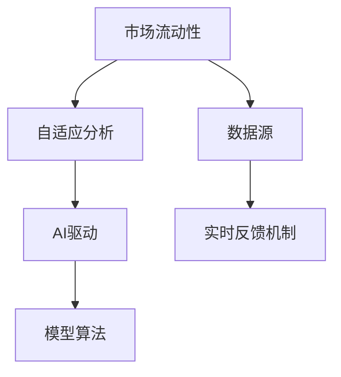
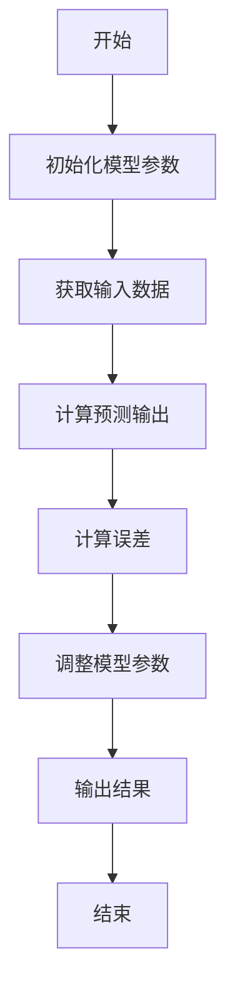
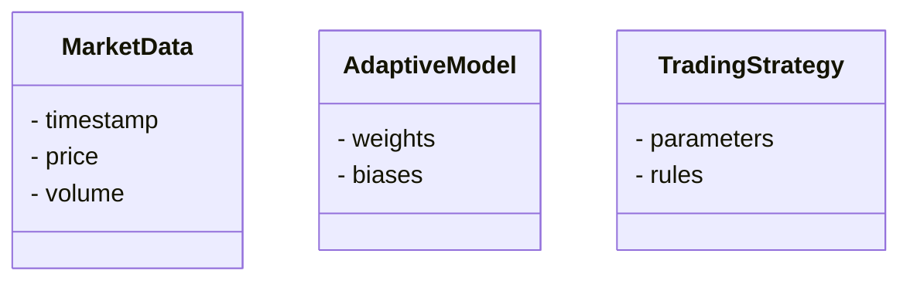
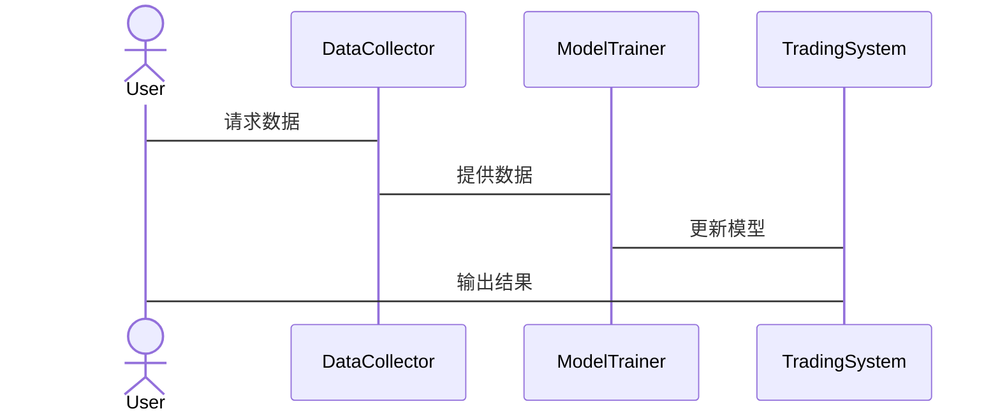

                 


```markdown
# AI驱动的自适应市场流动性分析

> 关键词：AI，市场流动性，自适应分析，机器学习，高频交易，算法交易，金融市场

> 摘要：  
本文探讨了AI在自适应市场流动性分析中的应用，从背景、核心概念到算法实现，再到系统架构和项目实战，全面解析了如何利用AI技术优化市场流动性分析。通过详细的技术分析和实例，展示了AI驱动的自适应方法在金融市场中的优势和实现路径。

---

# 第一部分: AI驱动的自适应市场流动性分析概述

## 第1章: 自适应市场流动性分析的背景与意义

### 1.1 问题背景

#### 1.1.1 市场流动性的定义与重要性
市场流动性是指资产在短时间内以合理价格买卖的能力。流动性高的市场具有较低的买卖价差和较高的交易量，是金融市场健康运作的基础。

#### 1.1.2 传统市场流动性分析的局限性
传统分析依赖于固定模型，难以捕捉市场动态变化，特别是在高频交易和算法交易日益普及的情况下，传统方法显得力不从心。

#### 1.1.3 AI驱动的自适应分析的优势
AI能够实时学习和调整模型，适应市场变化，提高分析的准确性和响应速度。

### 1.2 问题描述

#### 1.2.1 市场流动性的动态变化特点
市场流动性受多种因素影响，如市场情绪、交易量和宏观经济指标，表现出高度的动态性和不确定性。

#### 1.2.2 高频交易与算法交易的挑战
高频交易要求快速决策，传统方法难以应对复杂多变的市场环境。

#### 1.2.3 自适应分析的必要性
为了应对市场的快速变化，需要一种能够实时调整的分析方法，这就是自适应分析的必要性所在。

### 1.3 问题解决

#### 1.3.1 自适应分析的核心目标
通过实时学习和调整模型，优化市场流动性分析的准确性和效率。

#### 1.3.2 AI在自适应分析中的作用
AI技术能够处理大量数据，识别复杂模式，提供实时反馈，帮助交易者做出明智决策。

#### 1.3.3 自适应算法的实现路径
从数据收集、特征提取到模型训练和部署，构建一个闭环的自适应系统。

### 1.4 边界与外延

#### 1.4.1 自适应分析的适用范围
适用于高频交易、算法交易和市场风险管理等领域，但不适用于低频交易和长期市场分析。

#### 1.4.2 与其他市场分析方法的区别
自适应分析强调实时调整和动态优化，而传统方法则依赖于固定模型和假设。

#### 1.4.3 自适应分析的潜在风险
可能面临模型过拟合、数据质量和计算延迟等问题，需要谨慎设计和监控。

### 1.5 概念结构与核心要素

#### 1.5.1 核心概念的层次结构
市场流动性分析 → 自适应分析 → AI驱动。

#### 1.5.2 核心要素的定义与关系
数据源、模型算法、实时反馈机制三者相互关联，共同构成自适应分析系统。

#### 1.5.3 概念结构的可视化展示


---

## 第2章: AI驱动的自适应市场流动性分析的核心概念与联系

### 2.1 核心概念原理

#### 2.1.1 自适应分析的基本原理
通过实时数据反馈，不断优化模型参数，提高分析的准确性和适应性。

#### 2.1.2 AI在自适应分析中的作用
AI技术能够处理复杂数据，识别潜在模式，提供实时决策支持。

#### 2.1.3 自适应算法的数学模型
自适应滤波算法可以表示为：
$$
x_{n} = a \cdot x_{n-1} + b \cdot u_{n} + c \cdot e_{n}
$$
其中，\( x_n \) 是当前状态，\( x_{n-1} \) 是前一状态，\( u_n \) 是输入，\( e_n \) 是误差项，\( a \)、\( b \)、\( c \) 是权重系数。

### 2.2 核心概念属性特征对比

#### 2.2.1 自适应分析与传统分析的对比

| 对比维度 | 自适应分析 | 传统分析 |
|----------|------------|----------|
| 数据处理 | 实时动态 | 固定静态 |
| 模型更新 | 自动调整 | 手动更新 |
| 响应速度 | 实时 | 延时 |

#### 2.2.2 不同AI算法的性能对比

| 算法类型 | 自适应能力 | 计算复杂度 |
|----------|------------|------------|
| 线性回归 | 低 | 低 |
| 支持向量机 | 中 | 高 |
| 神经网络 | 高 | 极高 |

#### 2.2.3 数据特征对分析结果的影响
数据特征如波动性、交易量和市场情绪直接影响模型的准确性和稳定性。

### 2.3 ER实体关系图架构

```mermaid
erd
MarketEntity {
    id
    name
}
Transaction {
    id
    time
    amount
}
MarketData {
    id
    time
    value
}
```

---

## 第3章: 算法原理讲解

### 3.1 算法实现

#### 3.1.1 自适应滤波算法实现


#### 3.1.2 Python核心代码实现

```python
import numpy as np
import tensorflow as tf

def adaptive_filter(data, learning_rate=0.1):
    model = tf.keras.Sequential([
        tf.keras.layers.Dense(1, input_shape=(1,))
    ])
    model.compile(optimizer=tf.keras.optimizers.Adam(learning_rate), loss='mean_squared_error')
    history = model.fit(data[:-1], data[1:], epochs=100, verbose=0)
    return model.predict(data[-1:])[0][0]

# 示例数据
data = np.random.rand(100)
filtered = adaptive_filter(data)
```

### 3.2 算法原理的数学模型

#### 3.2.1 自适应滤波算法的数学表达
自适应滤波器通过不断调整权重，最小化误差函数：
$$
e_n = d_n - y_n
$$
其中，\( e_n \) 是误差，\( d_n \) 是期望输出，\( y_n \) 是实际输出。

#### 3.2.2 算法的收敛性分析
自适应滤波器的收敛性取决于步长和初始化参数，可以通过调整学习率来控制收敛速度和稳定性。

### 3.3 算法实现的流程图



---

## 第4章: 系统分析与架构设计

### 4.1 系统分析

#### 4.1.1 问题场景介绍
高频交易环境中，需要实时分析市场流动性，优化交易策略。

#### 4.1.2 项目介绍
开发一个AI驱动的自适应流动性分析系统，用于实时监控和优化交易决策。

### 4.2 系统功能设计

#### 4.2.1 领域模型类图



### 4.3 系统架构设计

#### 4.3.1 系统架构图


#### 4.3.2 系统接口设计



---

## 第5章: 项目实战

### 5.1 环境安装

#### 5.1.1 安装Python
```bash
python --version
pip install numpy tensorflow pandas
```

#### 5.1.2 安装TensorFlow
```bash
pip install tensorflow
```

### 5.2 系统核心实现

#### 5.2.1 核心代码实现

```python
import numpy as np
import pandas as pd

# 数据预处理
data = pd.read_csv('market_data.csv')
features = data[['price', 'volume']]
labels = data['流动性']

# 模型训练
model = tf.keras.Sequential([
    tf.keras.layers.Dense(64, activation='relu', input_shape=(2,)),
    tf.keras.layers.Dense(1)
])
model.compile(optimizer='adam', loss='mean_squared_error')
model.fit(features, labels, epochs=100, batch_size=32)

# 模型部署
def predict流动性(features):
    return model.predict(features)
```

#### 5.2.2 代码应用解读与分析
通过训练模型，系统能够根据价格和成交量预测市场流动性，帮助交易者做出实时决策。

### 5.3 实际案例分析

#### 5.3.1 数据分析与预处理
使用历史交易数据，提取关键特征，如价格、交易量和时间戳。

#### 5.3.2 模型训练与评估
通过交叉验证评估模型性能，调整超参数以优化预测准确率。

### 5.4 项目小结
通过项目实战，验证了AI驱动的自适应分析在实际应用中的有效性和可行性。

---

## 第6章: 最佳实践、小结、注意事项和拓展阅读

### 6.1 最佳实践

#### 6.1.1 数据质量的重要性
确保数据的准确性和完整性，避免噪声干扰模型训练。

#### 6.1.2 模型调优的技巧
通过网格搜索和交叉验证优化模型参数，选择合适的算法。

### 6.2 小结
本文全面介绍了AI驱动的自适应市场流动性分析，从理论到实践，展示了其在金融市场的应用潜力。

### 6.3 注意事项

#### 6.3.1 模型过拟合的风险
通过正则化和交叉验证防止模型过拟合。

#### 6.3.2 数据实时性的保障
确保数据采集和处理的实时性，避免信息滞后。

#### 6.3.3 系统稳定性的重要性
设计容错机制，确保系统在异常情况下的稳定运行。

### 6.4 拓展阅读

#### 6.4.1 推荐书籍
- 《机器学习实战》
- 《深度学习》

#### 6.4.2 推荐博客和资源
- TensorFlow官方文档
- PyTorch官方文档
- 专业金融分析博客

---

## 附录: 完整代码示例和数据集说明

### 附录A: 完整代码示例

```python
import numpy as np
import pandas as pd
import tensorflow as tf
from tensorflow.keras import layers

# 数据加载
data = pd.read_csv('market_data.csv')

# 数据预处理
features = data[['price', 'volume']]
labels = data['liquidity']

# 模型构建
model = tf.keras.Sequential([
    layers.Dense(64, activation='relu', input_shape=(2,)),
    layers.Dense(1)
])
model.compile(optimizer='adam', loss='mean_squared_error')

# 模型训练
model.fit(features, labels, epochs=100, batch_size=32)

# 预测函数
def predict_liquidity(features):
    return model.predict(features)
```

### 附录B: 数据集说明
数据集包括价格、交易量和市场流动性等字段，建议使用最新的交易数据进行模型训练。

### 附录C: 工具安装指南
- 安装Python：[Python官网](https://www.python.org/)
- 安装TensorFlow：`pip install tensorflow`

---

# 作者：AI天才研究院/AI Genius Institute & 禅与计算机程序设计艺术 /Zen And The Art of Computer Programming

---

通过以上内容，我们系统地介绍了AI驱动的自适应市场流动性分析的各个方面，从理论基础到实际应用，为读者提供了全面的知识体系和实践指导。
```

