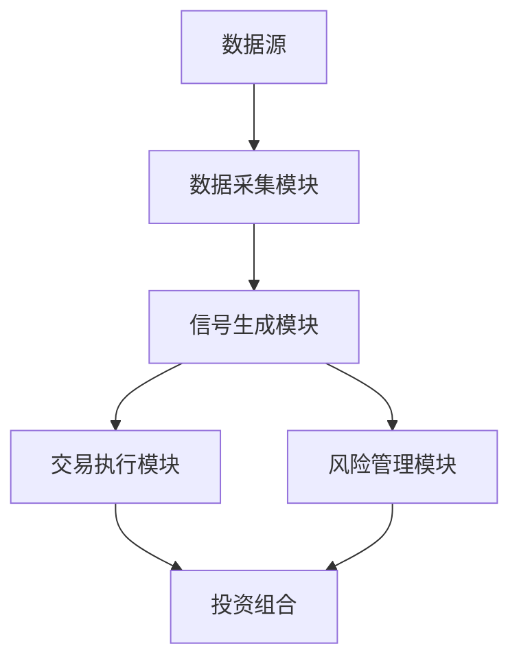

                 


# 克里斯托弗·布朗的小盘股价值投资策略

> 关键词：小盘股，价值投资，克里斯托弗·布朗，投资策略，财务分析，风险管理

> 摘要：本文详细介绍了克里斯托弗·布朗的小盘股价值投资策略，从基本概念到分析方法，再到实际操作策略，系统地阐述了如何在小盘股市场中进行价值投资。文章结合了技术分析和基本面分析，为投资者提供了全面的指导，帮助他们在小盘股市场中找到具有长期增长潜力的投资标的。

---

# 第一部分：小盘股价值投资的背景与核心概念

## 第1章：小盘股的定义与特点

### 1.1 小盘股的定义与特点

#### 1.1.1 小盘股的定义
小盘股通常指的是市值较小的公司股票。根据市场惯例，小盘股的市值范围通常在30亿到20亿美元之间。与大盘股相比，小盘股具有流动性较低、波动性较高、增长潜力较大的特点。

#### 1.1.2 小盘股与大盘股的对比
- **市场规模**：大盘股通常属于行业龙头，市场占有率高，而小盘股多为新兴企业或区域性公司。
- **流动性**：大盘股交易量大，流动性高，而小盘股交易量小，流动性较低。
- **波动性**：小盘股价格波动较大，而大盘股价格相对稳定。
- **增长潜力**：小盘股由于市值较小，增长潜力通常高于大盘股。

#### 1.1.3 小盘股市场的特点
- **市场分散**：小盘股分布在多个行业和市场，投资者需要进行深入的行业研究。
- **信息不透明**：小盘股公司信息披露较少，投资者需要通过其他途径获取信息。
- **高波动性**：小盘股价格波动较大，容易受到市场情绪的影响。

### 1.2 价值投资的核心理念

#### 1.2.1 价值投资的起源与发展
价值投资是一种投资策略，起源于20世纪初，由本杰明·格雷厄姆和大卫·多德提出。其核心理念是寻找市场价值低于内在价值的股票进行投资。

#### 1.2.2 价值投资的核心原则
- **安全边际**：买入价格低于内在价值，确保有一定的安全空间。
- **长期视角**：关注公司的长期价值，而非短期价格波动。
- **深入分析**：通过基本面分析，寻找具有竞争优势和良好管理的公司。

#### 1.2.3 小盘股价值投资的独特性
小盘股价值投资与大盘股价值投资有所不同，主要体现在：
- **市场规模小**：小盘股公司规模小，更容易受到行业变化的影响。
- **成长性高**：小盘股公司具有较高的增长潜力，适合长期投资。
- **流动性风险**：小盘股流动性较低，投资者需要注意流动性风险。

### 1.3 克里斯托弗·布朗的投资策略概述

#### 1.3.1 克里斯托弗·布朗的背景介绍
克里斯托弗·布朗是小盘股价值投资的代表人物之一，他的投资策略以深入的基本面分析和长期持有为核心。

#### 1.3.2 其投资理念的核心要素
- **价值发现**：寻找被市场低估的小盘股公司。
- **竞争优势**：关注具有竞争优势和持续盈利能力的公司。
- **长期持有**：以长期视角看待投资，避免短期波动的影响。

#### 1.3.3 小盘股价值投资的适用场景
小盘股价值投资适用于以下场景：
- **市场波动较大时**：小盘股价格波动较大，容易出现低估机会。
- **经济周期底部**：在经济周期底部，小盘股公司可能面临低估。
- **行业结构性变化**：某些行业可能出现结构性变化，小盘股公司可能因此受益。

### 1.4 本章小结
本章介绍了小盘股的定义和特点，阐述了价值投资的核心理念，并详细介绍了克里斯托弗·布朗的投资策略。小盘股价值投资以发现被低估的公司为核心，注重长期持有和竞争优势分析。

---

## 第2章：小盘股的财务指标分析

### 2.1 财务报表基础

#### 2.1.1 资产负债表的核心要素
- **资产**：包括流动资产和非流动资产，流动资产如现金、应收账款，非流动资产如固定资产。
- **负债**：包括流动负债和非流动负债，流动负债如应付账款、短期借款，非流动负债如长期借款。
- **所有者权益**：包括股本、资本公积、盈余公积等。

#### 2.1.2 利润表的关键指标
- **营业收入**：公司主营业务收入。
- **净利润**：公司实现的净利润，是衡量公司盈利能力的重要指标。
- **毛利率**：（营业收入 - 营业成本）/ 营业收入，衡量公司产品盈利能力。

#### 2.1.3 现金流量表的重要性
- **经营活动现金流**：公司日常经营产生的现金流。
- **投资活动现金流**：公司投资活动产生的现金流。
- **筹资活动现金流**：公司筹资活动产生的现金流。

### 2.2 小盘股的估值方法

#### 2.2.1 市盈率（P/E）的计算与应用
市盈率 = 股价 / 每股收益（EPS）。例如，公司A股价为10元，每股收益为2元，则市盈率为5倍。

#### 2.2.2 市净率（P/B）的分析
市净率 = 股价 / 每股净资产（BPS）。例如，公司B股价为20元，每股净资产为10元，则市净率为2倍。

#### 2.2.3 股息率的评估
股息率 = 每股股息 / 股价。例如，公司C每股股息为1元，股价为20元，则股息率为5%。

### 2.3 财务健康度评估

#### 2.3.1 偿债能力分析
- **流动比率** = 流动资产 / 流动负债。
- **速动比率** = （流动资产 - 存货）/ 流动负债。

#### 2.3.2 盈利能力分析
- **净利率** = 净利润 / 营业收入。
- **ROE（净资产收益率）** = 净利润 / 所有者权益。

#### 2.3.3 营运能力分析
- **存货周转率** = 营业成本 / 平均存货。
- **应收账款周转率** = 营业收入 / 平均应收账款。

### 2.4 本章小结
本章详细介绍了小盘股的财务指标分析方法，包括财务报表分析、估值方法和财务健康度评估。通过这些分析，投资者可以更好地评估小盘股的投资价值。

---

## 第3章：小盘股的竞争优势分析

### 3.1 企业竞争优势的识别

#### 3.1.1 行业地位分析
- **市场占有率**：公司是否是行业龙头，市场占有率如何。
- **行业竞争格局**：行业内的竞争情况，是否存在垄断或寡头竞争。

#### 3.1.2 市场占有率评估
- **市场份额**：公司所占的市场份额大小。
- **竞争对手分析**：竞争对手的优劣势分析。

#### 3.1.3 核心竞争力判断
- **核心技术**：公司是否拥有独特的技术或专利。
- **成本优势**：公司在生产成本上的优势。

### 3.2 管理层分析

#### 3.2.1 管理层的背景与能力
- **管理团队**：管理层的背景、经验和能力。
- **管理风格**：是激进型还是稳健型管理风格。

#### 3.2.2 管理层的决策风格
- **决策效率**：管理层在决策上的效率和准确性。
- **战略规划**：公司是否有明确的长期发展战略。

#### 3.2.3 管理层的财务纪律
- **资本支出控制**：公司是否控制资本支出，避免过度投资。
- **分红政策**：公司是否有稳定的分红政策。

### 3.3 企业成长性评估

#### 3.3.1 历史增长分析
- **收入增长**：公司过去几年的收入增长率。
- **利润增长**：公司过去几年的净利润增长率。

#### 3.3.2 未来增长潜力
- **行业增长空间**：行业未来的发展空间。
- **竞争优势**：公司是否能在未来保持竞争优势。

#### 3.3.3 行业发展趋势
- **行业周期**：行业处于哪个周期阶段。
- **政策影响**：政策对行业的影响。

### 3.4 本章小结
本章从竞争优势、管理层和企业成长性三个方面，详细分析了小盘股的竞争优势。通过这些分析，投资者可以更好地识别具有长期增长潜力的小盘股公司。

---

## 第4章：小盘股投资组合的构建

### 4.1 投资组合的基本原理

#### 4.1.1 投资组合的目标设定
- **投资目标**：明确投资目标，如追求绝对收益或相对收益。
- **风险承受能力**：根据自身的风险承受能力，设定投资组合的风险水平。

#### 4.1.2 投资组合的风险与收益平衡
- **风险分散**：通过分散投资降低风险。
- **收益预期**：根据市场情况设定收益预期。

#### 4.1.3 小盘股在组合中的角色
- **风险和收益匹配**：小盘股通常具有较高的风险和收益，适合风险承受能力强的投资者。

### 4.2 小盘股投资组合的优化

#### 4.2.1 股票筛选标准
- **财务指标**：如低市盈率、低市净率。
- **竞争优势**：如具有独特竞争优势的公司。
- **管理层**：管理层稳定且有良好的管理能力。

#### 4.2.2 组合权重分配
- **分散投资**：避免过度集中，降低风险。
- **权重分配**：根据公司的基本面和风险水平，合理分配权重。

#### 4.2.3 定期调整策略
- **定期 review**：定期检查投资组合，调整权重。
- **动态优化**：根据市场变化和公司基本面变化，动态优化投资组合。

### 4.3 实例分析

#### 4.3.1 某小盘股投资组合的构建过程
- **筛选阶段**：通过财务指标和竞争优势分析，筛选出若干小盘股。
- **权重分配**：根据筛选结果，分配投资权重。
- **组合构建**：将筛选出的股票按权重加入投资组合。

#### 4.3.2 组合表现的回顾与分析
- **收益表现**：对比投资组合的收益与市场指数的收益。
- **风险控制**：分析投资组合的风险水平是否符合预期。

### 4.4 本章小结
本章详细介绍了小盘股投资组合的构建方法，包括目标设定、优化策略和实例分析。通过这些方法，投资者可以更好地构建和管理自己的小盘股投资组合。

---

## 第5章：长期投资与小盘股价值

### 5.1 长期投资策略

#### 5.1.1 长期投资的核心理念
- **价值投资**：买入并持有，等待价值实现。
- **复利效应**：通过长期持有，享受复利效应。

#### 5.1.2 长期投资的风险管理
- **时间分散**：通过长期投资分散风险。
- **分散投资**：通过分散投资降低风险。

### 5.2 小盘股的价值实现

#### 5.2.1 小盘股的价值发现
- **市场低估**：寻找被市场低估的小盘股。
- **价值实现**：通过公司成长和价值发现，实现股价上涨。

#### 5.2.2 小盘股的价值陷阱
- **基本面恶化**：公司基本面恶化，股价可能继续下跌。
- **流动性风险**：小盘股流动性较低，可能难以变现。

### 5.3 本章小结
本章探讨了长期投资与小盘股价值的关系，强调了长期投资的核心理念和风险管理的重要性。通过长期持有优质小盘股，投资者可以实现财富的长期增长。

---

## 第6章：风险管理与心理控制

### 6.1 风险管理策略

#### 6.1.1 风险评估
- **市场风险**：小盘股市场波动较大，市场风险较高。
- **流动性风险**：小盘股流动性较低，可能难以变现。

#### 6.1.2 风险控制措施
- **分散投资**：通过分散投资降低风险。
- **严格止损**：设定止损点，避免损失扩大。

### 6.2 心理风险管理

#### 6.2.1 投资者心理分析
- **贪婪与恐惧**：投资者容易受到贪婪和恐惧的影响，做出非理性决策。
- **情绪控制**：投资者需要控制情绪，避免被市场情绪左右。

#### 6.2.2 心理控制技巧
- **制定计划**：制定明确的投资计划，严格执行。
- **定期反思**：定期反思自己的投资行为，总结经验教训。

### 6.3 本章小结
本章讨论了风险管理与心理控制的重要性。通过有效的风险管理，投资者可以降低投资风险，实现长期稳定的收益。

---

## 第7章：案例分析与投资策略总结

### 7.1 实际案例分析

#### 7.1.1 案例背景介绍
- **公司概况**：介绍公司的基本情况，如行业、规模等。
- **财务分析**：对公司的财务状况进行详细分析，包括财务指标和竞争优势。

#### 7.1.2 投资策略制定
- **买入时机**：分析买入时机，如市场低估时。
- **卖出策略**：设定卖出条件，如股价达到目标价或基本面变化。

### 7.2 投资策略总结

#### 7.2.1 小盘股投资的核心要素
- **价值发现**：寻找被低估的小盘股。
- **竞争优势**：关注具有竞争优势的公司。
- **长期持有**：以长期视角看待投资。

#### 7.2.2 投资者的心态与纪律
- **耐心与纪律**：投资者需要具备耐心和纪律，避免短期波动的影响。
- **持续学习**：不断学习和提升自己的投资能力。

### 7.3 本章小结
本章通过实际案例分析，总结了小盘股价值投资的核心要素和投资策略。投资者需要具备耐心、纪律和持续学习能力，才能在小盘股市场中获得长期稳定的收益。

---

## 第8章：建立小盘股投资系统

### 8.1 系统建立的背景

#### 8.1.1 投资系统的重要性
- **系统性**：通过系统化的方法，降低投资风险。
- **效率提升**：通过自动化工具，提高投资效率。

#### 8.1.2 系统建立的目标
- **实现自动化交易**：通过系统自动执行交易指令。
- **实时监控**：实时监控市场和投资组合的变化。

### 8.2 系统架构设计

#### 8.2.1 系统功能设计
- **数据采集**：从市场获取实时数据。
- **信号生成**：根据数据生成交易信号。
- **交易执行**：根据信号执行交易。
- **风险管理**：监控和管理投资风险。

#### 8.2.2 系统架构图


### 8.3 数据采集与处理

#### 8.3.1 数据源介绍
- **市场数据**：包括股票价格、成交量等。
- **财务数据**：包括公司财务报表数据。

#### 8.3.2 数据清洗与预处理
- **数据清洗**：去除异常数据，填补缺失值。
- **数据转换**：将数据转换为适合分析的形式。

### 8.4 信号生成与交易执行

#### 8.4.1 信号生成策略
- **技术指标**：如RSI、MACD等。
- **基本面指标**：如市盈率、市净率等。

#### 8.4.2 交易执行逻辑
- **条件触发**：当信号满足条件时，系统自动执行交易。
- **风险控制**：系统自动执行风险控制措施，如止损。

### 8.5 项目实战

#### 8.5.1 环境安装
- **编程语言**：Python
- **数据获取工具**：如Yahoo Finance API
- **数据分析工具**：Pandas、NumPy
- **可视化工具**：Matplotlib、Seaborn

#### 8.5.2 核心代码实现
```python
import pandas as pd
import numpy as np
import yfinance as yf

# 下载数据
data = yf.download(tickers='AAPL', start='2020-01-01', end='2023-12-31')

# 计算技术指标
data['MA_20'] = data['Adj Close'].rolling(window=20).mean()
data['RSI'] = ta.RSI(data['Adj Close'], window=14)

# 生成信号
data['Signal'] = 0
data['Signal'] = data['Signal'].where(data['RSI'] < 30, 1)
data['Signal'] = data['Signal'].where(data['MA_20'] > data['Adj Close'], -1)

# 执行交易
positions = 0
data['Position'] = 0
for i in range(len(data)):
    if data['Signal'].iloc[i] == 1 and positions == 0:
        data['Position'].iloc[i] = 1
        positions = 1
    elif data['Signal'].iloc[i] == -1 and positions == 1:
        data['Position'].iloc[i] = 0
        positions = 0
```

### 8.6 本章小结
本章介绍了如何建立小盘股投资系统，包括系统架构设计、数据处理、信号生成和交易执行等。通过系统化的方法，投资者可以更高效地进行小盘股投资。

---

## 第9章：总结与展望

### 9.1 总结

#### 9.1.1 核心内容回顾
- 小盘股的定义与特点。
- 价值投资的核心理念。
- 克里斯托弗·布朗的投资策略。
- 小盘股的财务指标分析。
- 小盘股的竞争优势分析。
- 小盘股投资组合的构建。
- 长期投资与小盘股价值。
- 风险管理与心理控制。
- 小盘股投资系统的建立。

#### 9.1.2 本文的主要结论
- 小盘股价值投资需要结合技术分析和基本面分析。
- 长期持有和竞争优势分析是小盘股投资的核心。
- 风险管理和心理控制是确保投资成功的必要条件。

### 9.2 展望

#### 9.2.1 未来的研究方向
- 小盘股市场的动态变化。
- 小盘股投资策略的优化。
- 小盘股投资系统的技术创新。

#### 9.2.2 对投资者的建议
- 持续学习，提升自己的投资能力。
- 保持耐心，避免短期波动的影响。
- 建立完善的投资系统，降低投资风险。

### 9.3 本章小结
本章总结了全文的主要内容，并对未来的研究方向和投资者的建议进行了展望。小盘股价值投资需要投资者具备全面的能力，从基本面分析到技术分析，再到风险管理，缺一不可。

---

## 作者：AI天才研究院/AI Genius Institute & 禅与计算机程序设计艺术/Zen And The Art of Computer Programming

---

以上是《克里斯托弗·布朗的小盘股价值投资策略》的技术博客文章的完整内容。文章从多个角度详细分析了小盘股价值投资的策略和方法，并结合实际案例和系统建立，为投资者提供了全面的指导。

