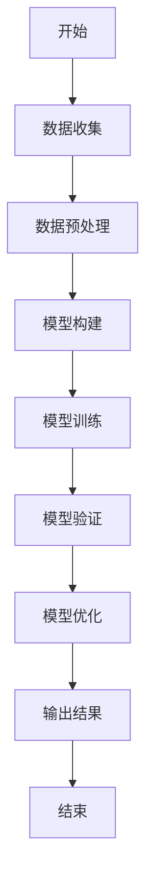
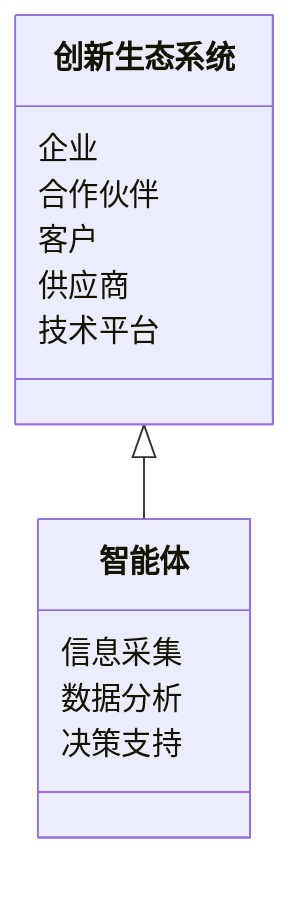
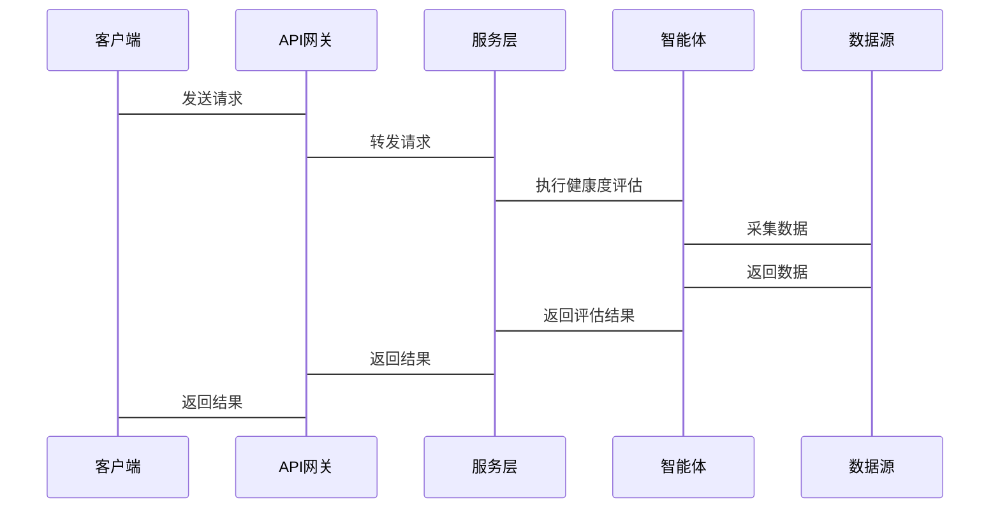

                 


# 多智能体系统在公司创新生态系统健康度评估中的应用

> 关键词：多智能体系统、创新生态系统、健康度评估、算法原理、系统架构

> 摘要：本文探讨了多智能体系统在公司创新生态系统健康度评估中的应用，从理论基础到实际案例，详细分析了健康度评估的必要性、方法及实现方案。通过构建多智能体模型，结合具体算法和系统架构设计，展示了如何利用多智能体系统优化企业创新生态系统的管理与决策。

---

## 第一部分: 多智能体系统与创新生态系统概述

### 第1章: 多智能体系统基础

#### 1.1 多智能体系统的基本概念

##### 1.1.1 多智能体系统的定义
多智能体系统（Multi-Agent System, MAS）是由多个智能体（Agent）组成的分布式系统，这些智能体通过协作或竞争完成特定目标。每个智能体都有一定的自主性、反应性和社会性。

##### 1.1.2 多智能体系统的特征
| 特征 | 描述 |
|------|------|
| 分布性 | 智能体独立运行，无中心节点 |
| 反应性 | 能感知环境并做出实时响应 |
| 协作性 | 智能体之间可以协作完成任务 |
| 社会性 | 智能体之间存在交互与信息共享 |

##### 1.1.3 多智能体系统的分类
- **简单反射型**：基于当前感知做出反应
- **基于模型的反射型**：结合内部模型进行决策
- **目标驱动型**：以特定目标为导向
- **效用驱动型**：通过效用函数优化决策

#### 1.2 创新生态系统的基本概念

##### 1.2.1 创新生态系统的定义
创新生态系统是由企业、合作伙伴、客户、供应商等多方参与者共同构成的网络，通过协作与竞争推动创新。

##### 1.2.2 创新生态系统的构成要素
| 要素 | 描述 |
|------|------|
| 企业 | 核心创新主体 |
| 合作伙伴 | 提供技术、资源支持 |
| 客户 | 需求驱动创新 |
| 供应商 | 提供原材料或服务 |
| 技术平台 | 支持创新活动的基础设施 |

##### 1.2.3 创新生态系统的特点
- **动态性**：参与者和关系不断变化
- **复杂性**：涉及多方利益和交互
- **网络化**：通过网络协同实现创新

#### 1.3 企业创新生态系统健康度评估的重要性

##### 1.3.1 企业创新生态系统健康度的定义
健康度是衡量创新生态系统整体运行状态的指标，包括创新能力、协作效率和可持续性。

##### 1.3.2 健康度评估的意义
- **优化资源配置**：识别瓶颈，合理分配资源
- **提升协作效率**：促进各参与者高效协同
- **预测风险**：提前发现潜在问题

##### 1.3.3 健康度评估的挑战与机遇
- **挑战**：数据收集困难，模型复杂度高
- **机遇**：通过多智能体系统实现动态评估

---

## 第二部分: 多智能体系统在创新生态系统中的应用

### 第2章: 多智能体系统在企业创新中的作用

#### 2.1 多智能体系统在创新过程中的角色

##### 2.1.1 多智能体系统的角色
- **信息收集**：智能体实时收集市场、技术、客户需求等信息
- **决策支持**：基于信息提供优化建议
- **协作协调**：协调不同参与者之间的关系

##### 2.1.2 多智能体系统如何促进创新
- **知识共享**：智能体之间共享知识和资源
- **快速响应**：实时响应市场变化
- **灵活调整**：根据反馈动态优化

##### 2.1.3 多智能体系统在创新生态系统中的优势
- **分布式计算**：避免单点故障
- **自主性**：智能体独立运作，降低依赖性
- **适应性**：快速适应环境变化

#### 2.2 多智能体系统与创新生态系统的关系

##### 2.2.1 多智能体系统的结构与创新生态系统的匹配
- **层次结构**：从个体到整体的多层次结构
- **网络结构**：通过网络实现协作与互动

##### 2.2.2 多智能体系统如何影响创新生态系统的健康度
- **信息透明**：通过智能体共享信息，提升透明度
- **高效协作**：智能体之间高效协同，提升整体效率
- **风险分散**：通过分布式结构降低系统风险

##### 2.2.3 创新生态系统对多智能体系统的需求
- **实时数据**：需要实时更新的市场和技术数据
- **动态调整**：根据环境变化快速调整策略
- **多目标优化**：在多个目标之间找到平衡点

### 第3章: 创新生态系统健康度评估的核心概念

#### 3.1 创新生态系统健康度的评价指标

##### 3.1.1 创新能力
- **研发投入**：企业研发投入占收入的比例
- **专利数量**：企业的专利申请和授权数量
- **新产品推出速度**：新产品或服务的上市速度

##### 3.1.2 协作能力
- **合作伙伴数量**：企业拥有的合作伙伴数量
- **协作频率**：合作伙伴之间的协作频率
- **协作成果**：协作产生的实际成果

##### 3.1.3 可持续发展能力
- **资源利用率**：资源的使用效率
- **环境影响**：企业的环保表现
- **社会责任**：企业履行社会责任的情况

#### 3.2 多智能体系统在健康度评估中的核心作用

##### 3.2.1 多智能体系统的数据采集能力
- **实时数据采集**：智能体实时采集市场、技术和客户需求数据
- **数据整合**：将分散的数据整合到统一平台
- **数据清洗**：对数据进行预处理，确保数据质量

##### 3.2.2 多智能体系统的分析能力
- **数据分析**：利用数据分析技术对健康度指标进行分析
- **模型构建**：构建健康度评估模型，预测系统健康状态
- **可视化**：通过可视化工具将分析结果呈现给决策者

##### 3.2.3 多智能体系统的决策支持能力
- **决策支持**：基于分析结果提供决策建议
- **情景模拟**：模拟不同情景下的系统表现
- **优化建议**：提出优化系统健康度的建议

### 第4章: 多智能体系统在健康度评估中的算法原理

#### 4.1 基于多智能体系统的健康度评估模型

##### 4.1.1 模型的构建过程
1. **数据收集**：通过智能体收集企业创新生态系统的相关数据
2. **数据预处理**：清洗和整合数据
3. **模型构建**：基于多智能体系统构建健康度评估模型
4. **模型训练**：利用历史数据训练模型
5. **模型验证**：通过验证数据测试模型的准确性
6. **模型优化**：根据验证结果优化模型

##### 4.1.2 模型的输入与输出
- **输入**：企业的研发投入、专利数量、新产品推出速度、合作伙伴数量、协作频率、资源利用率、环境影响、社会责任等
- **输出**：企业创新生态系统的健康度评分（如A级、B级、C级等）

##### 4.1.3 模型的优化与改进
- **特征选择**：通过特征选择算法优化模型的输入特征
- **参数调优**：通过网格搜索等方法优化模型的参数
- **模型融合**：结合多种模型的优点，提高模型的准确性

#### 4.2 健康度评估的数学模型与公式

##### 4.2.1 健康度综合评分模型
健康度评分可以通过以下公式计算：
$$
\text{健康度评分} = w_1 \times \text{创新能力} + w_2 \times \text{协作能力} + w_3 \times \text{可持续发展能力}
$$
其中，$w_1, w_2, w_3$ 是各指标的权重，通常通过专家评分或数据驱动的方法确定。

##### 4.2.2 健康度权重分配公式
权重分配可以通过以下公式实现：
$$
w_i = \frac{\sum_{j=1}^{n} s_{ij}}{\sum_{i=1}^{m} \sum_{j=1}^{n} s_{ij}}
$$
其中，$s_{ij}$ 是第$i$个指标的第$j$个评分，$m$是指标总数，$n$是评分人数。

##### 4.2.3 健康度预测公式
健康度预测可以通过机器学习模型（如随机森林、支持向量机）实现，具体公式取决于所选模型。

#### 4.3 算法流程图


#### 4.4 系统实现
以下是一个基于Python的健康度评估模型的实现示例：
```python
import pandas as pd
from sklearn.ensemble import RandomForestClassifier
from sklearn.metrics import accuracy_score

# 数据加载
data = pd.read_csv('创新生态系统数据.csv')

# 特征与标签分离
X = data.drop('健康度', axis=1)
y = data['健康度']

# 模型训练
model = RandomForestClassifier()
model.fit(X, y)

# 模型预测
y_pred = model.predict(X)

# 模型评估
print(f'模型准确度：{accuracy_score(y, y_pred)}')
```

---

## 第三部分: 系统分析与架构设计

### 第5章: 创新生态系统健康度评估的系统分析

#### 5.1 项目背景介绍
- **项目目标**：构建一个基于多智能体系统的创新生态系统健康度评估平台
- **项目范围**：涵盖企业创新过程中的主要参与者和关键指标
- **项目需求**：实时监测和评估创新生态系统的健康度

#### 5.2 系统功能设计

##### 5.2.1 领域模型（Mermaid 类图）


##### 5.2.2 系统架构设计（Mermaid 架构图）


##### 5.2.3 系统接口设计
- **API接口**：提供RESTful API，供客户端调用
- **数据接口**：与数据源（如数据库、API）对接
- **用户界面**：提供友好的用户界面，供用户查看健康度评估结果

##### 5.2.4 系统交互设计（Mermaid 序列图）


### 第6章: 项目实战

#### 6.1 环境配置
- **操作系统**：建议使用Linux或macOS
- **编程语言**：Python 3.8+
- **依赖库**：pandas, scikit-learn, requests

#### 6.2 核心代码实现

##### 6.2.1 数据采集
```python
import requests

url = 'https://example.com/api/data'
response = requests.get(url)
data = response.json()
```

##### 6.2.2 数据分析
```python
import pandas as pd
from sklearn.ensemble import RandomForestClassifier

# 数据加载
data = pd.read_csv('创新生态系统数据.csv')

# 特征与标签分离
X = data.drop('健康度', axis=1)
y = data['健康度']

# 模型训练
model = RandomForestClassifier()
model.fit(X, y)
```

##### 6.2.3 模型部署
```python
from flask import Flask, request, jsonify

app = Flask(__name__)
model = RandomForestClassifier()
model.fit(X, y)

@app.route('/predict', methods=['POST'])
def predict():
    data = request.json
    prediction = model.predict([[data['特征1'], data['特征2'], ...]])
    return jsonify({'健康度': int(prediction[0])})

if __name__ == '__main__':
    app.run(debug=True)
```

#### 6.3 案例分析与结果解读
假设我们有一个企业A，其创新生态系统健康度评估数据如下：
- 研发投入：10%
- 专利数量：50件
- 新产品推出速度：6个月
- 合作伙伴数量：20个
- 协作频率：每月10次
- 资源利用率：80%
- 环境影响：较低
- 社会责任：良好

将这些数据输入模型后，预测结果为健康度B级，说明企业A的创新生态系统整体表现良好，但在某些方面（如研发投入）需要进一步优化。

---

## 第四部分: 总结与展望

### 第7章: 总结与展望

#### 7.1 最佳实践 Tips
- **数据质量**：确保数据的准确性和完整性
- **模型选择**：根据实际情况选择合适的模型
- **系统维护**：定期更新模型和数据，确保系统的持续优化

#### 7.2 小结
本文详细探讨了多智能体系统在公司创新生态系统健康度评估中的应用，从理论基础到实际案例，展示了如何利用多智能体系统优化企业的创新管理。

#### 7.3 注意事项
- 在实际应用中，需结合企业的具体情况调整模型和参数
- 确保数据安全和隐私保护
- 定期监控和评估系统的性能

#### 7.4 拓展阅读
- 推荐阅读相关领域的书籍和论文，如《多智能体系统的理论与应用》、《企业创新管理》等。

---

## 作者：AI天才研究院/AI Genius Institute & 禅与计算机程序设计艺术/Zen And The Art of Computer Programming

---

以上是基于《多智能体系统在公司创新生态系统健康度评估中的应用》的完整文章结构，涵盖了背景介绍、核心概念、算法原理、系统架构设计、项目实战等部分内容。

