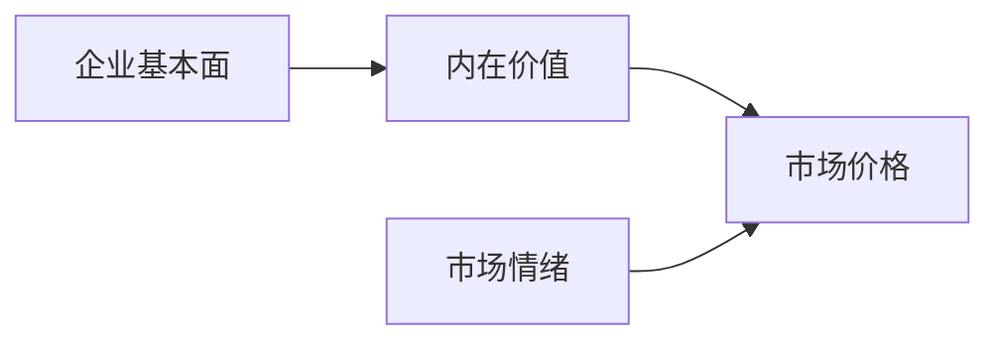
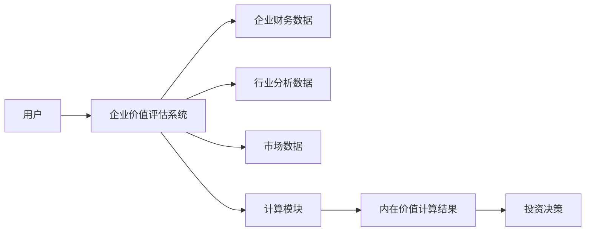
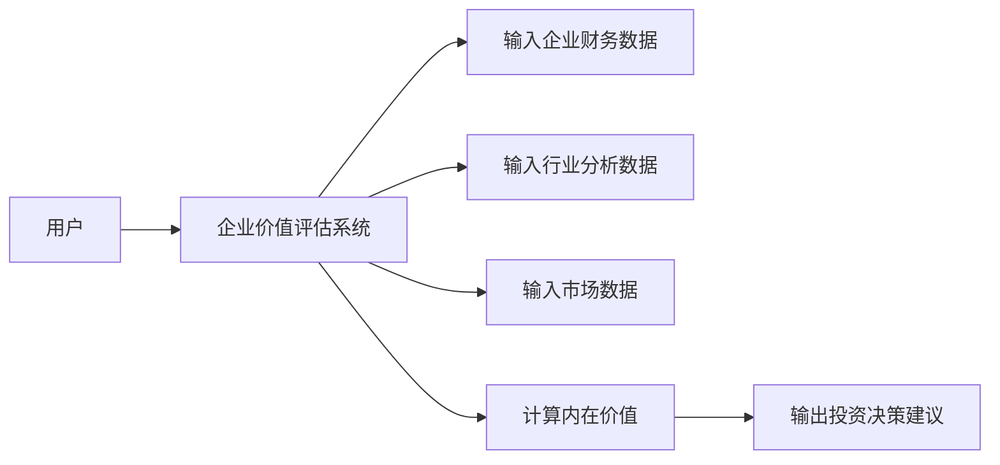

                 


# 巴菲特的企业价值评估：内在价值vs市场价格

## 关键词：巴菲特，价值投资，内在价值，市场价格，企业评估，投资策略

## 摘要：本文详细探讨了巴菲特的企业价值评估方法，重点分析了内在价值与市场价格的关系。通过理论与实践相结合的方式，文章解释了如何计算内在价值，分析市场价格波动对企业估值的影响，并通过实际案例展示了如何在投资决策中应用这些概念。本文适合对价值投资感兴趣的投资人士和企业分析人员阅读。

---

# 第一部分：背景介绍

## 第1章：巴菲特的价值投资理念概述

### 1.1 巴菲特的背景与投资哲学

#### 1.1.1 巴菲特的生平简介
沃伦·巴菲特（Warren Buffett）是世界上最著名、最成功的投资者之一。他于1934年出生在美国内布拉斯州，毕业于哥伦比亚大学，师从本杰明·格雷厄姆（Benjamin Graham）。巴菲特的投资理念深受格雷厄姆价值投资理论的影响，但他在此基础上发展出了自己的投资策略，并成为全球价值投资的代表人物。

#### 1.1.2 价值投资的核心理念
巴菲特的价值投资理念的核心在于寻找具有持续竞争优势的企业，并以低于其内在价值的价格买入。他认为市场的短期波动性为投资者提供了以折扣价买入优质资产的机会。价值投资强调对企业基本面的深入分析，而不是市场的短期波动。

#### 1.1.3 巴菲特投资风格的形成
巴菲特的投资风格融合了格雷厄姆的稳健投资理念和费雪（Phil Fisher）的成长型投资策略。他倾向于投资那些具有强大护城河、良好管理团队和可持续竞争优势的企业。这种投资风格使他能够在长期实现卓越的投资业绩。

### 1.2 企业价值评估的基本概念

#### 1.2.1 企业价值评估的定义
企业价值评估是指通过对企业的财务状况、经营业绩、行业地位和竞争优势等多方面因素的分析，估算出企业在市场上应有的价值的过程。企业价值评估是巴菲特投资决策的核心步骤之一。

#### 1.2.2 内在价值与市场价格的定义
- **内在价值**：内在价值是指企业在未来现金流的现值，是基于企业基本面分析得出的理论价值。巴菲特认为，内在价值是企业的真实价值，而市场价格是内在价值的反映，但可能偏离内在价值。
- **市场价格**：市场价格是指企业在市场上实际交易的价格，受市场情绪、投资者心理和市场流动性等多种因素影响。

#### 1.2.3 企业价值评估的意义与作用
企业价值评估是投资者做出投资决策的重要依据。通过评估企业的内在价值，投资者可以判断其市场价格是否被高估或低估，从而做出买入、卖出或持有投资的决策。

### 1.3 巴菲特的企业价值评估方法

#### 1.3.1 质量、价格与价值的关系
巴菲特认为，投资的本质是寻找那些具有高质量、低于公平价格的企业。他强调，投资决策的核心是企业本身的质量，而不是市场的价格波动。

#### 1.3.2 巴菲特的估值模型
巴菲特主要使用以下几种估值方法：
1. **DCF模型**（ discounted cash flow model）：通过预测企业的未来现金流，使用适当的贴现率计算其内在价值。
2. **可比公司分析**：通过比较同行业可比公司的估值水平，判断目标公司的价值。
3. **股息折现模型**（Dividend Discount Model）：通过预测企业的股息现金流，计算其内在价值。

#### 1.3.3 投资决策中的安全边际
安全边际是指企业内在价值与市场价格之间的差额。巴菲特强调，在投资时应寻找内在价值高于市场价格的企业，并留出一定的安全边际，以应对市场波动和不确定性。

### 1.4 本章小结
本章介绍了巴菲特的投资哲学、价值投资的核心理念以及企业价值评估的基本概念。巴菲特的价值投资理念强调对企业基本面的深入分析和对市场价格波动的长期忽视，从而实现超额收益。

---

## 第2章：内在价值与市场价格的核心概念

### 2.1 内在价值的计算方法

#### 2.1.1 自由现金流的定义与计算
自由现金流（Free Cash Flow, FCF）是企业在扣除所有成本和资本支出后的剩余现金流，反映了企业实际创造的现金能力。自由现金流的计算公式为：
$$
FCF = EBIT \times (1 - 税率) - 资本支出
$$

#### 2.1.2 贴现率的确定与应用
贴现率是将未来现金流折现为现值的利率。巴菲特通常使用企业的加权平均资本成本（WACC）作为贴现率。WACC的计算公式为：
$$
WACC = (D/E \times Cost\ of\ Debt) \times (1 - 税率) + (E/D \times Cost\ of\ Equity)
$$

#### 2.1.3 内在价值的公式推导
内在价值的计算公式可以表示为：
$$
Intrinsic\ Value = \sum_{t=1}^{n} \frac{FCF_t}{(1 + r)^t}
$$
其中，r是贴现率，n是预测的年数。

### 2.2 市场价格的影响因素

#### 2.2.1 市场情绪对价格的影响
市场价格受市场情绪的影响较大。当市场情绪乐观时，资产价格可能被高估；当市场情绪悲观时，资产价格可能被低估。

#### 2.2.2 市场参与者的认知偏差
投资者的认知偏差（如过度自信、从众心理）也会影响市场价格。这些偏差可能导致市场价格偏离企业的内在价值。

#### 2.2.3 市场价格与企业价值的关系
市场价格是内在价值的反映，但受市场参与者的行为和市场情绪的影响。巴菲特认为，市场价格波动为投资者提供了以低于内在价值的价格买入优质资产的机会。

### 2.3 内在价值与市场价格的对比分析

#### 2.3.1 内在价值与市场价格的差异
内在价值是企业的真实价值，而市场价格是市场参与者行为的结果。内在价值相对稳定，而市场价格波动较大。

#### 2.3.2 价格波动与价值稳定的关系
市场价格波动是暂时的，而内在价值是长期稳定的。巴菲特强调，投资者应关注企业的内在价值，而不是市场价格的短期波动。

#### 2.3.3 巴菲特的"价格是价值的奴仆"理念
巴菲特认为，价格是价值的奴仆，市场价格最终会围绕内在价值波动。投资者应关注企业的内在价值，而不是市场的短期波动。

### 2.4 核心概念对比表格

| 比较维度          | 内在价值                     | 市场价格                     |
|-------------------|------------------------------|------------------------------|
| 定义              | 企业未来现金流的现值          | 资产在市场上的交易价格        |
| 计算方式          | 基于企业基本面分析             | 市场供需关系决定               |
| 稳定性            | 稳定，受企业经营状况影响        | 波动性大，受市场情绪影响        |
| 投资决策依据      | 决定买入价格的上限            | 决定买入或卖出的时机          |

### 2.5 实体关系图


### 2.6 本章小结
本章详细讲解了内在价值和市场价格的定义、计算方法和两者之间的关系。内在价值是企业的真实价值，而市场价格是市场行为的结果。市场价格波动为投资者提供了以低于内在价值的价格买入优质资产的机会。

---

## 第3章：企业价值评估的数学模型与算法原理

### 3.1 内在价值计算的数学模型

#### 3.1.1 自由现金流模型
自由现金流模型是计算内在价值的核心工具。其公式为：
$$
Intrinsic\ Value = \sum_{t=1}^{n} \frac{FCF_t}{(1 + r)^t}
$$

#### 3.1.2 贴现率计算公式
贴现率通常使用企业的加权平均资本成本（WACC）作为贴现率。WACC的计算公式为：
$$
WACC = (D/E \times Cost\ of\ Debt) \times (1 - 税率) + (E/D \times Cost\ of\ Equity)
$$

#### 3.1.3 内在价值公式推导
通过将未来现金流折现到现值，可以得到企业的内在价值：
$$
Intrinsic\ Value = \sum_{t=1}^{n} \frac{FCF_t}{(1 + WACC)^t}
$$

### 3.2 内在价值计算的流程图


### 3.3 算法实现代码示例
以下是一个简单的内在价值计算代码示例：
```python
def calculate_intrinsic_value(free_cash_flows, discount_rate):
    intrinsic_value = 0
    for t in range(len(free_cash_flows)):
        intrinsic_value += free_cash_flows[t] / (1 + discount_rate) ** t
    return intrinsic_value

# 示例数据
free_cash_flows = [100, 120, 150, 200]  # 每年的自由现金流
discount_rate = 0.10  # 贴现率

intrinsic_value = calculate_intrinsic_value(free_cash_flows, discount_rate)
print("内在价值为：", intrinsic_value)
```

### 3.4 本章小结
本章详细讲解了内在价值的计算方法，包括自由现金流模型和贴现率的计算。通过公式推导和代码示例，读者可以理解如何将理论应用于实际的企业价值评估中。

---

## 第4章：系统分析与架构设计

### 4.1 问题场景介绍
企业价值评估是一个复杂的过程，涉及对企业财务状况、行业地位和竞争优势的全面分析。为了提高评估的效率和准确性，可以构建一个企业价值评估系统。

### 4.2 系统功能设计

#### 4.2.1 领域模型


#### 4.2.2 系统架构设计


### 4.3 系统接口设计
企业价值评估系统的接口设计应包括以下功能：
1. 输入企业财务数据。
2. 输入行业分析数据。
3. 输入市场数据。
4. 计算内在价值。
5. 输出投资决策建议。

### 4.4 系统交互流程图


### 4.5 本章小结
本章通过系统设计的方法，构建了一个企业价值评估系统的架构。该系统能够帮助投资者高效地进行企业价值评估，并做出投资决策。

---

## 第5章：项目实战

### 5.1 环境安装
为了进行企业价值评估，需要安装以下工具：
1. Python编程语言。
2. 数据分析库（如Pandas、NumPy）。
3. 可视化工具（如Matplotlib）。
4. 数据分析工具（如Excel）。

### 5.2 系统核心实现源代码
以下是一个简单的内在价值计算代码示例：
```python
import pandas as pd
import numpy as np

def calculate_intrinsic_value(free_cash_flows, discount_rate):
    intrinsic_value = 0
    for t in range(len(free_cash_flows)):
        intrinsic_value += free_cash_flows[t] / (1 + discount_rate) ** t
    return intrinsic_value

# 示例数据
free_cash_flows = pd.Series([100, 120, 150, 200])  # 每年的自由现金流
discount_rate = 0.10  # 贴现率

intrinsic_value = calculate_intrinsic_value(free_cash_flows.values, discount_rate)
print("内在价值为：", intrinsic_value)
```

### 5.3 代码应用解读与分析
上述代码示例展示了如何使用Python进行内在价值计算。首先，定义了一个计算内在价值的函数，然后输入自由现金流和贴现率，最后输出计算结果。

### 5.4 实际案例分析

#### 5.4.1 案例背景
以亚马逊为例，计算其内在价值。

#### 5.4.2 数据收集
收集亚马逊的财务数据，包括自由现金流、税率、资本支出等。

#### 5.4.3 计算贴现率
使用加权平均资本成本（WACC）作为贴现率。

#### 5.4.4 计算内在价值
通过自由现金流模型计算亚马逊的内在价值。

#### 5.4.5 投资决策
根据计算结果，判断亚马逊的市场价格是否低于其内在价值，从而做出买入或持有的决策。

### 5.5 项目小结
本章通过实际案例分析，展示了如何将理论应用于实践。通过计算亚马逊的内在价值，读者可以理解如何在实际投资决策中应用企业价值评估的方法。

---

## 第6章：最佳实践与小结

### 6.1 最佳实践 tips
1. **深入分析企业基本面**：了解企业的财务状况、行业地位和竞争优势。
2. **关注长期价值**：忽略短期市场波动，关注企业的内在价值。
3. **保持安全边际**：在投资时，留出一定的安全边际，以应对市场波动和不确定性。
4. **持续学习与更新**：市场环境不断变化，投资者需要不断学习和更新自己的知识。

### 6.2 小结
本文详细探讨了巴菲特的企业价值评估方法，重点分析了内在价值与市场价格的关系。通过理论与实践相结合的方式，读者可以理解如何计算内在价值，分析市场价格波动对企业估值的影响，并通过实际案例展示如何在投资决策中应用这些概念。

### 6.3 注意事项
1. **数据的准确性**：企业价值评估依赖于准确的数据，特别是财务数据。
2. **模型的适用性**：不同的企业可能需要不同的估值模型，投资者需要根据具体情况选择合适的模型。
3. **市场环境的变化**：市场环境的变化可能影响企业的内在价值和市场价格，投资者需要定期重新评估。

### 6.4 拓展阅读
1. **《巴菲特的loomberg金融模型》**：深入探讨巴菲特的金融模型和投资策略。
2. **《价值投资：从理念到实践》**：详细讲解价值投资的理论和实践方法。
3. **《企业价值评估：方法与应用》**：系统介绍企业价值评估的方法和应用。

---

## 作者：AI天才研究院/AI Genius Institute & 禅与计算机程序设计艺术/Zen And The Art of Computer Programming

---

以上是《巴菲特的企业价值评估：内在价值vs市场价格》的技术博客文章的目录结构和详细内容。希望这篇文章能够帮助读者更好地理解巴菲特的价值投资理念，并能够将其应用于实际投资决策中。

