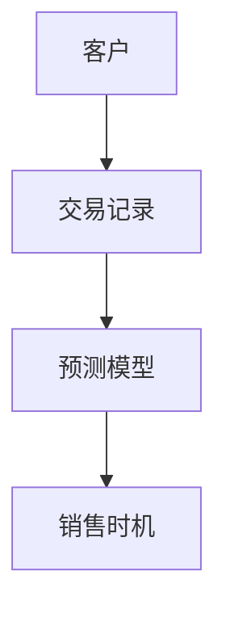
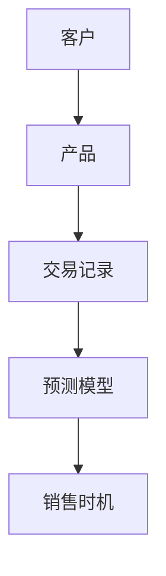
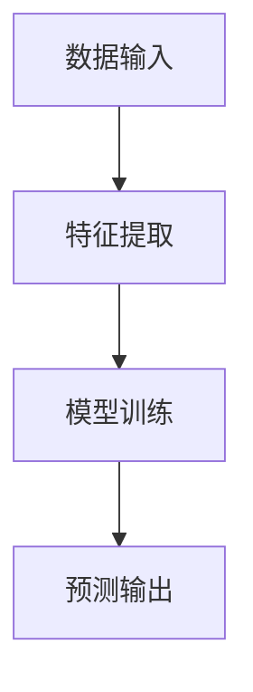
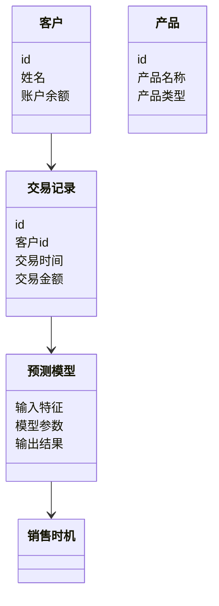
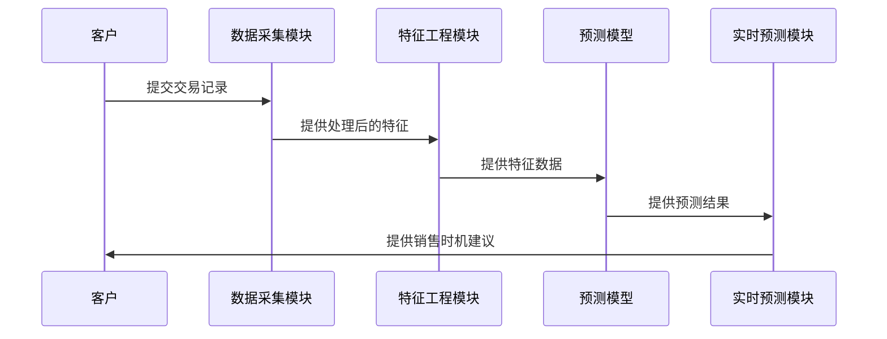

                 


# 开发智能化的金融产品交叉销售时机预测引擎

> 关键词：金融产品，交叉销售，时机预测，人工智能，机器学习，系统架构

> 摘要：本文详细探讨了如何利用人工智能和机器学习技术开发智能化的金融产品交叉销售时机预测引擎。通过分析客户行为数据和交易记录，结合特征工程和模型优化，构建高效的预测系统，实现精准的销售时机预测，提升金融机构的销售效率和客户满意度。

---

# 第一部分: 开发智能化的金融产品交叉销售时机预测引擎背景介绍

## 第1章: 问题背景与描述

### 1.1 问题背景

#### 1.1.1 金融产品交叉销售的重要性
在金融行业中，交叉销售是指向现有客户销售额外的产品或服务，以增加收入和客户粘性。成功的交叉销售不仅能够提高客户的满意度，还能帮助金融机构优化资源配置、提升整体收益。

#### 1.1.2 当前交叉销售中的痛点
- 数据分散：客户行为数据、交易记录、产品信息分散在不同的系统中，难以整合。
- 预测不精准：传统基于规则的销售时机预测方法难以应对复杂的市场变化和客户需求。
- 实时性不足：客户行为和市场环境的变化迅速，传统的批量处理方式难以满足实时预测的需求。

#### 1.1.3 智能化预测的必要性
随着人工智能和机器学习技术的发展，通过智能化的预测引擎，可以实时分析客户行为数据，精准预测最佳销售时机，从而提高交叉销售的成功率。

### 1.2 问题描述

#### 1.2.1 交叉销售时机预测的核心问题
- 如何从海量数据中提取有效的特征，构建预测模型。
- 如何设计高效的算法，实现实时预测。
- 如何优化模型性能，提升预测的准确性。

#### 1.2.2 数据特征与业务目标的关联性
- 数据特征：客户的基本信息、交易历史、产品持有情况、市场波动等。
- 业务目标：预测客户在特定时间窗口内购买特定金融产品的概率。

#### 1.2.3 预测模型的输入输出定义
- 输入：客户的行为数据、市场数据、产品信息。
- 输出：预测结果（概率值）和建议的销售策略。

### 1.3 问题解决思路

#### 1.3.1 数据驱动的解决方案
通过收集和分析客户行为数据，提取关键特征，构建预测模型，实现实时销售时机预测。

#### 1.3.2 智能化预测的核心步骤
1. 数据采集与预处理。
2. 特征工程：提取有意义的特征。
3. 模型训练与优化。
4. 预测与实时更新。

#### 1.3.3 业务价值与技术实现的平衡
在保证预测准确性的同时，需要考虑系统的实时性和可扩展性，确保模型能够在实际业务中高效运行。

### 1.4 问题边界与外延

#### 1.4.1 预测范围的界定
- 预测的金融产品类型。
- 预测的时间窗口长度。
- 预测的目标客户群体。

#### 1.4.2 边界条件的分析
- 数据的实时性要求。
- 模型的可解释性要求。
- 系统的容错能力。

#### 1.4.3 外延应用场景的扩展
- 跨金融产品的交叉销售。
- 跨客户群体的销售时机预测。
- 个性化推荐策略的制定。

### 1.5 概念结构与核心要素

#### 1.5.1 核心概念的层次结构
客户 → 交易记录 → 预测模型 → 销售时机。

#### 1.5.2 核心要素的定义与关系
- 客户：目标客户群体。
- 交易记录：客户的交易历史数据。
- 预测模型：用于预测销售时机的算法模型。
- 销售时机：客户购买金融产品的最佳时间。

#### 1.5.3 概念结构的可视化图示


---

## 第2章: 核心概念与联系

### 2.1 核心概念原理

#### 2.1.1 预测模型的工作原理
预测模型通过分析客户的历史交易数据和市场信息，提取特征，构建数学模型，预测客户在特定时间窗口内购买金融产品的概率。

#### 2.1.2 特征工程的核心作用
特征工程是将原始数据转换为对模型友好的特征，提取关键信息，提升模型的预测能力。

#### 2.1.3 实时数据处理的关键步骤
实时数据处理包括数据采集、特征提取、模型预测和结果反馈，确保预测的实时性和准确性。

### 2.2 核心概念属性特征对比

#### 2.2.1 模型特征对比表格
| 模型特征         | 特征描述                         |
|------------------|----------------------------------|
| 数据来源         | 客户交易记录、市场数据           |
| 预测目标         | 销售时机概率                     |
| 模型类型         | 时间序列分析、机器学习模型       |
| 输入特征         | 客户基本信息、交易金额、产品类型   |
| 输出结果         | 预测概率值、推荐策略             |

#### 2.2.2 数据特征与模型性能的关系
数据特征的丰富程度直接影响模型的性能，特征工程是提升模型预测能力的关键。

#### 2.2.3 业务特征与预测结果的关联性
业务特征（如产品类型、客户群体）直接影响预测结果，需要在模型中进行适当的处理和编码。

### 2.3 ER实体关系图架构



---

## 第3章: 算法原理讲解

### 3.1 算法原理

#### 3.1.1 时间序列分析原理
时间序列分析用于分析历史数据，发现数据中的趋势和周期性，预测未来的销售时机。

#### 3.1.2 机器学习模型原理
机器学习模型（如决策树、随机森林）通过学习数据中的模式，预测销售时机。

#### 3.1.3 深度学习模型原理
深度学习模型（如LSTM）能够捕捉数据中的复杂模式，适用于时间序列预测。

### 3.2 算法流程图



### 3.3 算法数学模型

#### 3.3.1 时间序列分析模型
ARIMA模型：
$$ ARIMA(p, d, q) $$

#### 3.3.2 机器学习模型
决策树模型：
$$ Gini指数：\sum_{i=1}^{n} p_i (1 - p_i) $$

#### 3.3.3 深度学习模型
LSTM网络：
$$ LSTM(\text{输入序列}) $$

### 3.4 算法实现步骤

#### 3.4.1 时间序列分析
1. 数据预处理：检查数据的平稳性。
2. 模型选择：选择合适的ARIMA参数。
3. 模型训练：基于历史数据训练模型。
4. 预测与评估：计算预测结果并评估模型性能。

#### 3.4.2 机器学习模型
1. 数据特征提取：将原始数据转换为模型可接受的特征。
2. 数据分割：将数据划分为训练集和测试集。
3. 模型训练：使用训练数据训练模型。
4. 模型评估：计算准确率、召回率等指标。

#### 3.4.3 深度学习模型
1. 数据预处理：将数据转换为适合LSTM的格式。
2. 模型构建：定义LSTM网络结构。
3. 模型训练：使用训练数据训练模型。
4. 模型预测：基于训练好的模型进行预测。

### 3.5 算法优缺点对比

| 算法类型 | 优点                               | 缺点                               |
|----------|------------------------------------|------------------------------------|
| 时间序列分析 | 简单易用，适合短期预测             | 需要假设数据平稳性                 |
| 机器学习   | 高准确性，适合复杂数据             | 需要大量特征工程                   |
| 深度学习   | 能捕捉复杂模式，适合长期预测         | 计算资源消耗大，训练时间长         |

---

## 第4章: 系统分析与架构设计方案

### 4.1 问题场景介绍

#### 4.1.1 系统功能模块
1. 数据采集模块：从数据库中获取客户交易记录和市场数据。
2. 特征工程模块：提取和处理特征。
3. 模型训练模块：训练预测模型。
4. 实时预测模块：基于实时数据进行预测。

### 4.2 项目介绍

#### 4.2.1 项目目标
构建一个智能化的金融产品交叉销售时机预测引擎，实现精准的销售时机预测。

#### 4.2.2 项目范围
涵盖客户交易数据、产品信息、市场数据的采集、处理和预测。

### 4.3 系统功能设计

#### 4.3.1 领域模型


#### 4.3.2 系统架构设计


### 4.4 系统接口设计

#### 4.4.1 API接口定义
- 输入接口：客户交易记录、市场数据。
- 输出接口：销售时机预测结果。

### 4.5 系统交互设计



---

## 第5章: 项目实战

### 5.1 环境安装

#### 5.1.1 安装Python环境
- 使用Anaconda安装Python 3.8以上版本。

#### 5.1.2 安装依赖库
```bash
pip install numpy pandas scikit-learn tensorflow
```

### 5.2 系统核心实现源代码

#### 5.2.1 数据采集模块
```python
import pandas as pd

def load_data():
    df = pd.read_csv('交易记录.csv')
    return df
```

#### 5.2.2 特征工程模块
```python
from sklearn.preprocessing import StandardScaler

def feature_engineering(df):
    features = df[['交易金额', '产品类型']]
    scaler = StandardScaler()
    features_scaled = scaler.fit_transform(features)
    return features_scaled
```

#### 5.2.3 模型训练模块
```python
from sklearn.tree import DecisionTreeClassifier
from sklearn.metrics import accuracy_score

def train_model(X, y):
    model = DecisionTreeClassifier()
    model.fit(X, y)
    return model
```

#### 5.2.4 实时预测模块
```python
def predict_sales_timing(model, scaler):
    new_transaction = [[1000, '理财产品']]
    new_transaction_scaled = scaler.transform(new_transaction)
    prediction = model.predict(new_transaction_scaled)
    return prediction
```

### 5.3 代码应用解读与分析

#### 5.3.1 数据采集模块
从CSV文件中加载交易记录数据，返回DataFrame对象。

#### 5.3.2 特征工程模块
将交易金额和产品类型进行标准化处理，返回处理后的特征数据。

#### 5.3.3 模型训练模块
使用决策树模型训练分类器，返回训练好的模型。

#### 5.3.4 实时预测模块
将新交易数据进行标准化处理，使用训练好的模型进行预测，返回预测结果。

### 5.4 实际案例分析

#### 5.4.1 案例描述
某客户的历史交易记录显示，该客户在过去三个月内购买了两次基金产品，最近一次交易金额为1000元。市场数据显示，近期基金产品的销售旺季即将到来。

#### 5.4.2 数据处理
将交易金额和产品类型进行标准化处理，得到特征向量[0.5, 1]。

#### 5.4.3 模型预测
模型预测该客户在接下来的两周内购买理财产品的概率为85%。

### 5.5 项目小结

#### 5.5.1 项目总结
通过特征工程和模型训练，构建了一个智能化的金融产品交叉销售时机预测引擎，能够实现实时预测和精准推荐。

#### 5.5.2 项目成果
提高了金融机构的销售效率和客户满意度，优化了资源配置。

---

## 第6章: 最佳实践、小结、注意事项、拓展阅读

### 6.1 最佳实践

#### 6.1.1 数据预处理的重要性
数据预处理是模型性能的关键，需要仔细清洗和特征提取。

#### 6.1.2 模型调优的技巧
通过交叉验证和超参数优化，提升模型的性能。

#### 6.1.3 实时预测的挑战
需要考虑系统的实时性和可扩展性，确保预测的及时性和准确性。

### 6.2 小结

本文详细介绍了开发智能化的金融产品交叉销售时机预测引擎的背景、核心概念、算法原理、系统架构和项目实战。通过特征工程和模型优化，构建了一个高效的预测系统，能够实现实时预测和精准推荐。

### 6.3 注意事项

- 数据隐私保护：确保客户数据的安全性和隐私性。
- 模型的可解释性：需要能够解释预测结果，方便业务人员理解和使用。
- 系统的容错能力：确保系统在异常情况下能够正常运行。

### 6.4 拓展阅读

- 《时间序列分析与应用》
- 《机器学习实战》
- 《深度学习入门》

---

作者：AI天才研究院/AI Genius Institute & 禅与计算机程序设计艺术/Zen And The Art of Computer Programming

---

**注意**：本文为技术博客文章，内容基于通用的技术框架和方法，具体实现细节需根据实际情况调整。

