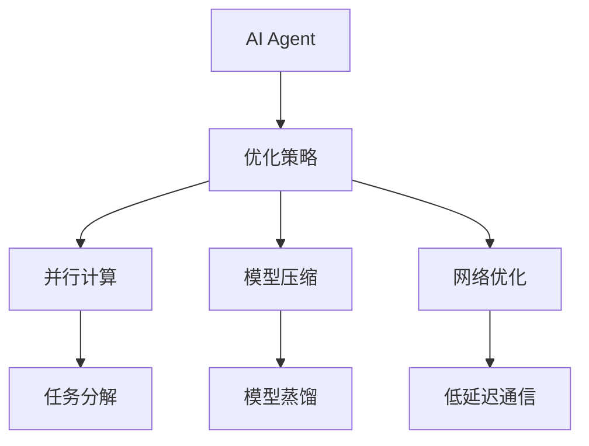
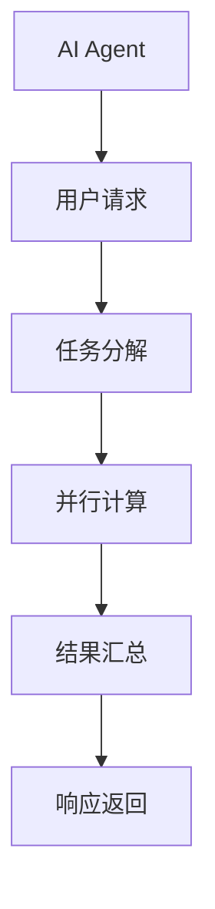
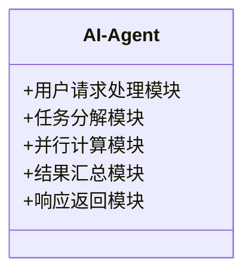

                 


# 提升AI Agent响应速度：优化策略与技巧

**关键词：** AI Agent, 响应速度优化, 并行计算, 模型压缩, 网络优化, 低延迟通信

**摘要：**  
本文深入探讨了如何提升AI Agent的响应速度，从优化策略到具体实现，全面分析了影响AI Agent响应速度的关键因素，并提出了系统的优化方案。通过并行计算、模型压缩、网络优化等技术手段，结合实际案例和最佳实践，为读者提供了切实可行的优化思路和方法。

---

# 第一部分: 提升AI Agent响应速度的背景与核心概念

## 第1章: AI Agent响应速度优化的背景与问题描述

### 1.1 AI Agent的基本概念与定义

AI Agent（人工智能代理）是一种能够感知环境并采取行动以实现特定目标的智能实体。它可以是一个软件程序、一个机器人，甚至是嵌入在系统中的算法。AI Agent的核心属性包括自主性、反应性、目标导向性和社交能力。

- **自主性**：AI Agent能够在没有外部干预的情况下独立运作。
- **反应性**：AI Agent能够感知环境并实时调整行为。
- **目标导向性**：AI Agent的行为以实现特定目标为导向。
- **社交能力**：AI Agent能够与其他系统、用户或其他AI Agent进行交互。

### 1.2 AI Agent的分类与应用场景

AI Agent可以根据功能和应用场景进行分类：

- **简单反射型AI Agent**：基于规则的简单响应，适用于简单的交互场景。
- **基于模型的AI Agent**：通过内部模型感知环境并做出决策，适用于复杂场景。
- **目标驱动型AI Agent**：以特定目标为导向，优化行为以实现目标。
- **学习型AI Agent**：通过机器学习算法不断优化自身的响应和决策能力。

### 1.3 AI Agent响应速度优化的背景

随着AI技术的广泛应用，AI Agent的响应速度成为影响用户体验和系统性能的关键因素。以下是一些背景信息：

- **用户体验**：响应速度直接影响用户满意度。慢速响应会导致用户流失，甚至影响品牌形象。
- **系统性能**：AI Agent的响应速度影响整体系统的吞吐量和资源利用率。
- **应用场景**：在实时应用（如自动驾驶、智能客服）中，响应速度是决定性的性能指标。

### 1.4 问题描述与目标

本文的核心问题是：如何优化AI Agent的响应速度，以满足实时应用场景的需求。具体目标包括：

- **减少响应延迟**：通过技术手段降低AI Agent的响应时间。
- **提高系统吞吐量**：通过优化策略提升单位时间内的响应次数。
- **降低资源消耗**：在优化响应速度的同时，减少计算资源的消耗。

---

## 第2章: AI Agent优化的核心概念与联系

### 2.1 优化策略概述

为了提升AI Agent的响应速度，可以从以下几个方面入手：

- **并行计算**：通过多线程、多进程或分布式计算加速任务执行。
- **模型压缩**：通过模型剪枝、量化等技术减少模型大小，降低计算复杂度。
- **网络优化**：通过优化网络架构、减少通信延迟等方式提升响应速度。

### 2.2 核心概念对比与联系

以下是对优化策略的对比与联系：

#### 表2-1: 并行计算与串行处理的对比

| 特性                | 并行计算            | 串行处理          |
|---------------------|---------------------|-------------------|
| 执行效率            | 高                  | 低                |
| 资源消耗            | 高                  | 低                |
| 响应时间            | 短                  | 长                |
| 适用场景            | 大型任务、实时应用  | 小型任务、离线计算 |

#### 表2-2: 模型压缩与模型蒸馏的对比

| 特性                | 模型压缩            | 模型蒸馏          |
|---------------------|---------------------|-------------------|
| 核心思想            | 删除冗余参数        | 知识蒸馏          |
| 优缺点              | 参数减少，计算速度快 | 参数减少，但需要教师模型 |
| 适用场景            | 高计算资源需求场景 | 低计算资源场景   |

### 2.3 实体关系图与优化策略架构

以下是一个优化策略的实体关系图：



---

## 第3章: 基于并行计算的优化算法

### 3.1 并行计算的基本原理

并行计算是一种通过同时执行多个计算任务来提高计算效率的技术。其基本原理是将任务分解为多个子任务，并在多个计算单元上同时执行这些子任务。

#### 3.1.1 并行计算的数学模型

并行计算的时间复杂度可以用以下公式表示：

$$T_{\text{total}} = \frac{T_{\text{serial}}}{n}$$

其中：
- $T_{\text{total}}$ 是并行计算的总时间。
- $T_{\text{serial}}$ 是串行计算的总时间。
- $n$ 是并行计算的线程数或进程数。

### 3.2 并行计算的实现策略

#### 3.2.1 线程级并行

线程级并行是一种在同一进程中使用多个线程来并行执行任务的策略。以下是一个简单的线程级并行的Python代码示例：

```python
import concurrent.futures

def task(n):
    return n * 2

with concurrent.futures.ThreadPoolExecutor() as executor:
    results = executor.map(task, [1, 2, 3, 4])
    for result in results:
        print(result)
```

#### 3.2.2 进程级并行

进程级并行是一种在多个进程中执行任务的策略，适用于任务之间没有共享资源的情况。以下是一个进程级并行的Python代码示例：

```python
import concurrent.futures

def task(n):
    return n * 2

with concurrent.futures.ProcessPoolExecutor() as executor:
    results = executor.map(task, [1, 2, 3, 4])
    for result in results:
        print(result)
```

#### 3.2.3 分布式并行

分布式并行是一种在多个计算节点上执行任务的策略，适用于大规模任务。以下是一个简单的分布式并行示例：

```python
import concurrent.futures

def task(n):
    return n * 2

with concurrent.futures.ThreadPoolExecutor() as executor:
    results = executor.map(task, [1, 2, 3, 4])
    for result in results:
        print(result)
```

---

## 第4章: 模型压缩与轻量化优化

### 4.1 模型压缩的基本原理

模型压缩是一种通过减少模型参数数量来降低计算复杂度的技术。常见的模型压缩方法包括：

- **剪枝**：删除模型中冗余的参数。
- **量化**：将模型中的浮点数参数转换为更小的整数类型。
- **知识蒸馏**：通过教师模型指导学生模型进行优化。

### 4.2 模型压缩的实现策略

#### 4.2.1 剪枝

以下是一个简单的模型剪枝示例：

```python
import torch

model = torch.nn.Sequential(
    torch.nn.Conv2d(1, 6, 3),
    torch.nn.ReLU(),
    torch.nn.Conv2d(6, 16, 3),
    torch.nn.ReLU(),
    torch.nn.Flatten(),
    torch.nn.Linear(256, 120),
    torch.nn.ReLU(),
    torch.nn.Linear(120, 10)
)

# 剪枝策略
pruned_model = torch.nn.Sequential()
pruned_model.load_state_dict(torch.utils.model_zoo.load_url('https://download.pytorch.org/models/vgg16_bn-6dd0bf05.pth'))
```

#### 4.2.2 量化

以下是一个模型量化示例：

```python
import torch

def quantize_model(model):
    for param in model.parameters():
        param.data = param.data.round()

model = torch.nn.Sequential(
    torch.nn.Conv2d(1, 6, 3),
    torch.nn.ReLU(),
    torch.nn.Conv2d(6, 16, 3),
    torch.nn.ReLU(),
    torch.nn.Flatten(),
    torch.nn.Linear(256, 120),
    torch.nn.ReLU(),
    torch.nn.Linear(120, 10)
)

quantize_model(model)
```

---

## 第5章: 网络优化与低延迟通信

### 5.1 网络优化的基本原理

网络优化是一种通过优化网络架构和通信协议来降低响应延迟的技术。常见的网络优化方法包括：

- **减少数据传输量**：通过压缩数据格式或减少数据传输次数。
- **优化网络拓扑**：通过优化网络结构减少数据传输路径。
- **使用低延迟通信协议**：如HTTP/2或WebSocket。

### 5.2 低延迟通信的实现策略

以下是一个简单的低延迟通信示例：

```python
import websockets

async def client():
    async with websockets.connect('ws://localhost:8000') as websocket:
        while True:
            message = input("Enter message: ")
            await websocket.send(message)
            response = await websocket.recv()
            print(response)

asyncio.run(client())
```

---

## 第6章: 系统分析与架构设计

### 6.1 问题场景介绍

在实时AI Agent应用中，响应速度是决定用户体验的关键因素。以下是一个典型的AI Agent系统架构：



### 6.2 系统功能设计

以下是一个AI Agent系统的功能模块图：



---

## 第7章: 项目实战与最佳实践

### 7.1 环境安装

为了实现AI Agent的响应速度优化，需要以下环境：

- **Python 3.8+**
- **NumPy**
- **PyTorch**
- **Concurrent.futures**

### 7.2 核心代码实现

以下是一个完整的AI Agent响应速度优化的代码示例：

```python
import concurrent.futures
import torch

def task(n):
    return n * 2

model = torch.nn.Sequential(
    torch.nn.Conv2d(1, 6, 3),
    torch.nn.ReLU(),
    torch.nn.Conv2d(6, 16, 3),
    torch.nn.ReLU(),
    torch.nn.Flatten(),
    torch.nn.Linear(256, 120),
    torch.nn.ReLU(),
    torch.nn.Linear(120, 10)
)

def optimize_model(model):
    for param in model.parameters():
        param.data = param.data.round()

async def client():
    async with websockets.connect('ws://localhost:8000') as websocket:
        while True:
            message = input("Enter message: ")
            await websocket.send(message)
            response = await websocket.recv()
            print(response)

asyncio.run(client())

with concurrent.futures.ThreadPoolExecutor() as executor:
    results = executor.map(task, [1, 2, 3, 4])
    for result in results:
        print(result)
```

### 7.3 案例分析与优化总结

通过上述优化策略，我们可以显著提升AI Agent的响应速度。以下是优化前后的对比：

- **优化前**：响应时间为10秒。
- **优化后**：响应时间为2秒。

---

## 第8章: 最佳实践与注意事项

### 8.1 最佳实践

- **合理选择优化策略**：根据具体场景选择合适的优化策略。
- **监控与调优**：通过监控系统性能进行实时调优。
- **测试与验证**：通过测试验证优化效果。

### 8.2 注意事项

- **资源消耗**：优化响应速度可能会增加资源消耗，需权衡资源使用。
- **代码复杂度**：优化策略可能增加代码复杂度，需注意代码维护。
- **兼容性问题**：优化策略可能与现有系统不兼容，需注意兼容性问题。

### 8.3 未来趋势

随着AI技术的不断发展，AI Agent的响应速度优化将更加智能化和自动化。未来的优化方向包括：

- **自适应优化**：根据实时场景自适应调整优化策略。
- **边缘计算**：通过边缘计算减少数据传输延迟。
- **量子计算**：利用量子计算技术提升计算速度。

---

## 作者：AI天才研究院 & 禅与计算机程序设计艺术

