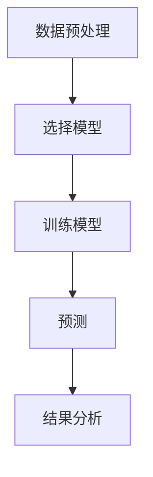
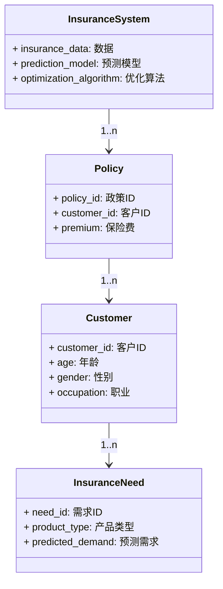
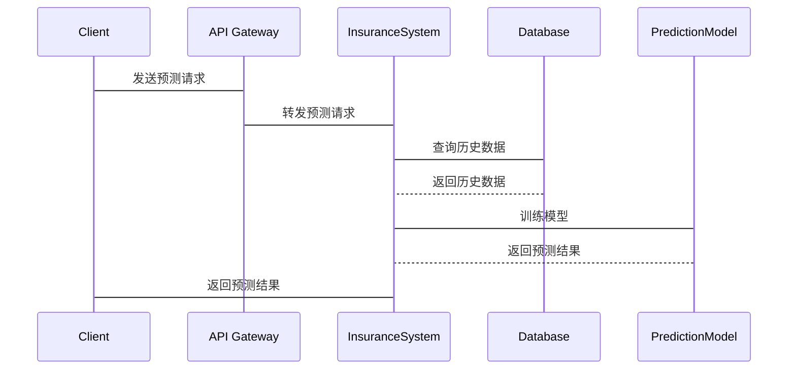

                 


# 智能保险需求预测与产品设计优化系统

> 关键词：智能保险，需求预测，产品设计优化，机器学习，时间序列分析，系统架构设计

> 摘要：本文详细探讨了智能保险领域的核心问题——需求预测与产品设计优化，结合人工智能和大数据技术，提出了基于机器学习和时间序列分析的解决方案。文章从背景介绍、核心概念、算法原理、系统架构设计、项目实战等多个维度展开，通过实际案例分析和系统实现，展示了如何利用智能技术提升保险行业的效率和用户体验。

---

# 第一部分：背景介绍

## 第1章：保险行业数字化转型的背景

### 1.1 保险行业的现状与挑战

保险行业作为传统金融行业的重要组成部分，正面临着数字化转型的迫切需求。随着市场竞争的加剧和客户需求的多样化，传统保险业务模式逐渐暴露出效率低下、成本高昂、客户体验差等问题。例如，保险产品的设计往往依赖于经验丰富的精算师和业务人员，但这种模式难以快速响应市场变化和客户需求。

此外，保险行业的数据量庞大且复杂，包括客户信息、历史索赔数据、市场趋势等。如何从海量数据中提取有价值的信息，从而优化产品设计、预测客户需求，成为保险公司亟待解决的核心问题。

### 1.2 智能保险需求预测与产品设计优化的背景

智能保险是指利用人工智能、大数据、物联网等技术，为保险公司和客户提供智能化的保险产品和服务。需求预测是指通过分析历史数据和市场趋势，预测未来保险产品的市场需求量；产品设计优化则是指通过数据挖掘和机器学习技术，优化保险产品的设计，使其更符合客户需求。

智能保险的需求预测与产品设计优化相辅相成。需求预测为产品设计提供了数据支持，而产品设计优化则通过数据反馈进一步提升需求预测的准确性。这种数据闭环关系使得保险行业能够更高效地响应市场变化，满足客户需求。

### 1.3 本章小结

本章主要介绍了保险行业数字化转型的背景，重点阐述了智能保险需求预测与产品设计优化的重要性和必要性。通过对传统保险业务模式的分析，我们看到了数字化转型的迫切需求；通过对智能保险概念的探讨，我们明确了需求预测与产品设计优化的核心作用。

---

## 第2章：核心概念与联系

### 2.1 智能保险需求预测的核心原理

需求预测是智能保险系统的重要组成部分，其核心原理是通过分析历史数据和市场趋势，利用机器学习算法预测未来的保险需求。常见的需求预测方法包括时间序列分析、回归分析和分类算法等。

时间序列分析是一种基于时间数据的预测方法，常用于保险需求预测。例如，ARIMA（自回归积分滑动平均模型）和LSTM（长短期记忆网络）是两种常用的时间序列预测算法。ARIMA模型适用于线性时间序列数据，而LSTM则更适合处理非线性、长依赖关系的序列数据。

### 2.2 产品设计优化的理论基础

产品设计优化是智能保险系统的核心目标之一。通过数据挖掘和机器学习技术，可以优化保险产品的设计，使其更符合客户需求。例如，通过分析客户行为数据，可以发现客户对保险产品的偏好，从而设计出更符合客户期望的产品。

此外，用户行为分析在产品设计优化中也起着重要作用。通过分析客户的购买行为、索赔记录和反馈意见，可以深入了解客户的需求和痛点，从而优化产品设计。

### 2.3 需求预测与产品设计优化的关联

需求预测与产品设计优化之间存在密切的关联。需求预测为产品设计提供了数据支持，而产品设计优化则通过数据反馈进一步提升需求预测的准确性。例如，通过分析客户对优化后产品的反馈，可以调整需求预测模型，使其更准确地预测未来的市场需求。

这种数据闭环关系使得保险行业能够更高效地响应市场变化，满足客户需求。

### 2.4 核心概念对比表

| **概念**       | **需求预测**          | **产品设计优化**        |
|-----------------|-----------------------|--------------------------|
| **核心目标**    | 预测未来保险需求      | 优化保险产品设计        |
| **主要方法**    | 时间序列分析、机器学习 | 数据挖掘、用户行为分析    |
| **数据输入**    | 历史销售数据、市场趋势 | 客户行为数据、反馈意见    |
| **输出结果**    | 预测需求量           | 优化后的产品设计方案    |
| **应用场景**    | 市场规划、库存管理    | 产品设计、用户体验优化    |

### 2.5 ER实体关系图

```mermaid
er
    InsuranceSystem
    ----> Policy: 1..n
    Policy
    ----> Customer: 1..n
    Customer
    ----> InsuranceNeed: 1..n
    InsuranceNeed
    ----> PredictionModel: 0..1
```

### 2.6 本章小结

本章主要介绍了智能保险需求预测与产品设计优化的核心概念及其联系。通过对需求预测和产品设计优化的理论基础和关联的分析，我们明确了智能保险系统的核心作用。

---

## 第3章：算法原理讲解

### 3.1 时间序列预测算法

#### 3.1.1 ARIMA模型原理

ARIMA（自回归积分滑动平均模型）是一种常用的时间序列预测算法。其基本原理是通过自回归（AR）和滑动平均（MA）的组合，对时间序列数据进行建模和预测。

#### 3.1.2 LSTM网络的基本结构

LSTM（长短期记忆网络）是一种基于递归神经网络（RNN）的变体，特别适用于处理长依赖关系的时间序列数据。LSTM通过引入记忆单元（Cell）和门控机制（Gate），可以有效捕捉时间序列中的长期依赖关系。

#### 3.1.3 算法流程图



### 3.2 机器学习算法

#### 3.2.1 支持向量机的基本原理

支持向量机（Support Vector Machine, SVM）是一种监督学习算法，常用于分类和回归问题。其基本原理是通过构建超平面，将数据点分成不同的类别。

#### 3.2.2 随机森林的应用场景

随机森林（Random Forest）是一种基于决策树的集成学习算法，常用于分类和回归问题。其核心思想是通过构建多个决策树，并通过投票或平均的方式得到最终结果。

#### 3.2.3 算法实现代码示例

```python
# ARIMA模型示例
from statsmodels.tsa.arima_model import ARIMA
model = ARIMA(train_data, order=(5,1,0))
model_fit = model.fit()
```

### 3.3 数学模型与公式

#### 3.3.1 时间序列模型公式

$$ ARIMA(p,d,q) = \phi(B)^p (1-B)^d (θ(B)^q) $$

#### 3.3.2 LSTM网络结构公式

$$ LSTM(t) = \text{tanh}(W_{xh}x_t + W_{hh}h_{t-1} + b_h) $$

### 3.4 本章小结

本章主要介绍了智能保险需求预测与产品设计优化中常用的算法原理，包括时间序列预测算法和机器学习算法。通过对ARIMA模型、LSTM网络和随机森林算法的详细讲解，我们明确了这些算法在保险需求预测中的应用。

---

## 第4章：系统分析与架构设计

### 4.1 问题场景介绍

保险行业的需求预测与产品设计优化系统需要解决以下问题：
1. 如何高效地预测保险需求？
2. 如何优化保险产品设计以满足客户需求？
3. 如何构建一个高效的智能保险系统？

### 4.2 系统功能设计

#### 4.2.1 领域模型



#### 4.2.2 系统架构设计


#### 4.2.3 系统接口设计



### 4.3 本章小结

本章主要介绍了智能保险需求预测与产品设计优化系统的分析与架构设计。通过对问题场景的分析，我们明确了系统的核心功能；通过对领域模型和系统架构图的绘制，我们展示了系统的整体结构。

---

## 第5章：项目实战

### 5.1 环境安装

为了实现智能保险需求预测与产品设计优化系统，我们需要以下环境：
- Python 3.8+
- Jupyter Notebook
- 数据库（MySQL/MongoDB）
- 机器学习库（scikit-learn、TensorFlow、Keras）

### 5.2 系统核心实现源代码

#### 5.2.1 数据预处理

```python
import pandas as pd
import numpy as np

# 读取数据
data = pd.read_csv('insurance_data.csv')

# 数据清洗
data = data.dropna()
data = data.replace({np.nan: 0})

# 数据标准化
from sklearn.preprocessing import StandardScaler
scaler = StandardScaler()
scaled_data = scaler.fit_transform(data)
```

#### 5.2.2 预测模型训练

```python
from statsmodels.tsa.arima_model import ARIMA
import warnings
warnings.filterwarnings('ignore')

# 训练ARIMA模型
model = ARIMA(scaled_data, order=(5, 1, 0))
model_fit = model.fit()

# 预测未来需求
forecast = model_fit.forecast(steps=30)
```

#### 5.2.3 产品设计优化

```python
from sklearn.ensemble import RandomForestClassifier
from sklearn.metrics import accuracy_score

# 训练随机森林模型
model = RandomForestClassifier(n_estimators=100)
model.fit(X_train, y_train)

# 预测产品优化方案
y_pred = model.predict(X_test)
print('Accuracy:', accuracy_score(y_test, y_pred))
```

### 5.3 案例分析

#### 5.3.1 需求预测案例

假设我们有一个保险产品的历史销售数据，我们可以通过ARIMA模型预测未来的需求量：

```python
# 历史销售数据
train_data = [100, 120, 130, 110, 140, 150, 160, 170, 180, 190]

# 训练模型
model = ARIMA(train_data, order=(1, 1, 0))
model_fit = model.fit()

# 预测未来需求
forecast = model_fit.forecast(steps=5)
print(forecast)
```

#### 5.3.2 产品设计优化案例

假设我们有一个客户群体的特征数据，我们可以通过随机森林模型优化保险产品的设计：

```python
# 客户特征数据
X_train = [[30, 'male', 'employed'],
          [40, 'female', 'unemployed'],
          [25, 'male', 'student'],
          [35, 'female', 'self-employed']]

y_train = ['high', 'low', 'medium', 'high']

# 训练随机森林模型
model = RandomForestClassifier(n_estimators=100)
model.fit(X_train, y_train)

# 预测客户需求
X_test = [[30, 'male', 'employed']]
y_pred = model.predict(X_test)
print(y_pred)
```

### 5.4 项目总结

通过上述项目实战，我们展示了如何利用智能技术实现保险需求预测与产品设计优化。通过数据预处理、模型训练和案例分析，我们验证了机器学习和时间序列分析在保险行业的有效性。

---

## 第6章：最佳实践与注意事项

### 6.1 最佳实践

1. 数据预处理是关键：确保数据的完整性和准确性。
2. 选择合适的算法：根据具体问题选择最合适的算法。
3. 模型调优：通过交叉验证和网格搜索优化模型性能。
4. 实际应用中的注意事项：
   - 数据隐私保护
   - 模型解释性
   - 系统可扩展性

### 6.2 小结

通过对智能保险需求预测与产品设计优化系统的详细探讨，我们看到了人工智能和大数据技术在保险行业中的巨大潜力。通过最佳实践和注意事项的总结，我们为读者提供了一些实用的建议。

### 6.3 注意事项

1. 数据隐私保护：在处理客户数据时，必须遵守相关法律法规。
2. 模型解释性：复杂的模型可能难以解释，需要选择适合业务需求的模型。
3. 系统可扩展性：设计一个能够适应未来业务发展的系统架构。

### 6.4 拓展阅读

1. 《时间序列分析》
2. 《机器学习实战》
3. 《系统架构设计》

---

# 作者：AI天才研究院 & 禅与计算机程序设计艺术

---

通过本文的详细讲解，我们希望读者能够深入了解智能保险需求预测与产品设计优化的核心原理和实际应用。如果您对相关内容有疑问或需要进一步探讨，请随时与我们联系。

