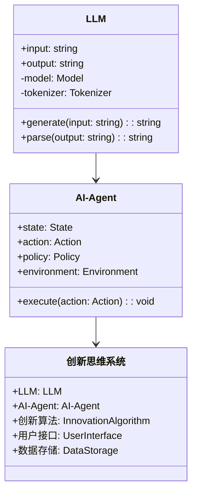
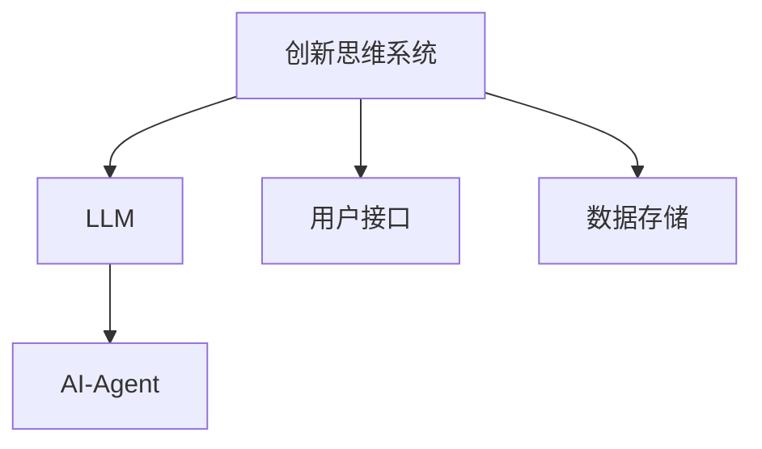
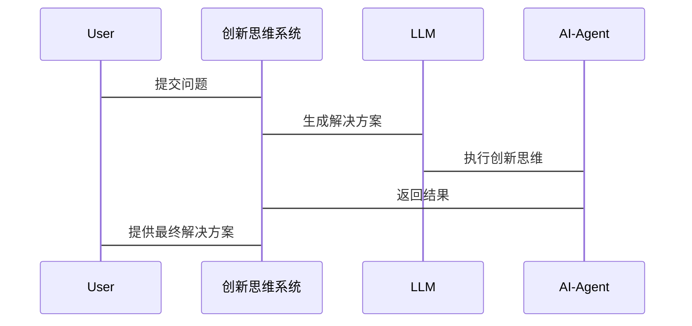

                 


# 构建LLM支持的AI Agent创新思维系统

> 关键词：LLM、AI Agent、创新思维系统、大语言模型、人工智能、系统架构

> 摘要：本文详细探讨了构建基于大语言模型（LLM）的AI Agent创新思维系统的各个方面。从问题背景到系统架构，从算法原理到项目实战，全面解析了如何利用LLM支持AI Agent的创新思维能力，展示了该系统的实现过程及实际应用。

---

# 第一部分: LLM支持的AI Agent创新思维系统背景介绍

## 第1章: 问题背景与系统概述

### 1.1 问题背景

#### 1.1.1 当前AI技术的发展现状
人工智能（AI）技术近年来取得了突飞猛进的发展，尤其是大语言模型（LLM）的出现，使得AI能够处理复杂的自然语言任务。然而，现有的AI系统在创新思维能力方面仍有不足，难以真正实现智能化决策。

#### 1.1.2 LLM与AI Agent的结合需求
AI Agent（智能体）是一种能够感知环境、自主决策并执行任务的智能系统。结合LLM的能力，可以显著提升AI Agent的理解、推理和创新能力，使其在复杂场景中表现出色。

#### 1.1.3 创新思维系统的核心问题
创新思维是AI Agent实现高度智能的关键。当前的AI系统在创新方面主要依赖预定义规则或模板，缺乏真正的创造性思维能力。如何利用LLM支持AI Agent的创新思维，是本系统的核心问题。

### 1.2 问题描述

#### 1.2.1 LLM支持的AI Agent定义
LLM支持的AI Agent是一种结合了大语言模型能力的智能体，能够通过自然语言处理技术进行创新思维，解决复杂问题。

#### 1.2.2 系统的目标与范围
系统的目的是构建一个基于LLM的AI Agent，使其具备创新思维能力，能够在多种场景中自主学习、推理和决策。

#### 1.2.3 系统的边界与外延
系统的边界包括LLM模型的输入输出、AI Agent的行为决策，以及创新思维的实现过程。外延则涉及与外部环境的交互和数据源的整合。

### 1.3 问题解决

#### 1.3.1 LLM在AI Agent中的作用
LLM为AI Agent提供了强大的语言理解和生成能力，使其能够更好地理解和处理复杂任务。

#### 1.3.2 创新思维系统的实现路径
通过结合LLM和AI Agent的技术，构建创新思维系统，实现自主学习、推理和决策。

#### 1.3.3 系统的创新点与优势
系统的创新点在于将LLM与AI Agent结合，通过创新思维算法提升系统的智能化水平。其优势在于能够处理复杂任务，具备较强的适应性和创新性。

### 1.4 系统核心要素

#### 1.4.1 LLM模型的选择与优化
选择合适的LLM模型，并对其进行优化，以提升系统的性能。

#### 1.4.2 创新思维的算法实现
设计创新思维算法，实现AI Agent的自主学习和推理能力。

#### 1.4.3 系统架构的设计与实现
设计系统的整体架构，确保各模块协同工作，实现创新思维能力。

---

## 第2章: LLM与AI Agent的核心概念

### 2.1 LLM的原理与特点

#### 2.1.1 大语言模型的原理
大语言模型通过大量的数据训练，能够理解和生成自然语言。其原理基于深度学习和概率分布。

#### 2.1.2 LLM的核心特点
- 大规模数据训练
- 强大的语言生成能力
- 自然语言理解能力

#### 2.1.3 LLM的优缺点
优点：强大的语言处理能力，能够处理复杂任务。缺点：计算资源消耗大，模型训练成本高。

### 2.2 AI Agent的基本概念

#### 2.2.1 AI Agent的定义
AI Agent是一种能够感知环境、自主决策并执行任务的智能系统。

#### 2.2.2 AI Agent的分类
- 简单反射型Agent
- 基于模型的反射型Agent
- 目标驱动型Agent
- 问题求解型Agent

#### 2.2.3 AI Agent的功能与作用
AI Agent能够感知环境、推理、决策、执行任务，并与外部系统进行交互。

### 2.3 LLM与AI Agent的关系

#### 2.3.1 LLM作为AI Agent的核心模块
LLM为AI Agent提供了语言理解和生成能力，使其能够更好地与人类交互。

#### 2.3.2 LLM与AI Agent的协同工作
AI Agent通过LLM进行语言处理和理解，结合自身的推理能力，实现复杂任务的处理。

#### 2.3.3 LLM对AI Agent能力的提升
LLM的引入显著提升了AI Agent的语言理解和生成能力，使其能够处理更复杂的问题。

### 2.4 核心概念对比分析

#### 2.4.1 LLM与传统NLP模型的对比
- LLM：基于深度学习，参数量大，能够处理复杂语言任务。
- 传统NLP模型：基于浅层学习，适用于简单任务。

#### 2.4.2 AI Agent与传统AI系统的对比
- AI Agent：具备自主决策和学习能力。
- 传统AI系统：依赖预定义规则，不具备自主学习能力。

#### 2.4.3 创新思维系统与传统思维系统的对比
- 创新思维系统：具备创新能力和自主学习能力。
- 传统思维系统：依赖预定义规则，不具备创新能力。

### 2.5 本章小结

---

## 第3章: LLM与AI Agent的核心概念原理

### 3.1 LLM的数学模型

#### 3.1.1 概率分布模型
语言模型通过概率分布来预测下一个词的概率。

#### 3.1.2 损失函数的定义
常用的损失函数是交叉熵损失函数。

#### 3.1.3 优化算法的实现
常用的优化算法是Adam优化算法。

### 3.2 AI Agent的算法原理

#### 3.2.1 状态空间的定义
状态空间是AI Agent所处环境的所有可能状态的集合。

#### 3.2.2 动作空间的定义
动作空间是AI Agent在每个状态下可执行的所有动作的集合。

#### 3.2.3 策略函数的实现
策略函数是将状态映射到动作的函数。

### 3.3 创新思维系统的数学模型

#### 3.3.1 创新思维的定义
创新思维是指在已有知识基础上，提出新的想法或解决方案的能力。

#### 3.3.2 创新思维的数学表达
创新思维可以通过概率分布和生成模型来实现。

#### 3.3.3 创新思维的优化目标
优化目标是最大化生成结果的创新性和实用性。

### 3.4 核心概念对比分析的数学模型

#### 3.4.1 LLM与传统NLP模型的对比公式
$$ P_{LLM}(y|x) > P_{传统}(y|x) $$

#### 3.4.2 AI Agent与传统AI系统的对比公式
$$ P_{Agent}(x) > P_{传统}(x) $$

#### 3.4.3 创新思维系统与传统思维系统的对比公式
$$ P_{创新}(y|x) > P_{传统}(y|x) $$

### 3.5 本章小结

---

## 第4章: LLM与AI Agent的算法实现

### 4.1 LLM的算法实现

#### 4.1.1 模型训练的流程
1. 数据预处理
2. 模型初始化
3. 损失计算
4. 参数优化

#### 4.1.2 模型推理的实现
1. 输入处理
2. 概率计算
3. 文本生成

#### 4.1.3 模型优化的策略
1. 超参数调整
2. 模型剪枝
3. 模型蒸馏

### 4.2 AI Agent的算法实现

#### 4.2.1 状态感知的实现
1. 环境感知
2. 状态表示

#### 4.2.2 动作决策的实现
1. 状态分析
2. 动作选择

#### 4.2.3 系统交互的实现
1. 用户输入
2. 系统响应

### 4.3 创新思维系统的算法实现

#### 4.3.1 创新思维的实现流程
1. 问题分析
2. 思维推理
3. 解决方案生成

#### 4.3.2 创新思维的算法实现
1. 创新点提取
2. 解决方案生成
3. 方案优化

### 4.4 本章小结

---

## 第5章: 系统分析与架构设计

### 5.1 问题场景介绍

#### 5.1.1 系统背景
系统旨在构建一个基于LLM的AI Agent创新思维系统，提升AI Agent的创新能力。

#### 5.1.2 项目介绍
本项目的目标是实现一个能够自主学习、推理和创新的AI Agent。

### 5.2 系统功能设计

#### 5.2.1 领域模型类图


#### 5.2.2 系统架构设计


#### 5.2.3 系统接口设计
- 用户接口：提供与系统交互的界面。
- 数据存储：存储系统的数据和历史记录。

#### 5.2.4 系统交互流程


### 5.3 本章小结

---

## 第6章: 项目实战

### 6.1 环境安装

#### 6.1.1 安装Python
```bash
python --version
pip install --upgrade pip
```

#### 6.1.2 安装LLM模型
```bash
pip install transformers
pip install torch
```

### 6.2 系统核心实现源代码

#### 6.2.1 LLM模型实现
```python
from transformers import AutoTokenizer, AutoModelForCausalLM

class LLM:
    def __init__(self, model_name):
        self.tokenizer = AutoTokenizer.from_pretrained(model_name)
        self.model = AutoModelForCausalLM.from_pretrained(model_name)
```

#### 6.2.2 AI Agent实现
```python
class AI-Agent:
    def __init__(self, llm):
        self.llm = llm
        self.state = None
```

#### 6.2.3 创新思维系统实现
```python
class 创新思维系统:
    def __init__(self, llm):
        self.llm = llm
        self.agent = AI-Agent(llm)
```

### 6.3 代码应用解读与分析

#### 6.3.1 代码结构
- LLM类：负责模型的加载和调用。
- AI-Agent类：负责与环境的交互和决策。
- 创新思维系统类：负责系统的整体协调和创新思维的实现。

#### 6.3.2 核心代码解读
- LLM模型的调用：通过tokenizer和model进行文本生成。
- AI-Agent的决策：基于当前状态和动作空间进行决策。
- 创新思维系统的协调：整合LLM和AI-Agent的能力，实现创新思维。

### 6.4 实际案例分析

#### 6.4.1 案例背景
用户提出一个复杂问题，系统需要生成创新解决方案。

#### 6.4.2 解决方案生成
系统通过LLM生成多个解决方案，AI-Agent进行优化选择。

#### 6.4.3 方案优化
系统根据历史数据和反馈，优化解决方案，提升创新性。

### 6.5 项目小结

---

## 第7章: 最佳实践与总结

### 7.1 最佳实践

#### 7.1.1 系统优化建议
- 定期更新LLM模型
- 优化AI-Agent的决策算法
- 提升系统的交互体验

#### 7.1.2 注意事项
- 数据安全与隐私保护
- 系统的可扩展性设计
- 系统的性能优化

### 7.2 小结

#### 7.2.1 系统实现总结
通过结合LLM和AI-Agent，构建了一个创新思维系统，能够处理复杂问题，具备较强的创新性和适应性。

#### 7.2.2 系统的优势
- 强大的语言处理能力
- 自主学习和推理能力
- 创新思维能力

### 7.3 注意事项

#### 7.3.1 系统维护
- 定期更新模型
- 监控系统性能
- 处理异常情况

#### 7.3.2 系统扩展
- 扩展功能模块
- 优化算法
- 提升系统性能

### 7.4 拓展阅读

#### 7.4.1 推荐书籍
- 《Deep Learning》
- 《自然语言处理实战》

#### 7.4.2 推荐论文
- "Attention Is All You Need"
- "The Transformer"

---

## 作者：AI天才研究院/AI Genius Institute & 禅与计算机程序设计艺术 /Zen And The Art of Computer Programming

---

这篇文章通过系统化的分析和实践，详细介绍了如何构建基于LLM的AI Agent创新思维系统，涵盖了从理论到实践的各个方面，为读者提供了丰富的技术细节和实用的实现方案。

