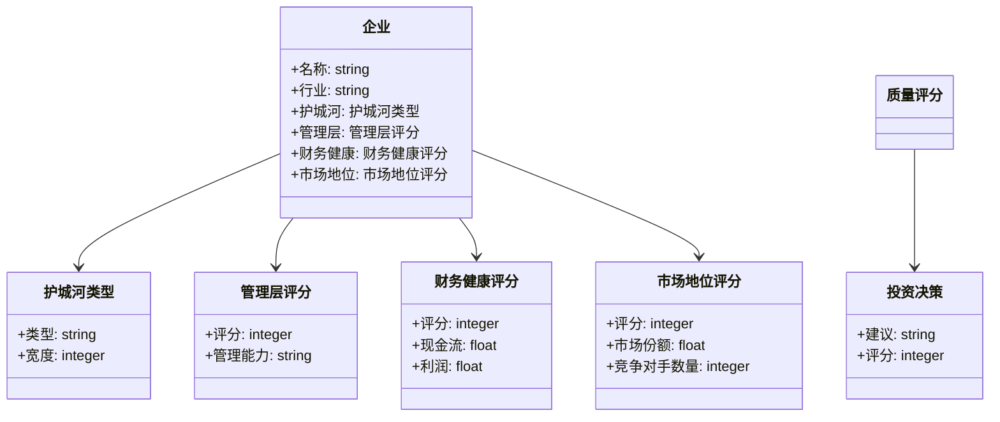
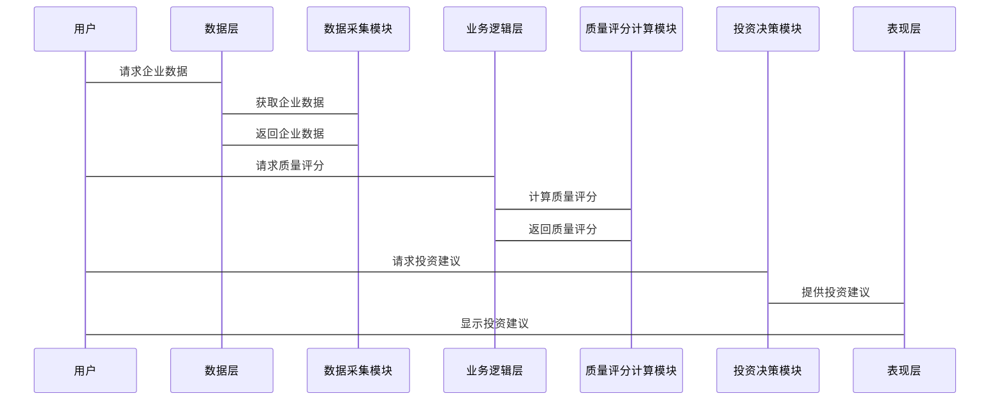

                 


# {{芒格的质量优先原则在投资中的应用}}

## {{关键词：芒格，质量优先，投资策略，企业质量，风险管理}}

## {{摘要：芒格的质量优先原则强调在投资中优先选择具有高质量特征的企业，通过深入分析企业的核心竞争力、管理层素质和财务状况，构建长期稳健的投资组合。本文详细阐述了该原则的背景、核心要素、数学模型、系统架构以及实际应用案例，结合风险管理、心理因素和未来趋势分析，为投资者提供科学的投资决策依据。}}

---

## # 第四章: 芒格的质量优先原则的系统分析与架构设计

## ## # 第4章: 投资分析系统的系统分析与架构设计

### ### 4.1 问题场景介绍

在实际投资过程中，投资者需要面对大量的数据和复杂的决策，如何将芒格的质量优先原则系统化，构建一个高效的分析系统，是投资者关注的焦点。本文将从系统分析的角度，详细阐述如何构建一个基于质量优先原则的投资分析系统。

### ### 4.2 项目介绍

本章将通过一个具体的投资分析系统的案例，展示如何将芒格的质量优先原则转化为一个可操作的系统架构。该系统将包括数据采集、分析、决策支持等功能模块，旨在帮助投资者快速识别出具有高质量特征的企业。

### ### 4.3 系统功能设计（领域模型）

#### 4.3.1 领域模型描述

领域模型是系统设计的基础，它描述了系统中各个核心概念及其之间的关系。在本系统中，主要涉及以下核心概念：

- **企业**：系统分析的主体，每个企业都有其独特的质量特征。
- **质量指标**：用于评估企业质量的一系列指标，如护城河、管理层等。
- **投资决策**：基于质量指标分析得出的投资建议。

#### 4.3.2 领域模型类图



### ### 4.4 系统架构设计

#### 4.4.1 系统架构概述

系统架构设计是将各个功能模块有机地组合起来，形成一个完整的系统。本系统采用分层架构，主要包含以下几个层次：

1. **数据层**：负责数据的采集、存储和管理。
2. **业务逻辑层**：负责具体的业务逻辑处理，如质量评分计算。
3. **表现层**：负责用户界面的展示和交互。

#### 4.4.2 系统架构图

```mermaid
container 数据层 {
    数据库
    数据采集模块
}
container 业务逻辑层 {
    质量评分计算模块
    投资决策模块
}
container 表现层 {
    用户界面
    数据可视化模块
}
数据层 --> 业务逻辑层
业务逻辑层 --> 表现层
```

### ### 4.5 系统接口设计

#### 4.5.1 系统接口描述

系统需要提供以下主要接口：

1. 数据接口：用于获取企业的各项质量指标数据。
2. 评分接口：用于计算企业的质量评分。
3. 决策接口：用于生成投资决策建议。

#### 4.5.2 接口交互流程图



---

## # 第五章: 芒格的质量优先原则的项目实战

## ## # 第5章: 投资决策系统的实战案例

### ### 5.1 系统设计

#### 5.1.1 系统设计概述

本章将通过一个具体的实战案例，展示如何将芒格的质量优先原则应用于实际投资决策系统中。我们将以一个小型投资决策系统为例，详细描述系统的功能设计、实现过程和实际应用。

### ### 5.2 系统核心实现

#### 5.2.1 核心实现概述

系统的核心在于如何计算企业的质量评分，并基于评分生成投资建议。以下是系统的核心实现步骤：

1. **数据采集**：从数据库中获取企业的各项指标数据。
2. **质量评分计算**：基于各项指标计算企业的质量评分。
3. **投资建议生成**：根据评分生成相应的投资建议。

#### 5.2.2 质量评分计算的Python实现

```python
def calculate_quality_score(护城河评分, 管理层评分, 财务健康评分, 市场地位评分):
    return (护城河评分 * 0.4) + (管理层评分 * 0.3) + (财务健康评分 * 0.2) + (市场地位评分 * 0.1)

# 示例数据
护城河评分 = 0.8
管理层评分 = 0.7
财务健康评分 = 0.6
市场地位评分 = 0.5

quality_score = calculate_quality_score(护城河评分, 管理层评分, 财务健康评分, 市场地位评分)
print(f"企业质量评分为：{quality_score}")
```

### ### 5.3 代码解读与分析

#### 5.3.1 代码解读

上述代码定义了一个计算企业质量评分的函数，输入企业的护城河评分、管理层评分、财务健康评分和市场地位评分，通过加权计算得出企业的质量评分。最后，代码使用示例数据计算并输出了质量评分。

#### 5.3.2 代码实现分析

通过上述代码可以看出，系统的实现过程主要包括以下几个步骤：

1. **数据输入**：获取企业的各项指标评分。
2. **评分计算**：通过加权计算得出企业的质量评分。
3. **结果输出**：将计算结果输出给用户。

### ### 5.4 投资决策系统的实际案例分析

#### 5.4.1 案例分析概述

以下是一个实际案例分析，展示如何使用本系统对某企业进行投资决策。

#### 5.4.2 案例分析过程

假设我们对一家科技公司进行投资分析，其各项指标评分如下：

- **护城河评分**：0.8
- **管理层评分**：0.7
- **财务健康评分**：0.6
- **市场地位评分**：0.5

通过上述代码计算得出的质量评分为：

$$ \text{quality\_score} = 0.8 \times 0.4 + 0.7 \times 0.3 + 0.6 \times 0.2 + 0.5 \times 0.1 = 0.32 + 0.21 + 0.12 + 0.05 = 0.70 $$

质量评分为0.70，属于较高的评分，说明该企业具有较高的质量特征，适合进行长期投资。

### ### 5.5 项目小结

本章通过一个具体的实战案例，详细展示了如何将芒格的质量优先原则应用于投资决策系统中。通过系统的实现和案例分析，我们可以看到，质量优先原则能够帮助投资者快速识别出具有高质量特征的企业，从而做出更加科学的投资决策。

---

## # 第六章: 芒格的质量优先原则的风险管理

## ## # 第6章: 投资风险管理与质量优先原则的结合

### ### 6.1 风险管理概述

在投资过程中，风险管理是至关重要的一环。芒格的质量优先原则强调选择具有高质量特征的企业，这本身就在一定程度上降低了投资风险。然而，为了进一步优化投资组合，我们需要将风险管理与质量优先原则相结合。

### ### 6.2 风险评估与质量优先原则

#### 6.2.1 风险评估概述

风险评估是投资风险管理的基础，它涉及到对企业可能面临的风险进行识别、量化和评估。在质量优先原则下，我们可以通过对企业质量特征的分析，识别出潜在的风险因素。

#### 6.2.2 质量优先原则与风险控制

质量优先原则强调选择具有高质量特征的企业，这些企业通常具有较强的抗风险能力和稳定的财务状况。因此，在质量优先原则下，我们可以通过以下方式实现风险控制：

1. **选择具有宽护城河的企业**：宽护城河可以有效抵御竞争对手的冲击，降低企业的经营风险。
2. **选择具有优秀管理层的企业**：优秀的管理层能够更好地应对市场变化，降低管理风险。
3. **关注企业的财务健康状况**：稳定的现金流和健康的财务状况可以降低企业的财务风险。
4. **关注企业的市场地位**：较强的市场地位可以降低企业的市场风险。

### ### 6.3 投资组合的风险管理策略

#### 6.3.1 投资组合的风险管理策略概述

在质量优先原则下，我们可以通过以下策略来优化投资组合的风险管理：

1. **分散投资**：将资金分散投资于不同行业和不同质量特征的企业，降低单一投资的风险。
2. **定期调整**：根据市场变化和企业质量特征的变化，定期调整投资组合。
3. **风险管理模型**：建立风险管理模型，量化投资组合的整体风险，并制定相应的风险管理策略。

#### 6.3.2 风险管理模型

以下是一个简单的风险管理模型，用于量化投资组合的整体风险：

$$ \text{投资组合风险} = \sum (\text{单个投资的风险} \times \text{投资比例}) $$

### ### 6.4 风险监控与管理

#### 6.4.1 风险监控概述

风险监控是投资风险管理的重要环节，它涉及到对投资组合的整体风险进行实时监控，并根据监控结果调整风险管理策略。

#### 6.4.2 风险管理系统的实现

为了实现有效的风险监控，我们可以建立一个风险管理信息系统，实时监控投资组合的整体风险，并根据市场变化和企业质量特征的变化，自动调整投资组合。

### ### 6.5 本章小结

本章详细探讨了芒格的质量优先原则与投资风险管理的结合。通过质量优先原则，我们可以选择具有高质量特征的企业，降低投资风险。同时，通过建立风险管理模型和风险管理系统，我们可以进一步优化投资组合的风险管理，确保投资组合的长期稳健增长。

---

## # 第七章: 芒格的质量优先原则的心理因素

## ## # 第7章: 投资者心理与质量优先原则

### ### 7.1 投资者心理概述

在投资过程中，投资者的心理因素往往会对投资决策产生重要的影响。芒格的质量优先原则强调选择具有高质量特征的企业，这需要投资者具备一定的心理素质和决策能力。

### ### 7.2 质量优先原则与行为金融学

#### 7.2.1 行为金融学概述

行为金融学研究的是投资者在实际投资过程中的心理和行为，以及这些心理和行为如何影响投资决策。在质量优先原则下，我们需要关注投资者的心理因素，避免因心理偏差而导致的投资决策失误。

#### 7.2.2 质量优先原则与行为金融学的结合

质量优先原则要求投资者在选择企业时，注重企业的质量特征，而不是短期的市场波动。然而，投资者的心理因素往往会影响其对质量特征的判断和决策。因此，在质量优先原则下，我们需要结合行为金融学的理论，帮助投资者克服心理偏差，做出更加理性的投资决策。

### ### 7.3 投资者心理因素的克服

#### 7.3.1 常见的心理偏差

在投资过程中，投资者常常会受到以下心理偏差的影响：

1. **过度自信**：投资者往往过高估计自己的能力，导致决策失误。
2. **从众心理**：投资者往往跟随市场的主流观点，导致决策趋同。
3. **损失厌恶**：投资者往往过于害怕损失，导致决策保守。

#### 7.3.2 克服心理偏差的策略

为了克服上述心理偏差，投资者可以采取以下策略：

1. **加强自我认知**：了解自己的心理特点，避免因心理偏差而导致决策失误。
2. **制定投资计划**：制定明确的投资计划，并严格按照计划执行，避免因情绪波动而导致决策失误。
3. **分散投资**：通过分散投资降低风险，避免因某一次决策失误而导致整体投资失败。

### ### 7.4 心理因素对质量优先原则的影响

#### 7.4.1 心理因素对质量优先原则的正向影响

质量优先原则强调选择具有高质量特征的企业，这需要投资者具备一定的耐心和长期视角。通过克服心理偏差，投资者可以更好地坚持质量优先原则，实现长期投资目标。

#### 7.4.2 心理因素对质量优先原则的负向影响

投资者的心理偏差可能会影响其对质量特征的判断，导致其选择那些表面上看似优质，实则存在潜在风险的企业。因此，在质量优先原则下，投资者需要克服心理偏差，坚持长期视角，做出理性的投资决策。

### ### 7.5 本章小结

本章详细探讨了投资者心理与质量优先原则的关系。通过分析投资者的心理因素，我们可以更好地理解质量优先原则在实际投资中的应用。同时，通过克服心理偏差，投资者可以更好地坚持质量优先原则，实现长期投资目标。

---

## # 第八章: 芒格的质量优先原则的未来趋势

## ## # 第8章: 质量优先原则的未来发展趋势

### ### 8.1 质量优先原则的未来发展趋势

随着全球经济的不断发展和技术的进步，芒格的质量优先原则将不断发展和完善。未来，质量优先原则将更加注重企业的可持续发展能力和社会责任感，选择那些不仅具有高质量特征，还能够为社会和环境做出积极贡献的企业。

### ### 8.2 技术进步对质量优先原则的影响

#### 8.2.1 技术进步对投资分析的影响

随着技术的进步，投资分析工具和方法将不断更新和优化。未来，基于人工智能和大数据分析的投资系统将更加普及，质量优先原则的分析将更加精准和高效。

#### 8.2.2 技术进步对质量管理的影响

技术进步将推动质量管理的创新和发展。未来，质量管理将更加注重企业的技术创新能力和研发投入，选择那些具有强大技术创新能力的企业。

### ### 8.3 经济环境对质量优先原则的影响

#### 8.3.1 经济环境对投资策略的影响

经济环境的变化将直接影响投资策略。在未来，质量优先原则将更加注重企业的抗风险能力和适应能力，选择那些能够在经济波动中保持稳定增长的企业。

#### 8.3.2 经济环境对质量管理的影响

随着经济全球化和区域经济一体化的深入发展，质量管理将更加注重企业的国际化能力和全球竞争优势，选择那些能够在国际市场上占据重要地位的企业。

### ### 8.4 政策环境对质量优先原则的影响

#### 8.4.1 政策环境对投资策略的影响

政策环境的变化将直接影响投资策略。未来，质量优先原则将更加注重企业的合规性和社会责任感，选择那些能够遵守法律法规并积极履行社会责任的企业。

#### 8.4.2 政策环境对质量管理的影响

随着政策法规的不断完善，质量管理将更加注重企业的合规性和透明度，选择那些能够满足政策法规要求并具有较高透明度的企业。

### ### 8.5 未来趋势预测

#### 8.5.1 质量优先原则的长期发展趋势

未来，质量优先原则将不断发展和完善，更加注重企业的可持续发展能力和社会责任感。选择那些不仅具有高质量特征，还能够为社会和环境做出积极贡献的企业将成为投资的主要方向。

#### 8.5.2 质量优先原则的技术实现趋势

随着技术的进步，质量优先原则的分析将更加精准和高效。基于人工智能和大数据分析的投资系统将更加普及，质量优先原则的分析将更加智能化和自动化。

### ### 8.6 本章小结

本章详细探讨了质量优先原则的未来发展趋势。随着技术的进步、经济环境的变化和政策法规的不断完善，质量优先原则将不断发展和完善。未来，质量优先原则将更加注重企业的可持续发展能力和社会责任感，选择那些能够在经济波动中保持稳定增长并积极履行社会责任的企业。

---

## # 第九章: 芒格的质量优先原则的总结与展望

## ## # 第9章: 质量优先原则的总结与展望

### ### 9.1 总结

芒格的质量优先原则是一种以企业质量为核心的长期投资策略，它强调选择那些具有高质量特征的企业进行投资。通过本文的详细阐述，我们可以看到，质量优先原则在实际投资中的应用具有重要的现实意义。通过选择具有高质量特征的企业，投资者可以实现长期稳健的投资收益。

### ### 9.2 展望

未来，质量优先原则将不断发展和完善，更加注重企业的可持续发展能力和社会责任感。随着技术的进步和经济环境的变化，质量优先原则的分析将更加精准和高效。基于人工智能和大数据分析的投资系统将更加普及，质量优先原则的分析将更加智能化和自动化。

### ### 9.3 本章小结

本章总结了质量优先原则的核心思想和实际应用，并展望了其未来的发展趋势。通过本文的阐述，我们可以看到，质量优先原则在实际投资中的应用具有重要的现实意义。未来，质量优先原则将不断发展和完善，为投资者提供更加科学的投资决策依据。

---

## # 作者：AI天才研究院/AI Genius Institute & 禅与计算机程序设计艺术 /Zen And The Art of Computer Programming

