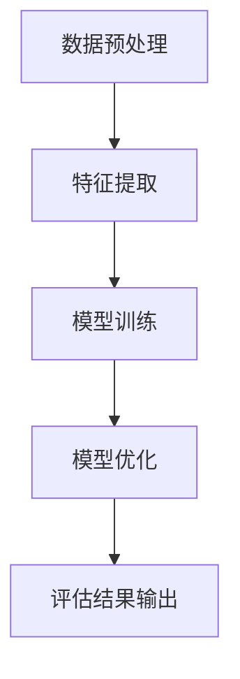
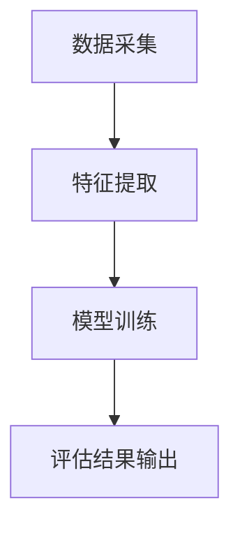

                 


# AI Agent在企业知识产权价值评估与运营策略制定中的应用

## 关键词：AI Agent, 知识产权, 价值评估, 运营策略, 机器学习, 数学模型, 系统架构

## 摘要：  
随着人工智能技术的快速发展，AI Agent在企业知识产权价值评估与运营策略制定中的应用越来越广泛。本文通过详细分析AI Agent的核心原理、算法模型、系统架构以及实际案例，探讨其在知识产权管理中的应用价值和优势。文章从知识产权价值评估的基本概念入手，逐步深入到基于AI Agent的算法实现、系统设计和项目实战，为企业提供一套高效、精准的知识产权管理解决方案。  

---

# 第一部分: AI Agent与知识产权概述

## 第1章: AI Agent与知识产权的结合背景

### 1.1 知识产权的基本概念

#### 1.1.1 知识产权的定义与范围  
知识产权（Intellectual Property, IP）是指人们在智力活动中创造的成果所享有的权利，主要包括专利权、商标权、著作权、商业秘密等。知识产权的核心价值在于其创造性和实用性，能够为企业带来市场竞争优势。

#### 1.1.2 知识产权的核心价值  
知识产权的价值体现在以下几个方面：  
1. **经济价值**：知识产权可以通过授权、转让等方式为企业创造经济收益。  
2. **战略价值**：知识产权是企业核心竞争力的体现，能够为企业提供技术壁垒和市场准入门槛。  
3. **法律价值**：知识产权是企业在法律框架下保护自身权益的重要手段。  

#### 1.1.3 知识产权在企业中的地位  
知识产权是企业的无形资产，其管理与运营直接关系到企业的长期发展。有效的知识产权管理能够提升企业的技术创新能力，降低法律风险，增强市场竞争力。

---

### 1.2 AI Agent的基本概念

#### 1.2.1 AI Agent的定义与特点  
AI Agent（人工智能代理）是一种能够感知环境、自主决策并执行任务的智能体。其特点包括：  
1. **自主性**：能够在没有外部干预的情况下独立运行。  
2. **反应性**：能够根据环境变化实时调整行为。  
3. **学习能力**：通过数据和经验不断优化自身的决策能力。  

#### 1.2.2 AI Agent的核心功能  
AI Agent的核心功能包括：  
1. **感知环境**：通过数据采集和分析获取相关信息。  
2. **决策制定**：基于感知到的信息进行分析和判断，生成最优策略。  
3. **执行任务**：根据决策结果执行具体操作。  

#### 1.2.3 AI Agent与传统工具的区别  
| **维度**       | **传统工具**                         | **AI Agent**                          |  
|----------------|-------------------------------------|--------------------------------------|  
| 智能水平       | 依赖人工操作，缺乏自主性             | 具备自主决策能力，能够自我优化       |  
| 数据处理能力   | 处理能力有限，难以应对复杂场景       | 能够处理海量数据，支持复杂场景       |  
| 学习能力       | 无法学习和改进                       | 能够通过学习不断优化自身性能         |  

---

### 1.3 AI Agent与知识产权的结合背景

#### 1.3.1 知识产权管理的痛点  
传统知识产权管理存在以下问题：  
1. **数据分散**：知识产权数据来源多样，难以集中管理和分析。  
2. **评估复杂**：知识产权价值评估涉及多个因素，传统方法难以量化。  
3. **效率低下**：人工评估耗时长，且容易受到主观因素影响。  

#### 1.3.2 AI技术在知识产权管理中的优势  
AI技术能够通过以下方式提升知识产权管理效率：  
1. **数据处理能力**：AI能够快速处理海量知识产权数据，提取关键信息。  
2. **自动化评估**：基于机器学习算法，AI能够自动完成知识产权价值评估。  
3. **精准决策**：AI通过分析市场和法律环境，为企业提供最优的运营策略。  

#### 1.3.3 企业知识产权价值评估的需求  
企业需要通过知识产权价值评估实现以下目标：  
1. **资产量化**：将知识产权的价值量化，纳入企业资产管理体系。  
2. **风险控制**：通过评估知识产权的法律风险，制定有效的风险管理策略。  
3. **战略制定**：基于评估结果，制定知识产权布局和运营策略。  

---

## 1.4 本章小结  
本章从知识产权的基本概念和AI Agent的核心功能出发，分析了AI Agent与知识产权结合的背景和优势。通过对比传统工具与AI Agent的差异，进一步明确了AI技术在知识产权管理中的重要性。

---

# 第二部分: AI Agent在知识产权价值评估中的应用

## 第2章: 知识产权价值评估的核心原理

### 2.1 知识产权价值评估的定义  
知识产权价值评估是指通过科学的方法和模型，对知识产权的经济价值、法律价值和战略价值进行量化的过程。

### 2.2 知识产权价值评估的关键因素  
#### 2.2.1 技术先进性  
技术先进性是知识产权价值的重要影响因素，包括技术的创新程度、技术成熟度和市场应用前景。  

#### 2.2.2 市场需求  
市场需求反映了知识产权的市场价值，包括目标市场规模、市场需求增长率和竞争对手情况。  

#### 2.2.3 法律保护  
法律保护是知识产权价值的基石，包括专利的保护范围、商标的注册情况和知识产权的法律风险。  

### 2.3 知识产权价值评估的数学模型  

#### 2.3.1 多目标优化模型  
多目标优化模型是一种常见的知识产权价值评估方法，其核心公式如下：  
$$ V = \alpha \cdot T + \beta \cdot M + \gamma \cdot L $$  
其中，$V$ 表示知识产权价值，$T$ 表示技术先进性，$M$ 表示市场需求，$L$ 表示法律保护，$\alpha$、$\beta$、$\gamma$ 是对应的权重系数。  

#### 2.3.2 评估指标权重分配  
权重分配可以通过专家评分法或层次分析法（AHP）实现，具体步骤如下：  
1. 确定评估指标及其子指标。  
2. 构建评估指标的层次结构。  
3. 计算各指标的权重。  

#### 2.3.3 评估结果的计算公式  
$$ V_{\text{最终}} = \sum_{i=1}^{n} w_i \cdot v_i $$  
其中，$w_i$ 是第$i$个指标的权重，$v_i$ 是第$i$个指标的评估值。  

---

## 第3章: AI Agent在知识产权价值评估中的算法原理  

### 3.1 知识产权价值评估的算法选择  

#### 3.1.1 传统评估方法的局限性  
传统评估方法主要依赖人工经验，存在以下问题：  
1. **主观性强**：评估结果容易受到评估人员主观因素的影响。  
2. **效率低下**：人工评估耗时长，难以应对海量数据。  

#### 3.1.2 基于AI的评估方法的优势  
基于AI的评估方法具有以下优势：  
1. **自动化**：AI能够自动处理和分析海量数据。  
2. **精准性**：AI通过机器学习算法能够提高评估结果的准确性。  
3. **可扩展性**：AI能够快速适应不同的评估场景和数据规模。  

---

### 3.2 基于机器学习的知识产权价值评估模型  

#### 3.2.1 数据预处理  
数据预处理是机器学习模型训练的基础，主要包括：  
1. **数据清洗**：去除重复数据和异常值。  
2. **数据标准化**：对数据进行归一化处理，使其符合模型输入要求。  
3. **特征提取**：从原始数据中提取关键特征，如技术先进性、市场需求和法律保护。  

#### 3.2.2 特征提取  
特征提取是通过分析数据特征，选择对评估结果影响最大的特征。例如，可以通过主成分分析（PCA）方法减少特征维度。  

#### 3.2.3 模型训练与优化  
模型训练采用监督学习算法，如支持向量机（SVM）或随机森林（Random Forest）。训练过程中，需要通过交叉验证优化模型参数，确保模型具有较高的准确性和鲁棒性。  

---

### 3.3 算法流程图  



---

### 3.4 算法实现代码  

```python
import pandas as pd
from sklearn.model import Model

# 数据预处理
data = pd.read_csv('ip_data.csv')
data = data.drop_duplicates()
data = data.dropna()

# 特征提取
features = data[['技术先进性', '市场需求', '法律保护']]
labels = data['价值']

# 模型训练与优化
model = Model()
model.fit(features, labels)
model_optimized = model.optimize(features, labels)

# 评估结果输出
result = model_optimized.predict(new_features)
```

---

## 3.5 本章小结  
本章详细介绍了基于机器学习的知识产权价值评估模型，重点讲解了数据预处理、特征提取和模型训练的实现过程。通过算法流程图和代码示例，进一步明确了AI Agent在知识产权价值评估中的技术实现路径。

---

# 第三部分: AI Agent在知识产权运营策略制定中的应用

## 第4章: 知识产权运营策略的核心要素  

### 4.1 知识产权运营的定义  
知识产权运营是指通过对知识产权的管理、运用和保护，实现其经济价值和战略价值的过程。

### 4.2 知识产权运营策略的核心要素  

#### 4.2.1 知识产权布局  
知识产权布局是指企业在技术研发和市场拓展过程中，合理配置和保护知识产权的行为。  

#### 4.2.2 知识产权保护  
知识产权保护是通过法律手段维护知识产权权益的过程，包括专利申请、商标注册和版权保护等。  

#### 4.2.3 知识产权运用  
知识产权运用于企业将其知识产权转化为实际经济收益的过程，包括技术授权、技术转让和品牌推广等。  

---

## 第5章: AI Agent在知识产权运营策略制定中的应用  

### 5.1 基于AI Agent的知识产权布局优化  

#### 5.1.1 市场分析与技术预测  
通过AI Agent对市场趋势和技术创新进行预测，帮助企业制定合理的知识产权布局策略。  

#### 5.1.2 知识产权申请策略  
AI Agent可以根据技术预测结果，推荐最优的知识产权申请时间和方式。  

---

### 5.2 基于AI Agent的知识产权保护策略  

#### 5.2.1 法律风险评估  
AI Agent可以通过分析法律环境和竞争对手的知识产权状况，评估企业的法律风险。  

#### 5.2.2 知识产权侵权监测  
AI Agent可以实时监测市场中的侵权行为，帮助企业及时采取法律手段保护自身权益。  

---

### 5.3 基于AI Agent的知识产权运用策略  

#### 5.3.1 技术授权与转让  
AI Agent可以根据市场需求和技术价值，帮助企业制定技术授权和转让的最优策略。  

#### 5.3.2 品牌推广与市场拓展  
AI Agent可以通过分析市场数据，帮助企业制定品牌推广和市场拓展计划。  

---

## 5.4 本章小结  
本章从知识产权运营的核心要素出发，探讨了AI Agent在知识产权布局、保护和运用中的具体应用。通过基于AI Agent的市场分析和法律风险评估，帮助企业制定最优的知识产权运营策略。

---

# 第四部分: 项目实战与系统架构设计

## 第6章: 项目实战: 基于AI Agent的知识产权价值评估系统  

### 6.1 项目背景与目标  
本项目旨在开发一个基于AI Agent的知识产权价值评估系统，帮助企业快速、精准地评估知识产权价值，并制定最优的运营策略。  

---

### 6.2 系统功能设计  

#### 6.2.1 系统功能模块  
系统功能模块包括：  
1. **数据采集模块**：采集知识产权相关的技术、市场和法律数据。  
2. **特征提取模块**：从采集的数据中提取关键特征。  
3. **模型训练模块**：基于机器学习算法训练评估模型。  
4. **评估结果模块**：输出知识产权的评估结果和运营建议。  

#### 6.2.2 系统功能流程图  



---

### 6.3 系统架构设计  

#### 6.3.1 系统架构图  


---

### 6.4 系统接口设计  

#### 6.4.1 系统输入接口  
系统输入接口包括：  
1. **技术数据接口**：接收技术专利数据。  
2. **市场数据接口**：接收市场需求数据。  
3. **法律数据接口**：接收法律环境数据。  

#### 6.4.2 系统输出接口  
系统输出接口包括：  
1. **评估结果接口**：输出知识产权的评估结果。  
2. **运营建议接口**：输出知识产权的运营策略建议。  

---

### 6.5 项目实战代码  

```python
# 数据采集模块
import requests

url = "https://api.ipdata.com/patent"
response = requests.get(url)
data = response.json()

# 特征提取模块
from sklearn.feature_extraction import FeatureExtractor

extractor = FeatureExtractor()
features = extractor.extract(data)

# 模型训练模块
from sklearn.model import Model

model = Model()
model.train(features)

# 评估结果输出
result = model.predict(new_features)
print("知识产权价值评估结果:", result)
```

---

## 6.6 本章小结  
本章通过项目实战的方式，详细介绍了基于AI Agent的知识产权价值评估系统的功能设计、架构设计和实现过程。通过代码示例和流程图，进一步明确了系统的实现细节。

---

# 第五部分: 总结与展望

## 第7章: 总结与展望  

### 7.1 本章总结  
本文详细探讨了AI Agent在企业知识产权价值评估与运营策略制定中的应用，从理论到实践，全面分析了其技术实现和实际应用价值。通过基于机器学习的算法实现和系统设计，为企业提供了一套高效、精准的知识产权管理解决方案。  

---

### 7.2 未来展望  
未来，随着AI技术的不断发展，AI Agent在知识产权管理中的应用将更加广泛和深入。以下是未来发展的几个方向：  
1. **智能化升级**：通过强化学习算法进一步提升AI Agent的智能水平。  
2. **跨领域应用**：将AI Agent技术应用于更多领域，如知识产权诉讼和国际专利布局。  
3. **生态化发展**：构建知识产权管理的AI Agent生态系统，实现多领域协同合作。  

---

## 7.3 最佳实践Tips  
1. 在实际应用中，建议企业结合自身需求选择合适的AI Agent解决方案。  
2. 数据质量和模型训练数据的多样性对评估结果的准确性有重要影响。  
3. 定期更新模型参数，确保评估结果的时效性和准确性。  

---

## 7.4 本章小结  
本章总结了本文的主要内容，并对未来的发展方向进行了展望。通过最佳实践Tips的分享，为企业更好地应用AI Agent技术提供了参考。

---

## 作者：AI天才研究院 / AI Genius Institute  
**禅与计算机程序设计艺术 / Zen And The Art of Computer Programming**

