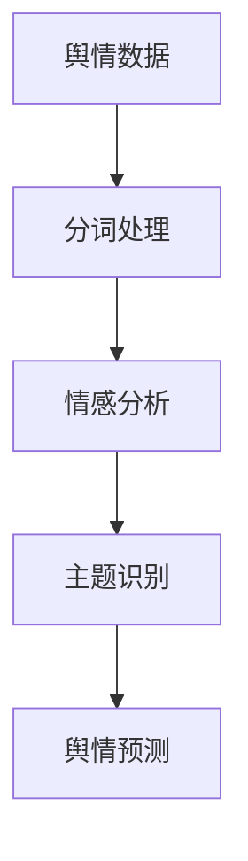
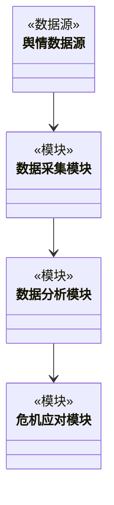
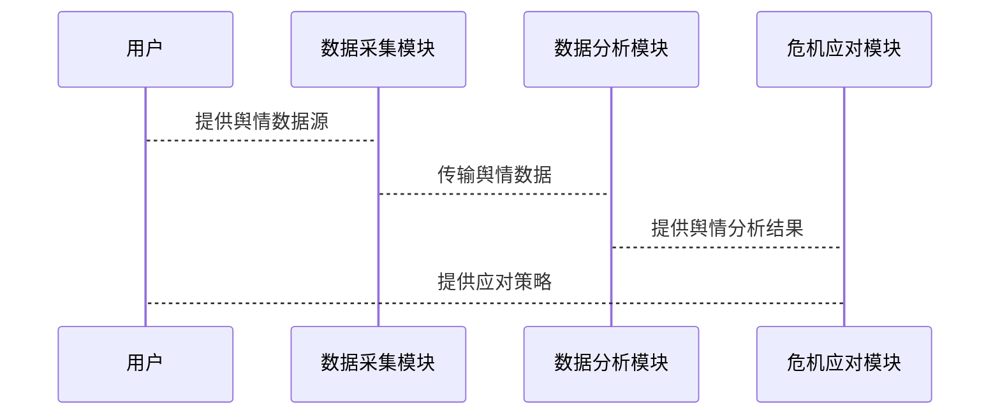

                 


# AI Agent在企业舆情监测与危机公关中的应用

## 关键词：AI Agent，舆情监测，危机公关，自然语言处理，机器学习，知识图谱

## 摘要：  
随着数字化时代的快速发展，企业面临的舆情风险日益复杂，传统的舆情监测手段已难以满足企业的需求。AI Agent（人工智能代理）作为一种智能工具，能够实时分析海量信息，快速识别潜在危机，并提供智能化的应对策略。本文将深入探讨AI Agent在企业舆情监测与危机公关中的应用，从技术原理到实际案例，全面解析其在提升企业危机管理能力中的价值。

---

# 第1章 AI Agent与企业舆情监测概述

## 1.1 企业舆情监测的核心概念

### 1.1.1 企业舆情监测的定义与范围  
企业舆情监测是指通过收集、分析和评估公众对企业及其产品、服务、品牌等的看法和态度，及时发现潜在的舆情风险，并采取相应措施进行管理和应对。舆情监测的核心在于“实时性”和“全面性”，覆盖社交媒体、新闻媒体、论坛社区等多种信息源。

### 1.1.2 AI Agent在舆情监测中的角色与优势  
AI Agent（人工智能代理）是一种能够自主执行任务的智能系统，其在舆情监测中的角色主要体现在以下几个方面：  
1. **实时信息处理**：AI Agent能够快速处理海量信息，识别关键词、情感倾向和主题。  
2. **智能预警**：通过机器学习算法，AI Agent可以预测舆情走势，提前发出危机预警。  
3. **自动化应对**：在发现负面舆情时，AI Agent可以自动触发危机公关流程，例如自动生成回应文本或协调相关部门采取行动。  

### 1.1.3 舆情监测的典型应用场景  
- **品牌声誉管理**：实时监测品牌关键词，发现负面评论并及时处理。  
- **产品发布监测**：在新产品发布后，实时跟踪市场反馈，快速调整营销策略。  
- **危机事件应对**：在突发事件中，快速识别舆论热点，制定应对方案。  

## 1.2 危机公关与AI Agent的结合

### 1.2.1 危机公关的基本概念与流程  
危机公关是指企业在面对负面舆情时，通过及时、有效的沟通和行动，降低危机对企业声誉的影响。典型的危机公关流程包括：  
1. **舆情预警**：发现潜在危机。  
2. **舆情分析**：识别危机的严重性和影响范围。  
3. **制定应对策略**：根据分析结果，制定公关方案。  
4. **执行与跟踪**：实施公关策略，并持续监测舆情变化。  

### 1.2.2 AI Agent在危机公关中的独特价值  
AI Agent通过自动化和智能化的手段，显著提升了危机公关的效率和效果：  
1. **快速响应**：AI Agent能够在短时间内分析海量信息，快速定位问题。  
2. **智能决策支持**：基于数据分析，AI Agent可以为公关团队提供最优的应对策略。  
3. **持续跟踪**：在危机发生后，AI Agent可以持续监测舆情变化，评估公关效果。  

### 1.2.3 舆情监测与危机公关的协同效应  
舆情监测为危机公关提供了数据支持，而危机公关则验证了舆情监测的有效性。两者的协同效应体现在：  
1. **数据闭环**：从舆情监测到危机公关，形成数据闭环，提升整体应对能力。  
2. **效率提升**：通过AI Agent的自动化处理，减少人工干预，提升整体效率。  

## 1.3 本章小结  
本章从企业舆情监测和危机公关的基本概念出发，详细介绍了AI Agent在其中的核心作用。通过分析舆情监测的典型应用场景和危机公关的流程，展示了AI Agent如何通过智能化手段提升企业的危机管理能力。

---

# 第2章 AI Agent的核心技术原理

## 2.1 自然语言处理（NLP）在舆情监测中的应用

### 2.1.1 NLP的基本概念与技术栈  
自然语言处理（NLP）是AI Agent的核心技术之一，其技术栈包括：  
- **分词**：将文本分割成词语或短语。  
- **词性标注**：为每个词语标注其词性（名词、动词、形容词等）。  
- **句法分析**：分析句子的语法结构。  
- **语义理解**：理解文本的深层含义。  

### 2.1.2 情感分析与主题识别的实现原理  
1. **情感分析**：通过训练好的模型，判断文本的情感倾向（正面、负面、中性）。  
2. **主题识别**：利用聚类算法，将相似的文本归为一类，识别舆情的主题。  

### 2.1.3 NLP在舆情监测中的具体应用案例  
例如，AI Agent可以通过NLP技术分析社交媒体上的评论，识别用户的满意度和情感倾向，帮助企业及时发现潜在的负面舆情。

## 2.2 机器学习与深度学习在AI Agent中的应用

### 2.2.1 机器学习的基本原理与算法简介  
机器学习是AI Agent的另一项核心技术，常用的算法包括：  
- **监督学习**：基于标注数据进行模型训练。  
- **无监督学习**：通过聚类等技术发现数据中的潜在模式。  
- **半监督学习**：结合监督学习和无监督学习的优势。  

### 2.2.2 深度学习在舆情分析中的优势  
深度学习通过多层神经网络，能够自动提取文本中的特征，显著提升了舆情分析的准确性和鲁棒性。  

### 2.2.3 基于深度学习的舆情预测模型  
例如，使用LSTM（长短期记忆网络）模型预测舆情的变化趋势，帮助企业提前制定应对策略。

## 2.3 知识图谱与语义理解

### 2.3.1 知识图谱的基本概念与构建方法  
知识图谱是一种将实体及其关系以图结构表示的技术，能够帮助AI Agent更好地理解文本的语义。  

### 2.3.2 语义理解在舆情分析中的应用  
通过语义理解技术，AI Agent能够识别文本中的实体、关系和意图，进一步提升舆情分析的准确性。  

### 2.3.3 知识图谱与AI Agent的结合  
例如，AI Agent可以通过知识图谱快速定位事件的关联信息，提供更全面的舆情分析结果。

## 2.4 本章小结  
本章详细介绍了AI Agent的核心技术，包括自然语言处理、机器学习和深度学习、知识图谱等。这些技术共同构成了AI Agent的强大能力，使其能够高效地进行舆情监测和危机公关。

---

# 第3章 AI Agent的算法原理与数学模型

## 3.1 情感分析算法

### 3.1.1 基于规则的情感分析  
基于规则的情感分析通过预设的规则库判断文本的情感倾向，适用于简单场景。  

### 3.1.2 基于机器学习的情感分析  
基于机器学习的情感分析通过训练好的模型自动识别情感倾向，准确率更高。  

### 3.1.3 基于深度学习的情感分析  
基于深度学习的情感分析（如LSTM）能够捕捉文本的情感变化，适用于复杂场景。  

## 3.2 主题识别与聚类算法

### 3.2.1 主题识别的基本原理  
主题识别通过聚类算法将相似的文本归为一类，识别舆情的主题。  

### 3.2.2 基于聚类的舆情主题挖掘  
例如，使用K-means算法对社交媒体上的评论进行聚类，识别出主要的舆情主题。  

### 3.2.3 主题识别的优化方法  
通过优化聚类算法的参数和特征选择，提升主题识别的准确性和鲁棒性。  

## 3.3 舆情预测模型

### 3.3.1 时间序列分析与舆情预测  
时间序列分析是一种常用的舆情预测方法，适用于具有时间依赖性的数据。  

### 3.3.2 基于机器学习的舆情预测模型  
例如，使用随机森林算法预测舆情的变化趋势。  

### 3.3.3 深度学习在舆情预测中的应用  
基于深度学习的舆情预测模型（如LSTM）能够捕捉数据的时序特征，预测能力更强。  

## 3.4 算法流程图（Mermaid）  
以下是一个舆情分析算法的流程图：



---

# 第4章 系统设计与架构方案

## 4.1 项目介绍  
本项目旨在开发一个基于AI Agent的企业舆情监测与危机公关系统，帮助企业在复杂环境下快速应对舆情风险。  

## 4.2 系统功能设计  
### 4.2.1 领域模型（Mermaid类图）  


### 4.2.2 系统架构设计（Mermaid架构图）  
```mermaid
container 舆情监测系统 {
  数据采集模块
  数据分析模块
  危机应对模块
}
```

### 4.2.3 系统接口设计  
系统接口包括：  
1. 数据采集接口：从社交媒体、新闻媒体等数据源获取舆情数据。  
2. 数据分析接口：接收舆情数据，进行情感分析和主题识别。  
3. 危机应对接口：根据分析结果，触发危机公关流程。  

### 4.2.4 系统交互流程（Mermaid序列图）  


## 4.3 本章小结  
本章从系统设计的角度，详细介绍了基于AI Agent的舆情监测与危机公关系统的架构和功能设计，为后续的实现提供了理论基础。

---

# 第5章 项目实战：基于AI Agent的舆情监测系统实现

## 5.1 环境安装与配置  

### 5.1.1 Python环境安装  
安装Python 3.x及以上版本，并安装必要的库（如`jieba`、`pandas`、`scikit-learn`、`tensorflow`等）。  

### 5.1.2 数据源获取  
从社交媒体API（如Twitter API）获取舆情数据，或使用公开数据集。  

## 5.2 系统核心实现源代码  

### 5.2.1 数据采集模块  
```python
import requests
from bs4 import BeautifulSoup

def fetch_data(url):
    response = requests.get(url)
    soup = BeautifulSoup(response.text, 'html.parser')
    return [text for text in soup.stripped_strings]
```

### 5.2.2 数据分析模块  
```python
from sklearn.feature_extraction.text import TfidfVectorizer
from sklearn.cluster import KMeans

def analyze_data(texts):
    vectorizer = TfidfVectorizer()
    tfidf = vectorizer.fit_transform(texts)
    km = KMeans(n_clusters=5)
    km.fit(tfidf)
    return km.labels_
```

### 5.2.3 危机应对模块  
```python
from transformers import pipeline

def generate_response(text):
    classifier = pipeline("sentiment-analysis")
    sentiment = classifier(text)[0]['label']
    if sentiment == 'negative':
        return "我们正在关注您的反馈，感谢您的支持！"
    else:
        return "感谢您的正面评价，我们会继续努力！"
```

## 5.3 实际案例分析与代码解读  

### 5.3.1 案例背景  
某企业发现社交媒体上出现大量负面评论，希望通过AI Agent快速识别问题并生成回应。  

### 5.3.2 代码实现  
```python
texts = ["产品有缺陷，非常失望！", "服务态度差，不会再光顾！"]
labels = analyze_data(texts)
for i, label in enumerate(labels):
    print(f"文本{i+1}的类别是：{label}")
response = generate_response(texts[0])
print("生成的回应是：", response)
```

### 5.3.3 分析与总结  
通过上述代码，AI Agent能够快速识别负面评论，并生成相应的回应，帮助企业及时应对危机。  

## 5.4 本章小结  
本章通过实际案例，详细讲解了基于AI Agent的舆情监测系统的实现过程，展示了AI Agent在企业危机公关中的强大能力。

---

# 第6章 最佳实践与未来展望

## 6.1 最佳实践  

### 6.1.1 数据质量管理  
确保数据的准确性和完整性，是提升AI Agent性能的关键。  

### 6.1.2 模型优化与调优  
通过不断优化算法和调整模型参数，提升舆情分析的准确性和效率。  

### 6.1.3 数据隐私与安全  
在处理舆情数据时，必须严格遵守数据隐私法规，保护用户信息的安全。  

## 6.2 小结  
AI Agent的应用为企业舆情监测与危机公关带来了前所未有的便利和效率。通过智能化的手段，企业能够更好地应对舆情风险，维护品牌形象。  

## 6.3 注意事项  

### 6.3.1 数据泛化能力  
AI Agent的模型需要具备良好的泛化能力，能够应对各种复杂的舆情场景。  

### 6.3.2 模型可解释性  
在危机公关中，模型的可解释性非常重要，能够帮助公关团队快速理解AI的决策依据。  

### 6.3.3 人工干预的重要性  
虽然AI Agent能够自动化处理舆情，但在关键时刻，仍需要人工干预以确保应对策略的合理性。  

## 6.4 拓展阅读  

### 6.4.1 推荐书籍  
1. 《深度学习实战》  
2. 《自然语言处理入门》  

### 6.4.2 推荐博客与资源  
1. [AI Agent技术博客](https://example.com)  
2. [机器学习实战资源](https://example.com)  

---

# 结语  
AI Agent作为人工智能领域的前沿技术，正在为企业舆情监测与危机公关带来革命性的变化。通过智能化的手段，企业能够更快速、更精准地应对舆情风险，维护品牌形象。未来，随着技术的不断进步，AI Agent将在企业危机管理中发挥更大的作用。

---

# 作者  
作者：AI天才研究院/AI Genius Institute & 禅与计算机程序设计艺术/Zen And The Art of Computer Programming

