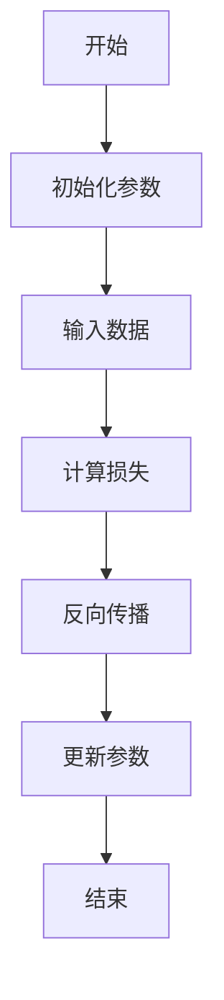
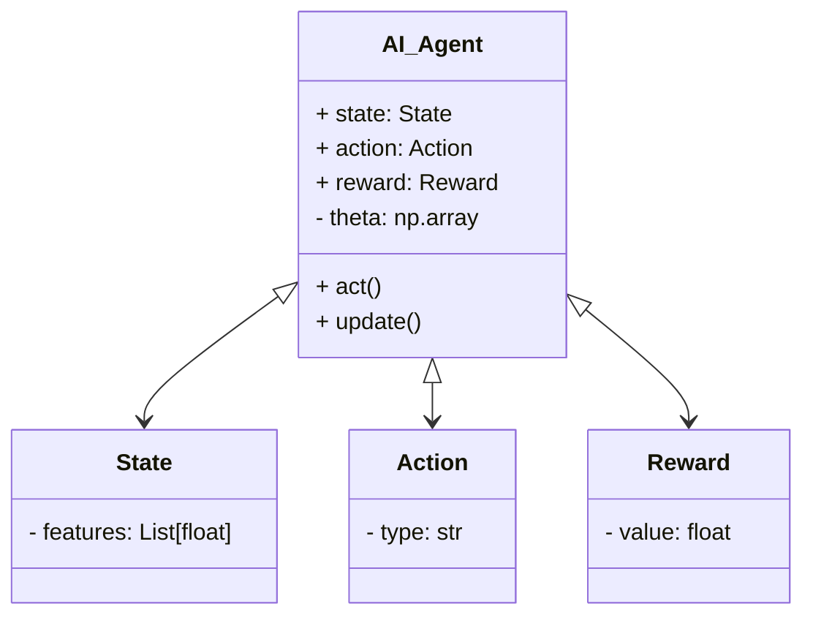
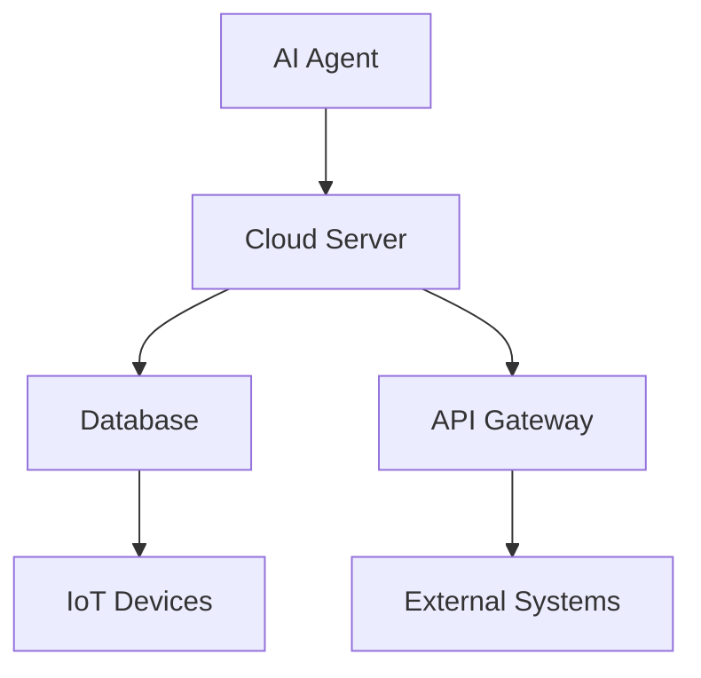
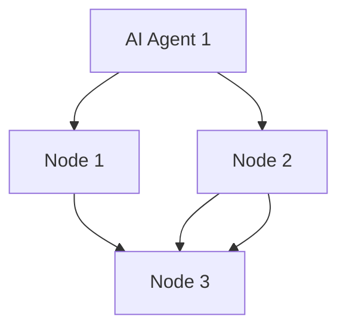
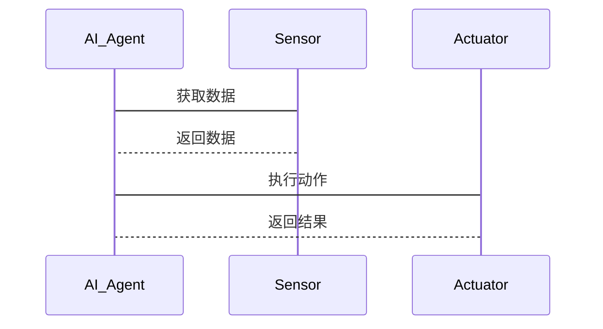

                 


# AI Agent在智能工厂管理中的全面应用策略

> 关键词：AI Agent，智能工厂，生产优化，质量控制，设备维护，供应链管理

> 摘要：本文将深入探讨AI Agent在智能工厂管理中的全面应用策略，涵盖AI Agent的核心原理、应用场景、算法实现、系统架构设计以及项目实战。通过详细的技术分析和实际案例，我们将展示如何利用AI Agent提升智能工厂的生产效率、优化资源利用、实现智能化决策，并为读者提供切实可行的实施建议。

---

# 第1章: AI Agent与智能工厂概述

## 1.1 AI Agent的基本概念

### 1.1.1 什么是AI Agent

AI Agent（人工智能代理）是一种能够感知环境、自主决策并执行任务的智能实体。它能够根据接收到的信息，通过内部算法和知识库进行推理，生成最优的行动方案，并通过执行机构完成任务。AI Agent可以是软件程序，也可以是与物理设备结合的系统。

### 1.1.2 AI Agent的核心特征

- **自主性**：能够在没有外部干预的情况下独立运行。
- **反应性**：能够实时感知环境变化并做出反应。
- **目标导向**：具有明确的目标，并通过行动逐步接近目标。
- **学习能力**：能够通过经验改进自身的决策能力。

### 1.1.3 AI Agent与传统自动化系统的区别

传统自动化系统基于固定的程序运行，无法适应环境变化。而AI Agent能够通过学习和推理，动态调整自己的行为，适应不同的生产场景。

---

## 1.2 智能工厂的基本概念

### 1.2.1 智能工厂的定义

智能工厂是通过物联网、大数据、人工智能等技术，实现生产过程的智能化、数字化和自动化管理的现代化工厂。智能工厂的核心目标是提高生产效率、降低成本、优化资源利用。

### 1.2.2 智能工厂的关键技术

- **物联网技术**：实现设备、物料、人员之间的实时连接和通信。
- **大数据分析**：通过对海量数据的分析，优化生产流程和资源分配。
- **人工智能技术**：通过AI算法实现智能化决策和自主优化。

### 1.2.3 智能工厂的发展历程

从最初的机械化生产，到自动化生产，再到智能化生产，智能工厂经历了从简单到复杂，从局部优化到全局优化的发展过程。

---

## 1.3 AI Agent在智能工厂中的作用

### 1.3.1 提高生产效率

AI Agent可以通过优化生产调度、资源分配，减少生产过程中的浪费，从而提高生产效率。

### 1.3.2 优化资源利用

AI Agent能够通过预测需求、优化库存管理，降低资源浪费，提高资源利用率。

### 1.3.3 实现智能化决策

AI Agent能够通过实时数据分析，快速做出最优决策，帮助工厂实现智能化管理。

---

## 1.4 本章小结

本章介绍了AI Agent的基本概念和核心特征，以及智能工厂的定义和发展历程。通过对比AI Agent与传统自动化系统的区别，我们明确了AI Agent在智能工厂中的独特价值和作用。

---

# 第2章: AI Agent的核心原理与技术

## 2.1 AI Agent的核心原理

### 2.1.1 知识表示与推理

知识表示是AI Agent进行推理的基础。常用的表示方法包括语义网络、逻辑推理等。AI Agent通过知识表示，能够理解环境中的信息，并进行逻辑推理。

### 2.1.2 感知与交互

AI Agent通过传感器、摄像头等设备感知环境信息，并通过自然语言处理技术与人类进行交互。感知和交互能力是AI Agent实现智能化决策的关键。

### 2.1.3 决策与执行

AI Agent根据感知到的信息和内部知识库，通过算法进行决策，并通过执行机构完成任务。决策和执行过程需要考虑环境约束和目标优化。

---

## 2.2 AI Agent的关键技术

### 2.2.1 机器学习算法

机器学习算法是AI Agent的核心技术之一。通过监督学习、无监督学习和强化学习，AI Agent能够从数据中学习，不断提升自身的决策能力。

### 2.2.2 自然语言处理

自然语言处理技术使AI Agent能够理解和生成人类语言，实现与人类的自然交互。

### 2.2.3 计算机视觉

计算机视觉技术使AI Agent能够通过图像识别、视频分析等方式，感知环境中的视觉信息。

---

## 2.3 AI Agent的实现架构

### 2.3.1 分层架构

分层架构将AI Agent的功能划分为多个层次，每一层负责特定的任务。例如，感知层负责数据采集，决策层负责策略制定。

### 2.3.2 分布式架构

分布式架构将AI Agent的功能分散到不同的节点，通过通信协议实现各节点之间的协同工作。

### 2.3.3 基于云的架构

基于云的架构利用云计算资源，实现AI Agent的高可用性和扩展性。通过云平台，AI Agent可以轻松扩展计算能力。

---

## 2.4 本章小结

本章详细介绍了AI Agent的核心原理和关键技术，包括知识表示与推理、感知与交互、决策与执行。同时，我们还探讨了AI Agent的实现架构，为后续章节的应用场景分析奠定了基础。

---

# 第3章: AI Agent在智能工厂中的应用场景

## 3.1 生产过程优化

### 3.1.1 生产调度优化

AI Agent可以通过预测需求和优化排产计划，提高生产效率。例如，通过强化学习算法，AI Agent可以动态调整生产顺序，避免资源浪费。

### 3.1.2 资源分配优化

AI Agent可以通过优化资源配置，提高生产效率。例如，通过机器学习算法，AI Agent可以预测设备利用率，并动态调整设备分配。

### 3.1.3 生产流程优化

AI Agent可以通过分析生产流程中的瓶颈，提出优化建议。例如，通过计算机视觉技术，AI Agent可以实时监控生产过程，发现潜在问题。

---

## 3.2 质量控制与预测

### 3.2.1 实时质量监控

AI Agent可以通过传感器和摄像头实时监控生产过程中的产品质量。例如，通过计算机视觉技术，AI Agent可以自动检测产品缺陷。

### 3.2.2 缺陷预测与分析

AI Agent可以通过历史数据和机器学习算法，预测潜在的质量问题。例如，通过监督学习算法，AI Agent可以分析历史缺陷数据，预测未来可能出现的缺陷。

### 3.2.3 质量改进方案

AI Agent可以根据质量分析结果，提出改进方案。例如，通过优化算法，AI Agent可以建议调整生产参数，提高产品质量。

---

## 3.3 物流与供应链管理

### 3.3.1 智能仓储管理

AI Agent可以通过优化库存管理和仓储布局，提高物流效率。例如，通过强化学习算法，AI Agent可以动态调整库存量，避免库存积压。

### 3.3.2 自动化物流配送

AI Agent可以通过协调无人车和无人机，实现物流配送的自动化。例如，通过路径规划算法，AI Agent可以优化配送路径，降低物流成本。

### 3.3.3 供应链优化

AI Agent可以通过分析供应链数据，优化供应链管理。例如，通过机器学习算法，AI Agent可以预测供应链中的潜在风险，并提出应对方案。

---

## 3.4 设备维护与预测

### 3.4.1 设备状态监测

AI Agent可以通过传感器实时监测设备运行状态。例如，通过时间序列分析算法，AI Agent可以预测设备的健康状态。

### 3.4.2 故障预测与诊断

AI Agent可以通过分析设备运行数据，预测设备故障。例如，通过无监督学习算法，AI Agent可以发现设备运行中的异常模式，并进行故障诊断。

### 3.4.3 维护计划优化

AI Agent可以根据设备运行状态，优化维护计划。例如，通过强化学习算法，AI Agent可以动态调整维护周期，降低维护成本。

---

## 3.5 本章小结

本章详细探讨了AI Agent在智能工厂中的多个应用场景，包括生产过程优化、质量控制与预测、物流与供应链管理以及设备维护与预测。通过这些应用场景的分析，我们展示了AI Agent在智能工厂管理中的巨大潜力。

---

# 第4章: AI Agent的算法原理与实现

## 4.1 算法原理

### 4.1.1 强化学习

强化学习是一种通过试错机制优化决策的算法。AI Agent通过与环境交互，不断优化自己的策略，以获得最大化的累计奖励。

### 4.1.2 监督学习

监督学习是一种基于标注数据进行学习的算法。AI Agent通过学习大量的标注数据，逐步优化自己的预测能力。

### 4.1.3 无监督学习

无监督学习是一种基于无标注数据进行学习的算法。AI Agent通过发现数据中的潜在结构，优化自己的决策能力。

---

## 4.2 算法实现

### 4.2.1 算法流程图



### 4.2.2 代码实现

以下是一个简单的强化学习算法实现示例：

```python
import numpy as np

class AI_Agent:
    def __init__(self, state_dim, action_dim):
        self.state_dim = state_dim
        self.action_dim = action_dim
        self.theta = np.random.randn(state_dim, action_dim)
    
    def act(self, state):
        return np.dot(state, self.theta).argmax()
    
    def update(self, state, action, reward):
        # 简单的梯度下降更新
        self.theta -= 0.1 * (state - self.theta.dot(state)).T.dot(action - np.mean(action))
```

### 4.2.3 算法优化

通过使用更高效的优化算法（如Adam优化器）和增加训练数据量，可以显著提高AI Agent的性能。

---

## 4.3 算法在智能工厂中的应用案例

### 4.3.1 生产调度优化案例

通过强化学习算法，AI Agent可以动态调整生产顺序，提高生产效率。例如，AI Agent可以根据实时需求和设备状态，优化生产调度。

### 4.3.2 设备故障预测案例

通过无监督学习算法，AI Agent可以分析设备运行数据，发现异常模式，并进行故障预测。例如，AI Agent可以通过聚类分析，识别设备运行中的异常状态。

### 4.3.3 质量控制案例

通过监督学习算法，AI Agent可以学习历史缺陷数据，优化质量控制策略。例如，AI Agent可以通过训练分类模型，自动检测产品质量。

---

## 4.4 本章小结

本章详细介绍了AI Agent的核心算法原理，并通过具体的代码实现和应用案例，展示了如何将这些算法应用于智能工厂的管理中。

---

# 第5章: AI Agent的数学模型与公式

## 5.1 数学模型概述

### 5.1.1 状态空间模型

状态空间模型描述了AI Agent所处的环境状态。状态空间可以通过向量表示，例如：

$$
s = (s_1, s_2, \dots, s_n)
$$

其中，$s_i$ 表示第$i$个状态变量。

### 5.1.2 动作空间模型

动作空间模型描述了AI Agent可以执行的动作。动作空间可以通过集合表示，例如：

$$
a \in \{a_1, a_2, \dots, a_m\}
$$

其中，$a_j$ 表示第$j$个动作。

### 5.1.3 奖励函数模型

奖励函数模型描述了AI Agent在执行动作后的奖励值。奖励函数可以表示为：

$$
r: S \times A \rightarrow \mathbb{R}
$$

其中，$S$是状态空间，$A$是动作空间。

---

## 5.2 关键公式

### 5.2.1 状态转移概率公式

状态转移概率公式描述了从当前状态转移到下一个状态的概率：

$$
P(s' | s, a) = \text{概率从状态}s$转移到状态$s'$在执行动作$a$
$$

### 5.2.2 奖励函数公式

奖励函数公式描述了在状态$s$和动作$a$下获得的奖励：

$$
r(s, a) = \text{奖励值}
$$

### 5.2.3 动作选择概率公式

动作选择概率公式描述了在状态$s$下选择动作$a$的概率：

$$
\pi(a | s) = \text{选择动作}$a$在状态$s$的概率
$$

---

## 5.3 数学模型的实现

通过数学模型的实现，我们可以量化AI Agent的决策过程，并为算法优化提供理论依据。例如，通过建立状态转移矩阵和奖励函数，我们可以模拟AI Agent在不同场景下的行为。

---

## 5.4 本章小结

本章通过数学模型和公式，详细分析了AI Agent的决策过程。这些模型和公式为后续的算法实现和应用提供了理论支持。

---

# 第6章: AI Agent的系统架构设计

## 6.1 系统功能设计

### 6.1.1 领域模型



### 6.1.2 功能模块

AI Agent系统主要包括感知模块、决策模块和执行模块。感知模块负责数据采集，决策模块负责策略制定，执行模块负责任务执行。

---

## 6.2 系统架构设计

### 6.2.1 基于云的架构



### 6.2.2 分布式架构



---

## 6.3 系统接口设计

### 6.3.1 API接口

AI Agent通过API接口与外部系统进行通信。例如，AI Agent可以通过REST API接收传感器数据，并通过API发送控制指令。

### 6.3.2 交互协议

AI Agent通过HTTP、MQTT等协议与物联网设备进行通信。例如，AI Agent可以通过MQTT协议订阅设备状态，并发布控制指令。

---

## 6.4 系统交互设计

### 6.4.1 交互流程

1. AI Agent接收传感器数据。
2. AI Agent通过算法分析数据，生成决策。
3. AI Agent通过执行机构执行决策。
4. 循环重复，直到达到目标。

### 6.4.2 交互序列图



---

## 6.5 本章小结

本章详细介绍了AI Agent的系统架构设计，包括功能模块、架构类型、接口设计和交互流程。通过这些设计，我们可以实现一个高效、可靠的AI Agent系统。

---

# 第7章: AI Agent的项目实战

## 7.1 环境安装

为了实现AI Agent，我们需要安装以下环境：

- Python 3.6+
- NumPy
- TensorFlow
- OpenCV
- MQTT客户端

---

## 7.2 核心实现

### 7.2.1 知识表示与推理

```python
class Knowledge:
    def __init__(self):
        self.rules = []
    
    def add_rule(self, condition, action):
        self.rules.append((condition, action))
    
    def infer(self, facts):
        for condition, action in self.rules:
            if all(fact in facts for fact in condition):
                return action
        return None
```

### 7.2.2 感知与交互

```python
import mqtt

class Perception:
    def __init__(self, broker):
        self.broker = broker
        self.client = mqtt.Client()
        self.client.connect(broker)
    
    def receive_data(self, topic):
        self.client.subscribe(topic)
        message = self.client.recv_message(topic)
        return message
```

### 7.2.3 决策与执行

```python
class Decision:
    def __init__(self, model):
        self.model = model
    
    def decide(self, state):
        action = self.model.act(state)
        return action
```

---

## 7.3 应用案例

### 7.3.1 生产调度优化

通过AI Agent实现生产调度优化，我们可以显著提高生产效率。例如，AI Agent可以通过强化学习算法，动态调整生产顺序，避免资源浪费。

### 7.3.2 设备故障预测

通过AI Agent实现设备故障预测，我们可以降低设备维护成本。例如，AI Agent可以通过无监督学习算法，分析设备运行数据，预测潜在故障。

---

## 7.4 本章小结

本章通过具体的项目实战，展示了如何实现AI Agent的各个功能模块。通过实际案例，我们验证了AI Agent在智能工厂管理中的巨大潜力。

---

# 第8章: 总结与展望

## 8.1 总结

通过本文的详细分析，我们了解了AI Agent在智能工厂管理中的核心原理、应用场景、算法实现和系统架构设计。AI Agent通过优化生产调度、质量控制、物流管理和设备维护，显著提高了智能工厂的生产效率和资源利用率。

---

## 8.2 未来展望

随着人工智能技术的不断发展，AI Agent在智能工厂管理中的应用将更加广泛和深入。未来，我们可以期待更多的技术创新，例如更高效的算法、更智能的设备和更完善的系统架构。这些创新将推动智能工厂向更高层次发展。

---

# 作者：AI天才研究院 & 禅与计算机程序设计艺术

---

**本文遵循创作共同原则，转载请注明出处。**

