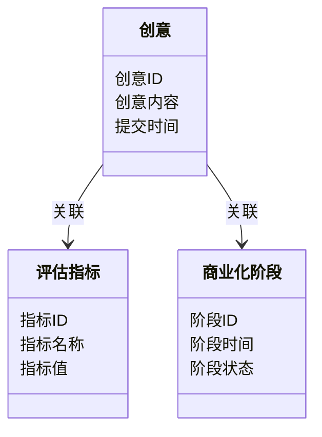
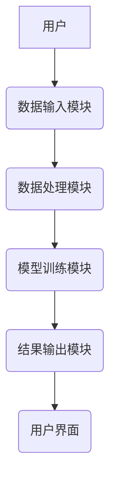
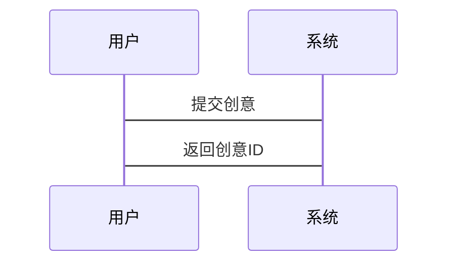
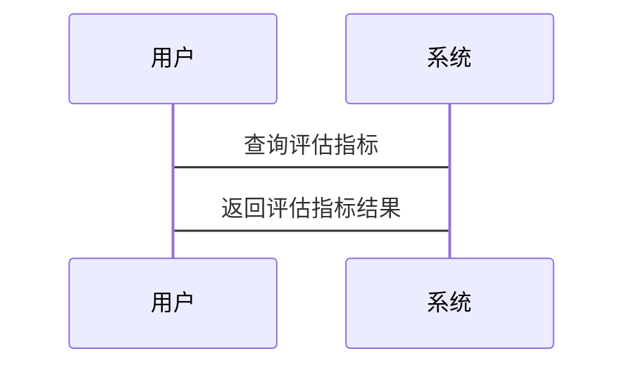

                 


# AI驱动的企业创新管理：从创意评估到商业化追踪

> 关键词：AI，企业创新管理，创意评估，商业化追踪，机器学习，深度学习，系统架构

> 摘要：本文深入探讨了AI技术如何驱动企业创新管理，从创意评估到商业化追踪的全过程。通过分析创意评估和商业化追踪的核心概念、算法原理、系统架构以及实际案例，本文为企业创新管理提供了全新的视角和解决方案。结合数学模型、算法实现和系统设计，本文详细解读了AI在企业创新管理中的应用，为企业的数字化转型提供了有力支持。

---

# 第1章: AI驱动的企业创新管理概述

## 1.1 企业创新管理的背景与挑战

### 1.1.1 传统企业创新管理的局限性

企业创新管理是企业在竞争激烈的市场环境中保持活力和增长的关键。然而，传统的企业创新管理存在以下主要问题：

- **信息孤岛**：各部门之间的数据无法有效整合，导致创新资源的浪费。
- **评估主观性**：创意的评估往往依赖主观判断，缺乏客观依据。
- **效率低下**：从创意到商业化的流程复杂且耗时，难以快速响应市场变化。

### 1.1.2 AI技术对企业创新管理的赋能

随着AI技术的快速发展，企业创新管理迎来了新的机遇。AI可以通过以下方式赋能企业创新管理：

- **数据驱动决策**：利用AI分析大量数据，提供客观的创意评估和商业化建议。
- **自动化流程优化**：AI可以自动化处理创意筛选、市场分析等流程，提高效率。
- **实时反馈与调整**：AI能够实时监控市场变化，提供动态反馈，帮助企业快速调整策略。

### 1.1.3 企业创新管理的数字化转型

企业创新管理的数字化转型是必然趋势。通过数字化工具和AI技术，企业可以实现创新过程的全链条管理，从创意生成、评估、实施到商业化追踪，每一步都更加高效和精准。

---

## 1.2 AI驱动的企业创新管理的核心概念

### 1.2.1 创意评估的定义与目标

创意评估是企业创新管理的第一步，其目标是筛选出具有市场潜力和可行性的创意。AI可以通过分析创意的市场适应性、技术可行性和经济可行性，提供客观的评估结果。

### 1.2.2 商业化追踪的定义与作用

商业化追踪是指在创意实施过程中，实时监控其市场表现和经济效益。AI可以帮助企业预测市场趋势、优化资源配置，并根据实时数据调整商业策略。

### 1.2.3 AI在创新管理中的应用场景

AI在创新管理中的应用场景广泛，包括：

- **创意生成**：通过AI生成创意灵感。
- **创意筛选**：利用AI筛选出高潜力创意。
- **市场预测**：基于AI的市场分析预测创意的商业化潜力。
- **风险评估**：AI帮助评估创意实施过程中的风险。

---

## 1.3 本书的结构与内容概述

### 1.3.1 本书的核心主题

本书的核心主题是探讨AI如何驱动企业创新管理，从创意评估到商业化追踪的全过程。通过理论分析和实际案例，本书将展示AI在企业创新管理中的巨大潜力。

### 1.3.2 各章节内容的逻辑关系

- 第1章：介绍AI驱动企业创新管理的背景和核心概念。
- 第2章：详细讲解创意评估和商业化追踪的核心概念。
- 第3章：分析AI驱动创新管理的算法原理。
- 第4章：探讨创意评估与商业化追踪的数学模型。
- 第5章：系统分析与架构设计。
- 第6章：项目实战与案例分析。
- 第7章：总结最佳实践。

### 1.3.3 读者对象与学习目标

读者对象包括企业管理人员、技术创新人员、AI工程师以及对创新管理感兴趣的研究者。通过本书，读者可以掌握AI在企业创新管理中的应用方法，并能够实际操作相关技术。

---

# 第2章: AI驱动的企业创新管理的核心概念

## 2.1 创意评估的AI实现

### 2.1.1 创意评估的流程与关键点

创意评估的流程包括创意收集、初步筛选、深度评估和最终决策。关键点在于如何利用AI技术提高评估的客观性和效率。

### 2.1.2 基于AI的创意评估模型

基于AI的创意评估模型通常包括以下步骤：

1. **数据收集**：收集创意相关的市场数据、技术数据和经济数据。
2. **特征提取**：提取创意的关键特征，如市场潜力、技术可行性和经济可行性。
3. **模型训练**：使用机器学习模型对创意进行分类或回归分析。
4. **结果输出**：输出创意的评估结果，包括优缺点和建议。

### 2.1.3 创意评估的特征提取与分类

创意评估的特征提取可以通过自然语言处理（NLP）技术从创意文本中提取关键词和主题。分类模型可以使用决策树、随机森林等算法，将创意分为高潜力、中潜力和低潜力三类。

---

## 2.2 商业化追踪的AI实现

### 2.2.1 商业化追踪的流程与关键点

商业化追踪的流程包括市场监控、数据采集、数据分析和策略调整。关键点在于如何利用AI实时监控市场变化，并根据数据调整商业策略。

### 2.2.2 基于AI的商业化追踪模型

商业化追踪模型通常包括以下步骤：

1. **数据收集**：收集市场数据、销售数据和用户反馈。
2. **特征提取**：提取市场趋势、用户行为和产品性能的特征。
3. **模型训练**：使用时间序列分析或深度学习模型预测市场趋势。
4. **结果输出**：输出商业化追踪结果，并提供优化建议。

### 2.2.3 商业化追踪的特征提取与预测

商业化追踪的特征提取可以通过统计方法和NLP技术从文本数据中提取关键特征。预测模型可以使用LSTM或ARIMA等算法，预测未来的市场趋势。

---

## 2.3 创意评估与商业化追踪的关联

### 2.3.1 创意评估对商业化的影响

创意评估的结果直接影响商业化的方向和策略。高潜力创意更容易成功商业化，而低潜力创意则需要进一步优化或放弃。

### 2.3.2 商业化追踪对创新管理的反馈作用

商业化追踪的结果可以为创新管理提供反馈，帮助企业调整创新策略。成功的商业化经验可以为未来的创意评估提供参考，而失败的案例则可以帮助企业识别潜在风险。

### 2.3.3 AI在创意评估与商业化追踪中的协同作用

AI可以通过协同创意评估和商业化追踪，实现创新管理的闭环。创意评估提供高潜力创意，商业化追踪提供实时反馈，两者结合可以优化创新过程，提高创新成功的概率。

---

# 第3章: AI驱动的企业创新管理的算法原理

## 3.1 创意评估的算法原理

### 3.1.1 基于机器学习的创意评估模型

基于机器学习的创意评估模型通常包括以下步骤：

1. **数据预处理**：清洗和转换数据，提取特征。
2. **模型选择**：选择适合的分类算法，如决策树、随机森林。
3. **模型训练**：使用训练数据训练模型。
4. **模型评估**：通过交叉验证评估模型性能。
5. **结果解释**：解释模型的输出结果。

### 3.1.2 基于深度学习的创意评估模型

基于深度学习的创意评估模型通常包括以下步骤：

1. **数据预处理**：清洗和转换数据，提取特征。
2. **模型选择**：选择适合的深度学习模型，如LSTM、Transformer。
3. **模型训练**：使用训练数据训练模型。
4. **模型评估**：通过测试数据评估模型性能。
5. **结果解释**：解释模型的输出结果。

### 3.1.3 创意评估的特征工程与模型选择

特征工程是创意评估的关键步骤。常用的特征提取方法包括主成分分析（PCA）和因子分析。模型选择需要根据数据特点和任务目标进行，常用的方法包括网格搜索和交叉验证。

---

## 3.2 商业化追踪的算法原理

### 3.2.1 基于机器学习的商业化追踪模型

基于机器学习的商业化追踪模型通常包括以下步骤：

1. **数据预处理**：清洗和转换数据，提取特征。
2. **模型选择**：选择适合的回归算法，如线性回归、支持向量回归。
3. **模型训练**：使用训练数据训练模型。
4. **模型评估**：通过交叉验证评估模型性能。
5. **结果解释**：解释模型的输出结果。

### 3.2.2 基于深度学习的商业化追踪模型

基于深度学习的商业化追踪模型通常包括以下步骤：

1. **数据预处理**：清洗和转换数据，提取特征。
2. **模型选择**：选择适合的深度学习模型，如LSTM、Transformer。
3. **模型训练**：使用训练数据训练模型。
4. **模型评估**：通过测试数据评估模型性能。
5. **结果解释**：解释模型的输出结果。

### 3.2.3 商业化追踪的特征工程与模型选择

特征工程是商业化追踪的关键步骤。常用的特征提取方法包括主成分分析（PCA）和因子分析。模型选择需要根据数据特点和任务目标进行，常用的方法包括网格搜索和交叉验证。

---

## 3.3 创意评估与商业化追踪的联合建模

### 3.3.1 联合建模的必要性与优势

联合建模的必要性在于创意评估和商业化追踪是创新管理的两个重要环节，只有将两者结合起来，才能实现创新管理的闭环。联合建模的优势在于可以提高模型的准确性和实用性。

### 3.3.2 联合建模的实现方法与挑战

联合建模的实现方法包括集成学习、多任务学习和迁移学习。挑战在于如何处理数据的异构性和模型的复杂性。

### 3.3.3 联合建模的优化策略与应用案例

联合建模的优化策略包括数据预处理、模型调优和结果解释。应用案例包括科技公司的创新项目，展示了AI在创意评估和商业化追踪中的实际应用。

---

# 第4章: 创意评估与商业化追踪的数学模型与公式

## 4.1 创意评估的数学模型

### 4.1.1 创意评估的分类模型

常用的分类模型包括逻辑回归、决策树和随机森林。逻辑回归的损失函数为：

$$
L = -\frac{1}{m}\sum_{i=1}^{m} [y_i \ln(\sigma(w^T x_i + b)) + (1-y_i)\ln(1-\sigma(w^T x_i + b))]
$$

其中，$\sigma$ 是sigmoid函数，$w$ 是权重向量，$x_i$ 是输入样本，$b$ 是偏置。

### 4.1.2 创意评估的回归模型

常用的回归模型包括线性回归和Lasso回归。线性回归的损失函数为：

$$
L = \frac{1}{2m}\sum_{i=1}^{m} (y_i - w^T x_i - b)^2
$$

### 4.1.3 创意评估的特征权重计算公式

特征权重可以通过LASSO回归计算，公式为：

$$
\text{特征权重} = \frac{\sum_{i=1}^{n} w_i \cdot x_i}{\sum_{i=1}^{n} 
$$

---

## 4.2 商业化追踪的数学模型

### 4.2.1 商业化追踪的分类模型

常用的分类模型包括逻辑回归、决策树和随机森林。逻辑回归的损失函数与创意评估相同。

### 4.2.2 商业化追踪的回归模型

常用的回归模型包括线性回归和Lasso回归。线性回归的损失函数与创意评估相同。

### 4.2.3 商业化追踪的特征权重计算公式

特征权重可以通过LASSO回归计算，公式与创意评估相同。

---

## 4.3 创意评估与商业化追踪的联合建模

### 4.3.1 联合建模的数学模型

联合建模可以使用集成学习方法，如Stacking和Blending。Stacking的损失函数为：

$$
L = \sum_{i=1}^{m} (y_i - f_1(f_2(x_i)))^2
$$

其中，$f_1$ 和 $f_2$ 分别是两个基模型。

### 4.3.2 联合建模的优化策略

优化策略包括参数调优和模型融合。参数调优可以通过网格搜索实现，模型融合可以通过投票法或加权法实现。

---

# 第5章: 系统分析与架构设计

## 5.1 系统功能设计

### 5.1.1 领域模型设计

领域模型的类图如图1所示：



### 5.1.2 系统架构设计

系统架构设计如图2所示：



### 5.1.3 系统接口设计

系统接口包括创意提交接口、评估指标查询接口和商业化阶段监控接口。接口设计采用RESTful API风格。

---

## 5.2 系统交互设计

### 5.2.1 创意提交流程

创意提交流程如图3所示：



### 5.2.2 评估指标查询流程

评估指标查询流程如图4所示：



---

## 5.3 系统性能优化

### 5.3.1 数据存储优化

数据存储采用分布式存储和压缩技术，提高存储效率。

### 5.3.2 计算效率优化

计算效率优化包括并行计算和缓存优化。

---

# 第6章: 项目实战

## 6.1 环境安装与配置

### 6.1.1 安装Python和相关库

安装Python和以下库：

- `numpy`
- `pandas`
- `scikit-learn`
- `tensorflow`

安装命令：

```bash
pip install numpy pandas scikit-learn tensorflow
```

### 6.1.2 安装Jupyter Notebook

安装Jupyter Notebook：

```bash
pip install jupyter
```

---

## 6.2 系统核心实现

### 6.2.1 创意评估模型实现

创意评估模型实现代码：

```python
import numpy as np
import pandas as pd
from sklearn.model_selection import train_test_split
from sklearn.linear_model import LogisticRegression

# 数据加载
data = pd.read_csv('创意数据.csv')

# 数据预处理
X = data.drop('标签', axis=1)
y = data['标签']

# 数据划分
X_train, X_test, y_train, y_test = train_test_split(X, y, test_size=0.2, random_state=42)

# 模型训练
model = LogisticRegression()
model.fit(X_train, y_train)

# 模型预测
y_pred = model.predict(X_test)
```

### 6.2.2 商业化追踪模型实现

商业化追踪模型实现代码：

```python
import numpy as np
import pandas as pd
from sklearn.model_selection import train_test_split
from sklearn.ensemble import RandomForestRegressor

# 数据加载
data = pd.read_csv('商业化数据.csv')

# 数据预处理
X = data.drop('标签', axis=1)
y = data['标签']

# 数据划分
X_train, X_test, y_train, y_test = train_test_split(X, y, test_size=0.2, random_state=42)

# 模型训练
model = RandomForestRegressor()
model.fit(X_train, y_train)

# 模型预测
y_pred = model.predict(X_test)
```

---

## 6.3 案例分析与详细解读

### 6.3.1 案例分析

以某科技公司的创新项目为例，展示AI在创意评估和商业化追踪中的实际应用。

### 6.3.2 代码实现解读

解读上述创意评估和商业化追踪模型的代码实现，包括数据预处理、模型训练和结果预测。

---

## 6.4 项目小结

通过本项目，我们展示了AI在企业创新管理中的实际应用。创意评估和商业化追踪模型的实现为企业提供了有力的支持，帮助企业提高创新效率和成功率。

---

# 第7章: 最佳实践与总结

## 7.1 最佳实践 tips

### 7.1.1 数据质量管理

确保数据的准确性和完整性，是模型性能的关键。

### 7.1.2 模型选择与调优

根据数据特点和任务目标选择合适的模型，并通过调优提高模型性能。

### 7.1.3 系统架构设计

合理设计系统架构，确保系统的高效性和可扩展性。

---

## 7.2 小结

通过本文的探讨，我们深入分析了AI在企业创新管理中的应用，从创意评估到商业化追踪的全过程。通过理论分析和实际案例，我们展示了AI在企业创新管理中的巨大潜力。

---

## 7.3 注意事项

- 数据隐私和安全问题需要高度重视。
- 模型的可解释性和透明度是实际应用中的重要考虑因素。
- 系统的稳定性和可靠性是确保创新管理顺利进行的关键。

---

## 7.4 拓展阅读

- 《机器学习实战》
- 《深度学习》
- 《企业创新管理》

---

# 作者：AI天才研究院/AI Genius Institute & 禅与计算机程序设计艺术 /Zen And The Art of Computer Programming

