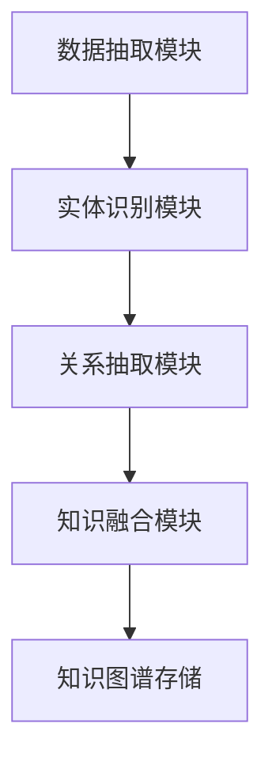
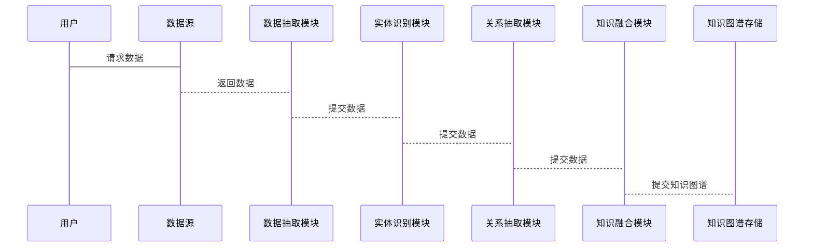

                 


# AI驱动的企业知识图谱：自动化构建与智能推理机制

> 关键词：知识图谱，AI驱动，自动化构建，智能推理，企业应用，数据挖掘，自然语言处理

> 摘要：  
本文系统地探讨了AI驱动的企业知识图谱的构建与智能推理机制，从背景、核心概念、算法原理到系统架构、项目实战，层层深入，结合实际案例和代码实现，全面解析知识图谱在企业中的应用价值与技术实现路径。通过本文，读者将深入了解如何利用AI技术实现知识图谱的自动化构建，并通过智能推理为企业决策提供支持。

---

# 第一部分: 知识图谱概述

## 第1章: 知识图谱的基本概念与背景

### 1.1 知识图谱的定义与特点

知识图谱是一种以图结构表示知识的技术，通过实体（节点）和关系（边）构建语义网络，能够表示复杂的语义信息。其特点包括：

1. **语义性**：通过实体和关系描述真实世界中的语义联系。
2. **可扩展性**：支持大规模数据的存储和管理。
3. **动态性**：能够实时更新和演化，适应数据变化。
4. **结构化**：以图的形式组织数据，便于计算机理解和推理。

### 1.2 企业知识图谱的背景

#### 1.2.1 企业知识图谱的定义
企业知识图谱是基于企业数据构建的知识图谱，旨在将企业的组织结构、业务流程、人员关系等信息以图的形式表示，为企业提供智能化的决策支持。

#### 1.2.2 企业知识图谱的重要性
- **提升数据利用率**：将分散的数据整合为连通的知识网络，便于分析和挖掘。
- **支持智能决策**：通过图结构的推理能力，辅助企业做出更明智的决策。
- **增强业务洞察**：发现隐含的业务关联，挖掘潜在的商业机会。

#### 1.2.3 企业知识图谱的构建挑战
1. **数据异构性**：企业数据来自不同系统，格式和结构多样。
2. **数据冗余与不一致**：同一信息可能在多个系统中存在，导致数据冗余和不一致。
3. **知识关联复杂性**：企业实体之间的关系复杂，构建知识图谱需要处理多种类型的关系。

#### 1.2.4 企业知识图谱的应用价值
- **优化业务流程**：通过知识图谱发现冗余流程，优化资源配置。
- **提升客户体验**：基于知识图谱进行客户画像，提供个性化服务。
- **支持战略决策**：通过图结构分析企业内外部关系，辅助战略决策。

---

## 第2章: 知识图谱的核心概念与联系

### 2.1 知识图谱的构建流程

知识图谱的构建通常包括以下步骤：

1. **数据抽取**：从结构化、半结构化和非结构化数据中抽取信息。
2. **实体识别**：识别数据中的实体（如人名、组织名）并建立实体库。
3. **关系抽取**：识别实体之间的关系（如“是公司的创始人”）。
4. **知识融合**：将多个数据源中的信息整合到统一的知识图谱中。
5. **知识表示**：将知识以图的形式表示，通常使用RDF（资源描述框架）或图数据库。

### 2.2 知识图谱的核心要素

#### 2.2.1 实体与属性
- **实体**：知识图谱中的基本单元，表示具体事物（如人、公司）。
- **属性**：描述实体的特征，例如“年龄”、“职位”。

#### 2.2.2 关系与事实
- **关系**：描述实体之间的关联，例如“人A是公司B的创始人”。
- **事实**：基于实体和关系的具体陈述，例如“张三创立了公司A”。

#### 2.2.3 知识图谱的语义网络
知识图谱通过语义网络的形式，将实体、关系和属性组织成一个复杂的网络结构，能够表示复杂的语义信息。

### 2.3 知识图谱与企业业务的结合

#### 2.3.1 企业知识图谱的业务价值
- **提升数据利用率**：通过知识图谱将分散的数据整合，提升数据价值。
- **支持智能决策**：基于知识图谱进行推理，辅助企业做出更明智的决策。
- **增强业务洞察**：通过知识图谱发现隐含的业务关联，挖掘潜在的商业机会。

#### 2.3.2 企业知识图谱的场景应用
1. **客户画像**：基于知识图谱构建客户画像，提供个性化服务。
2. **风险控制**：通过知识图谱分析企业之间的关联，评估风险。
3. **知识管理**：将企业知识以图的形式组织，便于管理和检索。

---

## 2.4 本章小结

本章主要介绍了知识图谱的基本概念、构建流程以及核心要素。通过对比知识图谱与传统数据库的区别，阐述了知识图谱在企业中的重要性及其应用价值。

---

# 第三部分: 知识图谱的算法原理

## 第3章: 知识图谱的构建算法

### 3.1 实体识别算法

#### 3.1.1 基于规则的实体识别
- **定义**：通过预定义的规则（如正则表达式）识别文本中的实体。
- **优点**：简单易实现，适用于结构化的数据。
- **缺点**：难以处理复杂的实体形式。

#### 3.1.2 基于机器学习的实体识别
- **定义**：利用机器学习模型（如CRF、SVM）进行实体识别。
- **优点**：能够处理复杂的实体形式，识别精度高。
- **缺点**：需要大量的标注数据。

#### 3.1.3 基于深度学习的实体识别
- **定义**：利用深度学习模型（如LSTM、BERT）进行实体识别。
- **优点**：能够捕捉上下文信息，识别精度高。
- **缺点**：计算资源消耗较大。

### 3.2 关系抽取算法

#### 3.2.1 基于规则的关系抽取
- **定义**：通过预定义的规则（如语义模式）抽取实体之间的关系。
- **优点**：简单易实现，适用于结构化的数据。
- **缺点**：难以处理复杂的语义关系。

#### 3.2.2 基于机器学习的关系抽取
- **定义**：利用机器学习模型（如CRF、SVM）进行关系抽取。
- **优点**：能够处理复杂的语义关系，抽取精度高。
- **缺点**：需要大量的标注数据。

#### 3.2.3 基于深度学习的关系抽取
- **定义**：利用深度学习模型（如BERT、GAT）进行关系抽取。
- **优点**：能够捕捉复杂的语义信息，抽取精度高。
- **缺点**：计算资源消耗较大。

---

## 3.2 算法原理的数学模型

### 3.2.1 条件随机场（CRF）

条件随机场是一种用于序列标注的模型，常用于实体识别和关系抽取。其数学模型如下：

$$
P(y_i | x_i, y_{i-1}) = \frac{\exp(f(y_i, y_{i-1}, x_i))}{Z}
$$

其中，$f$ 是特征函数，$Z$ 是归一化因子。

### 3.2.2 图注意力网络（GAT）

图注意力网络是一种用于图结构数据的模型，常用于知识图谱的推理。其数学模型如下：

$$
\alpha_i^k = \frac{\exp(\text{score}(e_i, e_k))}{\sum_{j} \exp(\text{score}(e_i, e_j))}
$$

其中，$\alpha_i^k$ 是节点$k$对节点$i$的注意力权重，$\text{score}$ 是相似性评分函数。

---

## 3.3 本章小结

本章详细介绍了知识图谱构建中的核心算法，包括实体识别和关系抽取的多种方法。通过对比不同算法的优缺点，阐述了如何选择合适的算法进行知识图谱的构建。

---

# 第四部分: 系统分析与架构设计

## 第4章: 系统架构设计

### 4.1 系统功能设计

#### 4.1.1 数据抽取模块
- **功能**：从多种数据源中抽取数据，包括结构化数据和非结构化数据。
- **实现**：使用Python的`pandas`库进行数据处理，使用`BeautifulSoup`或` lxml`进行HTML解析。

#### 4.1.2 实体识别模块
- **功能**：识别文本中的实体并建立实体库。
- **实现**：使用 spaCy 库进行实体识别，使用CRF模型进行命名实体识别。

#### 4.1.3 关系抽取模块
- **功能**：识别实体之间的关系并建立关系库。
- **实现**：使用spaCy的实体关系抽取功能，结合规则和机器学习模型进行关系抽取。

#### 4.1.4 知识融合模块
- **功能**：将多个数据源中的信息整合到统一的知识图谱中。
- **实现**：使用图数据库（如Neo4j）进行知识融合，使用冲突检测算法（如基于相似度的方法）解决数据冲突。

### 4.2 系统架构设计

#### 4.2.1 系统架构图


#### 4.2.2 系统交互流程


---

## 4.3 本章小结

本章详细介绍了企业知识图谱构建系统的功能设计和架构设计，通过图数据库和分布式系统的设计，实现了知识图谱的自动化构建和智能推理。

---

# 第五部分: 项目实战

## 第5章: 知识图谱构建项目实战

### 5.1 项目背景与目标

#### 5.1.1 项目背景
- **目标**：构建一个企业知识图谱，整合企业内部数据，支持智能决策。
- **数据来源**：企业组织架构、员工关系、项目信息、客户信息等。

### 5.2 环境配置与工具安装

#### 5.2.1 环境配置
- **Python版本**：3.8以上
- **依赖库**：
  - `spacy`：自然语言处理库
  - `networkx`：图论库
  - `neo4j`：图数据库
  - `pandas`：数据处理库

#### 5.2.2 工具安装
```bash
pip install spacy networkx neo4j pandas
python -m spacy download en_core_web_sm
```

### 5.3 核心代码实现

#### 5.3.1 数据抽取模块
```python
import pandas as pd

def extract_data(data_source):
    if data_source == 'csv':
        df = pd.read_csv('data.csv')
        return df
    elif data_source == 'db':
        # 数据库连接代码
        return None
    else:
        return None
```

#### 5.3.2 实体识别模块
```python
import spacy

nlp = spacy.load("en_core_web_sm")

def extract_entities(text):
    doc = nlp(text)
    entities = [ent.text for ent in doc.ents]
    return entities
```

#### 5.3.3 关系抽取模块
```python
from spacy import displacy

def extract_relations(text):
    doc = nlp(text)
    relations = []
    for i, ent1 in enumerate(doc.ents):
        for j, ent2 in enumerate(doc.ents):
            if i < j and ent1.label_ != ent2.label_:
                relations.append((ent1.text, ent2.text, 'related'))
    return relations
```

#### 5.3.4 知识融合模块
```python
from neo4j import GraphDatabase

def create_graph(neo4j_uri, entities, relations):
    driver = GraphDatabase.driver(neo4j_uri, auth=('user', 'password'))
    with driver.session() as session:
        # 创建节点
        for entity in entities:
            session.run("CREATE (n:Entity {name: $name})", name=entity)
        # 创建关系
        for ent1, ent2, rel in relations:
            session.run("MATCH (a {name: $a}), (b {name: $b}) CREATE (a)-[r:$rel]->(b)", a=ent1, b=ent2, rel=rel)
    driver.close()
```

### 5.4 项目小结

通过本章的实战项目，读者可以掌握知识图谱构建的完整流程，包括数据抽取、实体识别、关系抽取和知识融合。通过代码实现和工具配置，能够实际操作企业知识图谱的构建过程。

---

# 第六部分: 最佳实践与总结

## 第6章: 最佳实践与总结

### 6.1 最佳实践

#### 6.1.1 数据质量管理
- **数据清洗**：确保数据的准确性和完整性。
- **数据标注**：为机器学习模型提供高质量的标注数据。

#### 6.1.2 模型调优
- **参数调整**：根据数据特点调整模型参数。
- **模型评估**：通过准确率、召回率等指标评估模型性能。

#### 6.1.3 系统优化
- **分布式架构**：通过分布式系统提高处理效率。
- **缓存机制**：通过缓存技术减少重复计算。

### 6.2 总结

通过本文的详细讲解和实战项目，读者可以系统地掌握AI驱动的企业知识图谱的构建与智能推理机制。知识图谱作为一种强大的数据组织和分析工具，将在企业中发挥越来越重要的作用。

### 6.3 注意事项

- **数据隐私**：在处理企业数据时，需要注意数据隐私和安全问题。
- **模型解释性**：在实际应用中，需要确保模型的解释性，以便于理解和优化。
- **持续更新**：知识图谱需要持续更新，以适应数据的变化和业务的发展。

### 6.4 拓展阅读

- **推荐书籍**：
  - 《知识图谱：概念、方法与应用》
  - 《深度学习与自然语言处理》
- **推荐博客**：
  - https://towardsdatascience.com/
  - https://medium.com/ai-in-tech

---

# 作者：AI天才研究院/AI Genius Institute & 禅与计算机程序设计艺术 /Zen And The Art of Computer Programming

---

通过本文的详细讲解和实战项目，读者可以系统地掌握AI驱动的企业知识图谱的构建与智能推理机制。希望本文能为企业的数字化转型和智能化决策提供有价值的参考和指导。

