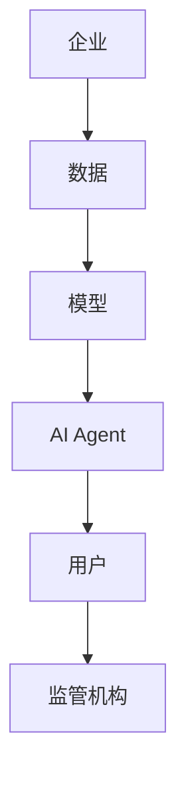
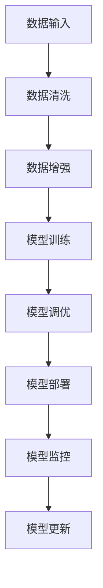
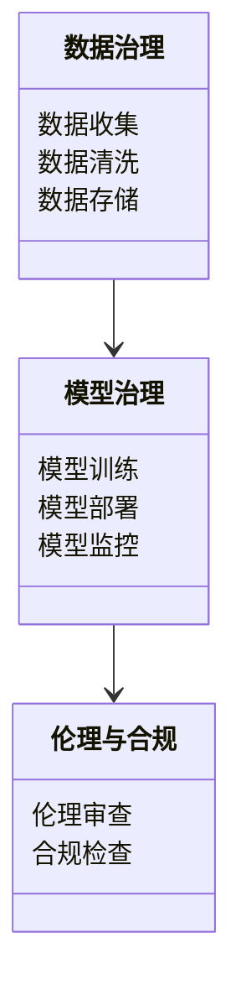
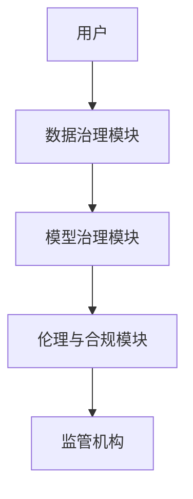
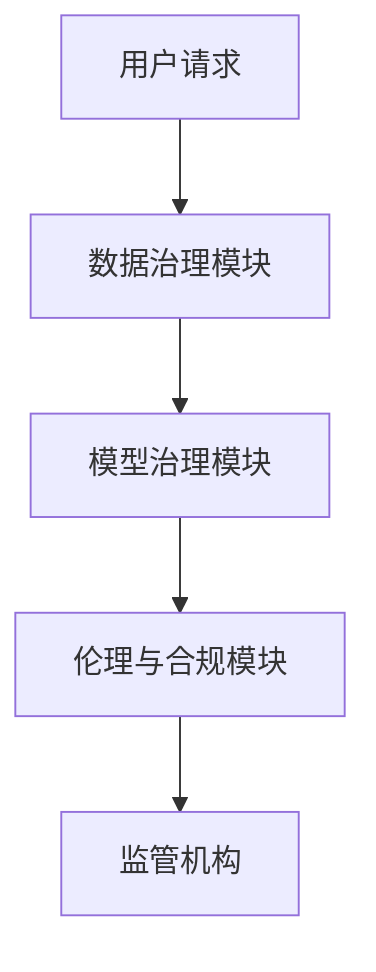

                 


# 企业AI治理框架：确保AI Agent的可控与合规

> 关键词：企业AI治理，AI Agent，数据治理，模型治理，合规，可控

> 摘要：随着人工智能技术在企业中的广泛应用，AI治理成为确保AI系统可控与合规的关键。本文系统地介绍了企业AI治理的背景、核心概念、算法原理、系统架构设计和实际项目案例，提出了构建企业AI治理框架的策略和方法，为企业在AI时代的可持续发展提供了理论和实践指导。

---

# 第一部分: 企业AI治理框架概述

# 第1章: 企业AI治理的背景与挑战

## 1.1 AI在企业中的应用现状

### 1.1.1 AI技术在企业中的应用领域
- **客户服务**：智能客服、聊天机器人
- **数据分析**：数据挖掘、预测分析
- **流程自动化**：RPA（机器人流程自动化）
- **决策支持**：基于AI的决策系统
- **风险管理**：AI驱动的 fraud detection

### 1.1.2 企业AI应用中的问题与挑战
- **数据隐私与安全**：数据泄露风险
- **模型偏见与公平性**：AI决策的公平性问题
- **可解释性不足**：AI决策的透明性缺失
- **合规性要求**：不同国家和地区的法规差异

### 1.1.3 AI治理的重要性与必要性
- **确保AI系统的可控性**：避免AI失控带来的风险
- **确保合规性**：符合相关法律法规
- **提升企业信任度**：增强客户和利益相关者的信任
- **支持可持续发展**：确保AI技术的长期健康发展

## 1.2 企业AI治理的定义与目标

### 1.2.1 企业AI治理的定义
- 企业AI治理是指对AI系统的全生命周期进行规划、监控和优化，确保其符合企业战略目标、法律法规和伦理标准。

### 1.2.2 企业AI治理的目标
- **合规性**：确保AI系统符合相关法律法规和行业标准
- **可控性**：确保AI系统的决策和行为在可控制范围内
- **透明性**：提升AI系统的可解释性和透明度
- **安全性**：降低AI系统带来的风险和潜在危害

### 1.2.3 企业AI治理的边界与外延
- **边界**：AI系统的开发、训练、部署和维护的全过程
- **外延**：涵盖数据治理、模型治理、伦理治理和合规治理

## 1.3 企业AI治理的核心要素

### 1.3.1 数据治理
- **数据质量**：确保数据的准确性、完整性和一致性
- **数据安全**：保护数据的隐私和安全
- **数据共享**：规范数据的共享和使用权限

### 1.3.2 模型治理
- **模型开发**：规范模型的设计、训练和优化
- **模型部署**：确保模型在生产环境中的稳定性和可靠性
- **模型监控**：实时监控模型性能和行为，及时发现和处理问题

### 1.3.3 AI伦理与合规
- **伦理规范**：确保AI系统的决策符合伦理标准
- **法律合规**：确保AI系统符合相关法律法规
- **社会责任**：提升企业的社会责任感和品牌形象

## 1.4 本章小结
本章从企业AI治理的背景出发，分析了其在企业中的应用现状和面临的挑战，明确了企业AI治理的定义、目标和核心要素，为后续章节的深入探讨奠定了基础。

---

# 第2章: 企业AI治理框架的核心概念

## 2.1 企业AI治理框架的原理

### 2.1.1 数据流与模型流的治理
- **数据流**：从数据收集、处理、存储到使用的全生命周期治理
- **模型流**：从模型训练、部署到监控的全生命周期治理

### 2.1.2 治理流程的标准化
- **标准化流程**：制定统一的治理流程和标准
- **动态调整**：根据实际情况动态调整治理策略

### 2.1.3 治理机制的动态性
- **实时监控**：实时监控AI系统的运行状态
- **快速响应**：及时发现和处理问题

## 2.2 核心概念对比分析

### 2.2.1 数据治理与模型治理的对比
| **维度** | **数据治理** | **模型治理** |
|----------|--------------|--------------|
| **目标** | 确保数据质量 | 确保模型性能 |
| **对象** | 数据的全生命周期 | 模型的全生命周期 |
| **重点** | 数据隐私与安全 | 模型的可解释性与公平性 |

### 2.2.2 伦理治理与合规治理的对比
| **维度** | **伦理治理** | **合规治理** |
|----------|--------------|--------------|
| **目标** | 确保AI系统的伦理合规 | 确保AI系统符合法律法规 |
| **对象** | AI系统的决策和行为 | AI系统的开发、部署和维护 |
| **重点** | 伦理标准的制定与执行 | 法律法规的遵守 |

### 2.2.3 治理框架的属性特征对比表
| **属性** | **数据治理** | **模型治理** | **伦理治理** |
|----------|--------------|--------------|--------------|
| **核心目标** | 数据质量 | 模型性能 | 伦理合规 |
| **关键挑战** | 数据隐私 | 模型偏见 | 伦理争议 |
| **解决方案** | 数据加密与匿名化 | 模型解释性工具 | 制定伦理规范 |

## 2.3 治理框架的ER实体关系图



## 2.4 本章小结
本章通过对比分析，明确了企业AI治理框架的核心概念和关键要素，为后续章节的算法原理和系统设计奠定了基础。

---

# 第3章: 企业AI治理的算法原理

## 3.1 数据预处理与清洗算法

### 3.1.1 数据清洗流程
- **数据收集**：从多种数据源收集数据
- **数据清洗**：去除重复数据、处理缺失值、纠正错误数据
- **数据标准化**：对数据进行标准化处理，确保数据的一致性

### 3.1.2 数据增强方法
- **数据增强**：通过增加数据的多样性和丰富性来提升模型性能
- **数据标注**：对数据进行标注，确保模型能够正确识别和分类

### 3.1.3 数据预处理的代码实现

```python
import pandas as pd

# 数据清洗示例代码
def data_cleaning(dataframe):
    # 去除重复数据
    dataframe.drop_duplicates(inplace=True)
    # 处理缺失值
    dataframe.dropna(inplace=True)
    # 标准化数据
    dataframe = dataframe.apply(lambda x: (x - x.mean()) / x.std())
    return dataframe

# 数据增强示例代码
def data_augmentation(images):
    augmented_images = []
    for image in images:
        # 随机裁剪
        augmented_image = random_crop(image)
        augmented_images.append(augmented_image)
    return augmented_images
```

## 3.2 模型训练与优化算法

### 3.2.1 模型训练流程
- **数据准备**：准备训练数据集
- **模型选择**：选择合适的模型架构
- **参数调优**：通过网格搜索或随机搜索优化模型参数
- **模型训练**：使用训练数据集训练模型

### 3.2.2 模型调优策略
- **网格搜索**：遍历所有可能的参数组合，找到最优参数
- **随机搜索**：随机选择参数组合，加速调优过程
- **早停法**：防止过拟合，提前终止训练

### 3.2.3 模型评估指标
- **准确率**：分类模型的正确预测比例
- **召回率**：模型识别出的正样本比例
- **F1分数**：准确率和召回率的调和平均数

## 3.3 模型部署与监控算法

### 3.3.1 模型部署流程
- **模型保存**：将训练好的模型保存为可部署的格式
- **模型加载**：在生产环境中加载模型
- **模型调用**：通过API接口调用模型进行预测

### 3.3.2 模型监控技术
- **实时监控**：监控模型的运行状态和性能
- **异常检测**：发现模型的异常行为并进行处理
- **模型更新**：根据监控结果动态更新模型

### 3.3.3 模型更新机制
- **在线更新**：实时更新模型参数
- **离线更新**：定期离线更新模型
- **增量学习**：逐步更新模型，减少计算开销

## 3.4 企业AI治理的算法流程图



## 3.5 数学模型与公式

### 3.5.1 准确率公式
$$准确率 = \frac{正确预测的数量}{总预测数量}$$

### 3.5.2 召回率公式
$$召回率 = \frac{正确识别的正样本数量}{实际正样本总数}$$

### 3.5.3 F1分数公式
$$F1分数 = 2 \times \frac{准确率 \times 召回率}{准确率 + 召回率}$$

## 3.6 本章小结
本章详细讲解了企业AI治理中的算法原理，包括数据预处理、模型训练和部署监控的流程，并通过公式和代码示例进行了详细说明。

---

# 第4章: 企业AI治理的系统架构设计

## 4.1 系统功能设计

### 4.1.1 领域模型设计


### 4.1.2 系统功能模块
- **数据治理模块**：负责数据的全生命周期管理
- **模型治理模块**：负责模型的全生命周期管理
- **伦理与合规模块**：负责AI系统的伦理审查和合规检查

## 4.2 系统架构设计

### 4.2.1 系统架构图


### 4.2.2 接口设计
- **API接口**：提供RESTful API接口，供其他系统调用
- **数据接口**：与数据源和数据存储系统对接
- **模型接口**：与AI模型训练和部署平台对接

## 4.3 系统交互流程

### 4.3.1 交互流程图


## 4.4 本章小结
本章通过系统架构设计，明确了企业AI治理系统的功能模块和交互流程，为后续章节的项目实战奠定了基础。

---

# 第5章: 企业AI治理的项目实战

## 5.1 项目介绍

### 5.1.1 项目背景
- 项目目标：构建一个企业级的AI治理框架
- 项目范围：涵盖数据治理、模型治理和伦理合规
- 项目团队：数据工程师、AI开发人员、合规专家

## 5.2 项目环境与工具安装

### 5.2.1 环境安装
```bash
pip install numpy pandas scikit-learn tensorflow
```

### 5.2.2 工具安装
- **数据治理工具**：Great Expectations
- **模型治理工具**：ModelDB
- **伦理合规工具**：AI Fairness
```

## 5.3 系统核心实现

### 5.3.1 数据治理实现
```python
import great_expectations as ge

def data_governance(dataframe):
    # 数据质量检查
    expectations = ge.augment_data(workbook, expectations_config)
    # 数据清洗
    cleaned_data = data_cleaning(dataframe)
    return cleaned_data
```

### 5.3.2 模型治理实现
```python
import modeldb

def model_governance(model):
    # 模型注册
    model_db.register_model(model)
    # 模型监控
    model_db.monitor_model(model)
    return model_db.get_model_status(model)
```

### 5.3.3 伦理与合规实现
```python
import aifairness

def ethical_governance(model):
    # 伦理审查
    fairness_report = aifairness.analyze(model)
    # 合规检查
    compliance_check = aifairness.compliance(model)
    return fairness_report, compliance_check
```

## 5.4 项目实战案例分析

### 5.4.1 案例背景
- 某企业希望通过AI技术提升客户服务的效率和质量

### 5.4.2 治理框架实施
- **数据治理**：清洗和增强客户服务数据
- **模型治理**：训练和部署客服AI系统
- **伦理与合规**：确保AI系统的公平性和透明性

## 5.5 本章小结
本章通过实际项目案例，展示了企业AI治理框架的实施过程和关键步骤，为读者提供了宝贵的实践经验。

---

# 第6章: 总结与展望

## 6.1 本章总结
- 企业AI治理是确保AI系统可控与合规的关键
- 本文提出了企业AI治理的框架和方法
- 通过实际案例展示了治理框架的实施过程

## 6.2 未来展望
- **技术发展**：AI技术的不断进步将推动治理框架的优化
- **法规变化**：不同国家和地区的法规变化将影响治理策略
- **伦理挑战**：AI系统的伦理问题将更加复杂和重要

## 6.3 最佳实践 Tips
- **数据治理**：确保数据的准确性和安全性
- **模型治理**：注重模型的可解释性和公平性
- **伦理与合规**：制定明确的伦理规范和合规策略
- **持续优化**：根据实际需求动态调整治理策略

## 6.4 本章小结
本章总结了全文的核心内容，并展望了未来的发展方向，为读者提供了持续优化企业AI治理框架的建议。

---

# 作者：AI天才研究院/AI Genius Institute & 禅与计算机程序设计艺术 /Zen And The Art of Computer Programming

