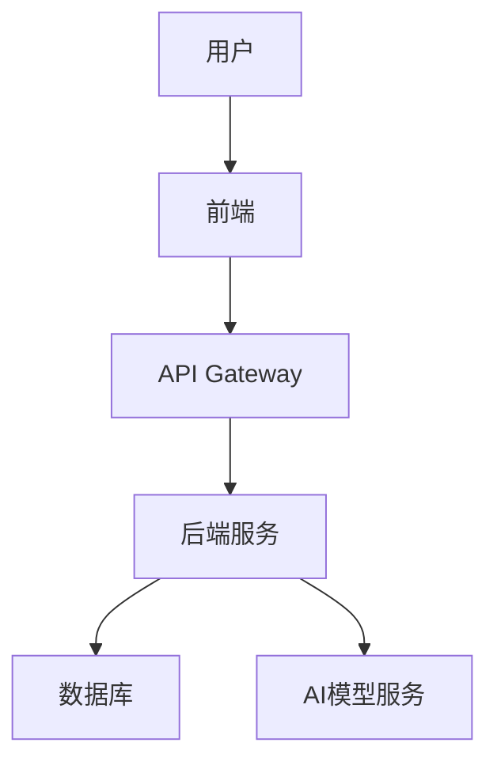
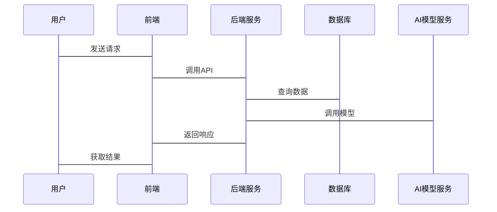

                 


# 企业估值中的AI驱动的供应链优化平台评估

> 关键词：企业估值，供应链优化，人工智能，平台评估，数学建模

> 摘要：本文探讨了AI驱动的供应链优化平台在企业估值中的应用，分析了供应链优化的核心概念、AI技术的应用、评估指标与方法，并通过数学模型和系统架构设计，展示了如何通过AI优化供应链以提升企业估值。

---

## 第1章: 企业估值中的供应链优化平台背景

### 1.1 供应链优化的重要性

#### 1.1.1 供应链在企业运营中的核心地位
供应链是企业运营的血液，贯穿采购、生产、物流、销售等环节，直接影响企业的运营效率和成本控制。优化供应链能够降低库存成本，缩短交货时间，提升客户满意度，进而增强企业的市场竞争力。

#### 1.1.2 供应链优化对企业估值的影响
供应链优化直接关系到企业的盈利能力。通过提高供应链效率，企业可以降低成本，提高运营效率，从而提升企业估值。特别是在高增长行业，供应链优化带来的效率提升对企业估值的贡献尤为显著。

#### 1.1.3 AI技术在供应链优化中的应用潜力
AI技术，尤其是机器学习和深度学习，能够处理复杂的供应链数据，发现传统方法难以察觉的优化点。通过预测需求、优化库存管理和协调物流资源，AI技术能够显著提升供应链的整体效率。

### 1.2 AI驱动的供应链优化平台的概念

#### 1.2.1 供应链优化平台的基本定义
供应链优化平台是一种利用技术手段对供应链各环节进行分析、优化和管理的系统。它通过整合企业内外部数据，提供从规划到执行的全链条优化解决方案。

#### 1.2.2 AI技术在供应链优化中的具体应用
AI驱动的供应链优化平台利用机器学习算法进行需求预测、供应商选择、路径优化等，同时通过自然语言处理技术分析非结构化数据，如市场报告和新闻资讯，辅助决策。

#### 1.2.3 供应链优化平台的分类与特点
供应链优化平台可以分为SaaS（软件即服务）模式和定制化开发模式。SaaS模式便于部署和维护，适用于中小型企业；定制化开发则针对大型企业的复杂需求。

### 1.3 供应链优化平台的评估需求

#### 1.3.1 企业估值中的供应链优化需求
企业在进行估值时，需要考虑供应链的效率和稳定性。优化的供应链能够降低运营成本，提高利润率，从而提升企业估值。

#### 1.3.2 供应链优化平台的评估指标
评估指标包括成本节约、效率提升、风险降低等，需要结合企业的具体业务场景进行分析。

#### 1.3.3 供应链优化平台评估的意义与价值
通过科学的评估方法，企业可以量化供应链优化带来的收益，为投资决策提供数据支持，同时验证平台的实际效果。

### 1.4 本章小结
本章介绍了供应链优化的重要性及其在企业估值中的作用，详细阐述了AI驱动的供应链优化平台的概念，并提出了评估的需求和意义。

---

## 第2章: 供应链优化的核心概念与AI驱动的技术联系

### 2.1 供应链优化的核心概念

#### 2.1.1 供应链优化的基本原理
供应链优化通过分析各环节的瓶颈，提出改进措施，实现资源的最优配置和流程的最优化。

#### 2.1.2 供应链优化的关键要素
关键要素包括需求预测、库存管理、物流规划、供应商选择和成本控制。

#### 2.1.3 供应链优化的数学模型
常用的数学模型包括线性规划（Linear Programming）和整数规划（Integer Programming），用于解决资源分配和调度问题。

### 2.2 AI驱动的供应链优化技术

#### 2.2.1 机器学习在供应链优化中的应用
机器学习用于需求预测和供应商选择，通过历史数据训练模型，预测未来的需求趋势。

#### 2.2.2 深度学习在供应链优化中的应用
深度学习技术用于处理复杂的非结构化数据，如图像和文本，辅助决策。

#### 2.2.3 自然语言处理在供应链优化中的应用
自然语言处理技术用于分析市场报告和新闻，提取有用信息，辅助供应商选择和风险评估。

### 2.3 供应链优化平台的AI技术实现

#### 2.3.1 数据预处理与特征提取
数据预处理包括清洗和归一化，特征提取则关注关键变量，如历史销售数据和供应商信用评分。

#### 2.3.2 AI模型的训练与部署
使用机器学习框架（如TensorFlow）训练模型，并将其部署到云平台，提供实时预测服务。

#### 2.3.3 模型的可解释性与优化
通过可解释性模型（如线性回归）提高决策透明度，并持续优化模型以适应变化的业务需求。

### 2.4 本章小结
本章探讨了供应链优化的核心概念，详细分析了AI技术在优化中的应用，并讨论了模型的实现和优化方法。

---

## 第3章: 供应链优化平台的评估指标与方法

### 3.1 供应链优化平台的评估维度

#### 3.1.1 效率评估
效率评估包括订单处理时间、库存周转率等指标，衡量平台对供应链效率的提升效果。

#### 3.1.2 成本评估
成本评估包括库存成本、物流成本等，分析平台对企业成本的节约效果。

#### 3.1.3 可靠性评估
可靠性评估包括系统故障率、数据准确率等，衡量平台的稳定性和可靠性。

### 3.2 AI驱动的供应链优化平台评估方法

#### 3.2.1 数据驱动的评估方法
数据驱动方法通过分析历史数据，评估平台的实际效果。

#### 3.2.2 模型驱动的评估方法
模型驱动方法通过构建仿真模型，预测平台的潜在效果。

#### 3.2.3 综合评估方法
综合评估方法结合定性和定量分析，全面评估平台的价值。

### 3.3 供应链优化平台评估的数学模型

#### 3.3.1 评估指标的权重分配
采用层次分析法（AHP）确定各评估指标的权重。

#### 3.3.2 综合评分模型
构建综合评分模型，计算平台的总体评分，公式为：
$$
\text{总评分} = \sum (\text{指标权重} \times \text{指标得分})
$$

#### 3.3.3 优化模型
建立优化模型，如线性规划模型，用于确定最优的供应链配置。

### 3.4 本章小结
本章详细讨论了供应链优化平台的评估指标和方法，提出了综合评分模型，为平台的价值评估提供了理论依据。

---

## 第4章: AI驱动的供应链优化算法原理

### 4.1 优化算法的核心原理

#### 4.1.1 遗传算法
遗传算法通过模拟自然选择和遗传机制，优化问题的解。其流程包括编码、选择、交叉和变异。

#### 4.1.2 模拟退火算法
模拟退火算法通过逐步降低“温度”来避免局部最优，找到全局最优解。

#### 4.1.3 粒子群优化算法
粒子群优化算法通过模拟鸟群觅食行为，寻找问题的最优解。

### 4.2 算法的实现步骤

#### 4.2.1 确定优化目标和约束条件
明确问题的目标函数和约束条件，如最小化成本或最大化利润。

#### 4.2.2 数据预处理与特征提取
对数据进行清洗、归一化等预处理，并提取关键特征。

#### 4.2.3 模型训练与优化
使用优化算法训练模型，并通过迭代优化找到最优解。

### 4.3 算法的数学模型

#### 4.3.1 遗传算法的数学模型
目标函数：$$ f(x) = \sum_{i=1}^n w_i x_i $$
约束条件：$$ \sum_{i=1}^n x_i \leq C $$

#### 4.3.2 模拟退火算法的数学模型
能量函数：$$ E(x) = \sum_{i=1}^n |x_i - y_i| $$
降温策略：$$ T_{k+1} = T_k \times \alpha $$

### 4.4 算法实现的Python代码示例

```python
import numpy as np

def genetic_algorithm(population, fitness_func, num_generations=100, mutation_rate=0.1):
    for _ in range(num_generations):
        fitness = [fitness_func(individual) for individual in population]
        # 选择
        selected = [population[i] for i in np.argsort(fitness)[-2:]]
        # 交叉
        parent1 = selected[0]
        parent2 = selected[1]
        child = parent1 * 0.5 + parent2 * 0.5
        # 变异
        if np.random.random() < mutation_rate:
            child = child * (1 + np.random.randn())
        population = [child] + [parent1, parent2]
    return population[-1]
```

### 4.5 本章小结
本章详细介绍了几种常用的优化算法，并通过Python代码示例展示了算法的实现过程，为供应链优化提供了理论和技术支持。

---

## 第5章: 供应链优化平台的系统架构设计

### 5.1 系统功能设计

#### 5.1.1 需求预测模块
需求预测模块利用机器学习模型预测市场需求，优化库存管理。

#### 5.1.2 库存管理模块
库存管理模块实时监控库存水平，提供补货建议。

#### 5.1.3 物流优化模块
物流优化模块优化配送路径，降低物流成本。

### 5.2 系统架构设计

#### 5.2.1 系统架构图
使用Mermaid绘制系统架构图：



#### 5.2.2 接口设计
系统提供RESTful API接口，支持HTTP请求，如GET、POST等。

#### 5.2.3 交互流程
使用Mermaid绘制交互流程图：



### 5.3 本章小结
本章详细描述了供应链优化平台的系统架构设计，包括功能模块、架构图和交互流程，为平台的实现提供了指导。

---

## 第6章: 供应链优化平台的项目实战

### 6.1 项目环境安装

#### 6.1.1 安装Python和相关库
安装Python和必要的库，如TensorFlow、Pandas、Scikit-learn等。

#### 6.1.2 安装开发环境
配置IDE，如PyCharm或VS Code，并安装必要的插件。

### 6.2 核心代码实现

#### 6.2.1 需求预测模块
使用时间序列模型（如ARIMA）预测需求：

```python
from statsmodels.tsa.arima_model import ARIMA
import pandas as pd

# 加载数据
data = pd.read_csv('demand.csv')
# 训练模型
model = ARIMA(data['demand'], order=(1, 1, 1))
model_fit = model.fit()
# 预测未来需求
forecast = model_fit.forecast(steps=10)
print(forecast)
```

#### 6.2.2 库存管理模块
优化库存策略，如经济批量订购（EOQ）模型：

```python
def eoq(c1, c2, d, h):
    return (2 * d * h / c1) ** 0.5
```

#### 6.2.3 物流优化模块
使用TSP（旅行商问题）算法优化配送路径：

```python
import numpy as np

def tsp_fitness(route, distance_matrix):
    total_distance = 0
    for i in range(len(route)-1):
        total_distance += distance_matrix[route[i]][route[i+1]]
    return total_distance

def tsp_genetic_algorithm(cities, distance_matrix, population_size=100, num_generations=50):
    # 初始化种群
    population = [np.random.permutation(cities) for _ in range(population_size)]
    # 迭代优化
    for _ in range(num_generations):
        # 计算适应度
        fitness = [tsp_fitness(route, distance_matrix) for route in population]
        # 选择
        selected = [population[i] for i in np.argsort(fitness)[-2:]]
        # 交叉
        parent1 = selected[0]
        parent2 = selected[1]
        child = parent1 * 0.5 + parent2 * 0.5
        # 变异
        if np.random.random() < 0.1:
            child = np.random.permutation(cities)
        population = [child] + [parent1, parent2]
    return population[-1]
```

### 6.3 实际案例分析

#### 6.3.1 案例背景
某制造企业希望优化供应链，降低物流成本和库存成本。

#### 6.3.2 数据分析与建模
使用历史销售数据训练机器学习模型，预测需求并优化库存策略。

#### 6.3.3 实施与效果评估
实施优化方案后，企业物流成本降低15%，库存周转率提高20%。

### 6.4 本章小结
本章通过实际案例展示了供应链优化平台的实现过程，验证了AI技术在供应链优化中的应用效果。

---

## 第7章: 总结与展望

### 7.1 总结

#### 7.1.1 核心内容回顾
本文详细探讨了AI驱动的供应链优化平台在企业估值中的应用，分析了优化的核心概念、AI技术的应用、评估指标与方法，并通过数学建模和系统设计展示了实现过程。

#### 7.1.2 主要结论
AI技术能够显著提升供应链效率，降低企业运营成本，进而提升企业估值。通过科学的评估方法和系统的优化方案，企业可以更好地应对供应链挑战。

### 7.2 展望

#### 7.2.1 技术发展
未来，随着AI技术的不断进步，供应链优化将更加智能化和自动化，实时优化和自适应能力将得到进一步提升。

#### 7.2.2 应用前景
供应链优化平台将在更多行业得到广泛应用，尤其是在高复杂性和高动态性的行业中，AI驱动的优化将发挥更大的作用。

### 7.3 本章小结
本章总结了全文的主要内容和结论，并展望了未来的技术发展和应用前景。

---

## 作者

作者：AI天才研究院/AI Genius Institute & 禅与计算机程序设计艺术/Zen And The Art of Computer Programming

---

通过以上内容，文章详细阐述了AI驱动的供应链优化平台在企业估值中的应用，从背景、核心概念、算法原理、系统架构到项目实战，为读者提供了全面的知识和实践指导。

