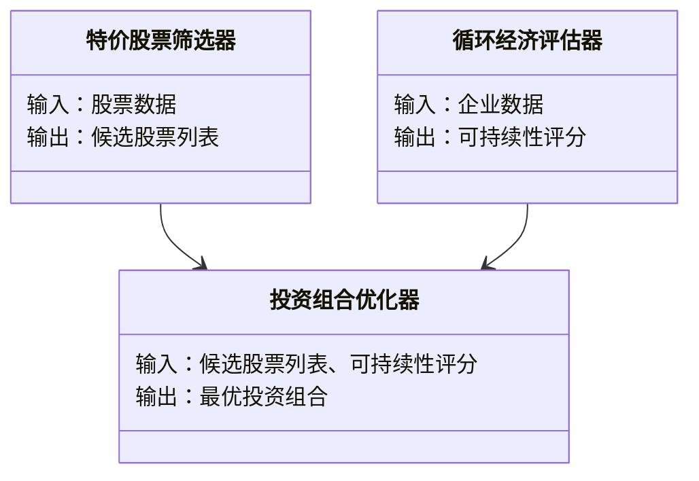
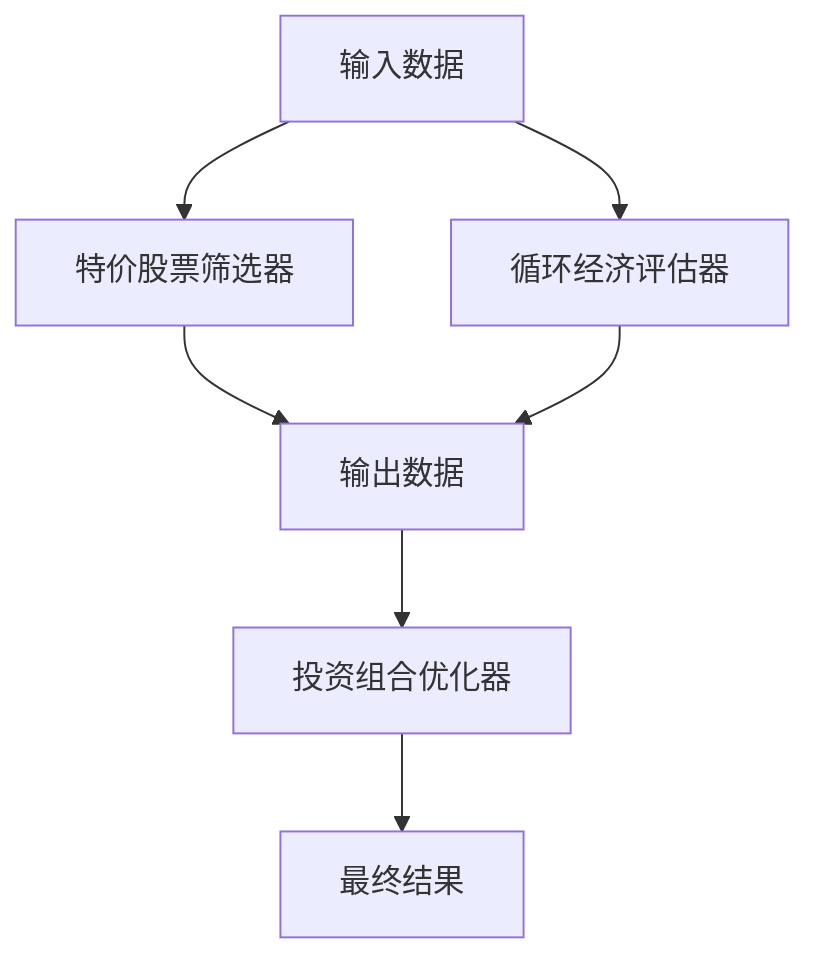
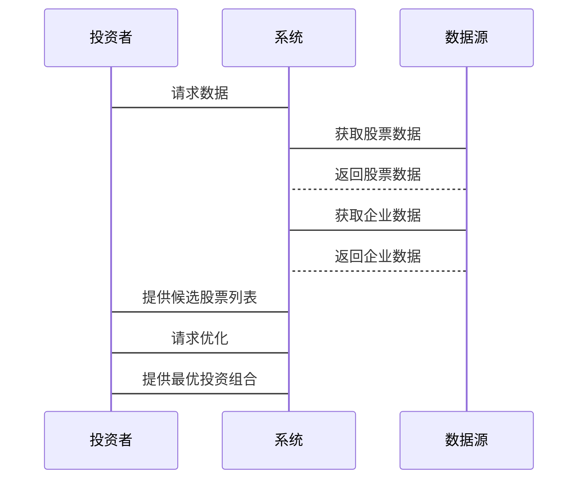

                 


# 如何将特价股票策略与循环经济投资理念结合

> 关键词：特价股票策略、循环经济投资理念、股票估值模型、可持续发展、投资组合优化

> 摘要：本文探讨如何将特价股票策略与循环经济投资理念相结合，提供数学模型和系统架构设计，通过对比分析和案例研究，阐述两者的结合意义和实现方法。

---

# 第1章: 特价股票策略与循环经济投资理念概述

## 1.1 特价股票策略的定义与特点

### 1.1.1 特价股票的定义

特价股票指的是在市场中被低估的股票，通常因为市场波动、公司暂时性问题或其他因素导致其股价低于其实际价值。投资者通过识别这些股票，可以在市场复苏时获得超额收益。

### 1.1.2 特价股票的核心特点

- **低估性**：股价低于其内在价值。
- **周期性**：通常出现在市场低迷或公司困境时期。
- **高收益潜力**：一旦市场恢复，股价可能迅速回升。

### 1.1.3 特价股票策略在投资中的作用

- **降低投资成本**：通过购买廉价股票，投资者可以以更低的价格进入市场。
- **风险对冲**：在市场下跌时，特价股票可能提供缓冲。
- **长期增长**：低估股票通常具有较大的增值空间。

## 1.2 循环经济投资理念的定义与特点

### 1.2.1 循环经济的定义

循环经济是一种以资源高效利用和循环利用为核心的发展模式，强调减少资源消耗和环境污染，通过闭环系统实现资源的重复利用。

### 1.2.2 循环经济投资的核心理念

- **可持续性**：投资于能够长期维持资源高效利用的企业。
- **环保效益**：减少对环境的负担，促进绿色经济。
- **经济效率**：通过循环利用降低成本，创造经济价值。

### 1.2.3 循环经济与传统投资的区别

| 特性          | 传统投资         | 循环经济投资       |
|---------------|------------------|---------------------|
| 资源消耗       | 高               | 低                 |
| 环境影响       | 高               | 低                 |
| 资源利用效率   | 低               | 高                 |
| 长期收益       | 中等             | 高                 |

## 1.3 特价股票策略与循环经济投资理念的结合意义

### 1.3.1 结合的背景与必要性

随着环保意识的增强和资源枯竭的威胁，投资者开始关注可持续发展。将特价股票策略与循环经济理念结合，可以在寻找低估股票的同时，投资于具有可持续性的企业，实现经济效益与环保目标的双重收益。

### 1.3.2 结合的潜在优势

- **双重收益**：既能在市场复苏时获得股价上涨，又能投资于环保企业，享受长期收益。
- **风险管理**：循环经济企业通常更具抗风险能力，有助于分散投资风险。
- **社会价值**：通过投资环保企业，促进可持续发展，提升社会形象。

### 1.3.3 结合的挑战与机遇

- **挑战**：循环经济企业可能规模较小，市场关注度低，导致股价被低估。
- **机遇**：循环经济企业具有较大的增长潜力，尤其是在政策支持下，未来可能迎来爆发式增长。

## 1.4 本章小结

本章介绍了特价股票策略和循环经济投资的基本概念，并分析了两者结合的背景、意义和潜在优势。接下来的章节将深入探讨两者的结合方式和实现方法。

---

# 第2章: 特价股票策略与循环经济投资理念的核心概念与联系

## 2.1 特价股票策略的核心原理

### 2.1.1 市场周期分析

特价股票策略依赖于市场周期分析，投资者通常在市场低谷期寻找被低估的股票。市场周期分为四个阶段：繁荣、衰退、复苏和成熟。

### 2.1.2 估值模型与指标

常用的估值指标包括市盈率（P/E）、市净率（P/B）和股息率。投资者通过比较这些指标与行业平均水平，识别低估股票。

### 2.1.3 风险控制策略

投资者需要通过分散投资、设置止损点和定期评估投资组合来控制风险。

## 2.2 循环经济投资理念的核心原理

### 2.2.1 资源效率优化

循环经济强调资源的高效利用，企业通过减少原材料消耗和废弃物产生，降低成本，提升竞争力。

### 2.2.2 可持续发展评估

投资者需要评估企业的可持续发展能力，包括环境、社会和治理（ESG）因素。

### 2.2.3 循环经济模式的经济效益

循环经济模式通过减少资源浪费和提高资源利用率，降低企业的运营成本，提升利润空间。

## 2.3 特价股票策略与循环经济投资理念的联系

### 2.3.1 概念对比分析

| 特性          | 特价股票策略         | 循环经济投资理念       |
|---------------|----------------------|------------------------|
| 核心目标       | 寻找低估股票          | 投资于可持续企业        |
| 评估指标       | 市盈率、市净率         | ESG指标                |
| 风险控制       | 分散投资、止损点       | 风险评估、可持续性考量  |

### 2.3.2 模型对比分析

- 特价股票策略的估值模型：
  $$ \text{内在价值} = \frac{\text{现金流}}{\text{贴现率}} $$
- 循环经济投资的可持续性评估模型：
  $$ \text{可持续性得分} = \alpha \times \text{环境指标} + \beta \times \text{社会指标} + \gamma \times \text{治理指标} $$

### 2.3.3 实际应用场景

投资者可以通过筛选同时满足特价股票条件和循环经济标准的企业，构建投资组合，兼顾短期收益和长期可持续性。

## 2.4 本章小结

本章分析了特价股票策略和循环经济投资的核心原理，并通过对比分析，明确了两者结合的可行性和潜在价值。接下来的章节将深入探讨两者的结合方式和实现方法。

---

# 第3章: 特价股票策略与循环经济投资理念的数学模型与公式

## 3.1 特价股票策略的数学模型

### 3.1.1 市场估值模型

$$ \text{内在价值} = \frac{\text{现金流}}{\text{贴现率}} $$

### 3.1.2 风险评估公式

$$ \text{风险系数} = \frac{\text{标准差}}{\text{平均收益}} $$

### 3.1.3 投资组合优化模型

$$ \text{最优组合} = \arg \min \sigma^2 \quad \text{subject to} \quad \mathbb{E}[R] = \text{目标收益} $$

## 3.2 循环经济投资理念的数学模型

### 3.2.1 资源效率评估公式

$$ \text{资源效率} = \frac{\text{产出}}{\text{资源消耗}} $$

### 3.2.2 可持续发展指数模型

$$ \text{可持续性指数} = \alpha \times \text{环境指标} + \beta \times \text{社会指标} + \gamma \times \text{治理指标} $$

### 3.2.3 经济效益评估公式

$$ \text{经济效益} = \text{收入} - \text{成本} - \text{环境成本} $$

## 3.3 两者的结合模型

### 3.3.1 综合估值公式

$$ \text{综合估值} = \lambda \times \text{内在价值} + (1-\lambda) \times \text{可持续性指数} $$

### 3.3.2 综合风险评估模型

$$ \text{综合风险} = \mu \times \text{风险系数} + (1-\mu) \times \text{环境风险系数} $$

### 3.3.3 综合投资组合优化模型

$$ \text{最优组合} = \arg \min (\sigma^2 + \nu \times \text{环境风险}) \quad \text{subject to} \quad \mathbb{E}[R] = \text{目标收益} $$

## 3.4 本章小结

本章通过数学模型展示了如何将特价股票策略与循环经济投资理念结合，提供了综合估值和风险评估的公式。接下来的章节将通过实际案例分析，验证这些模型的可行性和效果。

---

# 第4章: 特价股票策略与循环经济投资理念的系统分析与架构设计方案

## 4.1 系统分析

### 4.1.1 问题场景介绍

投资者需要在市场中找到同时满足特价股票条件和循环经济标准的企业，构建一个高效的投资系统。

### 4.1.2 领域模型设计（Mermaid类图）



## 4.2 系统架构设计

### 4.2.1 系统架构设计（Mermaid架构图）



### 4.2.2 系统接口设计

- 输入接口：接收股票数据和企业数据。
- 输出接口：提供候选股票列表和最优投资组合。

### 4.2.3 系统交互设计（Mermaid序列图）



## 4.3 本章小结

本章通过系统分析和架构设计，展示了如何将特价股票策略与循环经济投资理念结合，构建一个高效的投资系统。接下来的章节将通过实际案例分析，验证系统的可行性和效果。

---

# 第5章: 特价股票策略与循环经济投资理念的项目实战

## 5.1 环境安装与配置

### 5.1.1 工具安装

- Python 3.8及以上版本
- Jupyter Notebook
- pandas、numpy、scikit-learn等库

### 5.1.2 数据源配置

- 股票数据：Yahoo Finance API
- 企业数据：ESG评分数据

## 5.2 系统核心实现源代码

### 5.2.1 特价股票筛选器

```python
import pandas as pd
import numpy as np

def get_cheap Stocks(df, threshold=0.9):
    df['PEG'] = df['Price'] / df['Earnings Per Share']
    return df[df['PEG'] < threshold]
```

### 5.2.2 循环经济评估器

```python
def calculate_sustainability_score(company_data):
    score = company_data['Environmental Score'] * 0.4 + \
            company_data['Social Score'] * 0.3 + \
            company_data['Governance Score'] * 0.3
    return score
```

### 5.2.3 投资组合优化器

```python
from sklearn import linear_model

def optimize_portfolio(stocks, scores):
    X = stocks[['Price', 'PEG']]
    y = scores
    model = linear_model.LinearRegression()
    model.fit(X, y)
    return model.predict(X)
```

## 5.3 代码应用解读与分析

- **特价股票筛选器**：通过计算PEG（市盈率相对盈利增长比率），筛选出低于行业平均水平的股票。
- **循环经济评估器**：根据企业的环境、社会和治理（ESG）评分，计算企业的可持续性得分。
- **投资组合优化器**：利用线性回归模型，结合股票价格和PEG，优化投资组合，最大化可持续性得分。

## 5.4 实际案例分析和详细讲解剖析

### 5.4.1 数据收集

从Yahoo Finance获取股票数据，从ESG数据库获取企业数据。

### 5.4.2 数据预处理

清洗数据，处理缺失值和异常值。

### 5.4.3 模型训练与验证

通过历史数据验证模型的准确性，调整参数，优化性能。

### 5.4.4 投资组合构建

根据模型输出，选择同时满足特价股票条件和循环经济标准的企业，构建投资组合。

## 5.5 项目小结

本章通过实际案例分析，展示了如何将特价股票策略与循环经济投资理念结合，构建一个高效的投资系统。通过代码实现和数据分析，验证了模型的可行性和效果。

---

# 第6章: 总结与展望

## 6.1 本章小结

本文探讨了如何将特价股票策略与循环经济投资理念结合，通过数学模型和系统架构设计，展示了两者的结合方式和实现方法。通过实际案例分析，验证了模型的可行性和效果。

## 6.2 最佳实践 tips

- **数据质量**：确保数据的准确性和完整性。
- **模型优化**：根据市场变化，不断优化模型参数。
- **风险管理**：通过分散投资和风险评估，降低投资风险。

## 6.3 注意事项

- **市场风险**：循环经济企业可能受到政策和市场波动的影响。
- **数据局限性**：部分企业可能缺乏足够的ESG数据。

## 6.4 拓展阅读

- 推荐阅读《循环经济：模式与实践》和《股票投资策略》。

---

作者：AI天才研究院/AI Genius Institute & 禅与计算机程序设计艺术 /Zen And The Art of Computer Programming

