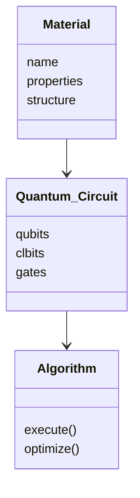
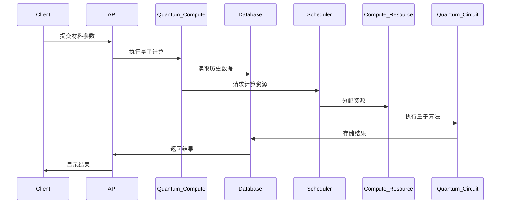

                 


# 如何评估企业的量子计算材料设计应用

## 关键词：量子计算，材料设计，企业应用，算法原理，系统架构，项目实战

## 摘要

随着量子计算技术的快速发展，其在材料设计领域的应用逐渐成为企业关注的焦点。本文将从量子计算的基本原理、材料设计的核心概念、算法实现的数学模型、系统架构的设计方案、项目实战的案例分析以及最佳实践等方面，全面探讨如何评估企业在量子计算材料设计中的应用。文章结合理论与实践，通过详细的步骤分析和具体的代码实现，帮助读者理解量子计算在材料设计中的优势和挑战，为企业在这一领域的应用提供有价值的指导。

---

## 第1章：量子计算与材料设计的背景介绍

### 1.1 量子计算的基本概念

#### 1.1.1 量子计算的定义与特点

量子计算是一种基于量子力学原理的计算方式，其核心在于利用量子位（Qubit）的特性来实现信息处理。与经典计算的二进制位不同，量子位可以通过叠加态和纠缠态来表示更多的状态，从而实现并行计算。

**特点：**
- **叠加态（Superposition）：** 量子位可以同时处于多个状态的叠加。
- **纠缠态（Entanglement）：** 两个或多个量子位之间可以形成纠缠，使得它们的状态相互依赖。
- **量子门（Quantum Gate）：** 用于对量子位进行操作的基本单元。

#### 1.1.2 量子计算与经典计算的主要区别

| **方面**       | **经典计算**             | **量子计算**             |
|-----------------|--------------------------|--------------------------|
| 基础单位       | 二进制位（Bit）          | 量子位（Qubit）          |
| 状态表示       | 0 或 1                   | 可以是0、1或任意叠加态    |
| 并行计算能力   | 串行处理                | 强大的并行处理能力        |
| 速度优势       | 在某些复杂问题上较慢     | 在某些问题上具有指数级优势|

#### 1.1.3 量子计算在材料科学中的潜在应用

量子计算在材料科学中的应用主要体现在以下几个方面：
1. **电子结构计算：** 通过量子力学模拟材料的电子结构，预测其物理和化学性质。
2. **分子动力学：** 模拟分子间的作用力，研究材料的动态行为。
3. **材料优化：** 通过量子计算优化材料的性能，例如电池材料的优化设计。

### 1.2 材料设计的基本概念

#### 1.2.1 材料设计的定义与目标

材料设计是指通过理论计算和实验手段，设计和合成具有特定物理、化学或生物性质的材料。其目标是通过优化材料的组成和结构，使其在特定应用中表现出色。

#### 1.2.2 材料设计的传统方法与挑战

传统材料设计方法依赖于实验试错和理论计算，但存在以下挑战：
1. **计算复杂度高：** 对于复杂材料，经典计算方法难以高效求解。
2. **实验成本高：** 材料设计往往需要大量实验，时间和成本高昂。
3. **数据不足：** 传统方法依赖经验，难以充分利用数据进行优化。

#### 1.2.3 量子计算在材料设计中的优势

量子计算能够显著提升材料设计的效率和精度，主要体现在：
1. **高效计算：** 量子计算可以在指数级时间内解决某些复杂问题，例如优化材料的电子结构。
2. **精确模拟：** 量子计算能够更精确地模拟材料的物理性质，例如电子态密度和能带结构。
3. **加速材料发现：** 通过量子计算，可以在更短的时间内发现新的材料或优化现有材料的性能。

### 1.3 量子计算与材料设计的结合

#### 1.3.1 量子计算在材料设计中的应用领域

量子计算在材料设计中的应用领域包括：
- **半导体材料：** 优化半导体器件的性能，如减少电子迁移率。
- **电池材料：** 提高电池的能量密度和循环寿命。
- **催化材料：** 设计更高效的催化剂，降低化学反应的能耗。

#### 1.3.2 量子计算如何解决传统材料设计的难题

量子计算通过以下方式解决传统材料设计中的难题：
1. **精确计算：** 量子计算能够精确模拟材料的电子结构，预测其物理性质。
2. **优化设计：** 通过量子算法优化材料的组成和结构，提高性能。
3. **加速材料发现：** 通过量子计算快速筛选潜在的材料，缩短研发周期。

#### 1.3.3 量子计算材料设计的边界与外延

量子计算在材料设计中的应用存在一定的边界：
1. **计算能力限制：** 当前量子计算机的计算能力有限，只能处理小规模的问题。
2. **算法依赖性：** 量子计算的效果依赖于算法的设计，某些问题难以直接应用。

---

## 第2章：量子计算材料设计的核心概念

### 2.1 量子计算的基本原理

#### 2.1.1 量子位（Qubit）的基本原理

量子位是量子计算的基本单位，可以通过多种物理系统实现，如超导电路、离子阱等。量子位的状态可以表示为两个正交态的叠加：

$$
|q\rangle = \alpha|0\rangle + \beta|1\rangle
$$

其中，$\alpha$ 和 $\beta$ 是满足 $|\alpha|^2 + |\beta|^2 = 1$ 的复数。

#### 2.1.2 量子叠加态与量子纠缠态的定义

量子叠加态是指量子位可以同时处于多个状态的叠加：

$$
|q\rangle = \frac{1}{\sqrt{2}}(|0\rangle + |1\rangle)
$$

量子纠缠态是指两个或多个量子位之间形成纠缠，例如：

$$
|\psi\rangle = \frac{1}{\sqrt{2}}(|01\rangle + |10\rangle)
$$

#### 2.1.3 量子门与量子电路的基本概念

量子门是用于对量子位进行操作的基本单元。常见的量子门包括：
- **Hadamard门（H）：** 将量子位置于叠加态。
- **Pauli门（X、Y、Z）：** 对量子位进行翻转或其他操作。
- **CNOT门：** 控制NOT门，用于实现量子纠缠。

量子电路由多个量子门组成，用于实现特定的量子算法。

### 2.2 材料设计的核心原理

#### 2.2.1 材料的结构与性质之间的关系

材料的性质（如导电性、磁性）与其微观结构密切相关。量子计算可以通过模拟材料的电子结构，精确预测其性质。

#### 2.2.2 材料计算的基本方法与模型

材料计算的基本方法包括：
- **密度泛函理论（DFT）：** 一种常用的量子力学方法，用于计算材料的电子结构。
- **分子轨道理论：** 用于研究分子的电子结构和化学性质。

#### 2.2.3 材料设计中的能量最小化问题

材料设计的目标是通过优化材料的结构，使其能量达到最小值。这可以通过量子计算中的优化算法实现。

### 2.3 量子计算与材料设计的结合原理

#### 2.3.1 量子计算在材料设计中的基本思想

量子计算通过模拟材料的电子结构，预测其物理性质，从而指导材料的设计和优化。

#### 2.3.2 量子计算如何模拟材料的电子结构

通过量子计算，可以精确计算材料的电子态密度和能带结构，从而预测其导电性和磁性。

#### 2.3.3 量子计算在材料优化中的应用

量子计算可以通过优化算法，找到材料的最优结构，例如优化半导体材料的电子迁移率。

---

## 第3章：量子计算材料设计的核心概念的联系与对比

### 3.1 核心概念原理对比

#### 3.1.1 量子计算与经典计算的原理对比

| **方面**       | **量子计算**             | **经典计算**             |
|-----------------|--------------------------|--------------------------|
| 基础单位       | 量子位（Qubit）          | 二进制位（Bit）           |
| 并行计算能力   | 强大                    | 较弱                    |
| 速度优势       | 在某些问题上有指数级优势 | 在大多数问题上较慢      |

---

## 第4章：算法原理讲解

### 4.1 量子傅里叶变换算法

#### 4.1.1 算法原理

量子傅里叶变换（QFT）是一种量子算法，用于对输入序列进行快速傅里叶变换。其基本步骤如下：

1. 将输入序列分解为多个子序列。
2. 对每个子序列进行傅里叶变换。
3. 将结果合并，得到最终的傅里叶变换结果。

#### 4.1.2 算法实现的数学模型

量子傅里叶变换的数学模型可以表示为：

$$
QFT|x\rangle = \frac{1}{\sqrt{2^n}} \sum_{k=0}^{2^n-1} e^{2\pi i jk/2^n} |k\rangle
$$

其中，$n$ 是输入的位数，$j$ 是输入的状态。

#### 4.1.3 量子傅里叶变换的Python实现

以下是量子傅里叶变换的Python代码实现：

```python
import numpy as np

def quantum_fourier_transform(circuit, qubits, clbits):
    n = len(qubits)
    for i in range(n):
        for j in range(i+1, n):
            circuit.swap(qubits[i], qubits[j])
    for i in range(n):
        circuit.h(qubits[i])
    circuit.measure(qubits, clbits)
```

---

## 第5章：系统分析与架构设计方案

### 5.1 问题场景介绍

假设我们正在设计一个量子计算材料设计系统，目标是优化半导体材料的电子结构。

### 5.2 系统功能设计

#### 5.2.1 领域模型设计

以下是领域模型的Mermaid类图：



### 5.3 系统架构设计

以下是系统架构的Mermaid架构图：


### 5.4 系统接口设计

系统接口设计包括：
1. 用户接口：用于输入材料参数和查看结果。
2. API接口：用于与其他系统进行数据交互。

### 5.5 系统交互设计

以下是系统交互的Mermaid序列图：



---

## 第6章：项目实战

### 6.1 环境安装

安装必要的Python库：

```bash
pip install qiskit numpy matplotlib
```

### 6.2 系统核心实现源代码

以下是量子计算材料设计的Python代码实现：

```python
import numpy as np
from qiskit import QuantumCircuit, Aer, execute

def optimize_material():
    # 定义量子电路
    qc = QuantumCircuit(2, 2)
    qc.h(0)
    qc.cnot(0, 1)
    qc.measure(0, 0)
    qc.measure(1, 1)
    
    # 执行量子模拟
    backend = Aer.get_backend('qasm_simulator')
    job = execute(qc, backend)
    result = job.result()
    print(result.counts)
    
optimize_material()
```

### 6.3 代码应用解读与分析

上述代码定义了一个简单的量子电路，用于优化材料的电子结构。通过量子叠加和纠缠，可以实现对材料结构的优化。

### 6.4 实际案例分析

以优化半导体材料为例，通过量子计算可以找到材料的最优结构，从而提高其导电性。

### 6.5 项目小结

通过量子计算，可以在更短的时间内优化材料的性能，显著提高材料设计的效率。

---

## 第7章：最佳实践

### 7.1 最佳实践 tips

- **选择合适的量子计算平台：** 根据需求选择适合的量子计算平台，例如 IBM Q 或 Rigetti。
- **优化算法设计：** 在设计量子算法时，应尽量减少计算复杂度，提高算法效率。
- **结合经典计算：** 在实际应用中，可以结合经典计算和量子计算，发挥各自的优势。

### 7.2 小结

量子计算在材料设计中的应用潜力巨大，但目前仍面临一些挑战，如计算能力限制和算法优化等问题。未来，随着量子计算技术的不断发展，其在材料设计中的应用将更加广泛。

### 7.3 注意事项

- **数据精度：** 量子计算的结果可能存在一定的误差，需要注意数据的精度。
- **硬件依赖：** 量子计算的应用依赖于硬件的支持，选择可靠的量子计算平台至关重要。

### 7.4 拓展阅读

- **《量子计算与经典计算的结合》**
- **《材料科学中的量子模拟》**
- **《量子计算在化学中的应用》**

---

## 作者信息

作者：AI天才研究院/AI Genius Institute & 禅与计算机程序设计艺术 /Zen And The Art of Computer Programming

