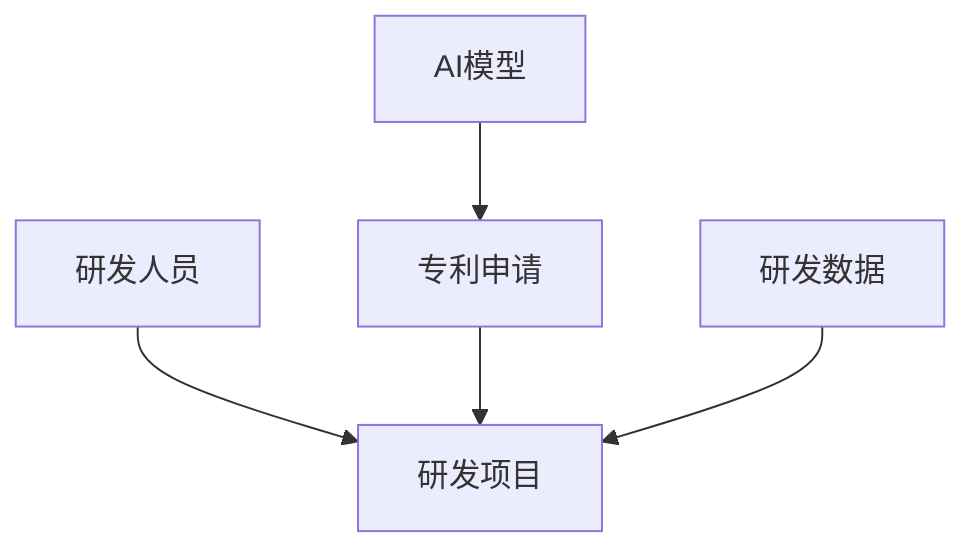
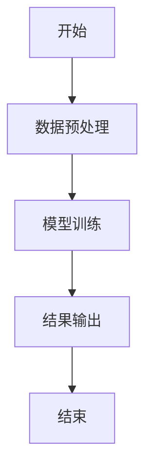
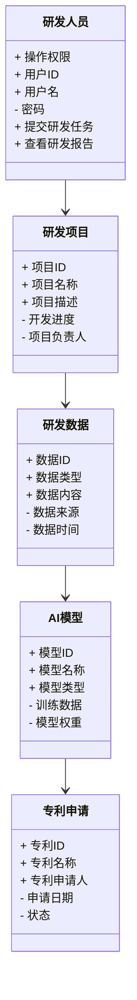
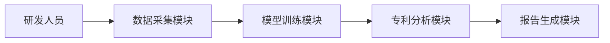
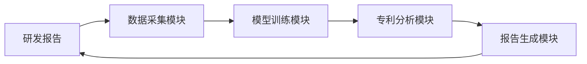

                 


# 构建企业级AI研发助手：加速创新与专利申请流程

> 关键词：企业级AI研发助手，AI算法，专利申请，系统架构设计，创新加速，研发效率

> 摘要：本文将详细探讨如何构建一个高效的企业级AI研发助手，通过AI技术加速创新与专利申请流程。文章从背景介绍、核心概念、算法原理、系统架构设计、项目实战、最佳实践等多个维度进行分析，结合实际案例，深入剖析构建企业级AI研发助手的关键技术和实现方法，为企业提供实用的解决方案。

---

# 第一部分: 企业级AI研发助手的背景与概念

## 第1章: 企业级AI研发助手的背景与问题背景

### 1.1 问题背景

#### 1.1.1 企业AI研发面临的挑战

在当前快速发展的科技领域，企业面临着越来越大的创新压力。研发部门需要在有限的时间和资源内，快速完成高质量的研发任务。然而，传统的人工研发模式存在以下问题：

- **研发效率低下**：研发人员需要手动处理大量的数据、文献检索和实验设计，效率难以提升。
- **专利申请复杂**：专利申请过程繁琐，需要专业的知识产权人员参与，且容易遗漏关键信息。
- **资源浪费**：研发过程中可能存在重复劳动，资源利用率低。

#### 1.1.2 创新与专利申请的效率瓶颈

企业在创新过程中，常常需要投入大量的人力和时间来完成研发任务。同时，专利申请的过程也充满了复杂性：

- **专利检索耗时**：研发人员需要花费大量时间查找相关领域的专利，以避免重复发明。
- **专利撰写困难**：专利文档的撰写需要专业的知识和技巧，非专业人员难以完成。
- **专利布局不足**：由于时间和资源的限制，企业可能无法全面布局专利，导致知识产权保护不足。

#### 1.1.3 传统研发模式的局限性

传统研发模式主要依赖人工操作，存在以下局限性：

- **效率低**：研发人员需要手动处理大量数据，效率难以提升。
- **资源浪费**：研发过程中可能存在重复劳动，资源利用率低。
- **创新不足**：由于时间和资源的限制，企业可能无法充分挖掘创新潜力。

### 1.2 问题描述

#### 1.2.1 研发流程中的痛点分析

企业在研发过程中，常常面临以下痛点：

- **研发周期长**：从研发到专利申请，整个流程耗时较长。
- **研发成本高**：需要投入大量的人力和资源。
- **创新不足**：由于时间和资源的限制，企业可能无法充分挖掘创新潜力。

#### 1.2.2 专利申请中的效率问题

专利申请过程中存在的效率问题包括：

- **专利检索耗时**：需要花费大量时间查找相关领域的专利。
- **专利撰写困难**：专利文档的撰写需要专业的知识和技巧。
- **专利布局不足**：由于时间和资源的限制，企业可能无法全面布局专利。

#### 1.2.3 企业创新需求与资源分配的矛盾

企业在创新需求与资源分配之间常常存在矛盾：

- **资源有限**：企业需要在有限的资源内完成更多的研发任务。
- **创新压力大**：市场竞争的加剧，企业需要更快地推出新产品。
- **资源分配不当**：资源分配不合理，可能导致某些关键项目无法顺利推进。

### 1.3 问题解决

#### 1.3.1 AI技术在研发中的应用潜力

AI技术在研发中的应用潜力巨大：

- **自动化处理**：AI可以自动化处理大量的数据和文献检索，提高研发效率。
- **智能推荐**：AI可以为研发人员提供智能推荐，帮助他们更快地找到相关资料。
- **预测分析**：AI可以预测实验结果，优化研发流程。

#### 1.3.2 AI研发助手的核心价值

AI研发助手的核心价值体现在以下几个方面：

- **提高研发效率**：通过自动化处理和智能推荐，缩短研发周期。
- **降低研发成本**：减少人力投入，节省研发成本。
- **提升创新质量**：通过智能推荐和数据分析，提高研发成果的质量。

#### 1.3.3 企业级AI研发助手的目标与意义

企业级AI研发助手的目标是：

- **加速研发流程**：通过自动化和智能化手段，缩短研发周期。
- **提高研发质量**：通过智能推荐和数据分析，提升研发成果的质量。
- **优化资源配置**：通过合理分配资源，提高资源利用率。

### 1.4 边界与外延

#### 1.4.1 企业级AI研发助手的边界

企业级AI研发助手的边界包括：

- **功能边界**：仅限于研发和专利申请相关的功能，不涉及企业的其他业务。
- **用户边界**：仅限于企业的研发人员和知识产权相关人员。
- **数据边界**：仅限于研发相关的数据，不涉及企业的其他数据。

#### 1.4.2 相关概念的对比与区分

与传统研发工具相比，企业级AI研发助手有以下区别：

- **功能差异**：传统工具主要提供基本的开发环境，而AI研发助手提供智能化的辅助功能。
- **效率差异**：传统工具效率较低，而AI研发助手通过自动化和智能化提高效率。
- **应用场景差异**：传统工具适用于所有开发场景，而AI研发助手主要适用于需要创新和专利申请的场景。

#### 1.4.3 与传统研发模式的异同

与传统研发模式相比，AI研发助手有以下异同：

- **相同点**：都需要研发人员的参与，都需要处理研发相关的数据。
- **不同点**：AI研发助手通过自动化和智能化手段，提高研发效率和质量。

### 1.5 概念结构与核心要素

#### 1.5.1 核心要素组成

企业级AI研发助手的核心要素包括：

- **研发人员**：负责研发任务的执行。
- **研发项目**：需要完成的具体研发任务。
- **专利申请**：研发成果的知识产权保护。
- **研发数据**：研发过程中产生的各种数据。
- **AI模型**：用于辅助研发的智能模型。

#### 1.5.2 概念结构图



#### 1.5.3 核心要素的相互关系

- **研发人员与研发项目**：研发人员负责执行研发项目。
- **研发项目与研发数据**：研发项目需要处理研发数据。
- **研发项目与专利申请**：研发项目的结果需要通过专利申请进行保护。
- **专利申请与AI模型**：AI模型可以辅助专利申请的撰写和检索。

---

## 第2章: 企业级AI研发助手的核心概念

### 2.1 核心概念原理

#### 2.1.1 AI研发助手的工作原理

AI研发助手通过以下步骤辅助研发人员：

1. **数据预处理**：对研发数据进行清洗和整理。
2. **模型训练**：训练AI模型，使其能够理解和生成研发相关的文本。
3. **智能推荐**：根据研发人员的需求，推荐相关文献和实验方案。
4. **结果输出**：生成研发报告和专利申请文档。

#### 2.1.2 与传统研发工具的对比

与传统研发工具相比，AI研发助手的优势在于：

- **自动化**：能够自动处理大量数据和文献。
- **智能化**：能够提供智能推荐和预测。
- **高效性**：能够显著缩短研发周期。

#### 2.1.3 核心算法与技术支撑

AI研发助手的核心算法包括：

- **自然语言处理（NLP）**：用于处理研发相关的文本数据。
- **机器学习（ML）**：用于训练模型，预测实验结果。
- **深度学习（DL）**：用于提高模型的准确性和智能化水平。

### 2.2 核心概念属性特征对比

以下是核心概念的属性特征对比表格：

| **属性**       | **传统研发工具**       | **AI研发助手**       |
|----------------|------------------------|-----------------------|
| **功能**       | 基本开发功能           | 智能辅助研发功能       |
| **效率**       | 较低                   | 较高                  |
| **创新性**     | 依赖人工               | 自动化生成创新方案     |
| **适用场景**   | 所有研发场景           | 创新和专利申请场景     |

### 2.3 ER实体关系图

以下是核心概念的ER实体关系图：


---

## 第3章: 算法原理与实现

### 3.1 算法原理

#### 3.1.1 算法选择与优化

在选择算法时，我们需要考虑以下因素：

- **数据类型**：研发数据通常是文本数据，因此选择适合处理文本数据的算法。
- **任务类型**：研发任务通常涉及分类、聚类和生成任务，选择适合这些任务的算法。
- **性能要求**：需要保证算法的高效性，能够在较短时间内处理大量数据。

#### 3.1.2 算法流程图

以下是算法的流程图：



#### 3.1.3 数学模型与公式

以下是机器学习模型的数学模型：

$$
y = \theta x + b
$$

其中，\( y \) 是输出，\( \theta \) 是权重，\( x \) 是输入，\( b \) 是偏置。

### 3.2 算法实现

#### 3.2.1 Python源代码

以下是Python代码示例：

```python
import numpy as np

# 定义线性回归模型
class LinearRegression:
    def __init__(self, learning_rate=0.01, iterations=1000):
        self.lr = learning_rate
        self.iters = iterations
        self.theta = None
        self.b = None

    def fit(self, X, y):
        # 初始化参数
        self.theta = np.zeros(X.shape[1])
        self.b = 0

        for _ in range(self.iters):
            # 预测
            y_pred = np.dot(X, self.theta) + self.b
            # 计算误差
            error = y - y_pred
            # 更新参数
            self.theta += self.lr * np.dot(X.T, error)
            self.b += self.lr * np.mean(error)

    def predict(self, X):
        return np.dot(X, self.theta) + self.b

# 使用示例
X = np.array([[1, 2], [3, 4], [5, 6]])
y = np.array([7, 11, 15])

model = LinearRegression()
model.fit(X, y)
print(model.predict(X))
```

#### 3.2.2 代码应用解读与分析

上述代码实现了一个简单的线性回归模型，用于预测研发数据。通过训练模型，可以预测研发项目的结果，从而辅助研发人员进行决策。

---

## 第4章: 系统架构设计

### 4.1 问题场景介绍

企业在研发过程中，常常需要处理大量的研发数据和专利申请。为了提高效率，企业需要构建一个高效的系统，整合AI技术，辅助研发人员完成任务。

### 4.2 项目介绍

本项目旨在构建一个企业级AI研发助手，通过AI技术加速创新与专利申请流程。系统将包括以下几个模块：

- **数据采集模块**：负责采集研发相关的数据。
- **模型训练模块**：负责训练AI模型。
- **专利分析模块**：负责分析专利数据。
- **报告生成模块**：负责生成研发报告和专利申请文档。

### 4.3 系统功能设计

以下是系统功能设计的领域模型：



### 4.4 系统架构设计

以下是系统架构设计的Mermaid图：



### 4.5 系统接口设计

系统接口设计包括以下几个部分：

- **数据采集接口**：用于采集研发数据。
- **模型训练接口**：用于训练AI模型。
- **专利分析接口**：用于分析专利数据。
- **报告生成接口**：用于生成研发报告。

### 4.6 系统交互设计

以下是系统交互的Mermaid图：



---

## 第5章: 项目实战

### 5.1 环境安装

以下是项目实战所需的环境安装步骤：

1. **安装Python**：确保安装了Python 3.6或更高版本。
2. **安装依赖库**：安装以下依赖库：

```bash
pip install numpy matplotlib scikit-learn
```

### 5.2 系统核心实现

以下是系统核心实现的代码示例：

```python
import numpy as np
from sklearn.linear_model import LinearRegression as LR

# 数据准备
X = np.array([[1, 2], [3, 4], [5, 6]])
y = np.array([7, 11, 15])

# 模型训练
model = LR()
model.fit(X, y)

# 预测
print(model.predict(X))
```

### 5.3 代码应用解读与分析

上述代码实现了线性回归模型，用于预测研发数据。通过训练模型，可以预测研发项目的结果，从而辅助研发人员进行决策。

### 5.4 实际案例分析

以下是实际案例分析的详细步骤：

1. **数据准备**：收集研发相关的数据。
2. **模型训练**：训练AI模型。
3. **结果输出**：生成研发报告和专利申请文档。

### 5.5 项目小结

通过本项目，我们可以看到AI技术在研发中的巨大潜力。通过构建企业级AI研发助手，可以显著提高研发效率和质量，缩短研发周期，降低研发成本。

---

## 第6章: 最佳实践与小结

### 6.1 最佳实践

在构建企业级AI研发助手时，需要注意以下几点：

- **数据质量**：确保数据的准确性和完整性。
- **模型优化**：不断优化模型，提高预测准确率。
- **安全性**：确保数据的安全性，防止数据泄露。

### 6.2 小结

通过本文的分析，我们可以看到AI技术在研发中的巨大潜力。通过构建企业级AI研发助手，可以显著提高研发效率和质量，缩短研发周期，降低研发成本。同时，AI技术还可以帮助企业更好地布局专利，保护知识产权。

### 6.3 注意事项

在实际应用中，需要注意以下几点：

- **数据隐私**：确保数据的隐私性和安全性。
- **模型更新**：定期更新模型，以适应新的数据和需求。
- **用户培训**：对研发人员进行培训，确保他们能够正确使用AI研发助手。

### 6.4 拓展阅读

以下是一些拓展阅读资料：

- 《机器学习实战》
- 《深度学习入门》
- 《自然语言处理入门》

---

# 第六部分: 附录

## 附录A: 参考文献

1. 《机器学习实战》
2. 《深度学习入门》
3. 《自然语言处理入门》

## 附录B: 工具与库

- **Python**：编程语言
- **NumPy**：数值计算库
- **Scikit-learn**：机器学习库
- **Mermaid**：图表工具

---

# 作者：AI天才研究院/AI Genius Institute & 禅与计算机程序设计艺术 /Zen And The Art of Computer Programming

---

以上就是《构建企业级AI研发助手：加速创新与专利申请流程》的完整目录和文章内容。

