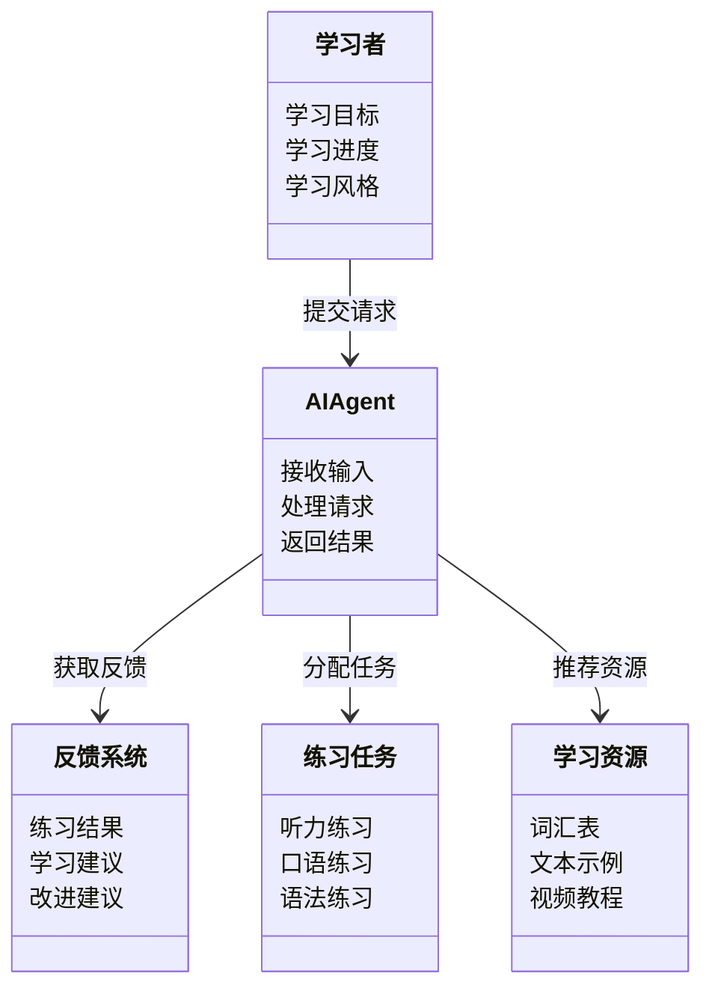
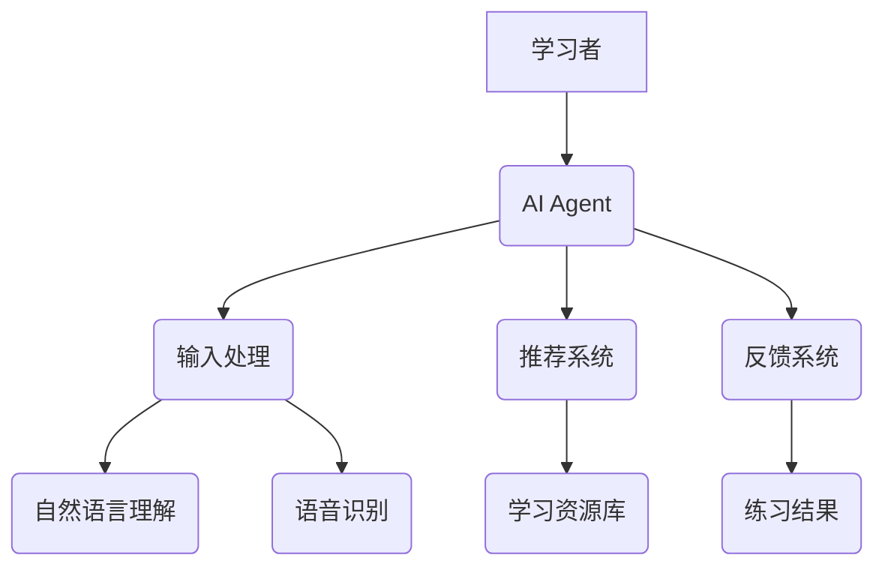

                 


---

# 《语言学习AI Agent：个性化外语教学助手》

---

## 关键词：
语言学习，AI Agent，个性化教学，自然语言处理，机器学习，推荐系统

---

## 摘要：
本文详细探讨了语言学习AI Agent的设计与实现，从背景需求、核心概念到算法原理、系统架构，再到项目实战和最佳实践，全面解析如何利用AI技术打造个性化的外语教学助手。通过自然语言处理、机器学习和推荐系统的结合，AI Agent能够根据学习者的个性特征和学习情况，提供定制化的学习方案，显著提升语言学习的效率与效果。

---

# 第1章: 语言学习AI Agent的背景与需求

## 1.1 语言学习的现状与挑战

### 1.1.1 当前语言学习的主要问题
语言学习是一个复杂的过程，涉及听、说、读、写等多种能力的培养。传统教学模式通常采用统一的教学计划和内容，难以满足不同学习者的个性化需求。以下是当前语言学习面临的主要问题：
- **学习者的个性化需求难以满足**：每个学习者的语言水平、学习风格和兴趣点都不同，统一的教学方式往往效果不佳。
- **学习资源繁多，难以筛选**：互联网上有海量的语言学习资源，但如何选择适合自己的资源是一个难题。
- **反馈机制不足**：学习者在学习过程中缺乏即时反馈，难以及时纠正错误或调整学习策略。

### 1.1.2 传统语言教学的局限性
传统语言教学主要依赖教师的讲解和学生的练习，这种方式存在以下局限性：
- **缺乏互动性**：学生与教师的互动有限，尤其在大规模教学中，难以实现个性化指导。
- **资源利用效率低**：教学资源通常是固定的，难以根据学生的学习进度和需求进行动态调整。
- **反馈滞后**：学生在练习中出现的错误不能立即得到纠正，导致错误习惯的形成。

### 1.1.3 学生个性化学习需求的多样性
学习者的个性化需求主要体现在以下几个方面：
- **学习目标的多样性**：有的学生希望提高听力，有的则希望加强写作能力。
- **学习风格的差异性**：有的学生更适合通过视觉学习，有的则更适合通过听觉或动手实践。
- **学习节奏的差异性**：有的学生学习速度快，有的则需要更多时间巩固知识点。

## 1.2 AI技术在教育领域的应用现状

### 1.2.1 AI在教育领域的典型应用
人工智能技术在教育领域的应用日益广泛，主要包括以下几个方面：
- **智能辅导系统**：通过AI技术为学生提供个性化的学习建议和辅导。
- **自动评分系统**：利用自然语言处理技术对学生的作文、口语等进行自动评分。
- **学习数据分析**：通过分析学生的学习数据，预测学习效果并优化教学策略。

### 1.2.2 语言学习中的AI技术应用案例
目前，AI技术在语言学习中的应用已经取得了显著成果，例如：
- **智能词典**：通过AI技术提供单词的多种释义、例句和用法。
- **智能对话练习**：通过语音识别和自然语言处理技术，为学生提供实时的对话练习和反馈。
- **自适应学习系统**：根据学生的学习情况动态调整学习内容和难度。

### 1.2.3 个性化教学的需求与AI的结合
个性化教学是语言学习的核心需求之一，而AI技术能够通过以下方式实现个性化教学：
- **学习者画像**：通过收集和分析学习者的学习数据，构建学习者画像，识别其学习风格和需求。
- **动态调整学习计划**：根据学习者的进步情况，动态调整学习内容和进度。
- **个性化反馈**：为每个学习者提供个性化的反馈和建议，帮助其克服学习中的难点。

## 1.3 语言学习AI Agent的定义与目标

### 1.3.1 语言学习AI Agent的定义
语言学习AI Agent是一种基于人工智能技术的智能助手，旨在为学习者提供个性化的语言学习支持。它能够通过自然语言处理、机器学习等技术，理解和分析学习者的需求，为其提供定制化的学习方案和实时反馈。

### 1.3.2 其核心功能与目标
语言学习AI Agent的核心功能包括：
- **智能诊断**：通过分析学习者的学习数据，识别其薄弱环节。
- **个性化推荐**：根据学习者的需求和特点，推荐适合的学习资源和练习任务。
- **实时反馈**：为学习者提供即时的练习反馈和建议。
- **自适应学习**：根据学习者的学习进度和效果，动态调整学习计划。

### 1.3.3 与传统教学工具的区别
与传统教学工具相比，语言学习AI Agent具有以下显著区别：
- **智能化**：能够通过AI技术实现智能化的交互和反馈。
- **个性化**：能够根据学习者的需求提供个性化的学习支持。
- **动态调整**：能够根据学习者的学习情况动态调整教学策略。

## 1.4 本章小结
本章从语言学习的现状与挑战出发，分析了传统教学模式的局限性，介绍了AI技术在教育领域的应用现状，并提出了语言学习AI Agent的定义和目标。通过对比传统教学工具，明确了语言学习AI Agent的独特优势和价值。

---

# 第2章: 语言学习AI Agent的核心概念与技术

## 2.1 自然语言处理（NLP）基础

### 2.1.1 NLP的基本概念与技术
自然语言处理（NLP）是人工智能的重要分支，旨在让计算机能够理解、处理和生成人类语言。NLP的核心技术包括：
- **分词**：将连续的文本分割成词语或短语。
- **词性标注**：给每个词语标注其词性（如名词、动词、形容词等）。
- **句法分析**：分析句子的语法结构。
- **语义理解**：理解文本的语义含义。

### 2.1.2 常见NLP任务与模型
在语言学习AI Agent中，常见的NLP任务包括：
- **文本分类**：将文本分为不同的类别（如积极、消极、中性）。
- **命名实体识别**：识别文本中的专有名词（如人名、地名、组织名）。
- **问答系统**：根据问题提供答案。

主流的NLP模型包括：
- **BERT**：由Google开发的 transformer 基础架构，用于各种NLP任务。
- **GPT**：由OpenAI开发的生成式模型，能够生成连贯的文本。

### 2.1.3 NLP在语言学习中的应用
在语言学习中，NLP技术可以应用于以下方面：
- **智能词典**：为学习者提供单词的多种释义、例句和用法。
- **智能对话练习**：通过语音识别和自然语言处理技术，为学生提供实时的对话练习和反馈。
- **文本分析**：分析学习者的作文，指出语法错误和改进建议。

## 2.2 机器学习与深度学习在AI Agent中的应用

### 2.2.1 机器学习的基本原理
机器学习是一种人工智能技术，通过数据训练模型，使其能够从数据中学习规律并进行预测或分类。机器学习的核心步骤包括：
1. 数据收集与预处理
2. 模型训练
3. 模型评估与优化

### 2.2.2 深度学习模型在AI Agent中的作用
深度学习是一种机器学习技术，通过多层神经网络来学习数据的特征。在语言学习AI Agent中，深度学习模型可以用于：
- **语音识别**：将语音转换为文字。
- **文本生成**：生成连贯的文本，如对话或作文。
- **情感分析**：分析文本中的情感倾向。

### 2.2.3 个性化学习推荐系统
个性化推荐系统是语言学习AI Agent的重要组成部分，其核心是通过分析学习者的行为和偏好，为其推荐适合的学习资源和练习任务。推荐系统的主要步骤包括：
1. **数据收集**：收集学习者的学习数据，包括学习内容、学习时间、练习结果等。
2. **用户画像构建**：根据学习数据构建用户画像，识别学习者的特点和需求。
3. **推荐策略制定**：根据用户画像和学习目标，制定个性化的推荐策略。
4. **推荐结果输出**：向学习者推荐适合的学习资源和练习任务。

## 2.3 个性化学习推荐系统

### 2.3.1 推荐系统的定义与原理
推荐系统是一种信息过滤技术，旨在为用户推荐与其兴趣相符的内容。在语言学习中，推荐系统可以用于推荐学习资源、练习任务等。

### 2.3.2 个性化学习推荐系统的构建
个性化学习推荐系统的构建步骤包括：
1. **数据收集**：收集学习者的学习数据，包括学习内容、学习时间、练习结果等。
2. **用户画像构建**：根据学习数据构建用户画像，识别学习者的特点和需求。
3. **推荐策略制定**：根据用户画像和学习目标，制定个性化的推荐策略。
4. **推荐结果输出**：向学习者推荐适合的学习资源和练习任务。

### 2.3.3 推荐系统的评估与优化
推荐系统的评估指标包括准确率、召回率、F1值等。为了优化推荐系统，可以采用以下方法：
- **基于协同过滤的推荐**：根据其他学习者的行为推荐学习资源。
- **基于内容的推荐**：根据学习资源的内容特征推荐相关资源。
- **混合推荐**：结合协同过滤和内容推荐的优点，提供更准确的推荐。

## 2.4 本章小结
本章详细介绍了语言学习AI Agent的核心概念与技术，包括自然语言处理、机器学习和个性化推荐系统。通过分析这些技术在语言学习中的应用，为后续的算法实现奠定了理论基础。

---

# 第3章: 语言学习AI Agent的核心算法与模型

## 3.1 自然语言处理模型

### 3.1.1 基于词嵌入的模型
词嵌入是一种将词语表示为低维向量的技术，常用的词嵌入模型包括Word2Vec、GloVe和FastText。这些模型能够捕捉词语之间的语义关系，为自然语言处理任务提供有效的向量表示。

### 3.1.2 基于Transformers的模型
Transformers是一种基于注意力机制的深度学习模型，近年来在自然语言处理领域取得了显著成果。主流的Transformers模型包括BERT、GPT、RoBERTa等。这些模型能够处理长文本，捕捉上下文信息，适用于多种NLP任务。

### 3.1.3 NLP在语言学习中的应用
在语言学习中，NLP技术可以应用于以下方面：
- **智能词典**：为学习者提供单词的多种释义、例句和用法。
- **智能对话练习**：通过语音识别和自然语言处理技术，为学生提供实时的对话练习和反馈。
- **文本分析**：分析学习者的作文，指出语法错误和改进建议。

## 3.2 机器学习与深度学习在AI Agent中的应用

### 3.2.1 机器学习的基本原理
机器学习是一种人工智能技术，通过数据训练模型，使其能够从数据中学习规律并进行预测或分类。机器学习的核心步骤包括：
1. 数据收集与预处理
2. 模型训练
3. 模型评估与优化

### 3.2.2 深度学习模型在AI Agent中的作用
深度学习是一种机器学习技术，通过多层神经网络来学习数据的特征。在语言学习AI Agent中，深度学习模型可以用于：
- **语音识别**：将语音转换为文字。
- **文本生成**：生成连贯的文本，如对话或作文。
- **情感分析**：分析文本中的情感倾向。

### 3.2.3 个性化学习推荐系统
个性化推荐系统是语言学习AI Agent的重要组成部分，其核心是通过分析学习者的行为和偏好，为其推荐适合的学习资源和练习任务。推荐系统的主要步骤包括：
1. **数据收集**：收集学习者的学习数据，包括学习内容、学习时间、练习结果等。
2. **用户画像构建**：根据学习数据构建用户画像，识别学习者的特点和需求。
3. **推荐策略制定**：根据用户画像和学习目标，制定个性化的推荐策略。
4. **推荐结果输出**：向学习者推荐适合的学习资源和练习任务。

## 3.3 算法原理讲解

### 3.3.1 基于Transformers的文本生成算法
文本生成是语言学习AI Agent的重要功能之一，常用算法包括GPT和BERT。以GPT为例，其生成文本的步骤如下：
1. **输入处理**：将输入文本转换为模型能够处理的格式。
2. **注意力计算**：计算每个词与其他词的注意力权重。
3. **前向传播**：通过多层神经网络进行前向传播，生成预测的下一个词。
4. **输出生成**：根据预测结果生成完整的文本。

### 3.3.2 基于协同过滤的推荐算法
协同过滤是一种基于用户行为的推荐算法，主要步骤包括：
1. **数据收集**：收集学习者的学习数据，包括学习内容、学习时间、练习结果等。
2. **用户相似度计算**：通过计算用户之间的相似度，找到与目标用户行为相似的用户。
3. **推荐结果生成**：根据相似用户的偏好，推荐目标用户可能感兴趣的学习资源。

### 3.3.3 算法实现的代码示例
以下是基于协同过滤的推荐算法的Python代码示例：

```python
import numpy as np

# 假设我们有一个用户-物品的评分矩阵，其中users是用户列表，items是物品列表
users = ['User1', 'User2', 'User3']
items = ['Item1', 'Item2', 'Item3']
ratings = {
    'User1': {'Item1': 5, 'Item2': 3, 'Item3': 4},
    'User2': {'Item1': 3, 'Item2': 5, 'Item3': 2},
    'User3': {'Item1': 4, 'Item2': 2, 'Item3': 5}
}

# 计算用户之间的相似度
def compute_similarity(users, items, ratings):
    # 计算每个用户的评分向量
    user_vectors = {}
    for user in users:
        vector = []
        for item in items:
            vector.append(ratings[user].get(item, 0))
        user_vectors[user] = vector
    # 计算用户之间的余弦相似度
    similarity = {}
    for i in range(len(users)):
        user_i = users[i]
        similarity[user_i] = {}
        for j in range(len(users)):
            if i == j:
                similarity[user_i][users[j]] = 0
                continue
            vec_i = user_vectors[user_i]
            vec_j = user_vectors[users[j]]
            # 计算余弦相似度
            dot_product = np.dot(vec_i, vec_j)
            norm_i = np.linalg.norm(vec_i)
            norm_j = np.linalg.norm(vec_j)
            if norm_i == 0 or norm_j == 0:
                similarity[user_i][users[j]] = 0
            else:
                similarity[user_i][users[j]] = dot_product / (norm_i * norm_j)
    return similarity

similarity_matrix = compute_similarity(users, items, ratings)

# 根据相似度推荐物品
def recommend_items(user, similarity_matrix, items, ratings, k=2):
    # 找出与目标用户相似度最高的k个用户
    similar_users = sorted(similarity_matrix[user].items(), key=lambda x: x[1], reverse=True)[:k]
    # 收集所有相似用户的推荐物品
    recommended_items = set()
    for similar_user in similar_users:
        similar_user_ratings = ratings[similar_user[0]]
        for item, rating in similar_user_ratings.items():
            if rating > 3:  # 假设推荐评分大于3的物品
                recommended_items.add(item)
    return list(recommended_items)

# 示例推荐
target_user = 'User1'
recommended_items = recommend_items(target_user, similarity_matrix, items, ratings, k=2)
print(f"推荐给 {target_user} 的物品为：{recommended_items}")
```

### 3.3.4 算法的数学模型
协同过滤的数学模型可以表示为：
$$
\text{相似度}(u1, u2) = \frac{\sum_{i=1}^{n} (r_{u1,i} \times r_{u2,i})}{\sqrt{\sum_{i=1}^{n} r_{u1,i}^2} \times \sqrt{\sum_{i=1}^{n} r_{u2,i}^2}}}
$$
其中，$r_{u1,i}$ 表示用户u1对物品i的评分，$r_{u2,i}$ 表示用户u2对物品i的评分。

---

# 第4章: 语言学习AI Agent的系统架构与设计

## 4.1 系统功能设计

### 4.1.1 领域模型
领域模型是系统功能设计的重要组成部分，用于描述系统的功能模块和它们之间的关系。以下是语言学习AI Agent的领域模型：



### 4.1.2 功能模块划分
语言学习AI Agent的功能模块可以划分为以下几个部分：
- **输入模块**：接收学习者的输入，包括文本、语音等。
- **处理模块**：对输入进行处理，包括自然语言理解、语音识别等。
- **推荐模块**：根据学习者的特征和需求，推荐适合的学习资源和练习任务。
- **反馈模块**：提供练习反馈和学习建议。

## 4.2 系统架构设计

### 4.2.1 系统模块划分
语言学习AI Agent的系统架构可以划分为以下几个模块：
- **用户界面层**：包括输入界面和输出界面，用于与学习者交互。
- **业务逻辑层**：包括输入处理、推荐系统、反馈系统等功能模块。
- **数据存储层**：包括学习者数据、学习资源、练习任务等数据的存储和管理。

### 4.2.2 系统架构设计
以下是语言学习AI Agent的系统架构图：



### 4.2.3 接口设计
语言学习AI Agent的接口设计需要考虑以下几个方面：
- **输入接口**：包括文本输入和语音输入。
- **输出接口**：包括文本输出和语音输出。
- **数据接口**：包括学习者数据、学习资源、练习任务等数据的接口。

## 4.3 本章小结
本章详细介绍了语言学习AI Agent的系统架构与设计，包括功能模块划分、系统架构设计和接口设计。通过系统的架构设计，为后续的实现奠定了基础。

---

# 第5章: 语言学习AI Agent的项目实战

## 5.1 环境搭建

### 5.1.1 开发工具安装
语言学习AI Agent的开发需要以下工具：
- **Python**：推荐使用最新版本的Python。
- **深度学习框架**：如TensorFlow、PyTorch。
- **自然语言处理库**：如spaCy、NLTK。
- **语音处理库**：如SpeechRecognition、pydub。

### 5.1.2 项目依赖管理
使用`pipenv`进行项目依赖管理：
```bash
pipenv install python>=3.8
pipenv install numpy
pipenv install tensorflow
pipenv install pytorch
pipenv install spacy
```

## 5.2 系统核心实现

### 5.2.1 自然语言处理模块实现
以下是自然语言处理模块的核心代码：

```python
import spacy

# 加载中文模型
nlp = spacy.load("zh_core_web_sm")

# 分词示例
text = "今天天气真好，我想去公园散步。"
doc = nlp(text)
for token in doc:
    print(token.text, token.pos_, token.lemma_)
```

### 5.2.2 机器学习模块实现
以下是机器学习模块的核心代码：

```python
from sklearn.feature_extraction.text import TfidfVectorizer
from sklearn.svm import SVC

# 数据准备
texts = ["这是一个测试文本。", "这是另一个测试文本。"]
y = [0, 1]

# 特征提取
vectorizer = TfidfVectorizer()
X = vectorizer.fit_transform(texts)

# 模型训练
model = SVC()
model.fit(X, y)

# 模型预测
test_text = "这是测试文本。"
test_X = vectorizer.transform([test_text])
print(model.predict(test_X))
```

## 5.3 项目实战案例分析

### 5.3.1 案例背景介绍
假设我们有一个语言学习AI Agent，旨在帮助学习者提高英语听说能力。

### 5.3.2 系统实现与分析
以下是系统的实现步骤：
1. **数据收集**：收集学习者的英语对话录音和文本。
2. **语音识别**：使用深度学习模型将语音转换为文本。
3. **自然语言理解**：分析对话内容，识别学习者的问题和需求。
4. **推荐系统**：根据分析结果，推荐相关的学习资源和练习任务。

### 5.3.3 系统优化与改进
系统优化的关键点包括：
- **模型优化**：通过调整模型参数和优化算法，提高识别和理解的准确率。
- **用户体验优化**：设计友好的用户界面，提高系统的易用性。
- **数据安全与隐私保护**：确保学习者数据的安全与隐私。

## 5.4 本章小结
本章通过实际案例分析，详细介绍了语言学习AI Agent的项目实战，包括环境搭建、系统实现和案例分析。通过这些实战，读者可以更好地理解理论知识，并掌握实际操作技能。

---

# 第6章: 语言学习AI Agent的最佳实践与未来展望

## 6.1 最佳实践

### 6.1.1 小结
语言学习AI Agent的设计与实现需要遵循以下原则：
- **以用户为中心**：始终关注学习者的需求和体验。
- **数据驱动**：通过数据驱动的方式优化系统性能。
- **持续改进**：根据用户反馈和数据不断优化系统。

### 6.1.2 注意事项
在实际应用中，需要注意以下几点：
- **数据隐私**：确保学习者数据的安全与隐私。
- **模型可解释性**：提高模型的可解释性，便于用户理解和信任。
- **多模态融合**：结合文本、语音、图像等多种模态信息，提供更全面的学习支持。

### 6.1.3 拓展阅读
推荐阅读以下书籍和论文：
- 《Deep Learning》（Ian Goodfellow等著）
- 《Natural Language Processing with PyTorch》（Abhishek Thakur著）
- 《推荐系统实践》（郑志刚著）

## 6.2 未来展望

### 6.2.1 技术趋势
未来，语言学习AI Agent可能会朝着以下几个方向发展：
- **多模态学习**：结合文本、语音、图像等多种模态信息，提供更全面的学习支持。
- **增强学习**：通过增强学习技术，提高系统的自适应能力和智能水平。
- **人机协作**：实现更自然的人机协作，增强学习者与AI Agent的互动体验。

### 6.2.2 应用场景
随着技术的进步，语言学习AI Agent可能会在以下场景中得到广泛应用：
- **在线教育**：为在线学习者提供个性化的学习支持。
- **企业培训**：为企业员工提供定制化的语言培训。
- **语言考试准备**：帮助学习者备考各类语言考试。

## 6.3 本章小结
本章总结了语言学习AI Agent的最佳实践，并展望了未来的发展方向。通过不断的技术创新和实践积累，语言学习AI Agent有望成为语言学习领域的重要工具，为学习者提供更高效、更个性化的学习支持。

---

# 作者：AI天才研究院/AI Genius Institute & 禅与计算机程序设计艺术 /Zen And The Art of Computer Programming

