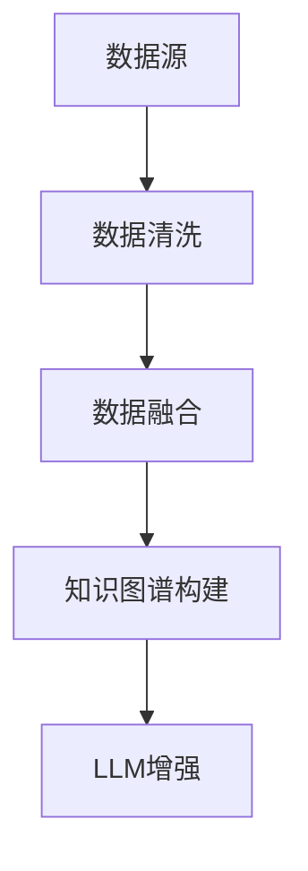

                 


# AI Agent 的知识融合：整合多源信息增强 LLM

> **关键词**：AI Agent，知识融合，大型语言模型，多源信息，知识图谱，LLM增强

> **摘要**：  
本文详细探讨了AI Agent如何通过知识融合技术整合多源信息，从而增强大型语言模型（LLM）的能力。文章从AI Agent和知识融合的基本概念出发，分析了多源异构数据的处理方法，详细阐述了知识图谱的构建与应用，提出了基于知识图谱的LLM增强算法。最后，通过项目实战展示了知识融合在实际应用中的效果，并总结了相关经验和未来发展方向。

---

# 第一部分: AI Agent 的知识融合基础

## 第1章: AI Agent与知识融合概述

### 1.1 AI Agent的基本概念

#### 1.1.1 AI Agent的定义  
AI Agent（人工智能代理）是指能够感知环境、自主决策并执行任务的智能实体。它可以是一个软件程序、机器人或其他智能系统，核心目标是通过与环境交互来实现特定目标。

#### 1.1.2 AI Agent的核心特征  
- **自主性**：无需外部干预，自主完成任务。  
- **反应性**：能够感知环境并实时调整行为。  
- **目标导向**：所有行为均以实现特定目标为导向。  
- **社交能力**：能够与其他Agent或人类进行交互协作。

#### 1.1.3 AI Agent与传统AI的区别  
AI Agent与传统AI（如专家系统）的区别在于，AI Agent具有更强的自主性和适应性，能够动态调整策略以应对复杂环境。

---

### 1.2 大型语言模型（LLM）的基础

#### 1.2.1 LLM的定义与特点  
大型语言模型（LLM）是指基于深度学习的自然语言处理模型，具有亿级别参数规模，能够理解并生成人类语言。其特点包括：  
- **大规模参数**：通常拥有数十亿甚至更多的参数。  
- **多任务能力**：可以通过微调完成多种NLP任务（如文本生成、问答系统等）。  
- **上下文理解**：能够捕捉文本中的语义信息并生成连贯的输出。

#### 1.2.2 LLM的主要应用场景  
- **文本生成**：新闻报道、文章创作等。  
- **问答系统**：智能客服、知识问答等。  
- **对话系统**：智能音箱、聊天机器人等。  
- **代码生成**：自动生成程序代码。  

#### 1.2.3 LLM与AI Agent的关系  
AI Agent可以通过LLM实现自然语言交互，而LLM则通过AI Agent的环境感知能力增强其应用场景和效果。

---

### 1.3 知识融合的背景与意义

#### 1.3.1 知识融合的概念  
知识融合是指将来自不同来源的信息进行整合，消除冲突并形成一致的知识表示。

#### 1.3.2 知识融合的必要性  
- **解决信息孤岛问题**：多源数据通常分散在不同的系统中，难以协同使用。  
- **提升模型性能**：通过整合多源信息，可以为LLM提供更全面的上下文支持。  
- **增强决策能力**：知识融合使AI Agent能够基于更丰富的信息做出更明智的决策。

#### 1.3.3 知识融合的目标与价值  
- **目标**：构建统一、一致、完整的知识表示。  
- **价值**：提升AI Agent的智能水平和应用场景的广度。

---

## 第2章: 知识融合的核心概念

### 2.1 知识融合的基本原理

#### 2.1.1 知识融合的定义  
知识融合是将多个来源的信息进行整合，形成统一的知识表示的过程。

#### 2.1.2 知识融合的关键步骤  
1. 数据清洗与预处理。  
2. 数据匹配与对齐。  
3. 知识表示与建模。  
4. 冲突检测与协调。  

#### 2.1.3 知识融合的实现方式  
- **基于规则的方法**：通过预定义的规则进行信息匹配和整合。  
- **基于学习的方法**：利用机器学习模型自动学习知识融合的模式。  
- **混合方法**：结合规则和学习的方法，提高融合的准确性和效率。

---

### 2.2 多源信息的特点与挑战

#### 2.2.1 多源信息的定义  
多源信息是指来自不同数据源的信息，通常具有异构性、冗余性和不一致性。

#### 2.2.2 多源信息的异构性  
- **数据格式异构**：不同数据源可能采用不同的数据格式。  
- **语义异构**：同一概念在不同数据源中的表示可能不同。  
- **粒度异构**：数据的粒度（如粗粒度或细粒度）可能不同。

#### 2.2.3 多源信息的冲突与协调  
- **冲突检测**：识别不同数据源中的矛盾信息。  
- **冲突协调**：通过协商或规则消除冲突，形成一致的知识表示。

---

### 2.3 知识图谱与知识融合的关系

#### 2.3.1 知识图谱的定义  
知识图谱是一种以图结构形式表示知识的语义网络，节点表示实体或概念，边表示实体之间的关系。

#### 2.3.2 知识图谱的构建过程  
1. 数据抽取与实体识别。  
2. 实体关系抽取。  
3. 知识图谱的存储与管理。  

#### 2.3.3 知识融合在知识图谱中的应用  
- **数据整合**：将来自不同数据源的信息整合到知识图谱中。  
- **知识补全**：通过融合信息填补知识图谱中的空白。  
- **语义增强**：通过融合上下文信息提升知识图谱的语义丰富性。

---

## 第3章: 多源异构数据的处理

### 3.1 数据清洗与预处理

#### 3.1.1 数据清洗的定义  
数据清洗是指对数据进行去噪、填补缺失值和标准化等处理，确保数据的质量。

#### 3.1.2 数据清洗的步骤  
1. 识别并删除噪声数据。  
2. 补充缺失值。  
3. 标准化数据格式。  

#### 3.1.3 数据清洗的工具与方法  
- **工具**：Python的Pandas库、数据清洗工具如DataCleaner。  
- **方法**：基于规则的清洗、统计方法清洗等。

---

### 3.2 数据融合的策略

#### 3.2.1 数据融合的定义  
数据融合是指将多个数据源的信息整合到一个统一的表示中。

#### 3.2.2 数据融合的策略选择  
- **基于规则的策略**：通过预定义的规则进行数据匹配。  
- **基于学习的策略**：利用机器学习模型自动学习数据融合的模式。  
- **混合策略**：结合规则和学习的方法，提高融合的准确性和效率。

#### 3.2.3 数据融合的实现方法  
- **基于特征匹配**：通过数据的特征进行匹配和对齐。  
- **基于语义匹配**：通过语义分析进行匹配和对齐。  

---

### 3.3 数据异构性的处理

#### 3.3.1 数据异构性的定义  
数据异构性是指不同数据源之间的数据格式、语义或粒度的差异。

#### 3.3.2 数据异构性的分类  
- **格式异构**：数据格式不同（如文本、结构化数据）。  
- **语义异构**：同一概念在不同数据源中的表示不同。  
- **粒度异构**：数据的粒度不同（如粗粒度和细粒度）。  

#### 3.3.3 数据异构性的处理方法  
- **格式统一**：将不同格式的数据转换为统一格式。  
- **语义映射**：通过映射表或模型将不同语义的数据统一起来。  
- **粒度调整**：通过聚合或拆分操作调整数据的粒度。

---

## 第4章: 知识图谱的构建与应用

### 4.1 知识图谱的构建过程

#### 4.1.1 数据抽取与实体识别  
- **数据抽取**：从文本、数据库等数据源中抽取信息。  
- **实体识别**：识别文本中的实体（如人名、地名等）。  

#### 4.1.2 实体关系抽取  
- **关系抽取**：识别实体之间的关系（如“是”、“属于”等）。  
- **关系建模**：将关系表示为图中的边。

#### 4.1.3 知识图谱的存储与管理  
- **存储**：使用图数据库（如Neo4j）存储知识图谱。  
- **管理**：通过版本控制和访问控制管理知识图谱。

---

### 4.2 知识图谱的应用场景

#### 4.2.1 知识图谱在LLM中的应用  
- **上下文理解**：通过知识图谱为LLM提供更丰富的上下文信息。  
- **实体链接**：通过知识图谱实现实体的准确链接。  

#### 4.2.2 知识图谱在AI Agent中的应用  
- **知识推理**：通过知识图谱进行推理，增强AI Agent的决策能力。  
- **多轮对话**：通过知识图谱支持多轮对话的连贯性。  

#### 4.2.3 知识图谱的其他应用场  
- **智能问答**：通过知识图谱提供更准确的答案。  
- **推荐系统**：通过知识图谱进行个性化推荐。

---

## 第5章: 基于知识图谱的LLM增强算法

### 5.1 算法原理

#### 5.1.1 算法流程图  


#### 5.1.2 算法步骤  
1. 数据清洗与预处理。  
2. 数据融合与对齐。  
3. 知识图谱构建。  
4. 知识图谱与LLM的集成。  

---

### 5.2 算法实现

#### 5.2.1 数据融合的Python代码示例  
```python
import pandas as pd

def data_cleaning(data):
    # 删除空值
    data = data.dropna()
    # 填补缺失值
    data['age'].fillna(data['age'].mean(), inplace=True)
    return data

# 示例数据
data = pd.DataFrame({
    'name': ['A', 'B', 'C'],
    'age': [25, None, 30]
})

# 数据清洗
cleaned_data = data_cleaning(data)
print(cleaned_data)
```

#### 5.2.2 知识图谱构建的代码示例  
```python
from neo4j import GraphDatabase

# 连接知识图谱
driver = GraphDatabase.driver('bolt://localhost:7687', auth=('user', 'password'))

# 插入数据
def add_entity(tx, entity_name):
    tx.run("CREATE (:Entity {name: $entity_name})", entity_name=entity_name)

with driver.session() as session:
    session.write_transaction(add_entity, 'Alice')
    session.write_transaction(add_entity, 'Bob')
```

---

## 第6章: 项目实战

### 6.1 环境配置

#### 6.1.1 环境需求  
- **Python 3.8+**  
- **TensorFlow/PyTorch**  
- **Neo4j图数据库**  

#### 6.1.2 安装依赖  
```bash
pip install neo4j python neo4j tensorflow
```

---

### 6.2 系统核心实现

#### 6.2.1 数据融合与知识图谱构建  
```python
import neo4j
from neo4j.exceptions import Neo4jError

# 数据融合
def data_fusion(data1, data2):
    # 数据清洗
    data1 = data_cleaning(data1)
    data2 = data_cleaning(data2)
    # 数据融合
    fused_data = pd.merge(data1, data2, on='id')
    return fused_data

# 知识图谱构建
def build_kg(fused_data):
    with driver.session() as session:
        for index, row in fused_data.iterrows():
            session.write_transaction(add_entity, row['name'])
            session.write_transaction(add_relation, row['relation'])
```

---

### 6.3 实际案例分析

#### 6.3.1 案例背景  
假设我们有来自多个数据源的公司信息，需要构建一个公司知识图谱。

#### 6.3.2 数据融合与知识图谱构建  
```python
# 示例数据
data1 = pd.DataFrame({
    'id': [1, 2, 3],
    'name': ['A公司', 'B公司', 'C公司']
})

data2 = pd.DataFrame({
    'id': [1, 2, 4],
    'industry': ['科技', '金融', '教育']
})

# 数据融合
fused_data = data_fusion(data1, data2)

# 知识图谱构建
build_kg(fused_data)
```

---

## 第7章: 总结与展望

### 7.1 总结

#### 7.1.1 核心观点回顾  
- AI Agent通过知识融合技术可以显著增强LLM的能力。  
- 知识图谱是实现知识融合的重要工具。  
- 数据融合与知识图谱构建是知识融合的关键步骤。

#### 7.1.2 最佳实践 tips  
- 数据清洗是知识融合的基础，必须重视数据质量。  
- 在实际应用中，建议结合具体场景选择合适的知识融合方法。  

---

### 7.2 注意事项

#### 7.2.1 数据隐私与安全  
在进行数据融合时，必须注意数据的隐私和安全问题。

#### 7.2.2 知识图谱的可扩展性  
在构建知识图谱时，需要考虑其可扩展性，以应对未来数据的增长。

---

### 7.3 未来展望

#### 7.3.1 知识融合的未来趋势  
- **智能化**：通过AI技术实现更智能的知识融合。  
- **实时化**：实现实时的知识融合与更新。  

#### 7.3.2 知识图谱的应用拓展  
- **跨领域应用**：知识图谱在医疗、金融等领域的深度应用。  
- **知识图谱的语义增强**：通过多模态数据提升知识图谱的语义丰富性。

---

**作者：AI天才研究院/AI Genius Institute & 禅与计算机程序设计艺术 /Zen And The Art of Computer Programming**

