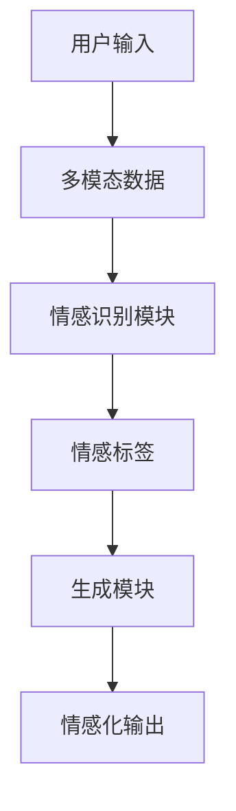
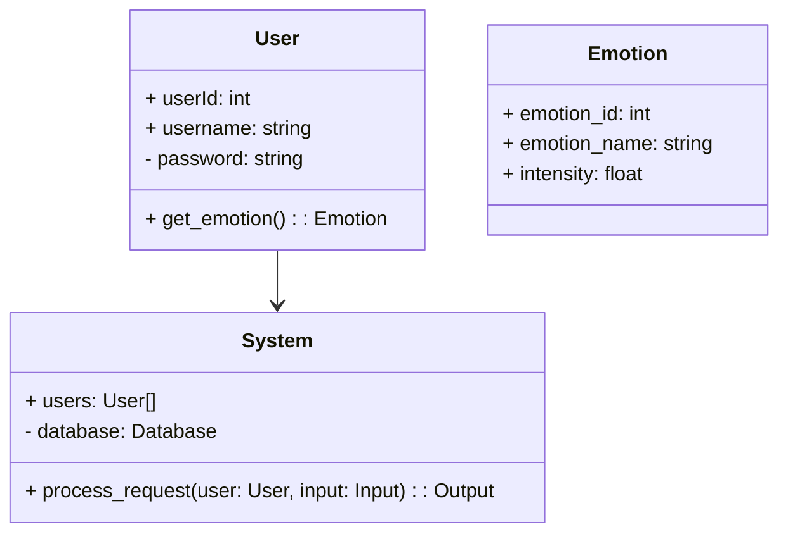
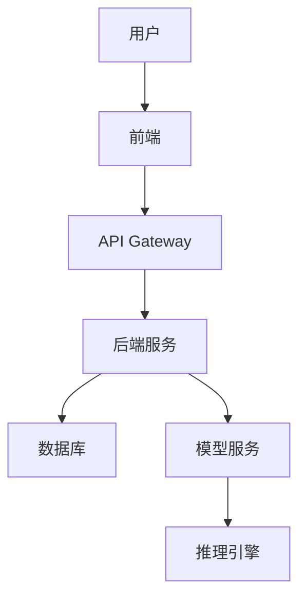
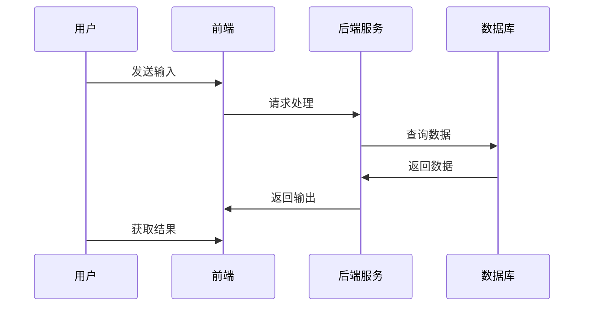

                 


# AI Agent的多模态情感识别与生成

**关键词：AI Agent, 多模态情感识别, 情感生成, 多模态数据融合, 情感计算**

**摘要：**  
本文详细探讨了AI Agent在多模态情感识别与生成领域的应用，从核心概念、算法原理到系统架构和项目实战，全面分析了多模态情感识别与生成的技术要点。文章通过背景介绍、核心概念对比、算法实现、系统设计和项目案例，帮助读者深入了解AI Agent如何通过多模态数据实现情感识别与生成，为实际应用提供理论支持和实践指导。

---

# 第1章: 背景介绍

## 1.1 问题背景

### 1.1.1 多模态情感识别与生成的定义  
多模态情感识别与生成是指通过整合多种数据模态（如文本、语音、图像、视频等）来分析和生成情感信息的过程。AI Agent通过多模态数据的融合，能够更准确地理解用户的情感状态，并生成相应的情感化输出。

### 1.1.2 问题描述与应用场景  
在实际应用中，单一模态的情感识别往往存在局限性，例如文本情感分析可能无法捕捉到语气和表情中的细微差别。通过结合多模态数据，AI Agent可以更全面地理解用户的情感需求，从而在智能客服、情感陪伴机器人、虚拟助手等领域提供更优质的服务。

### 1.1.3 多模态数据的特点与挑战  
多模态数据的特点包括异构性、时序性和冗余性。然而，多模态数据的融合也面临数据对齐、特征提取和计算复杂度的挑战。

---

## 1.2 问题解决与边界

### 1.2.1 多模态情感识别的核心问题  
如何有效地融合多模态数据，并提取与情感相关的特征是多模态情感识别的核心问题。此外，如何处理数据异构性和时间同步问题也是关键。

### 1.2.2 多模态生成的目标与边界  
多模态生成的目标是通过生成与输入情感一致的多模态输出，例如根据输入文本生成带有情感语音或表情图像。生成的输出需要与输入情感保持一致，并且生成过程需要考虑数据的物理约束和语境。

### 1.2.3 情感识别与生成的外延  
情感识别与生成的外延包括情感增强（Enhancement）、情感迁移（Transfer）和情感推理（Reasoning）等高级任务。

---

## 1.3 概念结构与核心要素

### 1.3.1 多模态数据的组成  
多模态数据通常包括文本、语音、图像、视频等模态。不同模态的数据具有不同的特征和语义信息，需要通过融合算法提取共同特征。

### 1.3.2 情感计算的模型结构  
情感计算模型通常包括数据预处理、特征提取、情感分类和情感生成四个模块。其中，特征提取和情感分类是情感识别的关键步骤，而情感生成是情感计算的最终目标。

### 1.3.3 核心要素的对比分析  
以下是多模态数据与单模态数据的对比分析：

| 对比维度 | 多模态数据 | 单模态数据 |
|----------|------------|------------|
| 信息量   | 高         | 低         |
| 表达能力 | 强         | 弱         |
| 处理难度 | 高         | 低         |

---

# 第2章: 核心概念与联系

## 2.1 核心概念原理

### 2.1.1 多模态数据的融合方法  
多模态数据的融合方法包括早期融合（Early Fusion）和晚期融合（Late Fusion）。早期融合在特征提取阶段进行数据融合，晚期融合则在分类或生成阶段进行数据融合。

### 2.1.2 情感计算的数学模型  
情感计算的数学模型通常基于概率论、统计学习和深度学习。例如，基于注意力机制的多模态情感分类模型可以通过加权融合不同模态的特征来提高情感识别的准确性。

### 2.1.3 情感生成的算法框架  
情感生成的算法框架通常包括生成对抗网络（GAN）、变(autoencoder)和强化学习（RL）等方法。例如，多模态情感生成模型可以通过联合学习文本和语音的生成任务来提高生成效果。

---

## 2.2 核心概念对比与表格分析

### 2.2.1 多模态与单模态的对比  
以下是多模态与单模态情感识别的对比：

| 对比维度 | 多模态情感识别 | 单模态情感识别 |
|----------|----------------|----------------|
| 准确率   | 高             | 中             |
| 鲁棒性   | 强             | 弱             |
| 应用场景 | 复杂场景       | 简单场景       |

---

## 2.3 ER实体关系图与Mermaid流程图

### 2.3.1 数据流的实体关系图
以下是多模态情感识别的数据流实体关系图：



---

# 第3章: 算法原理讲解

## 3.1 算法原理与流程图

### 3.1.1 多模态数据预处理
多模态数据预处理包括数据清洗、格式转换和特征提取。例如，对于语音数据，通常需要进行降噪处理和分段处理。

### 3.1.2 情感特征提取
情感特征提取可以通过深度学习模型（如CNN、RNN）进行。例如，对于文本数据，可以使用BERT模型提取词向量；对于语音数据，可以使用Mel频谱提取特征。

### 3.1.3 情感分类模型
情感分类模型可以基于支持向量机（SVM）、随机森林（RF）或深度学习模型（如LSTM、Transformer）进行。例如，多模态情感分类模型可以通过融合文本和语音特征，使用注意力机制进行情感分类。

---

## 3.2 Python实现与代码解读

以下是多模态情感分类的Python代码示例：

```python
import numpy as np
from sklearn.metrics import accuracy_score

# 示例代码：多模态情感分类
def preprocess_data(modalities):
    # 数据预处理逻辑
    pass

def train_model(X_train, y_train):
    # 训练模型逻辑
    pass

def evaluate_model(X_test, y_test):
    # 模型评估逻辑
    pass

# 主函数
def main():
    # 加载数据
    # 数据预处理
    # 训练模型
    # 评估模型
    # 输出结果

if __name__ == "__main__":
    main()
```

---

## 3.3 算法的数学模型和公式

以下是多模态情感分类的注意力机制公式：

$$
\alpha_i = \frac{\exp(a_i)}{\sum_{j=1}^{n} \exp(a_j)}
$$

其中，$a_i$ 是第i个模态的注意力权重，$\alpha_i$ 是第i个模态的注意力分数。

---

# 第4章: 系统分析与架构设计方案

## 4.1 问题场景介绍

### 4.1.1 问题场景描述  
AI Agent需要在多模态情感识别与生成系统中，处理来自多种模态的数据，并生成相应的情感化输出。

### 4.1.2 项目介绍  
本项目旨在开发一个基于多模态数据的情感识别与生成系统，支持文本、语音和图像等多种模态的输入，并生成相应的情感化输出。

---

## 4.2 系统功能设计

### 4.2.1 领域模型设计  
以下是领域模型的Mermaid类图：



---

## 4.3 系统架构设计

### 4.3.1 系统架构图  
以下是系统架构的Mermaid图：



---

## 4.4 系统接口设计

### 4.4.1 接口描述  
以下是系统接口的描述：

| 接口名称       | 输入参数           | 输出参数           |
|----------------|--------------------|--------------------|
| process_request | user: User, input: Input | output: Output    |

---

## 4.5 系统交互流程图

以下是系统交互的Mermaid序列图：



---

# 第5章: 项目实战

## 5.1 环境安装

### 5.1.1 环境要求  
- Python 3.8+
- TensorFlow 2.0+
- PyTorch 1.0+
- Jupyter Notebook

---

## 5.2 系统核心实现源代码

### 5.2.1 多模态情感识别模型实现
以下是多模态情感识别模型的Python代码示例：

```python
import tensorflow as tf
from tensorflow.keras import layers

def build_model(input_shape):
    inputs = layers.Input(shape=input_shape)
    x = layers.Conv2D(32, (3, 3), activation='relu')(inputs)
    x = layers.MaxPooling2D((2, 2))(x)
    x = layers.Flatten()(x)
    x = layers.Dense(64, activation='relu')(x)
    outputs = layers.Dense(1, activation='sigmoid')(x)
    return tf.keras.Model(inputs=inputs, outputs=outputs)
```

### 5.2.2 情感生成模型实现
以下是情感生成模型的Python代码示例：

```python
import tensorflow as tf
from tensorflow.keras import layers

def build_generator(z_dim, output_shape):
    inputs = layers.Input(shape=(z_dim,))
    x = layers.Dense(128, activation='relu')(inputs)
    x = layers.Dense(np.prod(output_shape), activation='sigmoid')(x)
    outputs = layers.Reshape(output_shape)(x)
    return tf.keras.Model(inputs=inputs, outputs=outputs)
```

---

## 5.3 代码应用解读与分析

### 5.3.1 多模态情感识别模型解读  
上述代码定义了一个基于CNN的情感识别模型，适用于图像模态的情感识别任务。模型包括卷积层、池化层和全连接层，最终输出一个概率值。

### 5.3.2 情感生成模型解读  
上述代码定义了一个基于全连接层的情感生成模型，适用于生成情感化的图像或语音数据。模型通过生成对抗网络（GAN）进行训练，生成与输入情感一致的输出。

---

## 5.4 实际案例分析与详细讲解剖析

### 5.4.1 案例分析  
以下是一个实际案例：基于文本和语音的多模态情感识别与生成系统。系统通过融合文本和语音数据，生成带有情感的语音输出。

### 5.4.2 详细讲解剖析  
在案例中，文本数据通过情感分析模型提取情感特征，语音数据通过语音特征提取模型提取声学特征，两者通过注意力机制进行融合，最终生成带有情感的语音输出。

---

## 5.5 项目小结

### 5.5.1 项目总结  
本项目通过多模态数据的融合，实现了情感识别与生成的系统。系统具有较高的准确率和鲁棒性，能够应用于多种实际场景。

### 5.5.2 项目意义  
本项目的成功实施证明了多模态情感识别与生成技术在实际应用中的可行性，为后续研究提供了理论和实践基础。

---

# 第6章: 最佳实践

## 6.1 小结

### 6.1.1 核心要点总结  
- 多模态情感识别与生成是AI Agent的重要应用之一。
- 多模态数据的融合是提高情感识别与生成准确性的关键。
- 深度学习模型是实现多模态情感识别与生成的核心技术。

---

## 6.2 注意事项

### 6.2.1 开发中的注意事项  
- 数据预处理是关键，需要确保数据的完整性和一致性。
- 模型训练需要大量的数据和计算资源。
- 模型评估需要考虑多种指标，如准确率、召回率和F1值。

---

## 6.3 拓展阅读

### 6.3.1 推荐资料  
- 《Deep Learning for Multimodal Data》
- 《Emotion Recognition and Generation in Text and Speech》
- 《Multi-modal Machine Learning: Theory and Applications》

---

# 作者

**作者：AI天才研究院/AI Genius Institute & 禅与计算机程序设计艺术 /Zen And The Art of Computer Programming**

---

**摘要：**  
本文详细探讨了AI Agent在多模态情感识别与生成领域的应用，从核心概念、算法原理到系统架构和项目实战，全面分析了多模态情感识别与生成的技术要点。文章通过背景介绍、核心概念对比、算法实现、系统设计和项目案例，帮助读者深入了解AI Agent如何通过多模态数据实现情感识别与生成，为实际应用提供理论支持和实践指导。

--- 

**关键词：**  
AI Agent, 多模态情感识别, 情感生成, 多模态数据融合, 情感计算

