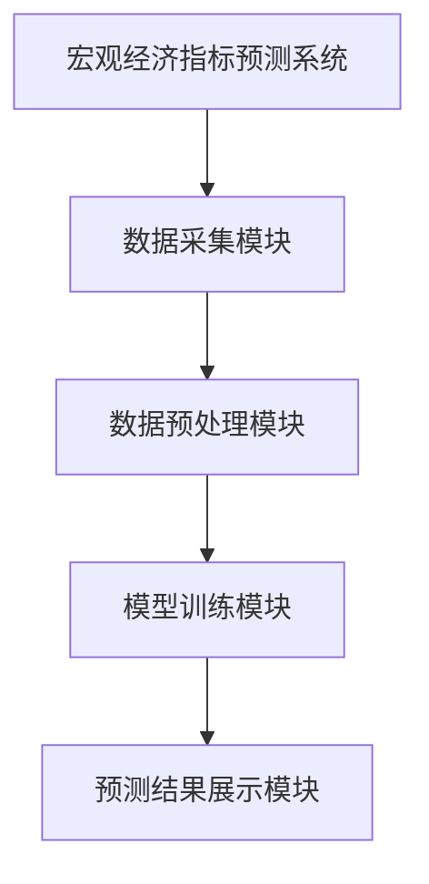
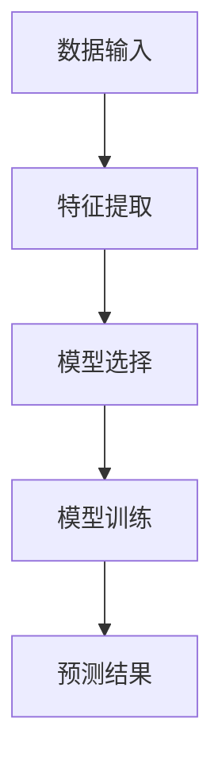
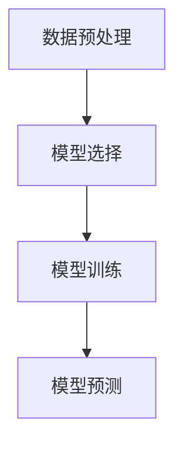
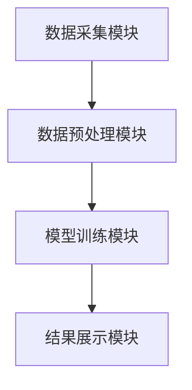
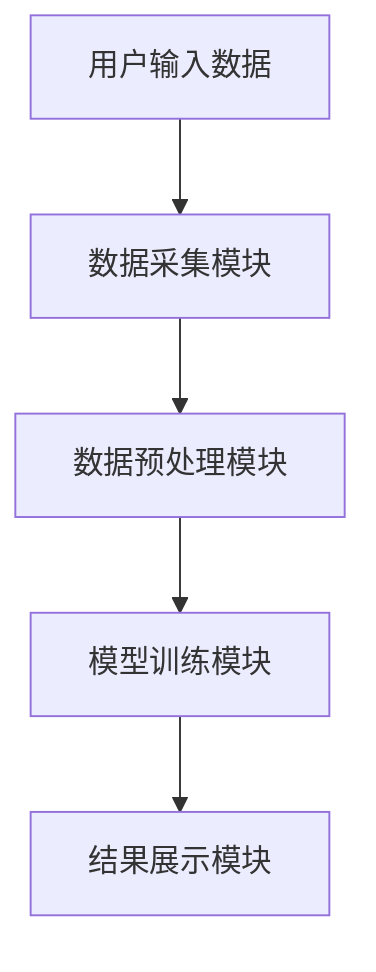

                 


# AI辅助的宏观经济指标预测与情景分析

> 关键词：宏观经济指标预测，人工智能，机器学习，时间序列分析，经济模型

> 摘要：本文探讨了人工智能在宏观经济指标预测中的应用，分析了AI技术如何通过时间序列分析、机器学习算法和深度学习模型来提升预测的准确性，并结合实际案例展示了AI辅助的宏观经济情景分析的应用场景和实施方法。

---

# 第一部分: 宏观经济指标预测的背景与挑战

## 第1章: 宏观经济指标预测的背景与挑战

### 1.1 宏观经济指标的基本概念

#### 1.1.1 宏观经济指标的定义与分类

- **定义**：宏观经济指标是衡量经济整体运行状况的量化数据，反映了国家或地区的经济表现。
- **分类**：
  - **总量指标**：如GDP（国内生产总值）、NI（国民收入）。
  - **结构指标**：如产业构成比例、就业结构。
  - **价格指标**：如CPI（消费者价格指数）、PPI（生产者价格指数）。
  - **国际指标**：如汇率、贸易平衡。

#### 1.1.2 宏观经济指标在经济分析中的作用

- **经济政策制定**：政府通过分析GDP增长率、失业率等指标制定货币政策和财政政策。
- **经济研究与预测**：学术界和企业通过宏观经济指标预测未来经济走势。
- **投资决策**：投资者利用宏观经济指标评估市场风险和投资机会。

#### 1.1.3 宏观经济预测的复杂性与挑战

- **数据复杂性**：宏观经济指标受多种因素影响，如政策变化、全球市场波动等。
- **模型选择**：选择合适的模型需要考虑数据特征、预测目标和时间跨度。
- **预测精度**：宏观经济预测往往存在较大的不确定性，模型需要不断优化。

### 1.2 AI技术在宏观经济预测中的应用前景

#### 1.2.1 AI技术的基本原理与优势

- **AI技术**：通过机器学习算法，AI可以从大量数据中提取模式和关系，进行预测和分类。
- **优势**：
  - 自动化处理：AI能够处理大量非结构化数据，提取特征。
  - 高效性：AI算法可以快速处理和分析数据，提供实时预测。
  - 精准性：通过训练数据，AI模型可以捕捉复杂的模式，提高预测准确性。

#### 1.2.2 宏观经济预测中的数据特点

- **时间依赖性**：宏观经济指标通常具有时间序列特性。
- **多重因素影响**：经济指标受政策、市场、社会等多种因素影响。
- **数据稀缺性**：某些宏观经济指标可能缺乏足够的历史数据。

#### 1.2.3 AI在宏观经济预测中的潜在价值

- **提高预测精度**：AI可以通过深度学习模型捕捉非线性关系，提升预测准确性。
- **实时分析**：AI可以实时处理数据，提供动态预测。
- **情景分析**：AI可以模拟不同政策下的经济走势，为决策提供支持。

---

## 第2章: 宏观经济指标预测的核心概念与联系

### 2.1 宏观经济指标预测的核心概念

#### 2.1.1 宏观经济指标的属性特征对比表格

| 指标类型 | 定义 | 数据频率 | 数据来源 | 影响因素 |
|----------|------|----------|----------|----------|
| GDP      | 国内生产总值 | 季度/年度 | 国家统计局 | 政策、投资、消费 |
| 失业率    | 劳动力市场状况 | 月度/季度 | 劳工统计局 | 经济状况、政策 |
| CPI      | 消费者价格指数 | 月度/季度 | 统计机构 | 通胀、货币政策 |

#### 2.1.2 宏观经济指标预测的ER实体关系图

```mermaid
er
  actor 宏观经济指标
  actor 经济预测系统
  actor 预测模型
  actor 数据源
  actor 预测结果
  relation 联系：预测模型从数据源获取指标数据，生成预测结果
```

#### 2.1.3 宏观经济指标预测的系统架构图



### 2.2 宏观经济指标预测的核心概念与联系

#### 2.2.1 宏观经济指标预测的流程



---

## 第3章: AI辅助宏观经济指标预测的算法原理

### 3.1 时间序列分析的基本原理

#### 3.1.1 时间序列分析的定义与特点

- **定义**：时间序列分析是通过统计学方法分析按时间顺序排列的数据，寻找数据中的模式和趋势。
- **特点**：
  - 数据有序性：数据按时间排列。
  - 季节性：数据可能受季节性因素影响。
  - 趋势性：数据可能呈现长期趋势。

#### 3.1.2 时间序列分析的数学模型

- **ARIMA模型**：Autoregressive Integrated Moving Average。
  - ARIMA模型由自回归部分（AR）、差分部分（I）和移动平均部分（MA）组成。
  - 公式表示为：ARIMA(p, d, q)，其中p为自回归阶数，d为差分阶数，q为移动平均阶数。

#### 3.1.3 时间序列分析的步骤与流程



### 3.2 基于机器学习的宏观经济预测算法

#### 3.2.1 机器学习算法的基本原理

- **监督学习**：基于标签数据训练模型，预测新的数据点。
  - 常见算法：线性回归、随机森林、支持向量机（SVM）。
- **无监督学习**：在无标签数据中发现模式和结构。
  - 常见算法：聚类分析（K-means）、主成分分析（PCA）。

#### 3.2.2 常见宏观经济预测算法的比较

| 算法类型   | 优点                         | 缺点                           |
|------------|------------------------------|--------------------------------|
| 线性回归   | 简单易懂，适合线性关系         | 无法捕捉非线性关系               |
| 随机森林   | 高精度，鲁棒性强               | 计算复杂，解释性较差             |
| LSTM网络   | 能捕捉长期依赖关系             | 训练时间长，参数多                 |

#### 3.2.3 基于深度学习的宏观经济预测模型

- **LSTM网络**：长短期记忆网络，适合处理时间序列数据。
  - LSTM通过门控机制记忆长期信息，适用于捕捉时间序列中的趋势和模式。
  - 公式表示为：$f_t = \sigma(W_f x_t + U_f h_{t-1} + b_f)$，其中$f_t$为遗忘门，$h_{t-1}$为前一时刻的隐藏状态。

### 3.3 宏观经济预测的数学模型与公式

#### 3.3.1 时间序列分析的ARIMA模型

- ARIMA模型的公式：
  $$
  \phi (B)(1 - B)^d X_t = \theta(B) \epsilon_t
  $$
  其中，$\phi(B)$和$\theta(B)$分别为自回归和移动平均多项式，$d$为差分阶数。

#### 3.3.2 机器学习算法的数学公式

- **线性回归**：$y = \beta_0 + \beta_1 x + \epsilon$。
- **随机森林**：基于决策树的集成方法，通过投票或平均进行预测。
- **LSTM网络**：通过门控机制捕捉长期依赖关系，公式如前所述。

---

## 第4章: 宏观经济指标预测的系统分析与架构设计

### 4.1 系统分析与需求分析

#### 4.1.1 宏观经济指标预测系统的功能需求

- **数据采集**：从数据库或API获取宏观经济指标数据。
- **数据预处理**：清洗数据，处理缺失值和异常值。
- **模型训练**：选择和训练预测模型。
- **结果展示**：以可视化方式展示预测结果和分析报告。

#### 4.1.2 系统的输入输出分析

- **输入**：历史宏观经济指标数据、模型参数。
- **输出**：预测结果、模型评估报告。

#### 4.1.3 系统的性能需求

- **预测精度**：模型预测的准确率。
- **运行时间**：系统处理数据和预测的时间效率。
- **可扩展性**：系统能否处理更大规模的数据。

### 4.2 系统架构设计

#### 4.2.1 系统功能模块设计

- **数据采集模块**：负责从数据库或API获取数据。
- **数据预处理模块**：清洗数据，进行特征工程。
- **模型训练模块**：选择算法，训练模型。
- **结果展示模块**：可视化预测结果和分析报告。

#### 4.2.2 系统架构图



#### 4.2.3 系统接口设计

- **数据接口**：通过API获取实时数据。
- **模型接口**：与训练好的模型进行交互，获取预测结果。
- **结果接口**：将预测结果输出到前端或报告中。

### 4.3 系统交互设计

#### 4.3.1 系统交互流程图



#### 4.3.2 用户界面设计

- **输入界面**：用户输入预测目标和参数。
- **输出界面**：展示预测结果和分析报告。

#### 4.3.3 系统异常处理机制

- **错误检测**：检测数据输入错误或模型训练失败。
- **异常处理**：记录错误信息，提供错误提示。

---

## 第5章: AI辅助宏观经济指标预测的项目实战

### 5.1 项目实战环境安装

#### 5.1.1 安装必要的Python库

```bash
pip install numpy
pip install pandas
pip install scikit-learn
pip install keras
pip install tensorflow
pip install matplotlib
```

### 5.2 系统核心实现源代码

#### 5.2.1 数据预处理代码

```python
import pandas as pd
import numpy as np

# 加载数据
data = pd.read_csv('macroeconomic.csv')

# 处理缺失值
data = data.dropna()

# 标准化处理
from sklearn.preprocessing import StandardScaler
scaler = StandardScaler()
scaled_data = scaler.fit_transform(data)
```

#### 5.2.2 模型训练代码

```python
from keras.models import Sequential
from keras.layers import LSTM, Dense

# 构建LSTM模型
model = Sequential()
model.add(LSTM(50, input_shape=(1, look_back)))
model.add(Dense(1))
model.compile(loss='mean_squared_error', optimizer='adam')

# 训练模型
model.fit(train_X, train_y, epochs=100, batch_size=1, verbose=2)
```

#### 5.2.3 预测结果可视化代码

```python
import matplotlib.pyplot as plt

# 预测结果
predicted = model.predict(test_X)
# 反标准化
predicted = scaler.inverse_transform(predicted)
actual = scaler.inverse_transform(test_y)

# 绘制预测结果
plt.plot(actual, label='实际值')
plt.plot(predicted, label='预测值')
plt.legend()
plt.show()
```

### 5.3 实际案例分析与详细讲解

#### 5.3.1 案例分析：预测GDP增长率

- **数据来源**：国家统计局提供的季度GDP数据。
- **模型选择**：使用LSTM网络进行预测。
- **预测结果**：模型预测未来几个季度的GDP增长率。

#### 5.3.2 结果分析与讨论

- **模型准确性**：通过比较实际值和预测值，评估模型的预测精度。
- **模型优化**：调整模型参数，如隐藏层大小和训练轮数，以提高预测准确性。

### 5.4 项目小结

- **项目总结**：通过AI技术实现宏观经济指标预测，展示了AI在经济分析中的应用价值。
- **经验分享**：数据预处理和模型选择对预测结果的影响至关重要。
- **改进建议**：未来可以尝试使用多模型融合方法，进一步提高预测精度。

---

## 第6章: 结论与展望

### 6.1 全文总结

- AI技术在宏观经济指标预测中展现了巨大的潜力。
- 通过时间序列分析、机器学习算法和深度学习模型，可以显著提高预测的准确性和效率。

### 6.2 对未来研究的展望

- **多模型融合**：探索不同模型的组合，以提高预测的准确性和鲁棒性。
- **实时预测**：开发实时数据处理系统，提供动态经济预测。
- **复杂场景分析**：研究多因素影响下的经济情景分析，为政策制定提供支持。

### 6.3 注意事项

- **数据质量**：确保数据的完整性和准确性，避免因数据问题导致预测偏差。
- **模型泛化能力**：在不同数据集和场景下验证模型的泛化能力，确保模型的适用性。
- **伦理与责任**：在实际应用中，需考虑预测结果的伦理性和责任性，避免误导决策。

---

## 第7章: 参考文献与进一步阅读

### 7.1 参考文献

- 引用相关学术论文、书籍和技术文档。
- 如：Zhang, G. P. (2003). Neural networks for short-term load forecasting: A review and case study. IEEE Transactions on Neural Networks.
- 引用AI和宏观经济预测相关的技术文档和研究报告。

### 7.2 进一步阅读

- 建议读者阅读相关领域的最新研究论文和书籍，了解宏观经济预测的最新进展和技术趋势。
- 推荐学习Python的机器学习库（如scikit-learn、Keras）和时间序列分析工具（如Pandas、NumPy）。

---

## 作者信息

作者：AI天才研究院/AI Genius Institute & 禅与计算机程序设计艺术 /Zen And The Art of Computer Programming

---

通过以上详细的目录和内容规划，我们可以系统地构建一篇结构清晰、内容丰富的技术博客文章，全面探讨AI辅助的宏观经济指标预测与情景分析的相关知识。

