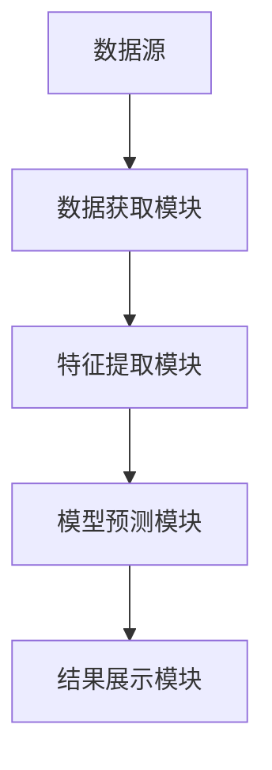
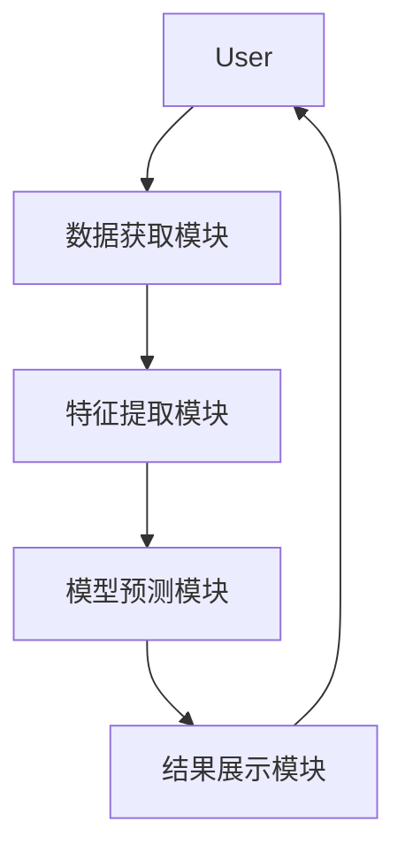

                 


# AI驱动的价值投资策略风格漂移检测

> 关键词：价值投资，风格漂移，人工智能，机器学习，金融数据分析

> 摘要：本文探讨了如何利用人工智能技术检测价值投资策略中的风格漂移问题，通过详细分析风格漂移的定义、原因及影响，结合机器学习算法和系统架构设计，提供了一种基于AI的解决方案，帮助投资者有效监控和管理投资策略的偏离风险。

---

# 第1章: 价值投资与风格漂移概述

## 1.1 价值投资的基本概念

### 1.1.1 价值投资的定义与核心理念

价值投资是一种以基本面分析为基础的投资策略，旨在通过识别市场中被低估的资产，长期持有以获得超额收益。其核心理念包括：

- **内在价值**：资产的真实价值独立于市场波动，可以通过财务指标（如市盈率、市净率等）评估。
- **安全边际**：以低于内在价值的价格买入资产，以降低投资风险。
- **长期视角**：关注企业的长期盈利能力，而非短期市场波动。

### 1.1.2 价值投资在金融领域中的地位

价值投资自20世纪初提出以来，一直是金融投资的重要流派之一。它强调对企业基本面的深入研究，以及对市场情绪的理性分析。许多长期成功的投资者（如沃伦·巴菲特）都采用或借鉴了价值投资策略。

### 1.1.3 价值投资策略的多样性

价值投资策略并非单一模式，而是包括多种变体，例如：

- **GARP策略**：结合成长与价值，寻找具有稳定增长且估值合理的公司。
- **防御性投资**：侧重于低波动性和高分红的资产。
- **深度价值投资**：专注于寻找市场价格远低于内在价值的资产。

## 1.2 风格漂移的定义与问题

### 1.2.1 风格漂移的定义

风格漂移（Style Drift）是指投资组合的实际表现与初始投资策略或风格发生偏离的现象。这可能导致投资组合的风险特征发生变化，偏离投资者的预期目标。

### 1.2.2 风格漂移的常见原因

风格漂移的原因多种多样，主要包括：

- **市场环境变化**：经济周期波动、利率变化等因素导致投资策略调整。
- **管理决策失误**：投资经理为追求短期收益而偏离原定策略。
- **费用侵蚀**：高昂的管理费用降低了投资组合的净收益。
- **资产配置调整**：在不同资产类别间的资金调配可能导致风格偏离。

### 1.2.3 风格漂移对投资组合的影响

风格漂移可能带来以下问题：

- **风险失控**：投资组合的波动性或收益模式发生变化，导致风险超出投资者承受范围。
- **收益不稳定**：偏离原定策略可能导致收益波动加剧。
- **合规性风险**：如果投资策略偏离过大，可能违反监管规定或投资合同。

## 1.3 AI驱动的风格漂移检测的必要性

### 1.3.1 传统风格漂移检测的局限性

传统的风格漂移检测方法通常依赖于定期的资产配置审查和手动分析，存在以下问题：

- **主观性**：依赖于投资经理的判断，可能受主观因素影响。
- **低效性**：手动审查耗时且成本高，难以实时监控。
- **片面性**：难以捕捉复杂市场环境下的细微变化。

### 1.3.2 AI技术在金融分析中的优势

人工智能技术在金融领域的优势包括：

- **大数据处理能力**：AI能够快速分析海量数据，发现传统方法难以察觉的模式。
- **实时监控**：AI可以实时跟踪市场变化和投资组合的表现。
- **自适应性**：AI模型能够根据市场反馈动态调整分析策略。

### 1.3.3 AI驱动风格漂移检测的应用场景

AI技术可以应用于以下场景：

- **实时监控**：实时跟踪投资组合的风格偏离情况。
- **风险预警**：通过AI模型预测潜在的风格漂移风险。
- **自动化调整**：根据偏离程度自动调整投资策略。

## 1.4 本书的核心目标与内容框架

### 1.4.1 本书的核心目标

本书旨在探讨如何利用AI技术有效检测价值投资策略中的风格漂移问题，帮助投资者和机构降低风格漂移带来的风险。

### 1.4.2 本书的主要内容框架

本书将从以下几个方面展开：

- **背景介绍**：详细阐述价值投资和风格漂移的基本概念。
- **核心概念**：分析风格漂移的量化指标及AI技术的应用。
- **技术基础**：介绍金融数据分析、特征工程和机器学习基础。
- **关键算法**：探讨时间序列分析、无监督学习和深度学习算法。
- **模型构建**：详细讲解数据预处理、特征选择和模型训练。
- **系统设计与实现**：设计风格漂移检测系统架构。
- **项目实战**：通过具体案例展示AI驱动风格漂移检测的实现。
- **优化与扩展**：探讨模型优化和实际应用中的注意事项。

### 1.4.3 本书的读者群体

本书适合以下读者群体：

- 金融从业者：投资经理、风险管理师等。
- 数据科学家：对金融数据分析感兴趣的AI从业者。
- 金融科技爱好者：希望将AI技术应用于金融领域的技术爱好者。

## 1.5 本章小结

本章通过介绍价值投资的基本概念、风格漂移的定义及影响，阐述了AI技术在风格漂移检测中的必要性和应用价值。接下来的章节将深入探讨相关技术细节和实现方法。

---

# 第2章: 风格漂移检测的核心概念

## 2.1 风格漂移检测的关键指标

### 2.1.1 风格漂移的量化指标

风格漂移可以通过以下指标量化：

- **偏离度**：投资组合的实际表现与预期风格之间的差异。
- **风格暴露度**：投资组合在不同风格因子上的暴露程度。

### 2.1.2 风格漂移的分类标准

风格漂移可以分为以下几种类型：

- **资产配置漂移**：投资组合的实际资产配置与原定配置出现偏差。
- **行业风格漂移**：投资组合在行业分布上偏离原定策略。
- **风险因子漂移**：投资组合的风险特征（如波动率、beta值）发生变化。

### 2.1.3 风格漂移的监测频率

监测频率可以根据投资策略的要求进行调整，常见的频率包括：

- **实时监测**：高频交易中的实时监控。
- **每日监测**：适用于需要及时调整的投资组合。
- **定期监测**：每月或每季度进行一次风格评估。

## 2.2 AI技术在风格漂移检测中的应用

### 2.2.1 机器学习在金融数据分析中的应用

机器学习在金融数据分析中的应用包括：

- **分类与回归**：预测资产价格走势、识别市场趋势。
- **聚类分析**：发现市场中的相似资产或投资组合。
- **异常检测**：识别投资组合中的异常行为。

### 2.2.2 深度学习在复杂金融模式识别中的优势

深度学习在金融领域的主要优势包括：

- **非线性特征提取**：能够捕捉复杂的市场模式。
- **自动特征工程**：减少人工特征设计的工作量。
- **实时预测能力**：适用于高频交易和实时监控。

### 2.2.3 AI驱动风格漂移检测的核心流程

AI驱动的风格漂移检测通常包括以下步骤：

1. **数据收集**：获取投资组合的历史数据和市场数据。
2. **特征提取**：提取与风格漂移相关的特征。
3. **模型训练**：训练风格漂移检测模型。
4. **实时监控**：持续监控投资组合的风格漂移情况。
5. **结果分析**：根据模型输出调整投资策略。

## 2.3 风格漂移检测的数学模型

### 2.3.1 时间序列分析模型

时间序列分析模型用于分析投资组合的历史表现，常用的模型包括：

- **ARIMA模型**：用于预测未来的资产价格走势。
- **GARCH模型**：用于估计资产的波动性。

### 2.3.2 无监督学习模型

无监督学习模型用于识别投资组合的潜在风格漂移，常用的模型包括：

- **K-Means聚类**：将投资组合分为不同的风格类别。
- **DBSCAN聚类**：识别密度较高的风格群集。

### 2.3.3 深度学习模型

深度学习模型用于捕捉复杂的市场模式，常用的模型包括：

- **LSTM网络**：适合处理时间序列数据。
- **卷积神经网络（CNN）**：适用于图像型数据的特征提取。

## 2.4 风格漂移检测的系统架构

### 2.4.1 数据流与模块划分

风格漂移检测系统通常包括以下几个模块：

- **数据获取模块**：从数据源获取投资组合和市场数据。
- **特征提取模块**：提取与风格漂移相关的特征。
- **模型预测模块**：使用AI模型预测风格漂移情况。
- **结果展示模块**：将预测结果以可视化形式呈现。

### 2.4.2 系统流程图

以下是风格漂移检测系统的流程图：



## 2.5 本章小结

本章详细介绍了风格漂移检测的关键指标和AI技术的应用，探讨了机器学习、深度学习等算法在风格漂移检测中的作用。接下来的章节将深入探讨这些算法的实现细节和系统设计。

---

# 第3章: 风格漂移检测的关键算法

## 3.1 时间序列分析

### 3.1.1 ARIMA模型

ARIMA（自回归积分滑动平均模型）是一种常用的时间序列分析模型，适用于预测未来的资产价格走势。其数学公式如下：

$$ ARIMA(p, d, q) $$

其中：
- \( p \) 表示自回归阶数。
- \( d \) 表示差分阶数。
- \( q \) 表示滑动平均阶数。

### 3.1.2 ARIMA模型的实现步骤

1. **数据预处理**：对数据进行平稳化处理。
2. **模型参数选择**：通过网格搜索确定最优参数。
3. **模型训练**：使用历史数据训练模型。
4. **模型预测**：预测未来的资产价格。

### 3.1.3 ARIMA模型的优缺点

- **优点**：适合处理平稳的时间序列数据，模型解释性强。
- **缺点**：对非平稳数据表现较差，需要手动选择参数。

## 3.2 无监督学习算法

### 3.2.1 K-Means聚类

K-Means聚类是一种常用的无监督学习算法，适用于将投资组合分为不同的风格类别。其数学公式如下：

$$ \text{目标函数} = \sum_{i=1}^{k} \sum_{j=1}^{n_i} \|x_j - c_i\|^2 $$

其中：
- \( k \) 表示聚类数。
- \( n_i \) 表示第 \( i \) 个聚类中的样本数。
- \( c_i \) 表示第 \( i \) 个聚类的中心点。

### 3.2.2 K-Means聚类的实现步骤

1. **数据预处理**：标准化特征数据。
2. **初始化聚类中心**：随机选择初始聚类中心。
3. **计算距离**：将样本分配到最近的聚类中心。
4. **更新聚类中心**：重新计算聚类中心。
5. **收敛判断**：直到聚类中心不再变化。

### 3.2.3 K-Means聚类的优缺点

- **优点**：实现简单，计算效率高。
- **缺点**：对初始聚类中心敏感，可能导致结果不稳定。

## 3.3 深度学习算法

### 3.3.1 LSTM网络

LSTM（长短期记忆网络）是一种特殊的RNN，适用于处理时间序列数据。其核心组件包括：

- **输入门**：控制输入信息的权重。
- **遗忘门**：决定是否遗忘长期记忆。
- **输出门**：生成最终的输出结果。

### 3.3.2 LSTM网络的实现步骤

1. **数据预处理**：将时间序列数据转换为适合LSTM输入的格式。
2. **构建模型**：定义LSTM网络的结构。
3. **模型训练**：使用历史数据训练模型。
4. **模型预测**：预测未来的资产价格走势。

### 3.3.3 LSTM网络的优缺点

- **优点**：能够捕捉时间序列中的长期依赖关系。
- **缺点**：模型复杂度高，训练时间较长。

## 3.4 本章小结

本章详细介绍了几种常用的时间序列分析、无监督学习和深度学习算法，并探讨了它们在风格漂移检测中的应用。接下来的章节将结合这些算法，构建风格漂移检测模型。

---

# 第4章: 风格漂移检测的系统架构设计

## 4.1 系统功能设计

### 4.1.1 系统功能模块

风格漂移检测系统通常包括以下几个功能模块：

- **数据获取模块**：从数据源获取投资组合和市场数据。
- **特征提取模块**：提取与风格漂移相关的特征。
- **模型预测模块**：使用AI模型预测风格漂移情况。
- **结果展示模块**：将预测结果以可视化形式呈现。

### 4.1.2 功能模块的交互流程

以下是功能模块的交互流程图：


## 4.2 系统架构设计

### 4.2.1 系统架构图

以下是风格漂移检测系统的架构图：


### 4.2.2 系统架构设计的注意事项

- **数据存储**：需要考虑数据的存储和管理。
- **模型部署**：需要考虑模型的部署和维护。
- **性能优化**：需要考虑系统的性能优化和扩展性。

## 4.3 系统接口设计

### 4.3.1 接口设计

风格漂移检测系统需要设计以下几个接口：

- **数据接口**：与数据源对接，获取投资组合和市场数据。
- **模型接口**：与AI模型对接，获取风格漂移预测结果。
- **展示接口**：与前端展示模块对接，输出风格漂移检测结果。

### 4.3.2 接口设计的注意事项

- **数据格式**：需要统一数据格式，确保接口的兼容性。
- **通信协议**：需要选择合适的通信协议，如HTTP、WebSocket等。
- **安全性**：需要考虑数据的安全传输和存储。

## 4.4 系统交互设计

### 4.4.1 系统交互流程

以下是系统交互流程图：



### 4.4.2 系统交互设计的注意事项

- **用户体验**：需要考虑用户的使用体验，设计直观的交互界面。
- **实时性**：需要考虑系统的实时性，确保及时反馈结果。
- **可扩展性**：需要考虑系统的可扩展性，方便后续功能的添加。

## 4.5 本章小结

本章详细介绍了风格漂移检测系统的架构设计和接口设计，并探讨了系统的交互流程。接下来的章节将结合这些设计，实现风格漂移检测系统。

---

# 第5章: 风格漂移检测的项目实战

## 5.1 项目背景

### 5.1.1 项目目标

本项目旨在利用AI技术实现风格漂移检测，帮助投资者及时发现和调整投资策略。

### 5.1.2 项目需求

- **数据需求**：获取历史资产价格数据和投资组合数据。
- **技术需求**：实现数据获取、特征提取、模型训练和结果展示功能。

## 5.2 项目实施

### 5.2.1 环境安装

需要安装以下环境和工具：

- **Python**：编程语言。
- **Pandas**：数据处理库。
- **Scikit-learn**：机器学习库。
- **Keras**：深度学习库。
- **Matplotlib**：可视化库。

### 5.2.2 核心代码实现

以下是风格漂移检测的核心代码实现：

```python
import pandas as pd
from sklearn.model_selection import train_test_split
from sklearn.metrics import accuracy_score
from sklearn.ensemble import RandomForestClassifier

# 数据预处理
data = pd.read_csv('investment_data.csv')
X = data.drop('target', axis=1)
y = data['target']

# 数据分割
X_train, X_test, y_train, y_test = train_test_split(X, y, test_size=0.2)

# 模型训练
model = RandomForestClassifier()
model.fit(X_train, y_train)

# 模型预测
y_pred = model.predict(X_test)

# 模型评估
print('Accuracy:', accuracy_score(y_test, y_pred))
```

### 5.2.3 代码解读与分析

上述代码实现了一个基于随机森林的风格漂移检测模型，具体步骤如下：

1. **数据预处理**：读取数据并进行特征选择。
2. **数据分割**：将数据分为训练集和测试集。
3. **模型训练**：使用随机森林算法训练模型。
4. **模型预测**：使用测试数据进行预测。
5. **模型评估**：计算模型的准确率。

## 5.3 项目结果分析

### 5.3.1 实验结果

通过实验可以发现，随机森林模型在风格漂移检测中的准确率较高，但可能需要进一步优化。

### 5.3.2 实验结论

实验结果表明，AI技术可以有效检测风格漂移，但仍需进一步优化模型和改进特征提取方法。

## 5.4 本章小结

本章通过一个具体项目展示了AI驱动的风格漂移检测的实现过程，帮助读者理解理论知识的实际应用。接下来的章节将总结项目经验，并探讨模型优化和实际应用中的注意事项。

---

# 第6章: 风格漂移检测的优化与扩展

## 6.1 模型优化

### 6.1.1 参数调优

通过网格搜索等方法优化模型参数，提高模型的准确率和稳定性。

### 6.1.2 集成学习

使用集成学习方法（如投票法、堆叠法）进一步提高模型的性能。

## 6.2 模型扩展

### 6.2.1 多资产类别扩展

将风格漂移检测方法扩展到多资产类别，提高模型的泛化能力。

### 6.2.2 实时监控扩展

实现实时风格漂移监控，确保投资组合的风格稳定性。

## 6.3 实际应用中的注意事项

### 6.3.1 数据质量问题

确保数据的完整性和准确性，避免因数据问题导致模型误判。

### 6.3.2 模型解释性问题

提高模型的解释性，便于投资者理解和调整策略。

### 6.3.3 系统维护问题

定期维护和更新模型，确保系统的稳定性和高效性。

## 6.4 本章小结

本章探讨了风格漂移检测模型的优化方法和实际应用中的注意事项，帮助读者更好地将理论应用于实践。

---

# 第7章: 总结与展望

## 7.1 本课题的核心总结

本文详细探讨了AI驱动的价值投资策略风格漂移检测问题，提出了基于机器学习和深度学习的解决方案，并通过具体案例展示了实现过程。

## 7.2 本课题的未来展望

未来的研究方向包括：

- **更先进的算法**：探索更高效的AI算法，如图神经网络。
- **多模态数据融合**：结合文本、图像等多种数据源进行风格漂移检测。
- **实时性优化**：提高系统的实时性和响应速度。
- **可解释性增强**：增强模型的可解释性，便于投资者理解和决策。

## 7.3 本章小结

本章总结了本文的主要内容，并展望了未来的研究方向。希望通过本文的研究，能够为投资者和机构提供有效的风格漂移检测方法，降低投资风险，实现稳健收益。

---

# 作者

作者：AI天才研究院/AI Genius Institute & 禅与计算机程序设计艺术 /Zen And The Art of Computer Programming

