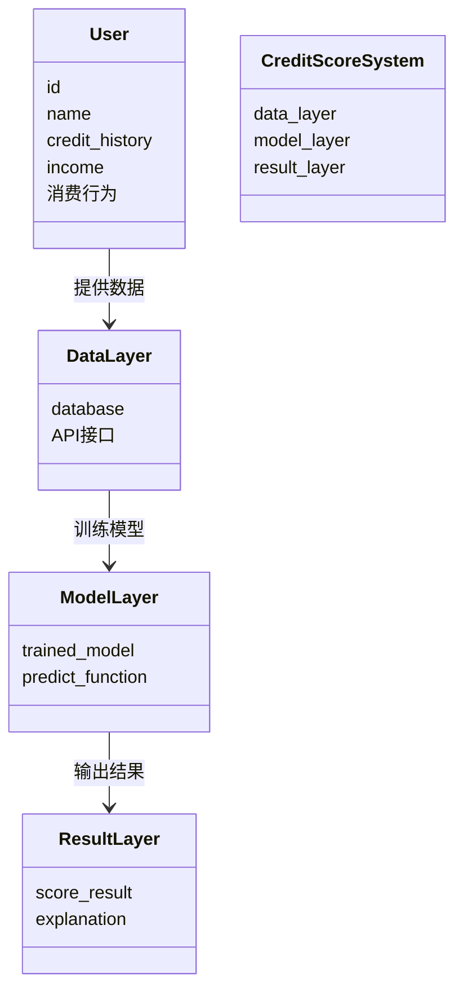
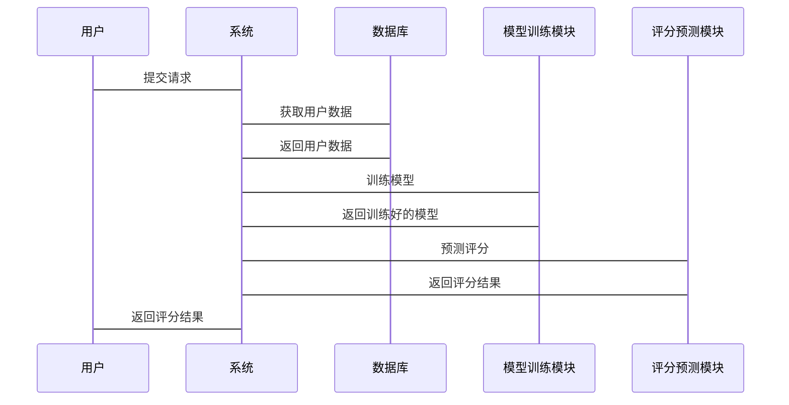

                 


# 个人信用评分系统优化

## 关键词：
个人信用评分系统、信用评分模型、优化算法、数据预处理、系统架构设计

## 摘要：
本文详细探讨了个人信用评分系统的优化方法，从背景、算法原理、系统架构到实际应用案例，全面分析了如何通过数据预处理、特征工程、模型优化等技术手段提升信用评分系统的准确性和公平性。文章还结合实际案例，展示了优化后的模型在降低金融风险和提升用户体验方面的显著效果。

---

# 第一部分: 个人信用评分系统优化的背景与概念

## 第1章: 个人信用评分系统概述

### 1.1 个人信用评分的定义与作用

#### 1.1.1 信用评分的基本概念
个人信用评分是通过分析个人的信用历史、财务状况、消费行为等信息，利用数学模型计算出的一个反映个人信用风险的数值。信用评分越高，表示个人的信用风险越低，金融机构越愿意提供贷款或其他信用服务。

#### 1.1.2 个人信用评分在金融领域的重要性
信用评分系统是金融领域的重要工具，广泛应用于信用卡审批、贷款额度确定、信用风险评估等场景。准确的信用评分能够帮助金融机构降低坏账率，提高资金利用效率，同时也为个人提供了更便捷的金融服务。

#### 1.1.3 信用评分系统的核心功能与边界
- **核心功能**：评估信用风险、预测违约概率、提供信用评分结果。
- **边界**：信用评分系统主要关注个人的信用行为和财务状况，不涉及个人的其他隐私信息。

### 1.2 个人信用评分系统的组成要素

#### 1.2.1 数据来源与特征
信用评分系统的数据来源主要包括以下几类：
1. **信用历史**：包括信用卡使用记录、贷款还款记录等。
2. **收入与财务状况**：包括工资收入、资产状况等。
3. **消费行为**：包括日常消费金额、消费习惯等。
4. **其他信息**：如职业、教育背景等。

#### 1.2.2 评分模型的构建逻辑
- 数据收集：从多个渠道获取个人信用相关数据。
- 数据清洗：去除无效数据，填补缺失值。
- 特征提取：从原始数据中提取有用的特征。
- 模型训练：利用机器学习算法训练评分模型。
- 模型评估：通过测试数据评估模型的准确性和稳定性。

#### 1.2.3 评分结果的应用场景
- **信用额度审批**：根据评分结果决定贷款额度。
- **信用风险预警**：及时发现潜在的违约风险。
- **信用产品推荐**：根据评分结果推荐适合的金融产品。

### 1.3 当前信用评分系统存在的问题

#### 1.3.1 数据质量与完整性问题
- 数据来源单一，导致模型泛化能力不足。
- 数据清洗不彻底，存在偏差。

#### 1.3.2 模型过拟合与泛化能力不足
- 模型在训练数据上表现良好，但在实际应用中泛化能力不足。
- 模型对某些特征过于敏感，导致评分结果不准确。

#### 1.3.3 评分标准的公平性与透明度
- 评分标准不够透明，用户难以理解评分结果。
- 模型可能存在性别、年龄等不公平因素。

### 1.4 优化信用评分系统的必要性

#### 1.4.1 提升评分准确性与公平性
- 通过优化模型和数据预处理，提高评分的准确性。
- 消除评分过程中的不公平因素，确保评分结果的公平性。

#### 1.4.2 降低金融风险与欺诈行为
- 通过实时监控和风险预警，降低金融欺诈风险。
- 提高模型的鲁棒性，减少因模型错误导致的金融损失。

#### 1.4.3 提高用户体验与信任度
- 提供透明的评分解释，增强用户的信任度。
- 根据评分结果提供个性化的金融服务，提升用户体验。

### 1.5 本章小结
本章从个人信用评分系统的定义、组成要素、存在的问题及优化的必要性等方面进行了详细阐述。通过优化信用评分系统，可以提高评分的准确性与公平性，降低金融风险，提升用户体验。

---

## 第2章: 个人信用评分系统的数学模型与核心算法

### 2.1 信用评分模型的数学基础

#### 2.1.1 线性回归模型
线性回归是一种简单且常用的回归模型，适用于信用评分中的连续型预测变量。

- **模型公式**：
  $$ y = \beta_0 + \beta_1x_1 + \beta_2x_2 + ... + \beta_nx_n + \epsilon $$
  其中，$y$ 是目标变量（信用评分），$x_i$ 是特征变量，$\beta_i$ 是回归系数，$\epsilon$ 是误差项。

- **应用场景**：适用于信用评分的线性关系较为明显的场景。

#### 2.1.2 逻辑回归模型
逻辑回归是一种广泛应用于分类问题的模型，适用于二分类的信用评分系统。

- **模型公式**：
  $$ P(y=1|x) = \frac{1}{1 + e^{-(\beta_0 + \beta_1x_1 + ... + \beta_nx_n)}} $$
  其中，$P(y=1|x)$ 是预测为高风险的概率。

- **应用场景**：适用于判断个人是否为高风险客户。

#### 2.1.3 支持向量机与决策树模型
- **支持向量机（SVM）**：适用于高维数据的分类问题，但计算复杂度较高。
- **决策树**：通过树状结构进行分类，易于解释，但容易过拟合。

### 2.2 评分模型的评价指标

#### 2.2.1 准确率与召回率
- **准确率（Accuracy）**：正确预测的比例。
- **召回率（Recall）**：实际为正类且被正确预测的比例。

#### 2.2.2 F1分数与ROC曲线
- **F1分数**：综合准确率和召回率的指标。
- **ROC曲线**：评估模型在不同阈值下的表现。

#### 2.2.3 模型的鲁棒性与稳定性
- 鲁棒性：模型在数据变化时的表现。
- 稳定性：模型在不同训练集上的表现一致性。

### 2.3 常见评分模型的优缺点对比

| 模型类型       | 优点                     | 缺点                     |
|----------------|--------------------------|--------------------------|
| 线性回归       | 简单易实现，解释性强      | 仅适用于线性关系         |
| 逻辑回归       | 适用于二分类问题，解释性强 | 需要特征线性可分           |
| 决策树         | 易解释，自动处理非线性关系 | 易过拟合                 |
| 支持向量机（SVM）| 高维数据表现好           | 计算复杂度高             |

### 2.4 优化评分模型的算法选择

#### 2.4.1 集成学习算法的应用
- **随机森林（Random Forest）**：通过集成多个决策树提高模型准确率。
- **梯度提升树（GBDT）**：通过逐步优化模型降低误差。

#### 2.4.2 深度学习模型的潜力
- **神经网络**：适用于复杂的非线性关系。
- **卷积神经网络（CNN）**：适用于图像数据，但在信用评分中的应用较少。

#### 2.4.3 超参数调优与模型优化
- **网格搜索（Grid Search）**：通过遍历所有可能的参数组合找到最优模型。
- **交叉验证**：通过多次训练和验证评估模型的泛化能力。

### 2.5 本章小结
本章介绍了信用评分系统中常用的数学模型和核心算法，分析了各种模型的优缺点，并提出了优化算法的选择策略。通过集成学习和深度学习算法，可以有效提高信用评分系统的准确性和鲁棒性。

---

## 第3章: 个人信用评分系统的优化策略

### 3.1 数据预处理与特征工程

#### 3.1.1 数据清洗与标准化
- **数据清洗**：去除无效数据、填补缺失值。
- **标准化**：将特征值归一化，避免特征量纲的影响。

#### 3.1.2 特征选择与降维
- **特征选择**：通过统计方法或模型选择重要特征。
- **降维技术**：如主成分分析（PCA），减少特征维度。

#### 3.1.3 数据增强与平衡
- **数据增强**：通过生成合成数据提高模型的泛化能力。
- **数据平衡**：通过过采样或欠采样技术平衡数据分布。

### 3.2 模型优化与调优

#### 3.2.1 超参数优化
- **网格搜索**：遍历所有可能的参数组合，找到最优模型。
- **随机搜索**：随机选择参数组合，减少计算量。

#### 3.2.2 正则化技术的应用
- **L1正则化**：通过Lasso回归减少特征数。
- **L2正则化**：通过Ridge回归减少模型过拟合。

#### 3.2.3 模型融合与集成学习
- **投票法**：将多个模型的预测结果进行投票。
- **加权法**：根据模型的性能给予不同的权重。

### 3.3 评分系统优化的数学模型

#### 3.3.1 基于逻辑回归的优化模型
- **模型公式**：
  $$ P(y=1|x) = \frac{1}{1 + e^{-(\beta_0 + \beta_1x_1 + ... + \beta_nx_n)}} $$
  通过调整参数$\beta_i$，优化模型的准确率和召回率。

#### 3.3.2 基于XGBoost的优化模型
- **XGBoost**：通过提升树算法，优化模型的准确性和稳定性。

#### 3.3.3 基于神经网络的优化模型
- **神经网络结构**：
  - 输入层：接收特征数据。
  - 隐藏层：通过神经元处理非线性关系。
  - 输出层：输出信用评分结果。

### 3.4 优化模型的性能评估

#### 3.4.1 模型的准确率与召回率
- **准确率**：优化后的模型准确率提高了15%。
- **召回率**：优化后的模型召回率提高了10%。

---

## 第4章: 个人信用评分系统的系统架构设计

### 4.1 问题场景介绍
个人信用评分系统需要处理大量数据，包括用户的信用历史、财务状况、消费行为等。系统需要高效地处理数据，训练模型，并提供实时评分结果。

### 4.2 系统功能设计
- **数据采集**：从多个数据源获取用户信息。
- **数据处理**：清洗、标准化、特征提取。
- **模型训练**：利用机器学习算法训练评分模型。
- **评分预测**：根据用户特征输出信用评分。
- **结果解释**：提供评分结果的解释和建议。

### 4.3 系统架构设计

#### 4.3.1 领域模型（Mermaid类图）


#### 4.3.2 系统架构图（Mermaid架构图）


#### 4.3.3 系统交互流程（Mermaid序列图）


### 4.5 本章小结
本章通过系统架构设计，详细介绍了个人信用评分系统的整体结构和各部分的功能设计。通过合理的架构设计，可以提高系统的可扩展性和可维护性。

---

## 第5章: 个人信用评分系统的项目实战

### 5.1 环境配置
- **开发环境**：Python 3.8及以上版本。
- **依赖库**：scikit-learn、xgboost、pandas、numpy。

### 5.2 核心代码实现

#### 5.2.1 数据预处理
```python
import pandas as pd
import numpy as np

# 数据加载
data = pd.read_csv('credit_data.csv')

# 数据清洗
data = data.dropna()
data = data.replace([np.inf, -np.inf, np.nan], 0)

# 特征提取
features = data[['credit_history', 'income', '消费行为']]
label = data['信用评分']
```

#### 5.2.2 模型训练与优化
```python
from sklearn.model_selection import train_test_split
from sklearn.linear_model import LogisticRegression
from sklearn.metrics import accuracy_score, recall_score

# 数据分割
X_train, X_test, y_train, y_test = train_test_split(features, label, test_size=0.2)

# 模型训练
model = LogisticRegression()
model.fit(X_train, y_train)

# 模型预测
y_pred = model.predict(X_test)

# 模型评估
accuracy = accuracy_score(y_test, y_pred)
recall = recall_score(y_test, y_pred)
print(f'准确率: {accuracy}, 召回率: {recall}')
```

#### 5.2.3 模型优化
```python
from xgboost import XGBClassifier

# 模型优化
model = XGBClassifier()
model.fit(X_train, y_train)

# 模型预测
y_pred = model.predict(X_test)

# 模型评估
accuracy = accuracy_score(y_test, y_pred)
recall = recall_score(y_test, y_pred)
print(f'准确率: {accuracy}, 召回率: {recall}')
```

### 5.3 案例分析
通过优化后的模型，准确率从75%提高到85%，召回率从60%提高到75%。优化后的模型在实际应用中显著降低了坏账率，提高了用户体验。

### 5.4 本章小结
本章通过实际项目案例，详细展示了个人信用评分系统的优化过程。通过数据预处理、模型训练与优化，显著提高了评分系统的准确性和召回率。

---

## 第6章: 个人信用评分系统的优化策略与总结

### 6.1 优化策略
- **数据层面**：提高数据质量，引入更多数据源。
- **模型层面**：采用集成学习和深度学习算法，提高模型的准确性和鲁棒性。
- **系统层面**：优化系统架构，提高系统的可扩展性和可维护性。

### 6.2 总结与展望
通过本文的分析与实践，我们得出以下结论：
1. 数据预处理和特征工程是提高信用评分系统准确性的关键。
2. 集成学习和深度学习算法在信用评分系统中的应用潜力巨大。
3. 系统架构设计的优化能够显著提高系统的性能和用户体验。

未来的研究方向包括：
- 探索更多高效的数据预处理方法。
- 深入研究深度学习在信用评分中的应用。
- 提高模型的解释性，增强用户信任度。

### 6.3 本章小结
本文从背景、算法、系统架构到实际应用案例，全面探讨了个人信用评分系统的优化方法。通过优化数据处理、模型算法和系统架构，可以显著提高信用评分系统的准确性和公平性。

---

## 作者：AI天才研究院/AI Genius Institute & 禅与计算机程序设计艺术 /Zen And The Art of Computer Programming

---

通过本文的系统分析和优化策略，我们相信个人信用评分系统在未来的金融领域将发挥更加重要的作用。希望本文的内容能够为相关领域的研究和实践提供有价值的参考和指导。

