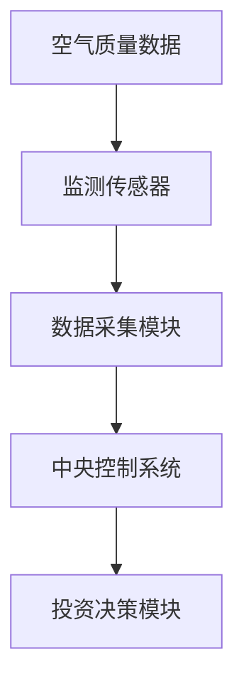
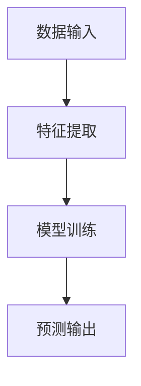
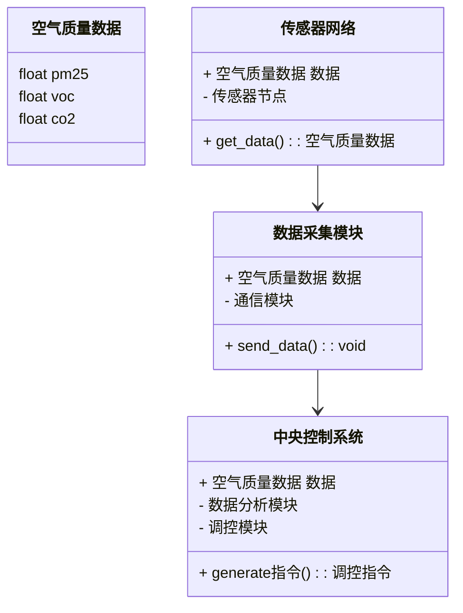
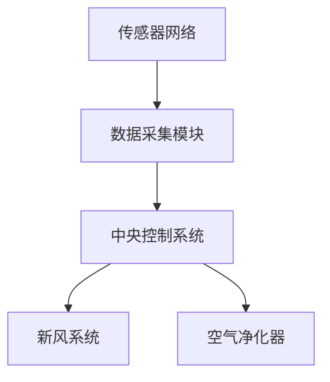
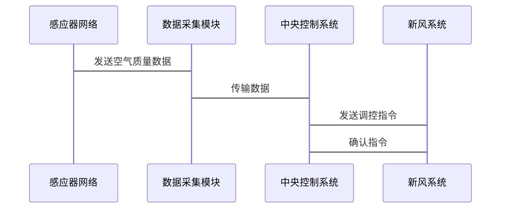

                 


# 价值投资中的智能建筑室内空气质量管理系统分析

> 关键词：智能建筑、室内空气质量、价值投资、机器学习、时间序列分析、系统架构

> 摘要：本文深入分析了智能建筑室内空气质量管理系统在价值投资中的应用。通过背景介绍、核心概念、算法原理、系统架构、项目实战和最佳实践等多个方面，探讨了如何利用技术手段优化空气质量管理，从而为投资者提供科学的决策依据。文章结合理论与实践，提出了系统的实现方案和投资策略，为相关领域的研究和应用提供了参考。

---

# 第一部分: 背景与概念

## 第1章: 智能建筑室内空气质量管理系统的背景介绍

### 1.1 问题背景与描述

#### 1.1.1 室内空气质量问题的现状与挑战

随着城市化进程的加快，室内空气质量问题日益严重。现代建筑中，由于密闭性和装饰材料的使用，挥发性有机化合物（VOCs）和其他有害气体的浓度不断增加，对人体健康和工作效率造成负面影响。特别是在办公楼、学校和医院等人员密集的场所，空气质量问题更加突出。

#### 1.1.2 智能建筑的概念与发展趋势

智能建筑是指通过物联网（IoT）、大数据和人工智能等技术，实现建筑内部设施智能化管理的建筑。智能建筑不仅能够优化能源使用，还能通过实时监测和调整，提升建筑的舒适性和可持续性。近年来，随着技术的进步，智能建筑在全球范围内的应用越来越广泛。

#### 1.1.3 价值投资在智能建筑中的应用前景

价值投资是一种长期投资策略，通过分析企业的内在价值，寻找被市场低估的投资机会。在智能建筑领域，通过分析空气质量管理系统的技术成熟度、市场前景和经济效益，投资者可以找到具有长期增长潜力的项目。

### 1.2 问题解决与边界

#### 1.2.1 室内空气质量管理的核心目标

空气质量管理的核心目标是通过实时监测和调控，确保室内空气质量符合健康标准。这包括监测PM2.5、VOCs、二氧化碳和温湿度等指标，并根据数据调整通风、净化等设备。

#### 1.2.2 智能建筑系统在空气质量管理中的作用

智能建筑系统通过集成传感器、数据采集和控制系统，实现空气质量的实时监测和智能调节。系统能够根据外部环境和室内需求，自动调整新风系统和净化设备，优化能源使用和空气质量。

#### 1.2.3 系统的边界与外延

系统的边界包括建筑内部的空气质量监测和调控，以及与外部环境的数据交互。外延则涉及与能源管理系统、物业管理系统的集成，以及与城市级空气质量监控平台的数据共享。

### 1.3 核心概念与组成要素

#### 1.3.1 空气质量监测系统的核心要素

- **传感器**：用于实时采集空气质量数据，如PM2.5、VOCs、二氧化碳等。
- **数据采集模块**：负责将传感器数据传输到中央控制系统。
- **中央控制系统**：对数据进行分析和处理，生成调控指令。

#### 1.3.2 智能建筑系统的组成部分

- **传感器网络**：包括温度、湿度、PM2.5等传感器。
- **数据采集与传输**：通过物联网技术实现数据的实时传输。
- **控制系统**：包括中央处理器和执行机构，如新风系统和空气净化器。

#### 1.3.3 价值投资的分析框架

- **技术分析**：分析空气质量管理系统的技术成熟度和市场竞争力。
- **基本面分析**：评估企业的财务状况、管理团队和市场前景。
- **行业趋势**：分析智能建筑行业的市场规模和增长潜力。

### 1.4 本章小结

本章介绍了智能建筑室内空气质量管理系统的背景、核心目标和组成要素，探讨了其在价值投资中的应用前景。通过分析系统的边界和组成部分，为后续的技术分析和投资策略奠定了基础。

---

## 第2章: 智能建筑室内空气质量管理系统的核心概念与联系

### 2.1 核心概念原理

#### 2.1.1 空气质量监测的基本原理

空气质量监测系统通过传感器实时采集数据，并通过数据采集模块传输到中央控制系统。系统对数据进行分析，识别异常情况并触发相应的调控措施。

#### 2.1.2 智能建筑系统的核心算法

智能建筑系统通常采用机器学习算法，如线性回归、支持向量机（SVM）和随机森林，对空气质量数据进行预测和分类。这些算法能够帮助系统预测未来空气质量变化，并制定相应的调控策略。

#### 2.1.3 价值投资的分析模型

价值投资模型通过分析企业的财务数据、行业地位和市场前景，评估其内在价值。在智能建筑领域，投资者可以利用空气质量管理系统的性能数据，评估企业的技术优势和市场竞争力。

### 2.2 核心概念属性对比

#### 2.2.1 空气质量监测系统的性能指标对比

| 指标 | 传感器类型 | 数据采集频率 | 响应时间 |
|------|-------------|---------------|----------|
| PM2.5 | 光散射传感器 | 1分钟 | 1秒 |
| VOCs | 电化学传感器 | 1分钟 | 1秒 |

#### 2.2.2 智能建筑系统的功能模块对比

| 模块 | 功能 | 输入 | 输出 |
|------|------|------|------|
| 数据采集 | 采集空气质量数据 | 传感器信号 | 数据流 |
| 数据分析 | 分析数据并生成调控指令 | 数据流 | 调控指令 |

#### 2.2.3 价值投资模型的优劣势对比

| 模型 | 优点 | 缺点 |
|------|------|------|
| 技术分析 | 精准预测 | 需要大量历史数据 |
| 基本面分析 | 全面评估企业 | 数据收集复杂 |

### 2.3 ER实体关系图



### 2.4 本章小结

本章详细分析了智能建筑室内空气质量管理系统的核心概念和组成部分，通过对比不同传感器和系统模块的性能，为后续的技术分析和投资策略提供了数据支持。

---

## 第3章: 智能建筑室内空气质量管理系统的算法原理

### 3.1 算法原理概述

#### 3.1.1 机器学习在空气质量预测中的应用

机器学习算法，如线性回归和随机森林，可以用于预测未来空气质量的变化趋势。通过训练模型，系统能够根据历史数据预测未来的空气质量，并制定相应的调控策略。

#### 3.1.2 时间序列分析的原理与方法

时间序列分析是一种统计方法，用于分析和预测随时间变化的数据。在空气质量预测中，ARIMA（自回归积分滑动平均模型）和LSTM（长短期记忆网络）是常用的方法。

#### 3.1.3 价值投资中的回归分析模型

回归分析是一种统计方法，用于分析变量之间的关系。在价值投资中，回归分析可以用于评估企业财务数据与市场表现之间的关系。

### 3.2 算法流程图



### 3.3 算法实现代码

```python
import pandas as pd
from sklearn.linear_model import LinearRegression

# 数据加载
data = pd.read_csv('air_quality.csv')

# 特征与目标变量分离
X = data[['temperature', 'humidity']]
y = data['aqi']

# 模型训练
model = LinearRegression()
model.fit(X, y)

# 预测与评估
predictions = model.predict(X)
print('预测值:', predictions)
print('模型系数:', model.coef_)
```

### 3.4 本章小结

本章详细介绍了机器学习和时间序列分析在空气质量预测中的应用，并通过代码示例展示了算法的实现过程。这些算法为智能建筑系统的调控提供了科学依据，同时也为价值投资者提供了决策支持。

---

## 第4章: 智能建筑室内空气质量管理系统的系统分析与架构设计

### 4.1 系统分析

#### 4.1.1 问题场景介绍

在智能建筑中，空气质量管理系统需要实时监测和调控室内空气质量，以确保 occupants 的健康和舒适。系统需要与新风系统、空气净化器等设备进行联动，并与物业管理系统和能源管理系统进行数据交互。

#### 4.1.2 项目介绍

本项目旨在开发一个基于物联网的智能空气质量管理系统，实现对建筑内部空气质量的实时监测和智能调控。系统将采用传感器网络、数据采集模块和中央控制系统，结合机器学习算法进行数据分析和预测。

### 4.2 系统功能设计

#### 4.2.1 领域模型



#### 4.2.2 系统架构设计



#### 4.2.3 系统接口设计

系统接口主要分为内部接口和外部接口。内部接口包括传感器网络与数据采集模块的通信接口，外部接口包括与新风系统和空气净化器的控制接口，以及与物业管理系统的数据接口。

#### 4.2.4 系统交互



### 4.3 本章小结

本章详细分析了智能建筑室内空气质量管理系统的功能设计和架构设计，展示了系统的组成部分和交互流程。通过系统架构图和交互图，为后续的系统实现提供了清晰的指导。

---

## 第5章: 项目实战——智能建筑空气质量管理系统的核心实现

### 5.1 环境安装

#### 5.1.1 系统环境要求

- 操作系统：Linux（推荐）或Windows
- 开发工具：Python 3.6以上版本，Jupyter Notebook
- 依赖库：pandas、numpy、scikit-learn、mermaid

#### 5.1.2 数据库安装

- 数据库选择：MySQL或MongoDB
- 数据库连接：通过Python的pymysql库连接MySQL数据库

### 5.2 系统核心实现

#### 5.2.1 传感器数据采集

```python
import serial
import time

port = 'COM3'  # 根据实际情况修改
 baud_rate = 9600

ser = serial.Serial(port, baud_rate)

while True:
    data = ser.readline().decode()
    print('接收到的数据:', data)
    time.sleep(1)
```

#### 5.2.2 数据分析与预测

```python
import pandas as pd
from sklearn.linear_model import LinearRegression

data = pd.read_csv('air_quality.csv')
X = data[['temperature', 'humidity']]
y = data['aqi']

model = LinearRegression()
model.fit(X, y)

predictions = model.predict(X)
print('预测值:', predictions)
print('模型系数:', model.coef_)
```

#### 5.2.3 系统控制与反馈

```python
import serial

port = 'COM3'
baud_rate = 9600

ser = serial.Serial(port, baud_rate)

command = 'open_fan'  # 示例命令
ser.write(command.encode())
```

### 5.3 项目实战小结

本章通过实际案例展示了智能建筑空气质量管理系统的实现过程，包括环境安装、数据采集、数据分析和系统控制。通过代码示例，读者可以深入了解系统的实现细节。

---

## 第6章: 最佳实践与注意事项

### 6.1 最佳实践 tips

#### 6.1.1 系统设计中的注意事项

- 确保传感器的布设位置合理，避免遮挡和干扰。
- 数据采集模块需要具备高可靠性和稳定性，确保数据传输的实时性。

#### 6.1.2 价值投资中的注意事项

- 在进行价值投资时，需要综合考虑企业的技术实力、市场前景和管理团队。
- 数据分析需要结合行业趋势和市场动态，避免单一依赖历史数据。

### 6.2 系统实施中的注意事项

- 系统的维护和更新需要定期进行，确保传感器和数据采集模块的正常运行。
- 系统的安全性需要高度重视，避免数据泄露和系统攻击。

### 6.3 拓展阅读与学习资料

- 推荐阅读《智能建筑技术与应用》和《价值投资实战》。
- 参考GitHub上的空气质量管理系统开源项目，学习其实现细节。

### 6.4 本章小结

本章总结了智能建筑空气质量管理系统实施中的注意事项和最佳实践，为读者提供了系统实施和价值投资的实用建议。

---

# 结语

智能建筑室内空气质量管理系统是现代建筑技术与价值投资相结合的重要应用。通过实时监测和智能调控，系统能够有效改善室内空气质量，提升建筑的舒适性和可持续性。对于投资者而言，掌握系统的实现细节和投资策略，能够帮助他们在智能建筑领域找到具有长期增长潜力的项目。

---

# 作者：AI天才研究院/AI Genius Institute & 禅与计算机程序设计艺术 /Zen And The Art of Computer Programming

