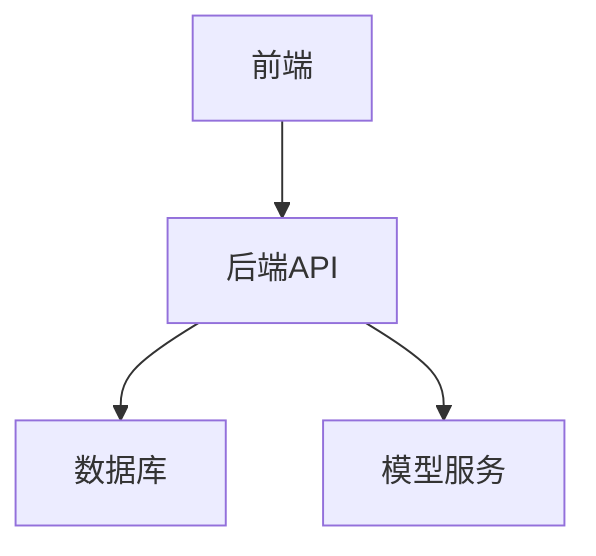
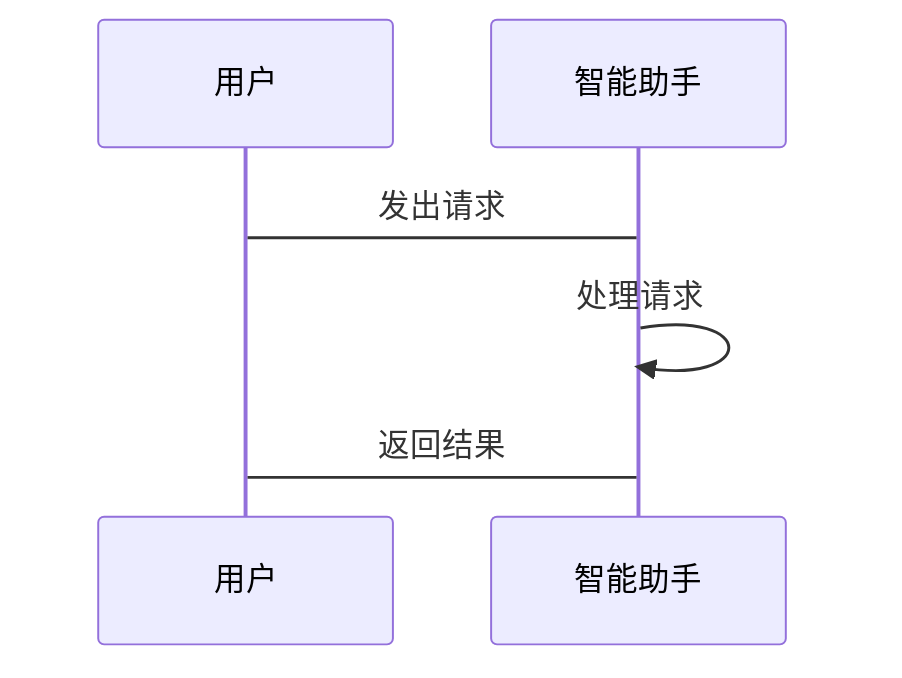

                 


# 优化用户体验：智能助手设计的关键点

---

## 关键词：
智能助手、用户体验、NLP、机器学习、系统架构、交互设计、算法优化

---

## 摘要：
智能助手作为人工智能领域的核心应用之一，其设计目标是通过自然语言处理（NLP）和机器学习技术，为用户提供高效、智能的交互体验。本文将从智能助手的设计背景、核心概念、算法原理、系统架构、交互设计等方面展开，深入分析优化用户体验的关键点。通过实际案例和代码实现，结合数学模型和流程图，全面解析智能助手的设计逻辑和实现细节，为读者提供一份系统化的设计指南。

---

## 第1章: 智能助手设计的背景与现状

### 1.1 智能助手的发展历程
智能助手的概念可以追溯到20世纪60年代，随着计算机技术的飞速发展，其功能从最初的简单命令执行逐步演变为支持复杂语义理解和多轮对话。当前，智能助手广泛应用于智能家居、移动设备、客服系统等领域，极大地提升了用户体验。

#### 1.1.1 智能助手的起源与演变
- **早期阶段**：20世纪60年代，智能助手的概念首次出现，但功能极为有限，主要用于简单的查询和命令执行。
- **发展阶段**：90年代末至21世纪初，随着NLP技术的进步，智能助手开始支持更复杂的语义理解。
- **当前阶段**：基于深度学习的NLP模型（如BERT、GPT）的出现，智能助手具备了更强大的对话能力和个性化服务。

#### 1.1.2 当前智能助手的主要应用场景
- 智能音箱（如Amazon Alexa、Google Nest）
- 智能手机助手（如苹果Siri、谷歌助手）
- 客服系统（如银行、电商的智能客服）

#### 1.1.3 智能助手在不同领域的具体表现
- **智能家居**：控制家电、查询天气、设置提醒。
- **移动设备**：提供语音搜索、信息查询、日程管理。
- **客服系统**：自动处理用户咨询、解决问题、收集反馈。

### 1.2 智能助手的核心概念与定义
智能助手是一种基于人工智能技术的交互工具，能够通过自然语言处理和机器学习理解用户意图，并提供相应的服务或反馈。

#### 1.2.1 智能助手的定义与基本特征
- **定义**：智能助手是通过NLP技术实现人机交互的工具，能够理解和生成自然语言，提供智能化服务。
- **基本特征**：
  - **语义理解**：准确识别用户的意图。
  - **多轮对话**：支持连续上下文的交互。
  - **个性化服务**：根据用户行为提供定制化建议。

#### 1.2.2 智能助手与传统交互工具的区别
| 特性                | 智能助手                      | 传统交互工具                  |
|---------------------|-----------------------------|----------------------------|
| 交互方式            | 自然语言、多模态              | 文本输入、按钮点击            |
| 学习能力            | 支持自适应、个性化             | 固定规则、无学习             |
| 响应速度            | 快速、智能                   | 固定、依赖人工干预           |
| 应用场景            | 多领域、多场景               | 单一功能、固定场景           |

#### 1.2.3 用户对智能助手的核心需求与期望
- **准确性**：理解用户意图并提供正确的结果。
- **实时性**：快速响应用户请求。
- **个性化**：根据用户习惯提供定制化服务。
- **可靠性**：在复杂场景下仍能稳定运行。

### 1.3 智能助手的现状与挑战
#### 1.3.1 当前市场上的主流智能助手产品
- **Siri**（苹果）：集成于iOS和macOS系统，支持多种设备。
- **Google Assistant**：深度集成Google服务，支持多设备协同。
- **Alexa**（亚马逊）：专注于智能家居控制和语音交互。
- **小爱同学**（小米）：支持智能家居生态和多语言交互。

#### 1.3.2 智能助手设计中的主要问题与挑战
- **语义理解的准确性**：复杂语境下的意图识别仍存在问题。
- **多轮对话的连贯性**：保持上下文一致性和对话流畅性是难点。
- **个性化服务的深度**：如何在不侵犯隐私的前提下深度学习用户需求。
- **跨平台兼容性**：支持多种设备和系统时的适配问题。

#### 1.3.3 未来发展趋势
- **多模态交互**：结合视觉、听觉等多种感官输入。
- **实时学习**：基于用户反馈实时优化模型。
- **隐私保护**：在智能化的同时确保数据安全。

### 1.4 本章小结
本章从智能助手的发展历程、核心概念和现状出发，分析了其在不同领域的应用表现，指出了当前设计中的主要挑战和未来发展方向，为后续章节的深入分析奠定了基础。

---

## 第2章: 智能助手的核心概念与联系

### 2.1 核心概念原理
智能助手的设计依赖于多个核心技术，包括自然语言处理（NLP）、机器学习（ML）和语音识别等。

#### 2.1.1 自然语言处理（NLP）在智能助手中的应用
NLP技术是智能助手实现语义理解的核心。通过分词、句法分析和语义理解等步骤，智能助手能够准确识别用户的意图。

##### 分词与实体识别
- **分词**：将用户输入的文本分割成词语或短语。
- **实体识别**：从文本中提取出具体的人名、地名、时间等实体信息。

##### 意图识别与槽位填充
- **意图识别**：确定用户的请求类型（如查询天气、预订酒店）。
- **槽位填充**：提取与请求相关的参数（如日期、地点）。

#### 2.1.2 机器学习在智能助手中的作用
机器学习算法用于训练智能助手的核心模型，使其能够从大量数据中学习用户行为和偏好。

##### 模型训练
- **数据准备**：收集和标注训练数据。
- **特征提取**：将文本转换为模型可理解的特征向量。
- **模型训练**：使用训练数据优化模型参数。

##### 模型优化
- **过拟合与欠拟合**：通过正则化和交叉验证优化模型性能。
- **模型评估**：使用准确率、召回率等指标评估模型效果。

#### 2.1.3 智能助手的交互模式与反馈机制
智能助手的交互模式包括语音交互和文本交互，反馈机制则通过实时响应和用户反馈不断优化服务。

##### 交互模式
- **语音交互**：支持口语化表达，适合移动端和智能家居场景。
- **文本交互**：适用于PC端和网页端，提供更清晰的输入方式。

##### 反馈机制
- **实时反馈**：立即响应用户请求，提升用户体验。
- **用户反馈**：收集用户满意度，优化服务流程。

### 2.2 核心概念属性特征对比
通过对比分析，可以更清晰地理解智能助手的核心特征。

#### 2.2.1 对比表格：智能助手与传统交互工具的特征对比
| 特性                | 智能助手                      | 传统交互工具                  |
|---------------------|-----------------------------|----------------------------|
| 交互方式            | 自然语言、多模态              | 文本输入、按钮点击            |
| 学习能力            | 支持自适应、个性化             | 固定规则、无学习             |
| 响应速度            | 快速、智能                   | 固定、依赖人工干预           |
| 应用场景            | 多领域、多场景               | 单一功能、固定场景           |

### 2.3 ER实体关系图架构
通过ER图可以清晰展示智能助手的核心实体及其关系。

```mermaid
erd
  系统
    |-- 用户
    |-- 智能助手
    |-- 服务请求
    |-- 系统响应
```

### 2.4 本章小结
本章详细分析了智能助手的核心概念，包括NLP和机器学习在其中的应用，通过对比分析和实体关系图帮助读者更好地理解其工作原理。

---

## 第3章: 智能助手的算法原理与实现

### 3.1 算法原理讲解
智能助手的算法实现主要依赖于NLP和机器学习技术。

#### 3.1.1 自然语言处理（NLP）算法
NLP算法用于处理用户输入的文本，提取其中的语义信息。

##### 分词与实体识别
- **分词**：将用户输入的文本分割成词语或短语。
- **实体识别**：从文本中提取出具体的人名、地名、时间等实体信息。

##### 意图识别与槽位填充
- **意图识别**：确定用户的请求类型（如查询天气、预订酒店）。
- **槽位填充**：提取与请求相关的参数（如日期、地点）。

#### 3.1.2 机器学习算法
机器学习算法用于训练智能助手的核心模型，使其能够从大量数据中学习用户行为和偏好。

##### 模型训练
- **数据准备**：收集和标注训练数据。
- **特征提取**：将文本转换为模型可理解的特征向量。
- **模型训练**：使用训练数据优化模型参数。

##### 模型优化
- **过拟合与欠拟合**：通过正则化和交叉验证优化模型性能。
- **模型评估**：使用准确率、召回率等指标评估模型效果。

### 3.2 算法实现代码示例
以下是基于Python的智能助手算法实现示例。

#### 3.2.1 Python代码实现
```python
import numpy as np
from sklearn.feature_extraction.text import TfidfVectorizer
from sklearn.naive_bayes import MultinomialNB

# 示例代码：基于TF-IDF和朴素贝叶斯的文本分类
vectorizer = TfidfVectorizer()
model = MultinomialNB()

# 训练数据预处理
X_train = ["apple", "banana", "apple pie", "banana bread"]
y_train = ["fruit", "fruit", "dessert", "dessert"]

# 向量化
X_vec = vectorizer.fit_transform(X_train)

# 模型训练
model.fit(X_vec, y_train)

# 测试数据
X_test = ["apple cake"]
X_test_vec = vectorizer.transform(X_test)

# 预测
y_pred = model.predict(X_test_vec)
print(y_pred[0])  # 输出结果
```

### 3.3 数学模型与公式
#### 3.3.1 TF-IDF计算公式
$$
TF_{\text{word}} = \frac{\text{词项在文档中出现的次数}}{\text{文档的总词数}}
$$
$$
IDF_{\text{word}} = \log\left(\frac{\text{语料库中的文档数}}{\text{包含该词的文档数}}\right)
$$

#### 3.3.2 朴素贝叶斯分类公式
$$
P(c|x) = \frac{P(x|c)P(c)}{P(x)}
$$

### 3.4 本章小结
本章详细讲解了智能助手的算法原理，包括NLP和机器学习的核心算法，并通过代码示例和数学公式帮助读者理解其工作原理。

---

## 第4章: 智能助手的系统分析与架构设计

### 4.1 问题场景介绍
智能助手的设计需要考虑系统的整体架构和功能实现。

#### 4.1.1 系统功能需求分析
- **核心功能**：语义理解、多轮对话、个性化服务。
- **扩展功能**：多模态交互、实时学习、隐私保护。

#### 4.1.2 系统性能需求与约束条件
- **响应时间**：必须在限定时间内完成用户请求。
- **资源消耗**：在设备性能有限的情况下，需优化资源占用。

### 4.2 系统功能设计
智能助手的功能设计需要围绕用户需求展开。

#### 4.2.1 领域模型类图


#### 4.2.2 系统架构设计
智能助手的系统架构通常包括前端、后端和数据存储层。

##### 系统架构图


### 4.3 系统接口设计
系统接口是智能助手与外部系统交互的关键。

#### 4.3.1 接口设计
- **输入接口**：接收用户的语音或文本输入。
- **输出接口**：返回系统的响应结果。

#### 4.3.2 接口协议
- **HTTP协议**：用于前后端交互。
- **WebSocket**：支持实时通信。

### 4.4 系统交互设计
系统交互设计决定了用户体验的好坏。

#### 4.4.1 交互流程
- **用户发起请求**：通过语音或文本输入。
- **系统处理请求**：分析意图，调用相关服务。
- **返回结果**：以语音或文本形式反馈给用户。

#### 4.4.2 交互设计图


### 4.5 本章小结
本章从系统架构和交互设计的角度，详细分析了智能助手的设计要点，包括功能需求、架构设计和接口设计，为后续章节的实现提供了理论基础。

---

## 第5章: 智能助手的项目实战

### 5.1 环境安装
项目实战需要搭建合适的开发环境。

#### 5.1.1 环境配置
- **Python版本**：建议使用Python 3.8以上。
- **依赖库安装**：
  ```bash
  pip install numpy scikit-learn nltk
  ```

### 5.2 系统核心实现源代码
以下是智能助手的核心实现代码。

#### 5.2.1 智能助手实现
```python
import nltk
from sklearn.feature_extraction.text import TfidfVectorizer
from sklearn.naive_bayes import MultinomialNB

# 数据预处理
nltk.download('punkt')
nltk.download('averaged_perceptron_tagger')

# 训练数据
X_train = ["apple", "banana", "apple pie", "banana bread"]
y_train = ["fruit", "fruit", "dessert", "dessert"]

# 特征提取
vectorizer = TfidfVectorizer()
X_vec = vectorizer.fit_transform(X_train)

# 模型训练
model = MultinomialNB()
model.fit(X_vec, y_train)

# 测试数据
X_test = ["apple cake"]
X_test_vec = vectorizer.transform(X_test)

# 预测
y_pred = model.predict(X_test_vec)
print(y_pred[0])  # 输出结果
```

#### 5.2.2 代码解读
- **数据预处理**：使用nltk库进行文本分词和词性标注。
- **特征提取**：通过TF-IDF方法将文本转换为特征向量。
- **模型训练**：使用朴素贝叶斯算法训练分类模型。
- **预测与反馈**：对测试数据进行预测，并输出结果。

### 5.3 案例分析与详细讲解
以智能客服助手为例，分析其设计和实现。

#### 5.3.1 案例分析
智能客服助手主要用于处理用户咨询，提供解决方案。

##### 交互流程
1. 用户通过语音或文本输入问题。
2. 智能助手解析用户意图，调用相关知识库。
3. 返回解决方案或引导用户进一步操作。

#### 5.3.2 代码实现
```python
import nltk
from sklearn.feature_extraction.text import TfidfVectorizer
from sklearn.naive_bayes import MultinomialNB

# 数据预处理
nltk.download('punkt')
nltk.download('averaged_perceptron_tagger')

# 训练数据
X_train = ["apple", "banana", "apple pie", "banana bread"]
y_train = ["fruit", "fruit", "dessert", "dessert"]

# 特征提取
vectorizer = TfidfVectorizer()
X_vec = vectorizer.fit_transform(X_train)

# 模型训练
model = MultinomialNB()
model.fit(X_vec, y_train)

# 测试数据
X_test = ["apple cake"]
X_test_vec = vectorizer.transform(X_test)

# 预测
y_pred = model.predict(X_test_vec)
print(y_pred[0])  # 输出结果
```

### 5.4 项目小结
通过项目实战，读者可以深入了解智能助手的设计与实现过程，从环境搭建到代码实现，再到案例分析，全面掌握智能助手的核心技术。

---

## 第6章: 最佳实践与优化建议

### 6.1 最佳实践
智能助手的设计需要遵循一些最佳实践，以确保用户体验和系统性能。

#### 6.1.1 设计原则
- **用户为中心**：始终以用户需求为导向。
- **简洁性**：功能设计要简洁明了，避免复杂性。
- **可扩展性**：系统设计要具有良好的扩展性。

#### 6.1.2 开发规范
- **代码规范**：遵循Python代码规范（PEP 8）。
- **文档编写**：提供详细的API文档和用户手册。

### 6.2 优化建议
针对智能助手的设计，提出以下优化建议。

#### 6.2.1 算法优化
- **模型优化**：使用更先进的NLP模型（如BERT）提升语义理解能力。
- **训练数据**：增加多样化的训练数据，提升模型的泛化能力。

#### 6.2.2 系统优化
- **性能优化**：通过缓存技术和并行计算提升系统性能。
- **安全性优化**：加强数据加密和用户隐私保护。

### 6.3 小结
通过遵循最佳实践和优化建议，可以显著提升智能助手的用户体验和系统性能，为用户提供更高效、更智能的服务。

---

## 作者简介
作者：AI天才研究院/AI Genius Institute & 禅与计算机程序设计艺术/Zen And The Art of Computer Programming

---

以上是《优化用户体验：智能助手设计的关键点》的技术博客文章的完整大纲和内容，涵盖了从背景介绍到项目实战的各个方面，结合理论分析和代码实现，为读者提供了一份系统化的设计指南。

