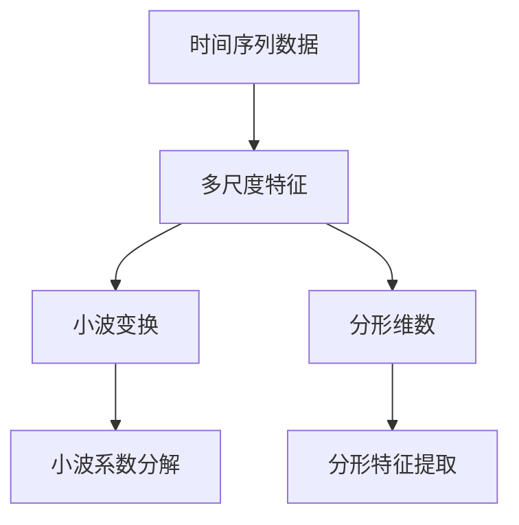
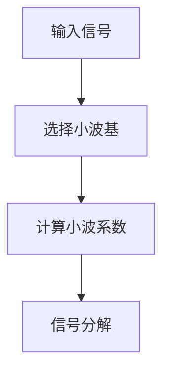
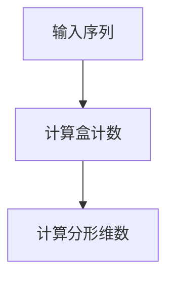
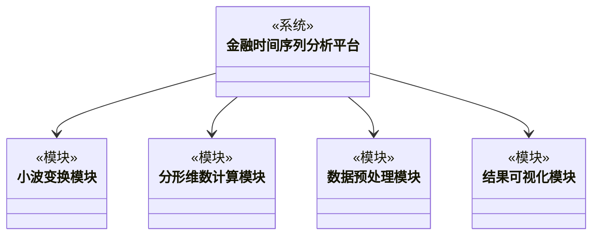
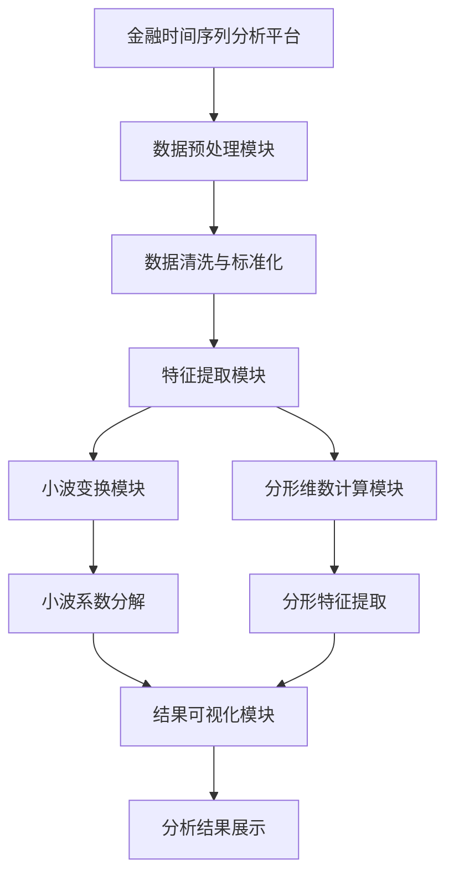
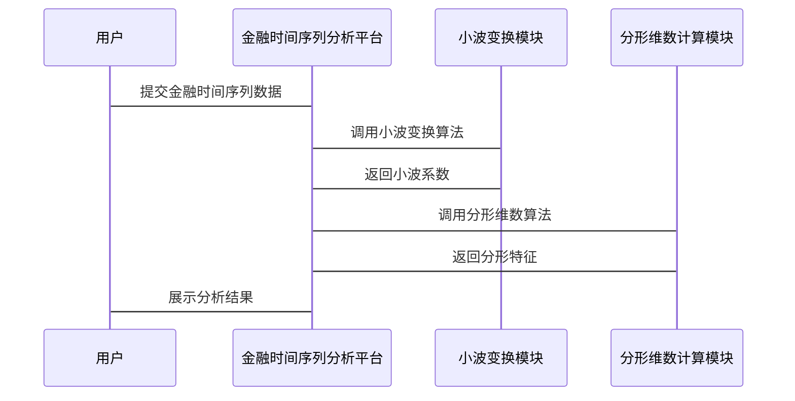

                 


# 金融时间序列多尺度分析平台

## 关键词：金融时间序列，多尺度分析，小波变换，分形维数，系统架构设计，Python实现

## 摘要：本文介绍了一种基于多尺度分析的金融时间序列分析平台，结合小波变换和分形理论，详细阐述了平台的核心算法、系统架构设计和项目实战。文章通过理论与实践结合的方式，展示了如何利用多尺度分析技术有效提取金融时间序列的特征，为金融数据分析提供了新的思路。

---

# 正文

## 第一部分: 金融时间序列多尺度分析平台概述

### 第1章: 金融时间序列分析的背景与挑战

#### 1.1 金融时间序列分析的背景

金融市场中的数据呈现出高度复杂性，传统的金融时间序列分析方法难以捕捉数据中的多尺度特性。金融时间序列数据通常具有高频波动、趋势变化、周期性等多种特征，这些特征在不同的时间尺度下表现各异。因此，如何从多尺度角度对金融时间序列进行分析，成为当前研究的热点。

#### 1.2 问题背景与问题描述

- **传统金融时间序列分析的局限性**：传统的时间序列分析方法（如ARIMA、GARCH等）主要关注单个时间尺度下的特征，难以捕捉数据在不同时间尺度下的复杂变化。
- **多尺度分析的核心问题**：金融数据在不同时间尺度下表现出不同的特征，如何有效地提取这些特征并进行综合分析，是多尺度分析的核心问题。
- **问题解决的思路与方法**：通过结合小波变换和分形理论，从多尺度角度对金融时间序列进行分解和特征提取，为金融数据分析提供更全面的视角。

#### 1.3 多尺度分析的边界与外延

- **多尺度分析的定义与范围**：多尺度分析是指在不同时间尺度下对数据进行分解和分析，以捕捉数据在不同尺度下的特征。
- **相关概念的对比与区分**：与传统的单尺度分析相比，多尺度分析更关注数据在不同时间尺度下的变化和关联。
- **多尺度分析的核心要素与组成**：包括小波变换、分形维数计算、时间序列分解等核心算法，以及数据预处理、特征提取、结果可视化等技术支持。

## 第2章: 多尺度分析的核心概念与联系

### 2.1 多尺度分析的核心原理

- **小波分析的基本原理**：小波变换是一种有效的多尺度分析工具，通过选择不同的小波基函数，可以对信号在不同尺度下进行分解。
- **分形理论与多尺度特性**：分形理论认为复杂数据在不同尺度下具有相似的结构，这为多尺度分析提供了理论基础。
- **时间序列的多分辨率分解**：通过小波变换，可以将时间序列分解为不同分辨率的子序列，每个子序列对应不同的时间尺度。

### 2.2 核心概念对比表

| 对比项                | 小波变换           | 分形理论           |
|-----------------------|------------------|------------------|
| 核心思想             | 多分辨率分解       | 自相似性         |
| 主要用途             | 信号处理、特征提取 | 描述复杂性        |
| 适用场景             | 时间序列分析       | 复杂数据建模      |
| 优缺点               | 高效、局部化       | 理论深度大、计算复杂 |

### 2.3 ER实体关系图架构



---

## 第3章: 多尺度分析算法原理

### 3.1 小波变换算法

#### 3.1.1 小波变换的定义与数学公式

小波变换是一种信号处理技术，用于将信号分解为不同尺度的子信号。其数学公式如下：

$$
\text{小波变换} = \int_{-\infty}^{\infty} f(t) \psi_{a,b}(t) dt
$$

其中，\( f(t) \) 是原始信号，\( \psi_{a,b}(t) \) 是小波基函数，\( a \) 是缩放因子，\( b \) 是平移因子。

#### 3.1.2 小波变换的实现步骤

1. 选择小波基函数。
2. 对信号进行小波变换，得到小波系数。
3. 根据小波系数进行信号分解或重构。

#### 3.1.3 小波变换的mermaid流程图



#### 3.1.4 Python代码实现

```python
import numpy as np
import pywt

# 示例时间序列数据
signal = np.array([1, 2, 3, 4, 5, 6, 7, 8, 9, 10])

# 小波变换
wavelet = 'db4'  # 使用Daubechies小波基
coeffs = pywt.wavedec(signal, wavelet)

# 输出小波系数
print("小波系数:", coeffs)
```

### 3.2 分形维数计算算法

#### 3.2.1 分形维数的定义与计算公式

分形维数是描述数据复杂性的指标，其计算公式为：

$$
\text{分形维数} = \lim_{r \to 0} \frac{\log N(r)}{\log (1/r)}
$$

其中，\( N(r) \) 是覆盖数据所需的小盒数量，\( r \) 是盒子的大小。

#### 3.2.2 分形维数计算的实现步骤

1. 对时间序列数据进行分箱处理。
2. 计算每个盒子中数据点的数量。
3. 根据盒子大小的变化，计算分形维数。

#### 3.2.3 分形维数计算的mermaid流程图



#### 3.2.4 Python代码实现

```python
import numpy as np

# 示例时间序列数据
signal = np.array([1, 2, 3, 4, 5, 6, 7, 8, 9, 10])

# 分形维数计算
def calculate_fractal_dimension(signal):
    # 计算盒计数
    n = len(signal)
    max_box_size = np.max(signal) - np.min(signal)
    box_sizes = np.arange(1, max_box_size + 1)
    counts = []
    for size in box_sizes:
        count = 0
        start = np.min(signal)
        while start <= np.max(signal):
            end = start + size
            count += 1
            start = end
        counts.append(count)
    # 计算分形维数
    box_counts = np.array(counts)
    log_box_counts = np.log(box_counts)
    log_box_sizes = np.log(box_sizes)
    # 使用线性回归计算分形维数
    slope, _ = np.polyfit(log_box_sizes, log_box_counts, 1)
    return slope

fractal_dimension = calculate_fractal_dimension(signal)
print("分形维数:", fractal_dimension)
```

## 第4章: 金融时间序列多尺度分析平台的系统分析与架构设计

### 4.1 系统功能设计

#### 4.1.1 领域模型mermaid类图



### 4.2 系统架构设计

#### 4.2.1 系统架构mermaid图



### 4.3 系统接口设计

#### 4.3.1 接口描述

1. **数据输入接口**：接收金融时间序列数据，支持多种数据格式。
2. **数据预处理接口**：对数据进行清洗、标准化等预处理操作。
3. **特征提取接口**：调用小波变换模块和分形维数计算模块，提取多尺度特征。
4. **结果输出接口**：将分析结果输出为可视化的图表或数值报告。

### 4.4 系统交互mermaid序列图



---

## 第5章: 项目实战

### 5.1 环境安装与配置

#### 5.1.1 环境需求

- Python 3.6+
- NumPy、Matplotlib、PyWavelets等Python库。

#### 5.1.2 安装依赖

```bash
pip install numpy matplotlib pywt scikit-learn
```

### 5.2 系统核心实现

#### 5.2.1 小波变换模块实现

```python
import pywt
import numpy as np

def perform_wavelet_transform(signal, wavelet='db4'):
    coeffs = pywt.wavedec(signal, wavelet)
    return coeffs
```

#### 5.2.2 分形维数计算模块实现

```python
import numpy as np

def calculate_fractal_dimension(signal):
    # 简化版的分形维数计算
    n = len(signal)
    box_size = np.max(signal) - np.min(signal)
    counts = []
    for size in np.arange(1, box_size + 1):
        count = 0
        start = np.min(signal)
        while start <= np.max(signal):
            end = start + size
            count += 1
            start = end
        counts.append(count)
    log_counts = np.log(counts)
    log_sizes = np.log(np.arange(1, box_size + 1))
    slope, _ = np.polyfit(log_sizes, log_counts, 1)
    return slope
```

#### 5.2.3 数据预处理模块实现

```python
import pandas as pd

def preprocess_data(dataframe):
    # 假设dataframe包含金融时间序列数据
    # 这里进行数据清洗和标准化
    dataframe = dataframe.dropna()
    dataframe = dataframe.pct_change().dropna()
    return dataframe
```

### 5.3 案例分析与结果展示

#### 5.3.1 数据获取与预处理

```python
import pandas as pd
import yfinance as yf

# 下载股票数据
data = yf.download('AAPL', start='2020-01-01', end='2023-01-01')
data = preprocess_data(data)
```

#### 5.3.2 多尺度特征提取

```python
signal = data['Adj Close'].values
wavelet_coeffs = perform_wavelet_transform(signal)
fractal_dimension = calculate_fractal_dimension(signal)
```

#### 5.3.3 结果可视化

```python
import matplotlib.pyplot as plt

# 绘制原始信号和小波系数
plt.figure(figsize=(12, 6))
plt.subplot(2, 1, 1)
plt.plot(signal, label='Original Signal')
plt.legend()
plt.subplot(2, 1, 2)
plt.plot(wavelet_coeffs, label='Wavelet Coefficients')
plt.legend()
plt.show()
```

### 5.4 项目小结

通过以上实现，我们构建了一个完整的金融时间序列多尺度分析平台，能够有效地提取金融数据的多尺度特征，并通过可视化结果展示分析成果。该平台为金融数据分析提供了新的思路和技术支持。

---

## 第6章: 最佳实践与总结

### 6.1 最佳实践 tips

- 在实际应用中，建议结合具体的金融场景选择合适的小波基函数和分形维数计算方法。
- 数据预处理阶段需要注意数据的完整性和代表性，避免噪声干扰。
- 结果可视化时，可以尝试不同的图表形式，以更直观地展示分析结果。

### 6.2 本章小结

金融时间序列多尺度分析平台通过结合小波变换和分形理论，提供了一种新的金融数据分析方法。该方法能够有效捕捉数据在不同时间尺度下的特征，为金融投资、风险管理等领域提供了有力支持。

### 6.3 注意事项

- 在选择小波基函数时，需要根据具体数据特点进行选择，避免盲目使用默认设置。
- 分形维数计算需要考虑数据的分布特性，确保计算结果的准确性。
- 系统设计时，要注意模块的可扩展性和可维护性，以便后续优化和功能扩展。

### 6.4 拓展阅读

- 《Wavelet Analysis and Its Applications in Finance》
- 《Fractal Geometry and Its Applications in Time Series Analysis》
- 《Python in Financial Data Analysis》

---

## 作者

作者：AI天才研究院/AI Genius Institute & 禅与计算机程序设计艺术/Zen And The Art of Computer Programming

---

以上是《金融时间序列多尺度分析平台》的技术博客文章的完整目录大纲和详细内容。如果需要进一步的修改或补充，请随时告知！

