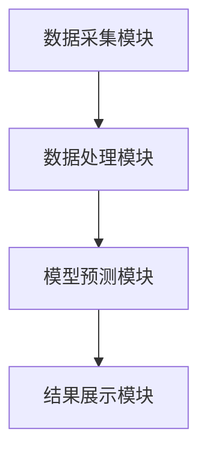
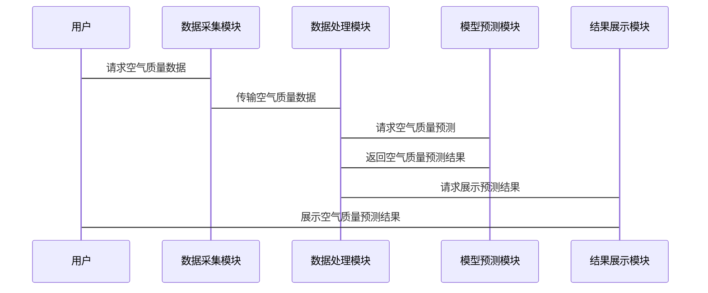

                 


# AI Agent在智能空气质量管理中的实践

> **关键词**：AI Agent, 智能空气质量管理, 机器学习, 空气质量预测, 系统架构设计

> **摘要**：本文探讨了AI Agent在智能空气质量管理中的应用，从背景、原理、数据采集与处理、预测模型构建、系统架构设计到项目实战，详细分析了如何利用AI技术优化空气质量管理过程。文章结合实际案例，展示了AI Agent在空气质量监测与预测中的潜力，并提出了系统的架构设计与实现方案。

---

# 第一部分：AI Agent与空气质量管理概述

## 第1章：AI Agent与空气质量管理概述

### 1.1 AI Agent的基本概念

#### 1.1.1 AI Agent的定义与特点
AI Agent（人工智能代理）是一种能够感知环境、自主决策并执行任务的智能实体。其特点包括：
- **自主性**：能够独立运作，无需人工干预。
- **反应性**：能够实时感知环境变化并做出响应。
- **目标导向**：以特定目标为导向，优化决策过程。
- **学习能力**：通过数据学习和优化，提升性能。

#### 1.1.2 AI Agent的工作原理
AI Agent通过感知环境、分析信息、制定决策并执行操作来完成任务。其工作流程包括：
1. **感知环境**：通过传感器或其他数据源获取环境信息。
2. **分析信息**：利用机器学习算法对数据进行分析和处理。
3. **制定决策**：基于分析结果，选择最优行动方案。
4. **执行操作**：根据决策结果，执行具体操作。

#### 1.1.3 空气质量管理的定义与目标
空气质量管理是指通过监测和控制空气污染物浓度，确保空气环境质量符合标准的过程。其目标包括：
- **减少空气污染**：降低空气中有害物质的浓度。
- **保护公众健康**：预防因空气污染引发的健康问题。
- **优化环境治理**：通过智能化手段提升环境管理效率。

---

### 1.2 AI Agent与空气质量管理的结合背景

#### 1.2.1 空气污染问题的严重性
随着工业化和城市化的快速发展，空气污染问题日益严重，成为全球性的环境问题。空气质量的恶化对人类健康和生态环境造成严重威胁。

#### 1.2.2 AI技术在环境监测中的应用潜力
AI技术在环境监测中的应用潜力巨大。通过机器学习算法，可以对空气质量数据进行预测和分析，帮助我们更好地理解空气污染的动态变化。

#### 1.2.3 AI Agent在智能空气质量管理中的优势
AI Agent在智能空气质量管理中的优势主要体现在：
- **实时监测**：能够实时感知空气质量变化。
- **智能决策**：基于实时数据，优化空气质量管理策略。
- **自主执行**：能够自动执行空气质量改善操作。

---

### 1.3 本书的核心目标与内容框架

#### 1.3.1 本书的核心目标
本书的核心目标是探讨AI Agent在智能空气质量管理中的应用，从理论到实践，全面解析如何利用AI技术优化空气质量管理过程。

#### 1.3.2 本书的主要内容框架
- **背景介绍**：介绍AI Agent和空气质量管理的基本概念与背景。
- **核心概念**：详细讲解AI Agent的核心原理与技术基础。
- **数据采集与处理**：探讨空气质量数据的采集与预处理方法。
- **预测模型构建**：介绍基于机器学习的空气质量预测模型。
- **系统架构设计**：设计AI Agent在空气质量管理中的系统架构。
- **项目实战**：通过实际案例展示AI Agent在空气质量管理中的应用。
- **总结与展望**：总结本书的核心内容，并展望未来的发展方向。

#### 1.3.3 本书的读者群体与适用场景
本书适用于对AI技术感兴趣的技术人员、环境科学家以及对空气质量管理有需求的企业和机构。无论是理论学习还是实际应用，本书都能提供有价值的参考。

---

## 第2章：AI Agent的核心原理与技术基础

### 2.1 AI Agent的核心原理

#### 2.1.1 AI Agent的基本组成
AI Agent的基本组成包括：
- **感知模块**：负责获取环境信息。
- **决策模块**：负责分析信息并制定决策。
- **执行模块**：负责执行决策结果。

#### 2.1.2 AI Agent的感知与决策机制
AI Agent的感知与决策机制包括：
- **感知**：通过传感器或其他数据源获取空气质量数据。
- **分析**：利用机器学习算法对数据进行分析和处理。
- **决策**：基于分析结果，选择最优行动方案。

#### 2.1.3 AI Agent的行动与反馈循环
AI Agent的行动与反馈循环包括：
1. **执行操作**：根据决策结果，执行具体操作。
2. **反馈机制**：根据执行结果，调整决策策略。

### 2.2 AI Agent的关键技术

#### 2.2.1 机器学习算法在AI Agent中的应用
机器学习算法在AI Agent中的应用包括：
- **监督学习**：用于空气质量预测和分类。
- **无监督学习**：用于异常检测和聚类分析。

#### 2.2.2 自然语言处理在AI Agent中的应用
自然语言处理在AI Agent中的应用包括：
- **语义理解**：用于解析空气质量报告和用户查询。
- **对话生成**：用于与用户进行自然语言交互。

#### 2.2.3 计算机视觉在AI Agent中的应用
计算机视觉在AI Agent中的应用包括：
- **图像识别**：用于识别空气质量监测设备的状态。
- **视频分析**：用于实时监控空气质量变化。

### 2.3 AI Agent的体系结构

#### 2.3.1 单智能体体系结构
单智能体体系结构适用于简单的空气质量管理任务，例如单一地点的空气质量监测。

#### 2.3.2 多智能体体系结构
多智能体体系结构适用于复杂的空气质量管理任务，例如多个监测点的协同管理。

#### 2.3.3 分层体系结构
分层体系结构将AI Agent分为感知层、决策层和执行层，适用于大规模的空气质量管理系统。

---

## 第3章：空气质量数据的采集与处理

### 3.1 空气质量数据的采集技术

#### 3.1.1 传感器技术在空气质量监测中的应用
传感器技术在空气质量监测中的应用包括：
- **颗粒物传感器**：用于监测PM2.5和PM10浓度。
- **气体传感器**：用于监测二氧化硫、氮氧化物等气体浓度。

#### 3.1.2 数据采集的常见方法
数据采集的常见方法包括：
- **有线传感器**：通过有线连接采集数据。
- **无线传感器**：通过无线通信技术采集数据。
- **云平台**：通过云平台进行数据存储和分析。

#### 3.1.3 数据采集中的挑战与解决方案
数据采集中的挑战包括：
- **数据噪声**：传感器数据可能存在噪声，需要进行数据清洗。
- **数据丢失**：传感器可能出现故障，导致数据丢失，需要进行数据补插。

### 3.2 空气质量数据的预处理

#### 3.2.1 数据清洗与异常值处理
数据清洗与异常值处理包括：
- **去除异常值**：通过统计方法或机器学习方法去除异常值。
- **插值处理**：通过插值方法填补数据缺失值。

#### 3.2.2 数据归一化与标准化
数据归一化与标准化包括：
- **归一化**：将数据缩放到统一的范围内。
- **标准化**：将数据标准化到均值为0，方差为1的范围内。

#### 3.2.3 时间序列数据的特征提取
时间序列数据的特征提取包括：
- **趋势分析**：提取时间序列的趋势特征。
- **周期性分析**：提取时间序列的周期性特征。
- **波动分析**：提取时间序列的波动特征。

---

## 第4章：空气质量预测模型的构建

### 4.1 空气质量预测模型的构建方法

#### 4.1.1 基于机器学习的预测模型
基于机器学习的预测模型包括：
- **线性回归模型**：用于空气质量的线性预测。
- **支持向量机模型**：用于空气质量的非线性预测。
- **随机森林模型**：用于空气质量的集成预测。

#### 4.1.2 基于深度学习的预测模型
基于深度学习的预测模型包括：
- **LSTM网络**：用于时间序列的预测。
- **卷积神经网络**：用于图像数据的预测。

#### 4.1.3 混合模型的构建方法
混合模型的构建方法包括：
- **集成学习**：将多种模型的结果进行集成。
- **迁移学习**：利用已有的模型进行迁移学习。

### 4.2 空气质量预测模型的评估与优化

#### 4.2.1 模型评估指标与方法
模型评估指标与方法包括：
- **均方误差（MSE）**：衡量预测值与真实值的差异。
- **平均绝对误差（MAE）**：衡量预测值与真实值的绝对差异。
- **R²系数**：衡量模型的拟合优度。

#### 4.2.2 超参数优化与调参技巧
超参数优化与调参技巧包括：
- **网格搜索**：通过网格搜索找到最优超参数。
- **随机搜索**：通过随机搜索优化超参数。
- **贝叶斯优化**：通过贝叶斯方法优化超参数。

---

## 第5章：空气质量预测模型的数学公式与实现

### 5.1 基于线性回归的空气质量预测模型

#### 5.1.1 线性回归模型的数学公式
线性回归模型的数学公式为：
$$ y = \beta_0 + \beta_1 x + \epsilon $$
其中，$y$为预测值，$x$为自变量，$\beta_0$和$\beta_1$为模型参数，$\epsilon$为误差项。

#### 5.1.2 线性回归模型的实现步骤
1. **数据准备**：收集空气质量数据和相关特征。
2. **数据预处理**：对数据进行归一化和标准化处理。
3. **模型训练**：利用最小二乘法训练线性回归模型。
4. **模型评估**：计算模型的均方误差（MSE）和R²系数。

### 5.2 基于LSTM的空气质量预测模型

#### 5.2.1 LSTM网络的数学公式
LSTM网络的数学公式为：
$$ f_t(x_t) = \sigma(g_t(x_t)) $$
其中，$x_t$为输入数据，$g_t$为门控函数，$\sigma$为sigmoid函数。

#### 5.2.2 LSTM网络的实现步骤
1. **数据准备**：收集空气质量时间序列数据。
2. **数据预处理**：对数据进行归一化和滑动窗口处理。
3. **模型训练**：利用反向传播算法训练LSTM网络。
4. **模型评估**：计算模型的均方误差（MSE）和准确率。

---

## 第6章：空气质量预测模型的系统架构设计

### 6.1 系统功能设计

#### 6.1.1 系统功能模块
系统功能模块包括：
- **数据采集模块**：负责采集空气质量数据。
- **数据处理模块**：负责对数据进行预处理。
- **模型预测模块**：负责空气质量预测。
- **结果展示模块**：负责展示预测结果。

#### 6.1.2 系统功能流程
系统功能流程包括：
1. 数据采集模块采集空气质量数据。
2. 数据处理模块对数据进行预处理。
3. 模型预测模块利用预处理后的数据进行空气质量预测。
4. 结果展示模块展示预测结果。

### 6.2 系统架构设计

#### 6.2.1 系统架构图
以下是系统架构设计的Mermaid图：



#### 6.2.2 系统接口设计
系统接口设计包括：
- **数据采集接口**：提供REST API接口，用于数据采集。
- **数据处理接口**：提供REST API接口，用于数据处理。
- **模型预测接口**：提供REST API接口，用于空气质量预测。
- **结果展示接口**：提供REST API接口，用于结果展示。

### 6.3 系统交互流程图

以下是系统交互流程图的Mermaid序列图：



---

## 第7章：空气质量预测模型的项目实战

### 7.1 环境安装

#### 7.1.1 安装Python环境
安装Python环境的步骤包括：
1. 下载并安装Python。
2. 安装Jupyter Notebook用于代码开发。

#### 7.1.2 安装机器学习库
安装机器学习库的步骤包括：
1. 使用pip安装scikit-learn、TensorFlow和Keras。

#### 7.1.3 安装数据处理库
安装数据处理库的步骤包括：
1. 使用pip安装Pandas、NumPy和Matplotlib。

### 7.2 系统核心实现源代码

#### 7.2.1 数据采集模块代码
以下是数据采集模块的代码示例：

```python
import pandas as pd
import numpy as np

# 数据采集模块代码
def collect_data():
    # 模拟数据采集
    data = pd.DataFrame({
        'PM2.5': np.random.rand(100),
        'PM10': np.random.rand(100),
        'SO2': np.random.rand(100),
        'NO2': np.random.rand(100)
    })
    return data

if __name__ == '__main__':
    data = collect_data()
    print(data)
```

#### 7.2.2 数据处理模块代码
以下是数据处理模块的代码示例：

```python
import pandas as pd
import numpy as np

# 数据处理模块代码
def preprocess_data(data):
    # 数据归一化处理
    normalized_data = (data - data.min()) / (data.max() - data.min())
    return normalized_data

if __name__ == '__main__':
    data = pd.DataFrame({
        'PM2.5': np.random.rand(100),
        'PM10': np.random.rand(100),
        'SO2': np.random.rand(100),
        'NO2': np.random.rand(100)
    })
    normalized_data = preprocess_data(data)
    print(normalized_data)
```

#### 7.2.3 模型预测模块代码
以下是模型预测模块的代码示例：

```python
from sklearn.linear_model import LinearRegression

# 模型预测模块代码
def predict_air_quality(X_train, y_train, X_test):
    # 训练线性回归模型
    model = LinearRegression()
    model.fit(X_train, y_train)
    # 预测测试数据
    y_pred = model.predict(X_test)
    return y_pred

if __name__ == '__main__':
    # 模拟数据
    X_train = np.array([[1, 2], [3, 4], [5, 6]])
    y_train = np.array([7, 8, 9])
    X_test = np.array([[2, 3], [4, 5]])
    y_pred = predict_air_quality(X_train, y_train, X_test)
    print(y_pred)
```

#### 7.2.4 结果展示模块代码
以下是结果展示模块的代码示例：

```python
import matplotlib.pyplot as plt

# 结果展示模块代码
def display_results(true_values, predicted_values):
    # 绘制预测结果对比图
    plt.plot(true_values, label='True Values')
    plt.plot(predicted_values, label='Predicted Values')
    plt.xlabel('Time')
    plt.ylabel('Air Quality Index')
    plt.legend()
    plt.show()

if __name__ == '__main__':
    # 模拟数据
    true_values = np.array([7, 8, 9, 10])
    predicted_values = np.array([6, 8, 9, 11])
    display_results(true_values, predicted_values)
```

### 7.3 代码应用解读与分析

#### 7.3.1 数据采集模块代码解读
数据采集模块代码通过随机生成数据模拟空气质量数据的采集过程，展示了如何获取空气质量数据。

#### 7.3.2 数据处理模块代码解读
数据处理模块代码通过归一化处理，展示了如何对空气质量数据进行预处理，以便后续模型训练。

#### 7.3.3 模型预测模块代码解读
模型预测模块代码通过线性回归模型，展示了如何基于训练数据进行空气质量预测。

#### 7.3.4 结果展示模块代码解读
结果展示模块代码通过绘制对比图，展示了如何可视化空气质量预测结果，帮助用户更好地理解预测结果。

### 7.4 实际案例分析与详细讲解

#### 7.4.1 数据准备
数据准备包括收集空气质量数据和相关特征。例如，我们可以从公开的数据集（如AQI数据集）获取空气质量数据。

#### 7.4.2 数据预处理
数据预处理包括对数据进行归一化和滑动窗口处理，以便模型能够更好地捕捉空气质量的变化趋势。

#### 7.4.3 模型训练
模型训练包括利用训练数据训练空气质量预测模型。例如，我们可以使用线性回归模型或LSTM网络进行训练。

#### 7.4.4 模型评估
模型评估包括计算模型的均方误差（MSE）和准确率，以评估模型的预测性能。

#### 7.4.5 模型优化
模型优化包括调整模型的超参数，以提高模型的预测精度。例如，我们可以使用网格搜索或随机搜索进行超参数优化。

### 7.5 项目小结
通过以上步骤，我们可以实现一个基于AI Agent的空气质量预测系统。该系统能够实时采集空气质量数据，进行数据预处理，训练空气质量预测模型，并展示预测结果。通过实际案例的分析，我们可以看到AI Agent在智能空气质量管理中的巨大潜力。

---

## 第8章：空气质量预测模型的最佳实践与总结

### 8.1 最佳实践 tips

#### 8.1.1 数据采集
- 确保数据的准确性和完整性。
- 定期校准传感器，确保数据的可靠性。

#### 8.1.2 数据处理
- 对数据进行归一化和标准化处理，以提高模型的泛化能力。
- 采用滑动窗口方法，捕捉空气质量的时间序列特征。

#### 8.1.3 模型选择
- 根据数据的特性和任务的需求选择合适的模型。
- 对于时间序列数据，LSTM网络可能表现更好。

#### 8.1.4 模型优化
- 使用网格搜索或随机搜索优化模型的超参数。
- 采用早停法防止过拟合。

#### 8.1.5 系统设计
- 设计模块化的系统架构，便于系统的扩展和维护。
- 采用REST API接口，便于系统的集成与调用。

### 8.2 总结
通过本文的详细讲解，我们可以看到AI Agent在智能空气质量管理中的巨大潜力。从数据采集到模型预测，再到结果展示，AI Agent能够帮助我们更高效、更准确地管理空气质量。然而，AI Agent的应用还面临一些挑战，例如数据的实时性、模型的可解释性等，这些都需要我们在未来进一步研究和解决。

### 8.3 展望
未来，随着AI技术的不断发展，AI Agent在智能空气质量管理中的应用将更加广泛。例如，我们可以利用强化学习算法优化空气质量管理策略，或者利用边缘计算技术提升空气质量监测的实时性。同时，随着物联网技术的发展，AI Agent将能够更高效地协同多个空气质量监测设备，实现更精准的空气质量管理。

---

# 作者：AI天才研究院/AI Genius Institute & 禅与计算机程序设计艺术 /Zen And The Art of Computer Programming

