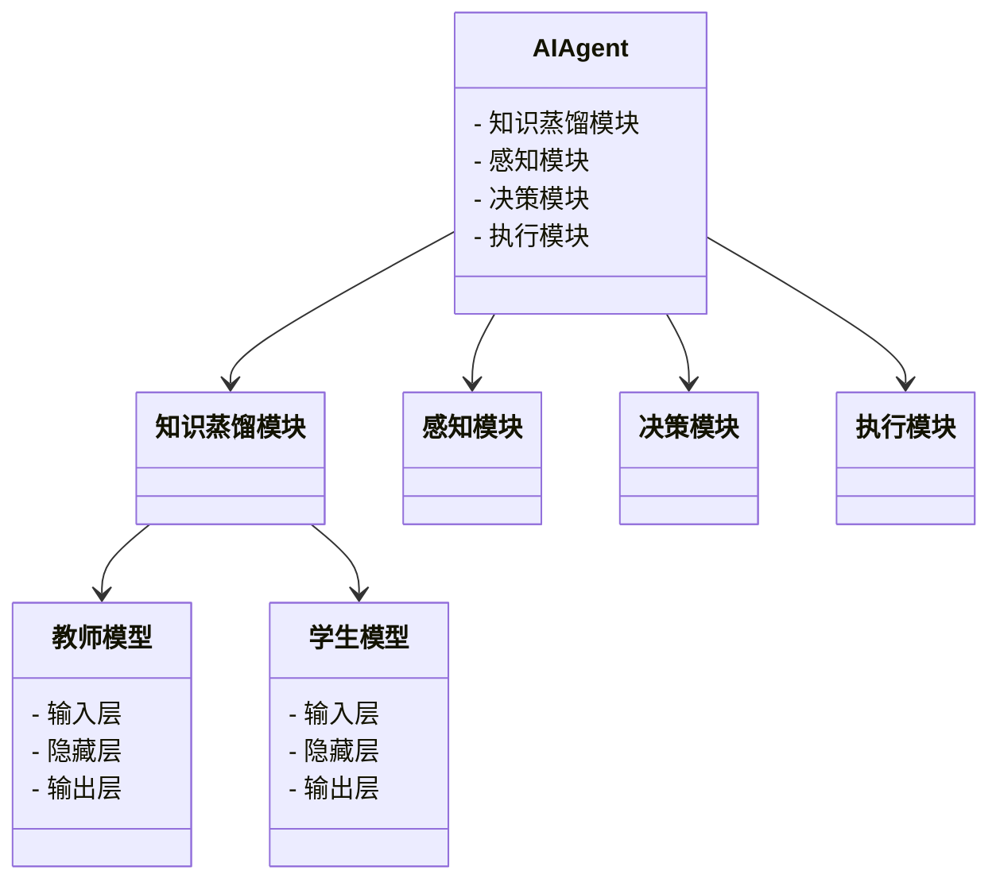
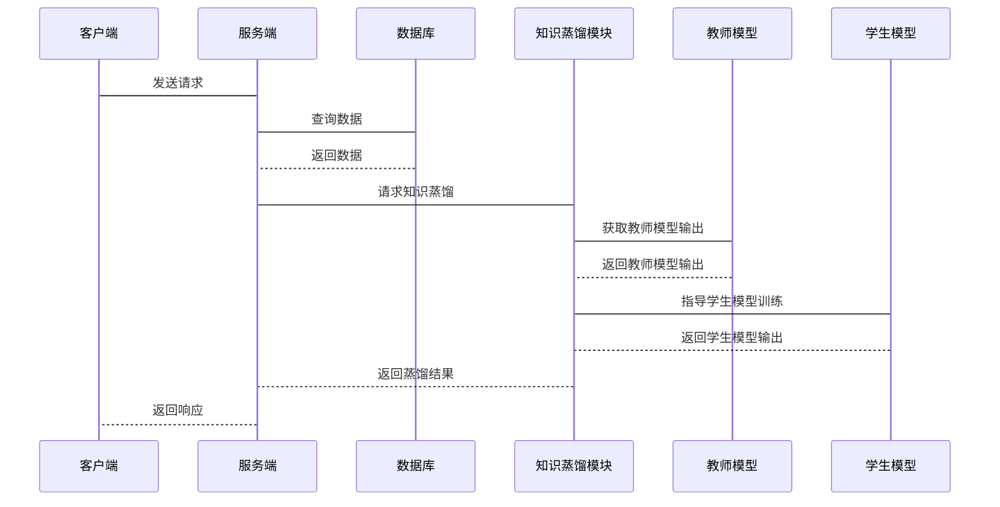

                 


# AI Agent的知识蒸馏：从大模型到轻量级应用

> 关键词：知识蒸馏，AI Agent，模型压缩，轻量级应用，深度学习

> 摘要：随着人工智能技术的飞速发展，大模型在AI Agent中的应用越来越广泛，但其计算复杂度和资源消耗也带来了挑战。知识蒸馏作为一种有效的模型压缩技术，能够将大模型的知识迁移到轻量级模型中，从而实现高效、低资源消耗的应用。本文详细探讨了知识蒸馏在AI Agent中的原理、技术实现、系统设计及实际应用，为读者提供从理论到实践的全面指导。

---

## 第1章: 知识蒸馏与AI Agent概述

### 1.1 知识蒸馏的核心概念

#### 1.1.1 什么是知识蒸馏
知识蒸馏（Knowledge Distillation）是一种通过将大型复杂模型（教师模型）的知识迁移到小型简单模型（学生模型）中的技术。其核心思想是通过教师模型的输出作为软目标，指导学生模型的训练，从而实现模型的压缩和性能提升。

知识蒸馏的过程包括以下步骤：
1. **教师模型训练**：首先训练一个大型复杂模型（教师模型）。
2. **知识蒸馏**：将教师模型的输出作为软目标，用于指导学生模型的训练。
3. **学生模型优化**：通过蒸馏过程，优化学生模型的参数，使其逼近教师模型的性能。

知识蒸馏的优势在于：
- 可以显著降低模型的计算复杂度和存储需求。
- 可以提升模型的泛化能力，尤其在数据量有限的情况下。
- 可以将教师模型的复杂知识迁移到轻量级模型中，适用于边缘计算和移动设备等场景。

#### 1.1.2 知识蒸馏的基本原理
知识蒸馏的核心在于将教师模型的输出概率分布作为软目标，用于指导学生模型的训练。具体来说，教师模型的输出是一个概率分布，表示输入样本属于各个类别的可能性；学生模型通过模仿教师模型的输出分布，逐步逼近教师模型的性能。

#### 1.1.3 知识蒸馏与AI Agent的关系
AI Agent是一种能够感知环境、自主决策并执行任务的智能体。知识蒸馏在AI Agent中的应用，可以将大型复杂模型的知识迁移到轻量级模型中，从而实现高效、低资源消耗的智能决策和执行。通过知识蒸馏，AI Agent可以在资源受限的环境中仍保持较高的性能和智能性。

### 1.2 AI Agent的基本概念

#### 1.2.1 AI Agent的定义与分类
AI Agent（人工智能代理）是指能够感知环境、自主决策并执行任务的智能体。根据功能和应用场景的不同，AI Agent可以分为以下几类：
- **简单反射型Agent**：基于当前输入直接执行预定义的规则。
- **基于模型的反射型Agent**：利用环境模型进行决策和规划。
- **目标驱动型Agent**：基于明确的目标进行决策和行动。
- **实用驱动型Agent**：通过优化效用函数进行决策和行动。

#### 1.2.2 AI Agent的核心功能与特点
AI Agent的核心功能包括：
- **感知环境**：通过传感器或其他输入方式感知外部环境。
- **自主决策**：基于感知信息和内部状态，自主决策并执行行动。
- **学习与适应**：通过学习算法不断优化自身的决策策略。

AI Agent的特点包括：
- **自主性**：能够在没有外部干预的情况下自主运行。
- **反应性**：能够实时感知环境并做出响应。
- **目标导向性**：基于目标或任务驱动决策和行动。

#### 1.2.3 AI Agent的应用场景与挑战
AI Agent的应用场景广泛，包括：
- **智能助手**：如Siri、Alexa等语音助手。
- **自动驾驶**：如自动驾驶汽车中的决策系统。
- **智能机器人**：如工业机器人和家庭服务机器人。
- **游戏AI**：如智能游戏角色和NPC。

AI Agent面临的挑战包括：
- **复杂环境的处理**：如何在动态、不确定的环境中做出高效决策。
- **多目标优化**：如何在多个目标之间进行权衡和优化。
- **资源受限的环境**：如何在计算资源有限的情况下保持高性能。

### 1.3 知识蒸馏在AI Agent中的作用

#### 1.3.1 知识蒸馏如何提升AI Agent的性能
知识蒸馏可以通过以下方式提升AI Agent的性能：
- **降低计算复杂度**：通过将大模型的知识迁移到轻量级模型中，减少计算资源的消耗。
- **提升泛化能力**：通过模仿教师模型的输出分布，增强模型的泛化能力和鲁棒性。
- **适应边缘计算**：在资源受限的边缘设备中，通过轻量级模型实现高效的AI推理。

#### 1.3.2 知识蒸馏在AI Agent中的优势
知识蒸馏的优势在于：
- **模型压缩**：通过知识蒸馏，可以将大型复杂模型的参数数量显著减少，同时保持较高的性能。
- **性能提升**：在某些情况下，学生模型在特定任务上的性能可以接近甚至超过教师模型。
- **灵活性与适应性**：知识蒸馏可以根据不同的应用场景和需求，灵活调整学生模型的结构和规模。

#### 1.3.3 知识蒸馏的局限性与改进方向
知识蒸馏的局限性包括：
- **性能损失**：在某些情况下，学生模型的性能可能无法完全达到教师模型的水平。
- **计算成本**：知识蒸馏需要进行多次迭代训练，计算成本较高。
- **依赖教师模型的质量**：知识蒸馏的效果高度依赖教师模型的质量和性能。

改进方向包括：
- **多教师蒸馏**：利用多个教师模型的知识进行蒸馏，提升学生模型的性能。
- **自适应蒸馏**：根据学生模型的训练进度和环境动态调整蒸馏策略。
- **结合其他压缩技术**：将知识蒸馏与其他模型压缩技术（如剪枝、量化）结合，进一步提升压缩效果。

---

## 第2章: 知识蒸馏的原理与技术

### 2.1 知识蒸馏的基本原理

#### 2.1.1 知识蒸馏的过程与步骤
知识蒸馏的过程可以分为以下几个步骤：
1. **教师模型训练**：首先训练一个大型复杂模型（教师模型）。
2. **知识蒸馏**：将教师模型的输出作为软目标，用于指导学生模型的训练。
3. **学生模型优化**：通过蒸馏过程，优化学生模型的参数，使其逼近教师模型的性能。

知识蒸馏的关键在于教师模型的输出概率分布。通过将教师模型的输出作为软目标，学生模型可以通过模仿教师模型的输出分布，逐步逼近教师模型的性能。

#### 2.1.2 知识蒸馏的数学模型
知识蒸馏的数学模型如下：

假设教师模型的输出概率分布为 $P(y|x)$，学生模型的输出概率分布为 $Q(y|x)$。知识蒸馏的目标是通过优化学生模型的参数，使得 $Q(y|x)$ 尽可能接近 $P(y|x)$。

知识蒸馏的损失函数可以表示为：
$$
L = -\sum_{i=1}^{n} [P(y_i|x) \cdot \log Q(y_i|x)]
$$

其中，$n$ 表示训练样本的数量，$P(y_i|x)$ 和 $Q(y_i|x)$ 分别表示教师模型和学生模型在输入 $x$ 下输出类别 $y_i$ 的概率。

通过最小化上述损失函数，学生模型可以逼近教师模型的输出概率分布，从而实现知识蒸馏。

#### 2.1.3 知识蒸馏的关键技术与方法
知识蒸馏的关键技术包括：
- **软目标蒸馏**：通过教师模型的输出概率分布作为软目标，指导学生模型的训练。
- **硬目标蒸馏**：通过教师模型的类别预测结果作为硬目标，指导学生模型的训练。
- **多任务蒸馏**：将多个任务的知识迁移到学生模型中，提升模型的多任务处理能力。
- **自适应蒸馏**：根据学生模型的训练进度和环境动态调整蒸馏策略。

### 2.2 知识蒸馏的数学模型

#### 2.2.1 知识蒸馏的数学公式推导
知识蒸馏的数学公式推导如下：

假设教师模型的输出概率分布为 $P(y|x)$，学生模型的输出概率分布为 $Q(y|x)$。知识蒸馏的目标是通过优化学生模型的参数，使得 $Q(y|x)$ 尽可能接近 $P(y|x)$。

知识蒸馏的损失函数可以表示为：
$$
L = -\sum_{i=1}^{n} [P(y_i|x) \cdot \log Q(y_i|x)]
$$

其中，$n$ 表示训练样本的数量，$P(y_i|x)$ 和 $Q(y_i|x)$ 分别表示教师模型和学生模型在输入 $x$ 下输出类别 $y_i$ 的概率。

通过最小化上述损失函数，学生模型可以逼近教师模型的输出概率分布，从而实现知识蒸馏。

#### 2.2.2 知识蒸馏的损失函数分析
知识蒸馏的损失函数分析如下：

知识蒸馏的损失函数 $L$ 是学生模型输出概率分布 $Q(y|x)$ 的对数似然的期望值，权重为教师模型输出概率分布 $P(y|x)$。通过最小化 $L$，学生模型可以逼近教师模型的输出概率分布，从而实现知识蒸馏。

需要注意的是，知识蒸馏的损失函数 $L$ 通常与交叉熵损失函数结合使用，以实现教师模型和学生模型的联合优化。

#### 2.2.3 知识蒸馏的优化算法探讨
知识蒸馏的优化算法探讨如下：

知识蒸馏的优化算法主要是基于梯度下降的方法，如随机梯度下降（SGD）和Adam优化器。通过计算损失函数 $L$ 对学生模型参数的梯度，并进行参数更新，可以优化学生模型的参数，使其逼近教师模型的性能。

### 2.3 知识蒸馏的技术实现

#### 2.3.1 知识蒸馏的实现框架
知识蒸馏的实现框架如下：

1. **教师模型训练**：首先训练一个大型复杂模型（教师模型）。
2. **知识蒸馏**：将教师模型的输出作为软目标，用于指导学生模型的训练。
3. **学生模型优化**：通过蒸馏过程，优化学生模型的参数，使其逼近教师模型的性能。

#### 2.3.2 知识蒸馏的实现步骤与流程
知识蒸馏的实现步骤与流程如下：

1. **教师模型训练**：训练教师模型，得到教师模型的参数。
2. **知识蒸馏**：将教师模型的输出作为软目标，用于指导学生模型的训练。
3. **学生模型优化**：通过蒸馏过程，优化学生模型的参数，使其逼近教师模型的性能。

---

## 第3章: AI Agent的知识蒸馏技术

### 3.1 AI Agent的知识蒸馏特点

#### 3.1.1 AI Agent知识蒸馏的独特性
AI Agent的知识蒸馏具有以下独特性：
- **实时性要求高**：AI Agent需要在动态、实时的环境中进行决策和行动，对知识蒸馏的实时性提出了更高的要求。
- **多模态数据处理**：AI Agent需要处理多种类型的输入数据（如图像、语音、文本等），对知识蒸馏的多模态处理能力提出了更高的要求。
- **任务多样性**：AI Agent需要在多种任务中进行决策和行动，对知识蒸馏的泛化能力和适应性提出了更高的要求。

#### 3.1.2 AI Agent知识蒸馏的核心技术
AI Agent知识蒸馏的核心技术包括：
- **多模态蒸馏**：将教师模型在多模态数据上的知识迁移到学生模型中。
- **实时蒸馏**：在动态、实时的环境中进行知识蒸馏，确保AI Agent的实时性和响应速度。
- **自适应蒸馏**：根据环境动态和任务需求，自适应地调整蒸馏策略。

#### 3.1.3 AI Agent知识蒸馏的优化策略
AI Agent知识蒸馏的优化策略包括：
- **多教师蒸馏**：利用多个教师模型的知识进行蒸馏，提升学生模型的性能。
- **自适应蒸馏**：根据学生模型的训练进度和环境动态调整蒸馏策略。
- **结合其他压缩技术**：将知识蒸馏与其他模型压缩技术（如剪枝、量化）结合，进一步提升压缩效果。

### 3.2 AI Agent的知识蒸馏实现

#### 3.2.1 AI Agent知识蒸馏的实现框架
AI Agent知识蒸馏的实现框架如下：

1. **教师模型训练**：训练一个大型复杂模型（教师模型）。
2. **知识蒸馏**：将教师模型的输出作为软目标，用于指导学生模型的训练。
3. **学生模型优化**：通过蒸馏过程，优化学生模型的参数，使其逼近教师模型的性能。

#### 3.2.2 AI Agent知识蒸馏的实现步骤
AI Agent知识蒸馏的实现步骤如下：

1. **教师模型训练**：训练教师模型，得到教师模型的参数。
2. **知识蒸馏**：将教师模型的输出作为软目标，用于指导学生模型的训练。
3. **学生模型优化**：通过蒸馏过程，优化学生模型的参数，使其逼近教师模型的性能。

---

## 第4章: 系统分析与架构设计方案

### 4.1 系统分析

#### 4.1.1 问题场景介绍
在AI Agent的应用中，通常需要在资源受限的环境中实现高效的智能决策和执行。为了降低计算复杂度和资源消耗，可以通过知识蒸馏将大型复杂模型的知识迁移到轻量级模型中，从而实现高效、低资源消耗的AI Agent。

#### 4.1.2 项目介绍
本项目旨在通过知识蒸馏技术，将大型复杂模型的知识迁移到轻量级模型中，实现高效、低资源消耗的AI Agent。

#### 4.1.3 系统功能设计（领域模型）
以下是系统功能设计的领域模型：



### 4.2 系统架构设计

#### 4.2.1 系统架构设计（mermaid架构图）
以下是系统架构设计的mermaid架构图：


#### 4.2.2 系统接口设计
系统接口设计如下：

1. **感知模块接口**：负责接收外部环境的输入数据，并将其传递给决策模块。
2. **决策模块接口**：负责根据感知模块提供的输入数据，结合知识蒸馏模块的知识，做出决策并生成执行指令。
3. **执行模块接口**：负责执行决策模块生成的执行指令，并将执行结果反馈给感知模块。

#### 4.2.3 系统交互设计（mermaid序列图）
以下是系统交互设计的mermaid序列图：



---

## 第5章: 项目实战

### 5.1 环境安装

#### 5.1.1 安装Python
安装Python 3.8 或更高版本。

#### 5.1.2 安装依赖
安装以下依赖：

```bash
pip install numpy
pip install matplotlib
pip install torch
```

### 5.2 核心实现

#### 5.2.1 知识蒸馏实现代码
以下是知识蒸馏的实现代码：

```python
import torch
import torch.nn as nn
import torch.optim as optim
import numpy as np

# 定义教师模型
class TeacherModel(nn.Module):
    def __init__(self):
        super(TeacherModel, self).__init__()
        self.fc1 = nn.Linear(2, 4)
        self.fc2 = nn.Linear(4, 2)
    
    def forward(self, x):
        x = torch.relu(self.fc1(x))
        x = torch.sigmoid(self.fc2(x))
        return x

# 定义学生模型
class StudentModel(nn.Module):
    def __init__(self):
        super(StudentModel, self).__init__()
        self.fc1 = nn.Linear(2, 3)
        self.fc2 = nn.Linear(3, 2)
    
    def forward(self, x):
        x = torch.relu(self.fc1(x))
        x = torch.sigmoid(self.fc2(x))
        return x

# 训练教师模型
def train_teacher():
    teacher_model = TeacherModel()
    criterion = nn.BCEWithLogitsLoss()
    optimizer = optim.Adam(teacher_model.parameters(), lr=0.01)
    
    for epoch in range(100):
        inputs = torch.randn(100, 2)
        labels = torch.randint(0, 2, (100, 1)).float()
        
        outputs = teacher_model(inputs)
        loss = criterion(outputs, labels)
        optimizer.zero_grad()
        loss.backward()
        optimizer.step()
    
    return teacher_model

# 知识蒸馏过程
def knowledge_distillation(teacher_model, student_model):
    criterion = nn.KLDivLoss(reduction='batchmean')
    optimizer = optim.Adam(student_model.parameters(), lr=0.01)
    
    for epoch in range(100):
        inputs = torch.randn(100, 2)
        labels = torch.randint(0, 2, (100, 1)).float()
        
        with torch.no_grad():
            teacher_outputs = teacher_model(inputs)
        
        student_outputs = student_model(inputs)
        
        loss = criterion(torch.log(student_outputs), torch.log(teacher_outputs))
        optimizer.zero_grad()
        loss.backward()
        optimizer.step()
    
    return student_model

# 测试模型
def test_model(model):
    inputs = torch.randn(1, 2)
    outputs = model(inputs)
    print("Model outputs:", outputs)

# 主函数
if __name__ == "__main__":
    teacher_model = train_teacher()
    student_model = StudentModel()
    student_model = knowledge_distillation(teacher_model, student_model)
    test_model(student_model)
```

#### 5.2.2 代码实现与解读
代码实现如下：

1. **教师模型训练**：定义教师模型并进行训练，得到教师模型的参数。
2. **知识蒸馏过程**：将教师模型的输出作为软目标，用于指导学生模型的训练。
3. **学生模型优化**：通过蒸馏过程，优化学生模型的参数，使其逼近教师模型的性能。

### 5.3 案例分析与详细讲解

#### 5.3.1 案例分析
以下是知识蒸馏的案例分析：

1. **教师模型训练**：训练一个小型的教师模型，得到教师模型的参数。
2. **知识蒸馏过程**：将教师模型的输出作为软目标，用于指导学生模型的训练。
3. **学生模型优化**：通过蒸馏过程，优化学生模型的参数，使其逼近教师模型的性能。

### 5.4 项目小结

#### 5.4.1 项目总结
通过本项目的实现，我们可以看到知识蒸馏在AI Agent中的应用，可以通过将大型复杂模型的知识迁移到轻量级模型中，实现高效、低资源消耗的AI Agent。

#### 5.4.2 项目经验
通过本项目的实践，我们可以总结出以下经验：
- 知识蒸馏的关键在于教师模型的输出概率分布。
- 学生模型的结构设计对蒸馏效果有重要影响。
- 知识蒸馏的优化需要结合具体的任务需求和环境动态。

---

## 第6章: 知识蒸馏的优化与部署

### 6.1 知识蒸馏的优化技巧

#### 6.1.1 模型压缩技术
模型压缩技术包括：
- **剪枝**：通过去除模型中冗余的参数或结构，降低模型的参数数量。
- **量化**：通过将模型的参数从浮点数表示为整数或低精度表示，降低模型的存储需求。
- **知识蒸馏**：通过将教师模型的知识迁移到学生模型中，降低模型的计算复杂度。

#### 6.1.2 算法优化技巧
算法优化技巧包括：
- **多教师蒸馏**：利用多个教师模型的知识进行蒸馏，提升学生模型的性能。
- **自适应蒸馏**：根据学生模型的训练进度和环境动态调整蒸馏策略。
- **结合其他压缩技术**：将知识蒸馏与其他模型压缩技术（如剪枝、量化）结合，进一步提升压缩效果。

### 6.2 知识蒸馏的部署与应用

#### 6.2.1 知识蒸馏的部署流程
知识蒸馏的部署流程如下：
1. **教师模型训练**：训练一个大型复杂模型（教师模型）。
2. **知识蒸馏**：将教师模型的输出作为软目标，用于指导学生模型的训练。
3. **学生模型优化**：通过蒸馏过程，优化学生模型的参数，使其逼近教师模型的性能。
4. **学生模型部署**：将优化后的学生模型部署到目标环境中，进行实际应用。

#### 6.2.2 知识蒸馏的实际应用
知识蒸馏的实际应用包括：
- **边缘计算**：在资源受限的边缘设备中，通过轻量级模型实现高效的AI推理。
- **移动应用**：在移动设备中，通过轻量级模型实现高效的AI推理。
- **实时应用**：在实时性要求高的应用中，通过轻量级模型实现高效的AI推理。

### 6.3 知识蒸馏的注意事项

#### 6.3.1 知识蒸馏的性能损失
知识蒸馏的性能损失主要体现在以下几个方面：
- **学生模型的性能**：学生模型的性能可能无法完全达到教师模型的水平。
- **计算成本**：知识蒸馏需要进行多次迭代训练，计算成本较高。
- **依赖教师模型的质量**：知识蒸馏的效果高度依赖教师模型的质量和性能。

#### 6.3.2 知识蒸馏的优化建议
知识蒸馏的优化建议包括：
- **多教师蒸馏**：利用多个教师模型的知识进行蒸馏，提升学生模型的性能。
- **自适应蒸馏**：根据学生模型的训练进度和环境动态调整蒸馏策略。
- **结合其他压缩技术**：将知识蒸馏与其他模型压缩技术（如剪枝、量化）结合，进一步提升压缩效果。

---

## 第7章: 知识蒸馏的未来展望

### 7.1 知识蒸馏的未来发展趋势

#### 7.1.1 知识蒸馏的多模态应用
知识蒸馏的多模态应用包括：
- **多模态蒸馏**：将教师模型在多模态数据上的知识迁移到学生模型中。
- **实时蒸馏**：在动态、实时的环境中进行知识蒸馏，确保AI Agent的实时性和响应速度。
- **自适应蒸馏**：根据环境动态和任务需求，自适应地调整蒸馏策略。

#### 7.1.2 知识蒸馏的边缘计算应用
知识蒸馏的边缘计算应用包括：
- **边缘设备中的知识蒸馏**：在资源受限的边缘设备中，通过知识蒸馏实现高效的AI推理。
- **实时应用中的知识蒸馏**：在实时性要求高的应用中，通过知识蒸馏实现高效的AI推理。

### 7.2 知识蒸馏的技术挑战

#### 7.2.1 知识蒸馏的性能瓶颈
知识蒸馏的性能瓶颈包括：
- **学生模型的性能限制**：学生模型的性能可能无法完全达到教师模型的水平。
- **计算成本**：知识蒸馏需要进行多次迭代训练，计算成本较高。
- **依赖教师模型的质量**：知识蒸馏的效果高度依赖教师模型的质量和性能。

#### 7.2.2 知识蒸馏的资源限制
知识蒸馏的资源限制包括：
- **计算资源**：知识蒸馏需要大量的计算资源，可能限制其在资源受限环境中的应用。
- **存储资源**：知识蒸馏需要存储大量的模型参数和训练数据，可能限制其在存储资源受限环境中的应用。

### 7.3 知识蒸馏的创新方向

#### 7.3.1 知识蒸馏的创新应用
知识蒸馏的创新应用包括：
- **多任务蒸馏**：将多个任务的知识迁移到学生模型中，提升模型的多任务处理能力。
- **自适应蒸馏**：根据学生模型的训练进度和环境动态调整蒸馏策略。
- **结合其他技术**：将知识蒸馏与其他技术（如强化学习、生成对抗网络）结合，探索新的应用方向。

#### 7.3.2 知识蒸馏的创新挑战
知识蒸馏的创新挑战包括：
- **如何提升学生模型的性能**：如何在保持学生模型轻量级的同时，提升其性能和泛化能力。
- **如何降低计算成本**：如何在知识蒸馏的过程中，降低计算成本和资源消耗。
- **如何处理多模态数据**：如何在多模态数据上进行知识蒸馏，提升模型的多模态处理能力。

---

## 结语

知识蒸馏作为一种有效的模型压缩技术，在AI Agent中的应用前景广阔。通过知识蒸馏，可以将大型复杂模型的知识迁移到轻量级模型中，实现高效、低资源消耗的AI Agent。随着技术的不断发展，知识蒸馏在多模态、实时性和边缘计算等领域的应用将更加广泛，为AI Agent的发展提供新的机遇和挑战。

---

作者：AI天才研究院/AI Genius Institute & 禅与计算机程序设计艺术 /Zen And The Art of Computer Programming

