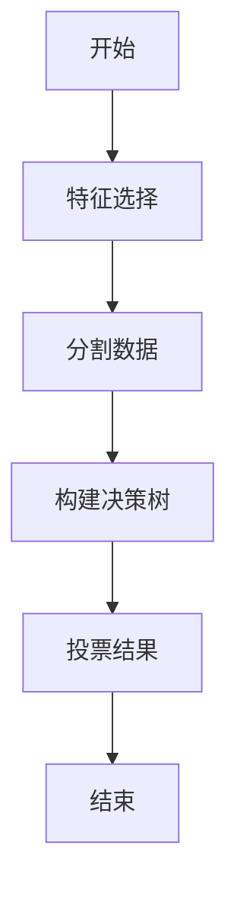
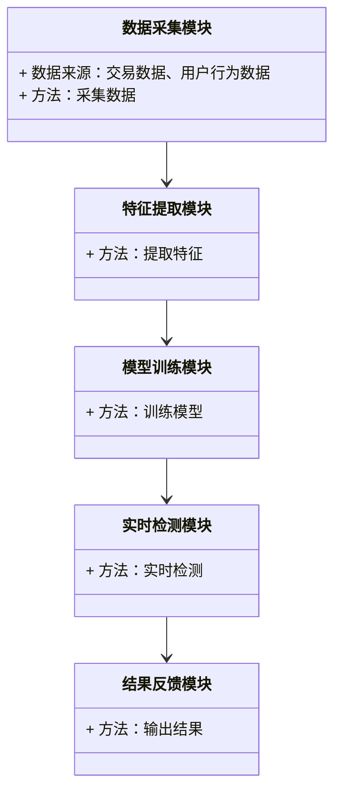
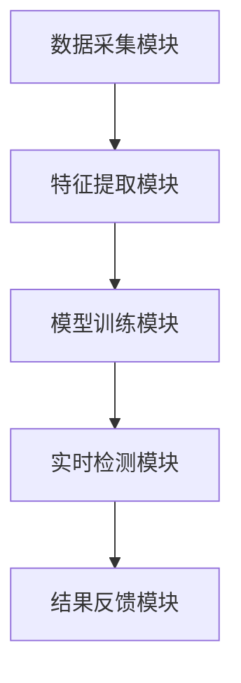

                 


# AI驱动的金融欺诈检测系统

> 关键词：AI，金融欺诈，检测系统，机器学习，深度学习，数据分析

> 摘要：随着金融交易的日益复杂化和网络化，金融欺诈手段也在不断演变，传统的欺诈检测方法逐渐暴露出效率低下和精准度不足的问题。本文将探讨如何利用AI技术，特别是机器学习和深度学习，构建一个高效的金融欺诈检测系统。通过分析系统的背景、核心概念、算法原理、系统设计和实际案例，本文将详细阐述AI在金融欺诈检测中的应用及其优势。

---

## 第1章: 问题背景与目标

### 1.1 问题背景

#### 1.1.1 金融欺诈的现状与挑战

金融欺诈是全球范围内一个严重的经济问题，随着金融交易的日益频繁和复杂化，欺诈手段也在不断升级。传统的欺诈检测方法，如基于规则的检测和人工审查，已经难以应对日益复杂的欺诈行为。这些方法通常依赖于预定义的规则，无法捕捉到复杂的模式和异常行为，导致漏检和误检的情况频繁发生。

#### 1.1.2 传统欺诈检测方法的局限性

传统欺诈检测方法主要包括基于规则的检测和统计分析。这些方法依赖于预先定义的规则和阈值，对某些特定类型的欺诈行为有一定的检测能力，但对于新型欺诈手段，往往显得力不从心。此外，这些方法在处理海量数据时效率低下，难以满足实时检测的需求。

#### 1.1.3 AI技术在金融领域的应用前景

人工智能（AI）技术，特别是机器学习和深度学习，近年来在金融领域的应用取得了显著成效。这些技术能够从海量数据中提取复杂的特征，并通过训练模型来识别异常行为，从而实现高精度的欺诈检测。AI技术的引入，使得金融欺诈检测系统能够更高效、更准确地识别欺诈行为，同时具备更强的适应性和扩展性。

### 1.2 问题描述与目标

#### 1.2.1 金融欺诈检测的核心问题

金融欺诈检测的核心问题是如何从大量交易数据中识别出异常交易，这些异常交易可能是欺诈行为的征兆。传统的检测方法通常基于简单的规则和统计分析，而现代的欺诈手段越来越隐蔽和多样化，这使得传统方法难以有效应对。

#### 1.2.2 AI驱动的欺诈检测目标

AI驱动的金融欺诈检测系统的目标是通过机器学习和深度学习算法，从海量交易数据中发现异常模式和行为，从而实现高精度的欺诈检测。具体目标包括：

1. 实现实时或近实时的欺诈检测。
2. 提高检测的准确率和召回率，减少误报和漏报。
3. 具备适应性，能够应对新型欺诈手段的出现。

#### 1.2.3 系统边界与外延

金融欺诈检测系统通常包括数据采集、特征提取、模型训练、实时检测和结果反馈等模块。系统边界包括数据来源（如交易数据、用户行为数据）、模型训练数据、检测目标（如异常交易）以及系统的输出（如警报信号）。系统的外延则涉及欺诈类型（如信用卡欺诈、转账欺诈）和应用场景（如银行、支付平台）。

### 1.3 本章小结

本章介绍了金融欺诈检测的背景和挑战，分析了传统方法的局限性，并阐述了AI技术在金融领域的应用前景。接下来的章节将详细探讨AI驱动的金融欺诈检测系统的核心概念、算法原理、系统设计和实际应用。

---

## 第2章: 核心概念与联系

### 2.1 核心概念原理

#### 2.1.1 AI驱动的金融欺诈检测系统组成

AI驱动的金融欺诈检测系统通常包括以下几个关键组成部分：

1. **数据采集模块**：负责收集交易数据、用户行为数据等。
2. **特征提取模块**：从原始数据中提取有用的特征，如交易金额、时间、地点、交易类型等。
3. **模型训练模块**：利用机器学习和深度学习算法训练欺诈检测模型。
4. **实时检测模块**：将实时交易数据输入模型，进行异常检测和分类。
5. **结果反馈模块**：输出检测结果，并根据结果采取相应的措施，如发出警报或阻止交易。

#### 2.1.2 数据流与信息处理流程

数据流与信息处理流程是AI驱动的金融欺诈检测系统的核心。数据从各种来源采集后，首先进行预处理，包括清洗、转换和特征提取。预处理后的数据被输入到模型训练模块中，训练出能够识别欺诈交易的模型。训练好的模型用于实时检测，对新的交易数据进行分类，判断是否为欺诈交易。

#### 2.1.3 模型训练与部署机制

模型训练与部署机制是系统的关键环节。训练过程中，需要选择合适的算法（如随机森林、支持向量机、神经网络等）并调整参数，以优化模型的性能。训练好的模型需要进行部署，通常通过API或集成到现有系统中，实现对实时交易的检测。

### 2.2 核心概念属性特征对比

为了更好地理解AI驱动的金融欺诈检测系统，我们需要对比不同概念的属性特征。

#### 2.2.1 数据特征对比分析

- **交易数据**：包括交易金额、时间、地点、类型等。
- **用户行为数据**：包括用户的登录时间、操作频率、设备信息等。
- **交易历史**：包括用户过去交易的记录和模式。

#### 2.2.2 模型特征对比分析

- **监督学习模型**：如随机森林、支持向量机，适用于有标签的训练数据。
- **无监督学习模型**：如聚类算法，适用于无标签的数据，能够发现异常模式。
- **深度学习模型**：如神经网络，适用于复杂特征的提取和分类。

#### 2.2.3 系统性能对比分析

- **准确率**：模型正确分类欺诈交易的能力。
- **召回率**：模型发现欺诈交易的能力。
- **F1分数**：综合准确率和召回率的指标。

### 2.3 ER实体关系图

为了更好地理解系统的数据模型，我们用ER图展示系统的实体关系。

```mermaid
er
    entity 用户 {
        key 用户ID
        属性 用户姓名, 账号, 密码, 身份证号
    }
    entity 交易 {
        key 交易ID
        属性 交易金额, 交易时间, 交易地点, 交易类型
    }
    entity 模型 {
        key 模型ID
        属性 模型名称, 模型版本, 训练数据量, 准确率
    }
    用户 --> 交易: 发起交易
    交易 --> 模型: 输入数据
```

### 2.4 本章小结

本章详细阐述了AI驱动的金融欺诈检测系统的核心概念和组成，对比了不同数据和模型的特征，并用ER图展示了系统的数据模型。接下来的章节将深入探讨系统的算法原理和数学模型。

---

## 第3章: 算法原理与数学模型

### 3.1 算法原理

#### 3.1.1 监督学习算法

监督学习是一种基于标签数据的机器学习方法，适用于欺诈交易有明确标签的情况。常用的监督学习算法包括：

- **逻辑回归**：适用于二分类问题，如欺诈与非欺诈分类。
- **随机森林**：基于决策树的集成算法，适用于特征较多的情况。

#### 3.1.2 无监督学习算法

无监督学习适用于没有标签数据的情况，常用算法包括：

- **聚类算法**：如K-means，适用于发现异常交易的聚类。
- **孤立林**：专门用于异常检测的树状结构算法。

#### 3.1.3 深度学习算法

深度学习通过多层神经网络提取数据的深层特征，适用于复杂特征的分类。常用的深度学习算法包括：

- **神经网络**：如卷积神经网络（CNN）和循环神经网络（RNN）。
- **长短期记忆网络（LSTM）**：适用于时间序列数据的分析。

### 3.2 数学模型与公式

#### 3.2.1 线性回归模型

线性回归是一种简单的回归模型，适用于预测连续型变量。

$$y = \beta_0 + \beta_1x + \epsilon$$

其中，$y$ 是预测值，$\beta_0$ 和 $\beta_1$ 是模型参数，$x$ 是输入变量，$\epsilon$ 是误差项。

#### 3.2.2 随机森林模型

随机森林是一种基于决策树的集成算法，多个决策树的投票结果作为最终预测。



### 3.3 本章小结

本章详细介绍了AI驱动的金融欺诈检测系统中常用的算法，包括监督学习、无监督学习和深度学习算法，并给出了相应的数学公式和流程图。接下来的章节将探讨系统的实际设计和实现。

---

## 第4章: 系统分析与架构设计

### 4.1 系统分析

#### 4.1.1 问题场景介绍

金融欺诈检测系统通常需要应对以下场景：

- **实时检测**：对实时交易数据进行快速检测。
- **高精度要求**：要求系统具有高准确率和召回率。
- **数据多样性**：交易数据包括不同类型和规模。

#### 4.1.2 系统功能设计

系统功能设计包括：

- **数据采集**：收集交易数据和用户行为数据。
- **特征提取**：从数据中提取有用特征。
- **模型训练**：训练欺诈检测模型。
- **实时检测**：对实时交易进行分类。
- **结果反馈**：输出检测结果并采取相应措施。

### 4.2 系统架构设计

#### 4.2.1 领域模型的类图

领域模型的类图展示了系统的各个模块及其关系。



#### 4.2.2 系统架构图

系统架构图展示了系统的整体结构和各模块之间的关系。



#### 4.2.3 接口设计和交互流程

接口设计和交互流程展示了系统的交互过程。

```mermaid
sequenceDiagram
    用户发起交易 --> 数据采集模块：采集交易数据
    数据采集模块 --> 特征提取模块：提取特征
    特征提取模块 --> 模型训练模块：训练模型
    模型训练模块 --> 实时检测模块：实时检测
    实时检测模块 --> 结果反馈模块：输出结果
```

### 4.3 本章小结

本章详细分析了金融欺诈检测系统的架构设计，包括系统功能模块、架构图和交互流程。接下来的章节将探讨系统的实际实现和案例分析。

---

## 第5章: 项目实战

### 5.1 环境安装

为了实现AI驱动的金融欺诈检测系统，我们需要安装以下环境：

- **Python**：编程语言。
- **机器学习库**：如scikit-learn、XGBoost。
- **深度学习框架**：如TensorFlow、Keras。
- **数据处理工具**：如Pandas、NumPy。

### 5.2 核心代码实现

以下是一个简单的欺诈检测系统的Python代码示例：

```python
import pandas as pd
from sklearn.model_selection import train_test_split
from sklearn.ensemble import RandomForestClassifier
from sklearn.metrics import accuracy_score

# 数据加载
data = pd.read_csv('transactions.csv')
X = data.drop('is_fraud', axis=1)
y = data['is_fraud']

# 数据分割
X_train, X_test, y_train, y_test = train_test_split(X, y, test_size=0.2, random_state=42)

# 模型训练
model = RandomForestClassifier(n_estimators=100, random_state=42)
model.fit(X_train, y_train)

# 模型预测
y_pred = model.predict(X_test)

# 模型评估
print("准确率：", accuracy_score(y_test, y_pred))
```

### 5.3 代码解读与分析

上述代码展示了如何使用随机森林算法训练一个欺诈检测模型。数据加载、数据分割、模型训练和评估是实现AI驱动系统的典型步骤。通过调整模型参数和选择不同的算法，可以优化系统的性能。

### 5.4 实际案例分析

以下是一个实际案例分析：

假设我们有一个包含交易金额、时间、地点等特征的交易数据集。通过训练随机森林模型，我们可以识别出欺诈交易。模型的准确率和召回率可以通过交叉验证来评估，并根据结果优化模型。

### 5.5 本章小结

本章通过实际案例展示了AI驱动的金融欺诈检测系统的实现过程，包括环境安装、代码实现和案例分析。接下来的章节将总结系统的最佳实践和注意事项。

---

## 第6章: 最佳实践与总结

### 6.1 小结

本文详细探讨了AI驱动的金融欺诈检测系统的各个方面，包括背景、核心概念、算法原理、系统设计和实际案例。通过分析和实践，我们展示了如何利用机器学习和深度学习技术构建高效的欺诈检测系统。

### 6.2 注意事项

- **数据隐私**：确保数据的隐私和安全。
- **模型更新**：定期更新模型以应对新型欺诈手段。
- **系统性能**：优化系统的性能以实现实时检测。

### 6.3 拓展阅读

- **《机器学习实战》**：深入理解机器学习算法。
- **《深度学习》**：学习深度学习的原理和应用。
- **《金融风险管理》**：了解金融领域的风险管理知识。

### 6.4 本章小结

本章总结了AI驱动的金融欺诈检测系统的最佳实践和注意事项，并提供了拓展阅读的建议。通过本文的学习，读者可以掌握构建高效欺诈检测系统的方法和技巧。

---

## 作者：AI天才研究院/AI Genius Institute & 禅与计算机程序设计艺术/Zen And The Art of Computer Programming

---

通过以上结构和内容，我们详细阐述了AI驱动的金融欺诈检测系统的各个方面，从理论到实践，帮助读者全面理解并掌握构建此类系统的方法。

