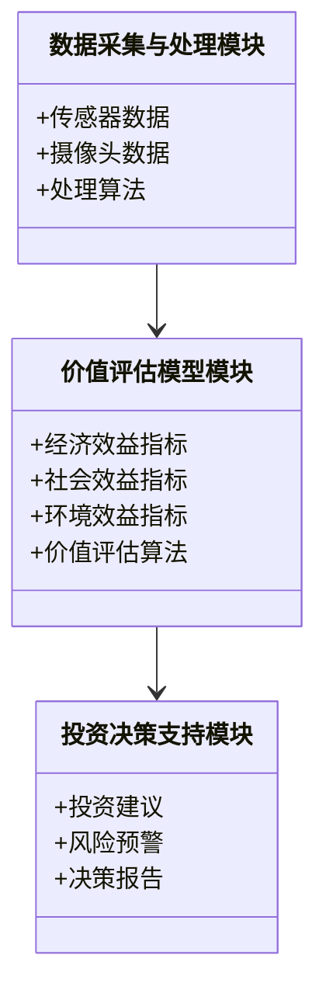
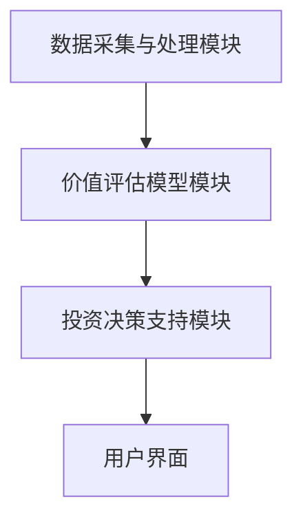

                 


# 价值投资在智慧城市发展中的应用：基础设施投资新思路

> **关键词**：价值投资，智慧城市，基础设施，投资策略，风险管理，系统架构

> **摘要**：本文探讨了价值投资在智慧城市建设中的应用，特别是基础设施投资的新思路。通过分析智慧城市的发展现状、价值投资的核心理念以及两者的结合，提出了基于价值评估的基础设施投资策略。结合实际案例，本文详细讲解了算法原理、系统架构设计及风险管理方法，为智慧城市的可持续发展提供了理论支持和实践指导。

---

## 第一部分：智慧城市与价值投资背景

### 第1章：智慧城市发展现状与价值投资概述

#### 1.1 智慧城市的发展背景

智慧城市的概念最早可以追溯到20世纪末，随着信息技术的发展，城市化进程加速，城市资源的有限性与需求的无限性之间的矛盾日益突出。智慧城市通过物联网、大数据、人工智能等技术手段，将城市的各个系统有机整合，以实现资源的优化配置和高效管理。

##### 1.1.1 智慧城市的概念与定义

智慧城市是一个综合运用信息技术和创新思维，以实现城市可持续发展目标的系统工程。它不仅包括物理基础设施的智能化改造，还涉及社会、经济、环境等多个维度的协调发展。以下是智慧城市的核心定义：

**智慧城市是一个通过技术手段优化资源配置、提升居民生活质量的城市发展模式。**

| **维度**       | **具体内容**                           |
|----------------|---------------------------------------|
| 物理基础设施     | 智能交通系统、智能电网、智慧建筑等   |
| 信息基础设施     | 5G网络、物联网、云计算平台等         |
| 社会服务        | 智慧医疗、智慧教育、智慧社区等       |
| 经济活动        | 数字经济、共享经济、智慧供应链等       |
| 环境保护        | 绿色能源、碳排放监测、生态修复等       |

##### 1.1.2 智慧城市的发展历程与现状

智慧城市建设经历了多个阶段，从最初的试点项目到如今的全面铺开，其发展历程可以分为以下几个阶段：

1. **概念引入阶段（2000-2010）**：主要以试点城市为核心，探索智慧城市的基本框架和关键技术。
2. **技术积累阶段（2010-2015）**：物联网、大数据等技术逐步成熟，智慧城市开始在更多城市试点。
3. **全面推进阶段（2015年至今）**：智慧城市建设进入快车道，技术和应用趋于成熟，逐渐形成标准化体系。

##### 1.1.3 智慧城市的核心特征与关键领域

智慧城市的特征可以用“以人为本、技术创新、资源整合、高效协同”来概括。其核心领域包括：

- **智能交通**：优化交通流量，减少拥堵，提升出行效率。
- **智能能源**：实现能源的高效利用和绿色能源的应用。
- **智能建筑**：通过物联网技术实现建筑的智能化管理。
- **智能政务**：提升政府服务效率，实现政务服务的数字化。
- **智能安防**：构建城市安全防护体系，提升应急响应能力。

#### 1.2 价值投资的基本概念

价值投资是一种以基本面分析为基础的投资策略，其核心在于寻找市场价格低于其内在价值的资产。价值投资者通常关注公司的财务状况、行业地位和未来盈利能力，通过长期持有优质资产来实现收益。

##### 1.2.1 价值投资的定义与原则

价值投资由本杰明·格雷厄姆提出，其核心原则包括：

1. **安全边际**：买入价格低于内在价值，确保有一定的安全空间。
2. **长期视角**：关注企业的长期盈利能力，而非短期市场波动。
3. **基本面分析**：通过财务报表和行业分析评估企业的价值。

##### 1.2.2 价值投资的核心理念与方法

价值投资的核心理念是寻找市场低估的资产，通过长期持有实现收益。其方法包括：

1. **深度研究**：对企业的财务状况、行业地位和竞争优势进行详细分析。
2. **分散投资**：通过分散投资降低风险，避免过度集中。
3. **耐心持有**：不因短期市场波动而频繁交易，保持投资的稳定性。

##### 1.2.3 价值投资与智慧城市基础设施的结合

智慧城市基础设施的投资具有长期性和系统性的特点，与价值投资的理念高度契合。通过价值投资的方法，可以优化基础设施的投资决策，降低投资风险，提高投资回报率。

#### 1.3 智慧城市与价值投资的结合

智慧城市的发展离不开大量的基础设施投资，而价值投资的方法可以帮助投资者在复杂的市场环境中找到优质的投资标的。

##### 1.3.1 智慧城市基础设施的价值属性

智慧城市基础设施的价值不仅体现在其直接经济效益上，还包括其对城市未来发展的影响。例如，智能交通系统可以减少拥堵，降低能源消耗，提升居民生活质量。

##### 1.3.2 价值投资在智慧城市中的应用潜力

通过价值投资的方法，投资者可以识别出那些具有长期增长潜力的基础设施项目，如智能电网、智慧交通系统等。这些项目不仅具有较高的内在价值，还能为城市的发展带来长期收益。

##### 1.3.3 当前智慧城市基础设施投资的现状与问题

尽管智慧城市建设取得了显著进展，但基础设施投资仍存在一些问题，如资金不足、回报周期长、风险高等。这些问题需要通过价值投资的方法来解决。

---

## 第二部分：价值投资在智慧城市基础设施中的应用

### 第2章：智慧城市基础设施的价值评估

#### 2.1 智慧城市基础设施的核心要素

智慧城市基础设施的核心要素包括：

- **智能交通系统（ITS）**：包括交通监控、智能信号灯、电子收费系统等。
- **智能电网**：包括分布式能源系统、智能电表、需求响应系统等。
- **智慧建筑**：包括建筑自动化系统、能源管理系统、智能家居设备等。

##### 2.1.1 智慧城市基础设施的分类与特点

智慧城市基础设施可以分为硬件设施和软件系统两大类。硬件设施包括传感器、摄像头、智能终端等，软件系统包括数据分析平台、管理控制系统等。

| **类别**        | **具体内容**                           |
|-----------------|---------------------------------------|
| 硬件设施        | 传感器、摄像头、智能终端等             |
| 软件系统        | 数据分析平台、管理控制系统等           |

##### 2.1.2 基础设施与智慧城市发展的关系

基础设施是智慧城市发展的基石，没有完善的基础设施，智慧城市难以实现高效运行。例如，智能交通系统需要依赖大量的传感器和数据处理系统来实现交通流量的实时监控和管理。

#### 2.2 智慧城市基础设施的价值评估

##### 2.2.1 价值评估的指标体系

智慧城市基础设施的价值评估需要考虑多方面的因素，包括经济效益、社会效益、环境效益等。

| **指标**        | **具体内容**                           |
|-----------------|---------------------------------------|
| 经济效益        | 投资回报率、成本节约、就业创造等       |
| 社会效益        | 提升居民生活质量、减少交通拥堵等         |
| 环境效益        | 降低碳排放、节约能源等                 |

##### 2.2.2 价值评估模型的构建

基于上述指标，我们可以构建一个综合的价值评估模型，如下所示：

$$ V = \alpha E + \beta S + \gamma En $$

其中，\( V \) 是基础设施的总价值，\( E \) 是经济效益，\( S \) 是社会效益，\( En \) 是环境效益，\( \alpha \)、\( \beta \)、\( \gamma \) 是各指标的权重系数。

##### 2.2.3 模型在智慧城市中的应用案例

以智能交通系统为例，假设某城市计划投资建设智能交通系统，其经济效益为1000万元，社会效益为500万元，环境效益为200万元。假设权重系数分别为0.5、0.3、0.2，则总价值为：

$$ V = 0.5 \times 1000 + 0.3 \times 500 + 0.2 \times 200 = 500 + 150 + 40 = 690 \text{万元} $$

---

## 第三部分：价值投资的策略与风险管理

### 第3章：价值投资策略在智慧城市中的应用

#### 3.1 价值投资的基本策略

##### 3.1.1 投资组合优化

价值投资者通常会通过分散投资来降低风险。在智慧城市建设中，投资者可以将资金分配到不同的基础设施项目中，以分散风险。

##### 3.1.2 长期投资与短期投资的平衡

智慧城市基础设施的投资具有较长的回报周期，因此投资者需要具备长期投资的耐心。同时，也需要关注短期市场波动，避免因短期亏损而盲目抛售。

##### 3.1.3 与政府政策和市场趋势的结合

政府政策对智慧城市建设有重要影响，投资者需要密切关注政策动向，抓住政策机遇。同时，也需要关注市场趋势，避免盲目跟风。

#### 3.2 智慧城市基础设施投资的策略

##### 3.2.1 投资组合优化

通过优化投资组合，投资者可以在不同的基础设施项目之间分散风险，降低整体投资的风险。

##### 3.2.2 长期投资与短期投资的平衡

由于智慧城市基础设施的投资周期较长，投资者需要在长期投资和短期投资之间找到平衡点，既要考虑长期的回报，也要关注短期的流动性。

##### 3.2.3 与政府政策和市场趋势的结合

政府政策对智慧城市建设有重要影响，投资者需要密切关注政策动向，抓住政策机遇。同时，也需要关注市场趋势，避免盲目跟风。

#### 3.3 投资风险管理与控制

##### 3.3.1 风险识别与评估

在智慧城市建设中，投资者可能面临多种风险，如政策风险、市场风险、技术风险等。需要通过全面的风险评估，识别潜在的风险点。

##### 3.3.2 风险应对策略

针对不同的风险，投资者可以采取多种应对策略，如分散投资、购买保险、加强内部管理等。

##### 3.3.3 风险监控与反馈机制

建立完善的风险监控机制，定期评估投资组合的风险状况，及时调整投资策略，确保投资安全。

---

## 第四部分：系统架构与项目实施

### 第4章：智慧城市基础设施投资的系统架构

#### 4.1 系统功能设计

##### 4.1.1 数据采集与处理模块

数据采集与处理模块是系统的核心部分，负责收集和处理各种数据，包括交通流量、能源消耗、环境指标等。

##### 4.1.2 价值评估模型模块

价值评估模型模块基于收集的数据，进行综合评估，计算基础设施的总价值。

##### 4.1.3 投资决策支持模块

投资决策支持模块根据评估结果，为投资者提供决策支持，包括投资建议、风险预警等。

##### 4.1.4 系统功能设计的领域模型类图



#### 4.2 系统架构设计

##### 4.2.1 系统架构设计的架构图



##### 4.2.2 系统接口设计

系统接口设计需要考虑模块之间的数据传递和调用关系，确保系统的高效运行。

##### 4.2.3 系统交互设计

系统交互设计需要考虑用户的操作流程，包括数据输入、评估结果展示、决策支持等功能。

---

## 第五部分：项目实战与案例分析

### 第5章：智慧城市基础设施投资的项目实战

#### 5.1 项目背景与目标

##### 5.1.1 项目背景

以某城市智能交通系统的建设为例，项目旨在通过智能化手段优化城市交通，减少拥堵，提升出行效率。

##### 5.1.2 项目目标

- 实现交通流量的实时监控和管理。
- 提供智能信号灯控制，优化交通流量。
- 提供实时交通信息，引导市民合理出行。

#### 5.2 核心代码实现

##### 5.2.1 环境安装

需要安装Python、NumPy、Pandas、Matplotlib等库。

##### 5.2.2 核心代码实现

```python
import numpy as np
import pandas as pd
import matplotlib.pyplot as plt

# 数据采集与处理
data = pd.read_csv('traffic_data.csv')
data['timestamp'] = pd.to_datetime(data['timestamp'])
data.set_index('timestamp', inplace=True)

# 价值评估
def calculate_value(data):
    economic_benefit = data['economic_benefit'].mean() * 1000
    social_benefit = data['social_benefit'].mean() * 500
    environmental_benefit = data['environmental_benefit'].mean() * 200
    total_value = 0.5 * economic_benefit + 0.3 * social_benefit + 0.2 * environmental_benefit
    return total_value

value = calculate_value(data)
print(f"Total value: {value}")
```

##### 5.2.3 代码应用解读与分析

上述代码首先读取交通数据，进行数据处理，然后计算基础设施的总价值。通过调整权重系数，可以实现对不同指标的重视程度。

#### 5.3 案例分析与详细解读

##### 5.3.1 案例分析

假设某城市智能交通系统的经济效益为1000万元，社会效益为500万元，环境效益为200万元。计算总价值：

$$ V = 0.5 \times 1000 + 0.3 \times 500 + 0.2 \times 200 = 500 + 150 + 40 = 690 \text{万元} $$

##### 5.3.2 详细解读

通过上述计算，可以看出智能交通系统的总价值为690万元。这表明该基础设施项目具有较高的投资价值，值得进一步投资。

#### 5.4 项目小结

通过实际案例分析，验证了价值评估模型的有效性。投资者可以根据评估结果，做出科学的投资决策。

---

## 第六部分：最佳实践与总结

### 第6章：价值投资在智慧城市中的最佳实践

#### 6.1 关键点总结

##### 6.1.1 理论与实践的结合

价值投资在智慧城市中的应用需要理论与实践相结合，通过实际案例验证模型的有效性。

##### 6.1.2 风险管理的重要性

在智慧城市建设中，风险管理是投资决策的重要组成部分，需要引起高度重视。

##### 6.1.3 长期投资的必要性

由于智慧城市建设的投资周期较长，投资者需要具备长期投资的耐心和信心。

#### 6.2 小结

通过本文的分析，我们可以看到价值投资在智慧城市中的应用具有重要意义。通过科学的价值评估和有效的风险管理，投资者可以更好地优化投资决策，提升投资回报率。

#### 6.3 注意事项

##### 6.3.1 投资风险提示

智慧城市建设具有较高的风险，投资者需要充分评估风险，制定合理的风险管理策略。

##### 6.3.2 投资策略调整

随着市场环境的变化，投资者需要及时调整投资策略，确保投资安全。

##### 6.3.3 遵守法律法规

在投资过程中，投资者需要遵守相关法律法规，确保投资行为的合法性。

#### 6.4 拓展阅读

##### 6.4.1 推荐书籍

- 《价值投资实战手册》
- 《智慧城市发展规划与实施》

##### 6.4.2 推荐网站

- [投资分析网](http://www.invest-analytic.com)
- [智慧城市资源网](http://www.smart-city-resources.com)

---

## 作者

**作者：AI天才研究院/AI Genius Institute & 禅与计算机程序设计艺术 /Zen And The Art of Computer Programming**

---

以上就是《价值投资在智慧城市发展中的应用：基础设施投资新思路》的完整目录和文章内容。通过系统化的分析和实践案例，本文为智慧城市建设中的基础设施投资提供了有力的理论支持和实践指导。

