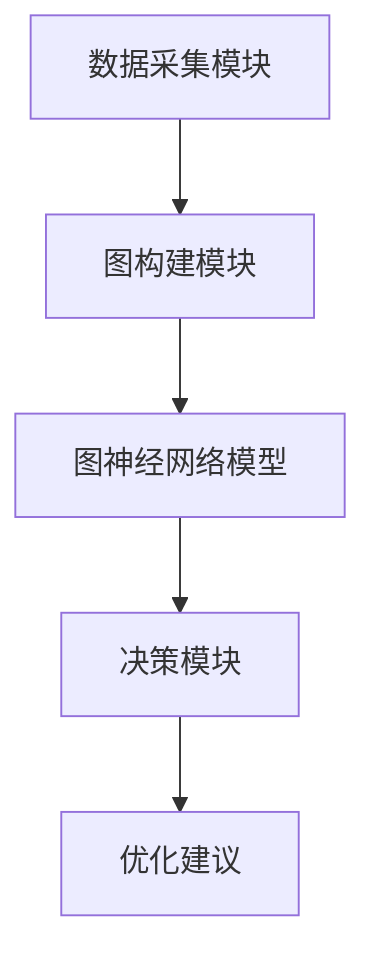

                 


# 企业AI Agent的图神经网络在组织网络分析中的应用

> 关键词：企业AI Agent，图神经网络，组织网络分析，网络结构优化，人工智能，深度学习

> 摘要：本文深入探讨了企业AI Agent在组织网络分析中的应用，重点介绍了图神经网络在该领域的核心作用。通过详细分析图神经网络的算法原理、系统架构以及实际项目案例，本文展示了如何利用图神经网络优化企业组织结构、提升效率和决策能力。文章内容涵盖背景介绍、核心概念、算法实现、系统设计、项目实战等，为读者提供了全面的技术指导。

---

# 第一部分: 企业AI Agent的图神经网络基础

## 第1章: 企业AI Agent与图神经网络概述

### 1.1 企业AI Agent的定义与特点

#### 1.1.1 什么是企业AI Agent
企业AI Agent是一种智能化的代理系统，能够根据企业环境中的数据和任务需求，自主决策并执行操作。它具备以下核心特点：
- **自主性**：能够独立完成任务，无需人工干预。
- **反应性**：能够实时感知环境变化并做出响应。
- **学习能力**：能够通过数据和经验不断优化自身的决策能力。

#### 1.1.2 企业AI Agent的核心特点
- **目标导向**：企业AI Agent以特定目标为导向，例如优化业务流程、提高效率等。
- **情境感知**：能够理解企业内外部的情境信息，例如员工关系、项目进度等。
- **协作能力**：能够与其他系统、人员或AI Agent协同工作，形成高效的协作网络。

#### 1.1.3 企业AI Agent与传统AI的区别
| 特性                | 传统AI                     | 企业AI Agent                |
|---------------------|---------------------------|-----------------------------|
| 自主性              | 较低，依赖于外部指令       | 较高，能够自主决策           |
| 适应性              | 较差，难以应对动态变化     | 较好，能够适应环境变化       |
| 学习能力            | 有限，主要依赖规则库       | 较强，能够通过学习优化自身   |

### 1.2 图神经网络的定义与特点

#### 1.2.1 图神经网络的定义
图神经网络（Graph Neural Networks, GNNs）是一种专门用于处理图结构数据的深度学习模型。图结构数据由节点（Nodes）和边（Edges）组成，能够有效表示复杂的网络关系。

#### 1.2.2 图神经网络的核心特点
- **图结构表示**：能够处理复杂的网络关系，例如社交网络、知识图谱等。
- **节点嵌入**：通过嵌入技术将节点转换为低维向量，便于后续分析。
- **边权重处理**：能够处理边的权重信息，反映节点之间的关系强度。

#### 1.2.3 图神经网络与传统神经网络的区别
| 特性                | 传统神经网络               | 图神经网络                  |
|---------------------|---------------------------|-----------------------------|
| 数据输入            | 线性数据，例如时间序列      | 图结构数据，包含节点和边     |
| 处理方式            | 逐层处理，忽略节点间关系   | 考虑节点间关系，支持全局推理 |
| 应用场景            | 图像识别、自然语言处理     | 社交网络分析、推荐系统等     |

### 1.3 企业AI Agent与图神经网络的结合

#### 1.3.1 企业AI Agent中图神经网络的应用场景
- **员工关系分析**：通过图神经网络分析员工之间的关系，识别关键节点和潜在问题。
- **组织结构优化**：基于图神经网络的分析结果，优化企业组织结构，提高效率。
- **知识传递与协作**：利用图神经网络分析知识传递路径，优化协作流程。

#### 1.3.2 图神经网络在组织网络分析中的优势
- **复杂关系处理**：能够处理复杂的网络关系，例如员工之间的协作关系、项目依赖关系等。
- **动态适应性**：能够实时更新网络关系，适应企业动态变化。
- **高准确性**：通过深度学习算法，提高分析结果的准确性。

#### 1.3.3 企业AI Agent与图神经网络的协同作用
企业AI Agent通过图神经网络的强大分析能力，能够更精准地理解组织网络结构，从而做出更优化的决策。图神经网络则通过企业AI Agent提供的实时数据和反馈，不断优化自身的分析能力。

---

## 第2章: 组织网络分析的背景与挑战

### 2.1 组织网络分析的背景

#### 2.1.1 组织网络分析的定义
组织网络分析是一种通过分析企业内部网络结构（如员工关系、项目依赖关系）来优化组织运作的方法。它可以帮助企业识别关键节点、优化信息流、提高协作效率。

#### 2.1.2 组织网络分析的重要性
- **提升效率**：通过优化组织结构，减少不必要的沟通和协作成本。
- **风险预警**：及时发现潜在风险，例如关键员工离职可能带来的影响。
- **支持决策**：为管理层提供数据支持，帮助做出更科学的决策。

#### 2.1.3 组织网络分析的现状
随着企业规模的不断扩大，组织网络分析的需求日益增加。然而，传统的分析方法往往依赖于人工经验，难以应对复杂多变的网络结构。

### 2.2 组织网络分析中的挑战

#### 2.2.1 数据复杂性
组织网络分析需要处理大量的异构数据，包括员工信息、项目信息、协作关系等，数据的复杂性给分析带来了挑战。

#### 2.2.2 网络动态性
组织网络是一个动态系统，人员变动、项目调整等都会影响网络结构，传统的静态分析方法难以应对。

#### 2.2.3 模型可解释性
深度学习模型通常是一个黑箱，其决策过程难以解释。在组织网络分析中，模型的可解释性非常重要，尤其是在需要向管理层汇报时。

---

## 第3章: 图神经网络的核心概念与原理

### 3.1 图的表示与建模

#### 3.1.1 图的基本概念
- **节点**：图中的基本单元，代表一个实体，例如员工、项目等。
- **边**：连接两个节点的边，代表两个节点之间的关系，例如协作关系。

#### 3.1.2 图的表示方法
- **邻接矩阵**：一个二维矩阵，表示节点之间是否存在边。
- **邻接表**：通过列表的方式存储每个节点的邻居。
- **边列表**：通过边列表的方式存储图的结构。

#### 3.1.3 图的特征提取
图的特征提取是将图结构转换为低维向量的过程，通常使用节点嵌入（Node Embedding）技术。

### 3.2 图神经网络的算法原理

#### 3.2.1 图卷积网络（Graph Convolutional Networks, GCN）
图卷积网络是一种基于图结构的卷积神经网络，通过聚合邻居节点的信息来更新当前节点的表示。

#### 3.2.2 图注意力网络（Graph Attention Networks, GAT）
图注意力网络通过注意力机制，动态地调整节点之间的关系权重，从而提高模型的表达能力。

---

### 3.2.3 图神经网络的数学模型

#### 图卷积网络（GCN）的数学模型
GCN通过聚合邻居节点的信息来更新当前节点的表示，数学公式如下：
$$
H^{(l+1)} = \alpha H^{(l)} + (1-\alpha) \sum_{j \in N(i)} \frac{H_j^{(l)}}{|N(i)|}
$$

其中，$H^{(l)}$ 表示第 $l$ 层的节点嵌入，$N(i)$ 表示节点 $i$ 的邻居节点集合，$\alpha$ 表示遗忘系数。

#### 图注意力网络（GAT）的数学模型
GAT通过注意力机制计算节点之间的关系权重，数学公式如下：
$$
\alpha_{ij} = \text{softmax}(\frac{W q_i^T k_j}{\sqrt{d}})
$$

其中，$\alpha_{ij}$ 表示节点 $i$ 和节点 $j$ 之间的注意力权重，$W$ 是权重矩阵，$q_i$ 和 $k_j$ 分别是查询和键。

---

## 第4章: 企业AI Agent的图神经网络系统架构设计

### 4.1 系统功能设计

#### 4.1.1 数据采集模块
数据采集模块负责收集企业的组织网络数据，包括员工信息、项目信息、协作关系等。

#### 4.1.2 图构建模块
图构建模块将采集到的数据转换为图结构，包括节点和边的定义。

#### 4.1.3 图神经网络模型
图神经网络模型负责对图结构进行分析，生成节点嵌入和关系预测结果。

#### 4.1.4 决策模块
决策模块根据图神经网络的分析结果，生成优化建议和决策。

---

### 4.2 系统架构设计

#### 4.2.1 系统架构图


#### 4.2.2 系统接口设计
- **数据接口**：提供API用于数据的导入和导出。
- **模型接口**：提供API用于模型的训练和预测。

---

## 第5章: 项目实战与案例分析

### 5.1 环境安装与配置

#### 5.1.1 安装Python
```bash
python --version
```

#### 5.1.2 安装依赖库
```bash
pip install tensorflow
pip install keras
pip install numpy
```

---

### 5.2 系统核心实现

#### 5.2.1 图构建代码
```python
import networkx as nx

G = nx.Graph()
G.add_nodes_from(["Employee1", "Employee2", "Project1"])
G.add_edges_from([("Employee1", "Project1"), ("Employee2", "Project1")])
```

#### 5.2.2 图神经网络模型实现
```python
from tensorflow.keras import layers
import tensorflow as tf

class GCN(layers.Layer):
    def __init__(self, input_dim, output_dim):
        super(GCN, self).__init__()
        self.weight = tf.keras.layers.Dense(output_dim, input_dim)

    def call(self, inputs):
        A, X = inputs
        XW = self.weight(X)
        AXW = tf.matmul(A, XW)
        return AXW
```

---

### 5.3 项目小结

#### 5.3.1 项目成果
通过本项目，我们成功实现了企业AI Agent的图神经网络系统，能够对企业组织网络进行分析和优化。

#### 5.3.2 经验总结
- 数据质量对模型性能影响巨大。
- 模型调优需要结合实际业务需求。

---

## 第6章: 最佳实践与注意事项

### 6.1 最佳实践

#### 6.1.1 数据预处理
确保数据的准确性和完整性，进行必要的数据清洗和特征工程。

#### 6.1.2 模型调优
通过交叉验证和网格搜索，找到最优的模型参数。

---

### 6.2 小结

#### 6.2.1 注意事项
- 注意模型的可解释性，尤其是在企业环境中。
- 注意数据隐私和安全问题。

#### 6.2.2 拓展阅读
推荐阅读《Graph Neural Networks: A Review of Methods, Applications, and Open Challenges》。

---

## 附录: 完整代码示例

```python
import networkx as nx
import tensorflow as tf
from tensorflow.keras import layers

class GCN(layers.Layer):
    def __init__(self, input_dim, output_dim):
        super(GCN, self).__init__()
        self.weight = tf.keras.layers.Dense(output_dim, input_dim)

    def call(self, inputs):
        A, X = inputs
        XW = self.weight(X)
        AXW = tf.matmul(A, XW)
        return AXW

# 示例代码
G = nx.Graph()
G.add_nodes_from(["Employee1", "Employee2", "Project1"])
G.add_edges_from([("Employee1", "Project1"), ("Employee2", "Project1")])

# 训练模型
model = GCN(2, 1)
optimizer = tf.keras.optimizers.Adam()
loss_fn = tf.keras.losses.MeanSquaredError()

for epoch in range(100):
    A = nx.adjacency_matrix(G)
    X = tf.constant([[1.0], [1.0], [1.0]], dtype=tf.float32)
    with tf.GradientTape() as tape:
        y_pred = model([A, X])
        y_true = tf.constant([[2.0]])
        loss = loss_fn(y_true, y_pred)
    gradients = tape.gradient(loss, model.trainable_weights)
    optimizer.apply_gradients(zip(gradients, model.trainable_weights))

print("模型训练完成！")
```

---

作者：AI天才研究院/AI Genius Institute & 禅与计算机程序设计艺术 /Zen And The Art of Computer Programming

