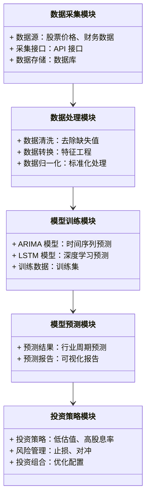
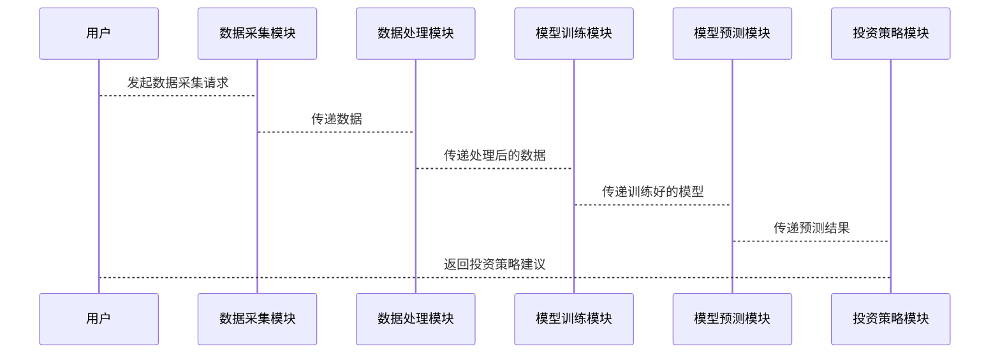

                 


# 大卫·温特斯的周期性价值投资：把握行业起落节奏

---

## 关键词：
- 价值投资
- 周期性行业
- 行业周期
- 投资策略
- 风险管理

---

## 摘要：
本文深入探讨了周期性价值投资的核心理念与实践方法，结合大卫·温特斯的投资思想，分析了周期性行业的波动规律，提出了基于行业周期的投资策略。通过数学模型与算法实现，帮助投资者在行业起落中把握投资节奏，优化投资组合，降低风险。文章还通过具体案例分析和实战指导，为投资者提供了实用的操作指南。

---

## 第1章：周期性价值投资的背景与核心概念

### 1.1 价值投资的基本概念
#### 1.1.1 价值投资的定义与特点
价值投资是一种投资策略，强调以低于资产内在价值的价格买入优质资产。其核心在于寻找市场低估的股票，并长期持有，等待其价值回归。价值投资的特点包括：
- 长期视角：关注企业的长期价值，而非短期市场波动。
- 低估值导向：寻找市场价格低于内在价值的股票。
- 高质量企业：投资于具有强大竞争优势和良好财务状况的企业。

#### 1.1.2 周期性投资的背景与意义
周期性投资是指在经济周期波动中，通过识别行业周期的变化，调整投资策略以获取超额收益。周期性投资的意义在于：
- 把握行业波动规律，优化投资时机。
- 在行业低谷时布局，在行业高点时收割收益。
- 通过周期性分析，降低投资风险，提高收益稳定性。

#### 1.1.3 价值投资与周期性行业的结合
周期性行业（如能源、材料、工业等）的波动性较高，但具有较高的周期性价值投资机会。通过分析行业周期，投资者可以在行业低谷时买入优质资产，在行业高峰时卖出，实现超额收益。

---

### 1.2 周期性行业的定义与分类
#### 1.2.1 周期性行业的定义
周期性行业是指其需求和供给受经济周期影响较大的行业。这些行业在经济繁荣时表现良好，在经济衰退时需求下降，价格波动剧烈。

#### 1.2.2 主要周期性行业的分类
周期性行业可以分为以下几类：
1. **能源行业**：如石油、天然气行业，需求受经济波动影响较大。
2. **材料行业**：如钢铁、有色金属行业，受经济周期影响显著。
3. **工业行业**：如机械制造、运输设备行业，需求与经济景气度密切相关。
4. **房地产行业**：受宏观经济政策和经济周期影响较大。
5. **周期性消费行业**：如汽车、家电行业，需求受经济波动影响。

#### 1.2.3 周期性行业的波动规律
周期性行业的波动通常呈现以下规律：
1. **周期性波动**：行业景气度随经济周期波动，呈现周期性特征。
2. **价格波动**：行业产品价格受供需关系影响，呈现周期性波动。
3. **库存周期**：行业库存水平与经济周期密切相关，库存周期是行业波动的重要指标。

---

### 1.3 周期性价值投资的核心理念
#### 1.3.1 周期性价值投资的定义
周期性价值投资是一种结合价值投资与周期性分析的投资策略，旨在通过识别行业周期的变化，选择在周期性低谷时低估的优质资产进行投资，以获取周期性回升带来的超额收益。

#### 1.3.2 周期性价值投资的核心要素
周期性价值投资的核心要素包括：
1. **行业周期分析**：识别行业所处的周期阶段，判断投资时机。
2. **低估值筛选**：在行业低谷时，寻找市场价格低于内在价值的优质企业。
3. **风险管理**：通过分散投资、设置止损等方法，降低投资风险。

#### 1.3.3 周期性价值投资的目标与策略
周期性价值投资的目标是通过行业周期分析和低估值筛选，捕捉行业周期性回升带来的收益。其策略包括：
1. **低估值买入策略**：在行业低谷时，选择低估值、高分红的优质企业进行投资。
2. **周期性行业轮动策略**：根据行业周期变化，动态调整投资组合，选择景气度向上的行业进行投资。
3. **风险管理策略**：通过分散投资、对冲交易等方式，降低周期性波动带来的风险。

---

### 1.4 本章小结
本章从价值投资的基本概念出发，介绍了周期性行业的定义、分类和波动规律，提出了周期性价值投资的核心理念和策略。周期性价值投资通过结合行业周期分析和低估值筛选，帮助投资者在行业波动中把握投资机会，实现长期稳定的收益。

---

## 第2章：周期性行业的波动规律与分析方法

### 2.1 周期性行业的波动周期
#### 2.1.1 行业周期的四个阶段
周期性行业通常经历四个阶段：
1. **衰退期**：行业需求下降，价格下跌，企业盈利能力减弱。
2. **底部回升期**：行业需求逐步恢复，价格企稳回升。
3. **扩张期**：行业需求快速增长，价格上升，企业盈利能力增强。
4. **顶部回落期**：行业需求开始放缓，价格下跌，企业盈利能力下降。

#### 2.1.2 行业周期的驱动因素
行业周期的驱动因素包括：
1. **宏观经济因素**：如GDP增长率、利率、通货膨胀等。
2. **行业供需关系**：行业供需失衡导致价格波动。
3. **政策因素**：政府政策对行业的支持或抑制。

#### 2.1.3 行业周期的预测方法
行业周期的预测方法包括：
1. **历史数据分析法**：通过分析历史周期数据，寻找周期性规律。
2. **经济指标分析法**：通过分析宏观经济指标，预测行业周期变化。
3. **市场情绪分析法**：通过分析市场情绪，判断行业周期的拐点。

---

### 2.2 行业周期分析的核心指标
#### 2.2.1 行业景气度指标
行业景气度指标包括：
1. **订单量**：行业需求的订单量变化。
2. **产能利用率**：行业产能的利用情况。
3. **库存水平**：行业库存的变化情况。

#### 2.2.2 行业盈利能力分析
行业盈利能力分析包括：
1. **净利率**：行业企业的净利润率变化。
2. **毛利率**：行业企业的毛利率变化。
3. **ROE（净资产收益率）**：行业企业的净资产收益率变化。

#### 2.2.3 行业库存与销售分析
行业库存与销售分析包括：
1. **库存周转率**：行业库存的周转速度。
2. **销售增长率**：行业销售收入的增长情况。

---

### 2.3 周期性行业的财务分析方法
#### 2.3.1 财务报表分析的基本方法
财务报表分析的基本方法包括：
1. **利润表分析**：分析企业的收入、成本和利润情况。
2. **资产负债表分析**：分析企业的资产、负债和所有者权益情况。
3. **现金流量表分析**：分析企业的现金流情况。

#### 2.3.2 行业周期与财务指标的关系
行业周期与财务指标的关系：
1. **衰退期**：企业盈利能力下降，库存积压。
2. **底部回升期**：企业盈利能力逐步恢复，库存开始去化。
3. **扩张期**：企业盈利能力增强，库存周转加快。
4. **顶部回落期**：企业盈利能力下降，库存积压。

#### 2.3.3 周期性行业的估值方法
周期性行业的估值方法包括：
1. **市盈率（P/E）**：用市盈率指标判断企业估值。
2. **市净率（P/B）**：用市净率指标判断企业估值。
3. **EV/EBITDA**：用企业价值与息税折旧及摊销前利润的比率判断企业估值。

---

### 2.4 本章小结
本章分析了周期性行业的波动周期及其驱动因素，提出了行业周期分析的核心指标和财务分析方法。通过这些方法，投资者可以更好地识别行业周期的变化，把握投资机会。

---

## 第3章：周期性价值投资的策略与实践

### 3.1 周期性价值投资的基本策略
#### 3.1.1 低估值策略
低估值策略是指在行业低谷时，选择市场价格低于内在价值的优质企业进行投资。具体实施步骤包括：
1. **筛选低估值企业**：通过市盈率、市净率等指标筛选低估值企业。
2. **分析企业基本面**：评估企业的盈利能力、财务状况和竞争优势。
3. **买入并持有**：在行业低谷时买入低估值企业，等待行业周期回升。

#### 3.1.2 高股息率策略
高股息率策略是指投资于股息收益率较高的周期性企业。具体实施步骤包括：
1. **筛选高股息率企业**：通过股息收益率指标筛选高股息率企业。
2. **分析企业财务状况**：评估企业的盈利能力和现金流情况。
3. **长期持有**：长期持有高股息率企业，获取稳定的现金流。

#### 3.1.3 行业拐点策略
行业拐点策略是指在行业周期拐点时进行投资。具体实施步骤包括：
1. **识别行业拐点**：通过行业景气度指标和市场情绪分析，判断行业拐点。
2. **布局拐点行业**：在行业拐点出现时，布局相关行业或企业。
3. **动态调整**：根据行业周期变化，动态调整投资组合。

---

### 3.2 周期性行业的投资时机选择
#### 3.2.1 行业拐点识别
行业拐点识别方法包括：
1. **历史数据分析法**：通过分析历史周期数据，寻找行业拐点的规律。
2. **市场情绪分析法**：通过分析市场情绪，判断行业拐点。
3. **经济指标分析法**：通过分析宏观经济指标，判断行业拐点。

#### 3.2.2 市场情绪与投资时机
市场情绪与投资时机的关系：
1. **市场情绪低落时**：可能是投资机会的出现时点。
2. **市场情绪高涨时**：可能是投资风险增大的信号。

#### 3.2.3 历史案例分析
历史案例分析：
1. **2008年全球金融危机**：周期性行业如能源、材料在危机后出现反弹，提供了投资机会。
2. **2020年新冠疫情**：周期性行业如航空、酒店在疫情后逐步恢复，提供了投资机会。

---

### 3.3 周期性价值投资的风险管理
#### 3.3.1 风险识别与评估
周期性价值投资的风险包括：
1. **市场风险**：行业周期波动带来的市场风险。
2. **流动性风险**：周期性行业在低谷时可能面临流动性风险。
3. **操作风险**：投资策略执行中的操作风险。

#### 3.3.2 风险控制策略
风险控制策略包括：
1. **分散投资**：通过分散投资不同行业和企业，降低风险。
2. **设置止损**：在投资组合中设置止损点，控制亏损。
3. **动态调整**：根据市场变化，动态调整投资组合。

#### 3.3.3 保险策略与对冲方法
保险策略与对冲方法包括：
1. **对冲基金**：通过做空相关行业或指数，对冲市场风险。
2. **期权对冲**：通过买入或卖出期权，对冲价格波动风险。

---

### 3.4 本章小结
本章提出了周期性价值投资的基本策略，包括低估值策略、高股息率策略和行业拐点策略。同时，分析了投资时机选择的方法和风险管理策略，帮助投资者在周期性行业中实现稳健收益。

---

## 第4章：周期性行业的案例分析与实战

### 4.1 历史案例分析
#### 4.1.1 石油行业的周期性分析
石油行业的周期性分析：
1. **衰退期**：2014-2016年，石油价格从高点下跌，行业进入衰退期。
2. **底部回升期**：2016年后，石油价格逐步回升，行业进入底部回升期。
3. **扩张期**：2019-2020年，石油价格稳定上升，行业进入扩张期。
4. **顶部回落期**：2020年新冠疫情爆发后，石油价格大幅下跌，行业进入顶部回落期。

#### 4.1.2 钢铁行业的周期性分析
钢铁行业的周期性分析：
1. **衰退期**：2008年全球金融危机后，钢铁行业需求下降，价格下跌。
2. **底部回升期**：2010年后，钢铁行业需求逐步恢复，价格企稳回升。
3. **扩张期**：2015-2018年，钢铁行业需求快速增长，价格上升。
4. **顶部回落期**：2019年后，钢铁行业需求放缓，价格开始回落。

#### 4.1.3 半导体行业的周期性分析
半导体行业的周期性分析：
1. **衰退期**：2000年互联网泡沫破裂后，半导体行业需求下降，价格下跌。
2. **底部回升期**：2003年后，半导体行业需求逐步恢复，价格企稳回升。
3. **扩张期**：2007-2011年，半导体行业需求快速增长，价格上升。
4. **顶部回落期**：2012年之后，半导体行业需求放缓，价格开始回落。

---

### 4.2 实战案例：如何选择周期性行业中的优质企业
#### 4.2.1 企业基本面分析
企业基本面分析包括：
1. **盈利能力分析**：分析企业的净利润率、毛利率等指标。
2. **财务状况分析**：分析企业的资产负债表，评估企业的财务健康状况。
3. **竞争优势分析**：分析企业的市场地位、品牌优势、技术壁垒等。

#### 4.2.2 企业竞争优势分析
企业竞争优势分析包括：
1. **成本优势**：企业是否具有成本优势，能否在价格竞争中胜出。
2. **技术优势**：企业是否具有技术优势，能否在技术创新中胜出。
3. **市场优势**：企业是否具有市场优势，能否在市场竞争中胜出。

#### 4.2.3 企业财务健康状况评估
企业财务健康状况评估包括：
1. **流动性分析**：分析企业的流动资产与流动负债的比例，评估企业的流动性状况。
2. **偿债能力分析**：分析企业的债务负担，评估企业的偿债能力。
3. **盈利能力分析**：分析企业的净利润率、毛利率等指标，评估企业的盈利能力。

---

### 4.3 投资组合构建与优化
#### 4.3.1 投资组合的构建原则
投资组合构建原则包括：
1. **分散投资**：通过分散投资不同行业和企业，降低风险。
2. **长期视角**：关注企业的长期价值，而非短期市场波动。
3. **动态调整**：根据市场变化，动态调整投资组合。

#### 4.3.2 投资组合的风险分散策略
投资组合风险分散策略包括：
1. **行业分散**：投资于不同行业的企业，降低行业风险。
2. **企业分散**：投资于不同企业的股票，降低企业特定风险。
3. **资产分散**：投资于不同资产类别，降低市场风险。

#### 4.3.3 投资组合的动态调整
投资组合的动态调整包括：
1. **定期 rebalancing**：定期调整投资组合，保持目标配置。
2. **根据市场变化调整**：根据市场变化，动态调整投资组合。
3. **根据企业变化调整**：根据企业基本面变化，动态调整投资组合。

---

### 4.4 本章小结
本章通过历史案例分析和实战指导，展示了如何在周期性行业中选择优质企业进行投资。通过企业基本面分析、竞争优势分析和财务状况评估，投资者可以更好地识别优质企业。同时，通过投资组合的构建与优化，投资者可以降低风险，实现稳健收益。

---

## 第5章：周期性价值投资的数学模型与算法实现

### 5.1 周期性行业的波动预测模型
#### 5.1.1 时间序列分析模型
时间序列分析模型用于预测行业周期的变化。常用的模型包括：
1. **ARIMA模型**：自回归积分滑动平均模型。
2. **GARCH模型**：广义自回归条件异方差模型。
3. ** prophet模型**：基于 Facebook 的 Prophet 时间序列预测模型。

#### 5.1.2 基于机器学习的周期性预测
基于机器学习的周期性预测方法包括：
1. **随机森林**：通过特征工程，利用随机森林模型预测行业周期。
2. **神经网络**：通过 LSTM 神经网络模型，预测行业周期。
3. **支持向量机**：通过支持向量机模型，预测行业周期。

---

### 5.2 周期性行业的波动预测算法实现
#### 5.2.1 ARIMA模型实现
ARIMA模型的实现步骤包括：
1. **数据准备**：收集行业周期数据，进行数据清洗和预处理。
2. **模型选择**：通过 AIC 或 BIC � 准则选择最优模型。
3. **模型训练**：利用历史数据训练 ARIMA 模型。
4. **模型预测**：利用训练好的模型预测未来行业周期。

#### 5.2.2 LSTM 神经网络模型实现
LSTM 神经网络模型的实现步骤包括：
1. **数据准备**：收集行业周期数据，进行数据清洗和预处理。
2. **数据归一化**：对数据进行归一化处理，确保输入数据适合 LSTM 模型。
3. **模型构建**：构建 LSTM 神经网络模型，包括输入层、LSTM 层、 Dense 层和输出层。
4. **模型训练**：利用历史数据训练 LSTM 模型。
5. **模型预测**：利用训练好的模型预测未来行业周期。

---

### 5.3 周期性行业的波动预测数学模型
#### 5.3.1 ARIMA 模型的数学公式
ARIMA 模型的数学公式为：
$$
y_t = \phi_1 y_{t-1} + \phi_2 y_{t-2} + \dots + \phi_p y_{t-p} + \theta_1 \epsilon_{t-1} + \theta_2 \epsilon_{t-2} + \dots + \theta_q \epsilon_{t-q} + \epsilon_t
$$
其中，$\phi_i$ 和 $\theta_j$ 是模型参数，$\epsilon_t$ 是白噪声。

#### 5.3.2 LSTM 模型的数学公式
LSTM 模型的数学公式为：
$$
f_t = \sigma(w_{f} \cdot [h_{t-1}, x_t] + b_f)
$$
$$
i_t = \sigma(w_{i} \cdot [h_{t-1}, x_t] + b_i)
$$
$$
o_t = \sigma(w_{o} \cdot [h_{t-1}, x_t] + b_o)
$$
$$
h_t = f_t \cdot c_t + i_t \cdot c_{t-1}
$$
其中，$f_t$ 是遗忘门，$i_t$ 是输入门，$o_t$ 是输出门，$h_t$ 是隐藏状态，$c_t$ 是细胞状态。

---

### 5.4 本章小结
本章介绍了周期性行业的波动预测模型，包括时间序列分析模型和机器学习模型。通过 ARIMA 模型和 LSTM 神经网络模型的实现，展示了如何利用数学模型和算法预测行业周期变化，为投资者提供科学的投资决策依据。

---

## 第6章：系统分析与架构设计方案

### 6.1 系统功能设计
系统功能设计包括：
1. **数据采集**：采集周期性行业的历史数据，包括价格、成交量、财务指标等。
2. **数据处理**：对数据进行清洗、转换和归一化处理。
3. **模型训练**：利用 ARIMA 模型和 LSTM 模型训练行业周期预测模型。
4. **模型预测**：利用训练好的模型预测行业周期变化。
5. **投资策略制定**：根据模型预测结果，制定投资策略。

#### 6.1.1 系统功能模块图（Mermaid 类图）


---

### 6.2 系统架构设计
#### 6.2.1 系统架构图（Mermaid 架构图）


---

### 6.3 系统接口设计
系统接口设计包括：
1. **数据采集接口**：通过 API 接口采集股票价格数据。
2. **数据处理接口**：对数据进行清洗、转换和归一化处理。
3. **模型训练接口**：训练 ARIMA 和 LSTM 模型。
4. **模型预测接口**：利用模型预测行业周期变化。
5. **投资策略接口**：根据模型预测结果，制定投资策略。

---

### 6.4 系统交互设计（Mermaid 序列图）


---

### 6.5 本章小结
本章通过系统功能设计、架构设计和接口设计，展示了如何构建一个基于周期性价值投资的行业周期预测系统。通过该系统，投资者可以更好地识别行业周期变化，制定科学的投资策略。

---

## 第7章：项目实战与总结

### 7.1 项目实战：构建周期性价值投资系统
#### 7.1.1 环境安装与配置
1. **安装 Python**：安装 Python 3.8 或更高版本。
2. **安装依赖库**：安装 pandas、numpy、scikit-learn、tensorflow 等依赖库。
3. **安装可视化工具**：安装 matplotlib 或 seaborn 等可视化工具。

#### 7.1.2 核心实现代码
1. **数据采集代码**：
```python
import pandas as pd
import requests

def get_stock_data(symbol, start_date, end_date):
    url = f"https://api.example.com/stock/{symbol}"
    params = {
        "start": start_date,
        "end": end_date
    }
    response = requests.get(url, params=params)
    data = pd.DataFrame(response.json())
    return data
```

2. **模型训练代码**：
```python
from sklearn.metrics import mean_squared_error
from keras.models import Sequential
from keras.layers import LSTM, Dense

def train_lstm_model(train_data):
    model = Sequential()
    model.add(LSTM(units=50, return_sequences=True, input_shape=(train_data.shape[1], 1)))
    model.add(Dense(1))
    model.compile(loss='mean_squared_error', optimizer='adam')
    model.fit(train_data, epochs=50, batch_size=32)
    return model
```

3. **模型预测代码**：
```python
def predict_stock_price(model, test_data):
    predictions = model.predict(test_data)
    return predictions
```

#### 7.1.3 代码应用解读与分析
1. **数据采集**：通过 API 接口获取股票价格数据。
2. **数据处理**：对数据进行清洗、转换和归一化处理。
3. **模型训练**：利用 LSTM 神经网络模型训练行业周期预测模型。
4. **模型预测**：利用训练好的模型预测未来行业周期变化。
5. **投资策略制定**：根据模型预测结果，制定投资策略。

---

### 7.2 投资策略优化与项目小结
#### 7.2.1 投资策略优化
投资策略优化包括：
1. **动态调整**：根据市场变化，动态调整投资组合。
2. **风险管理**：设置止损点，控制投资风险。
3. **对冲交易**：通过对冲交易，降低市场风险。

#### 7.2.2 项目小结
通过构建周期性价值投资系统，投资者可以更好地识别行业周期变化，制定科学的投资策略。同时，通过动态调整和风险管理，投资者可以降低投资风险，实现稳健收益。

---

## 第8章：总结与展望

### 8.1 本章总结
本章总结了周期性价值投资的核心理念与实践方法，通过数学模型与算法实现，帮助投资者在行业起落中把握投资节奏。通过系统分析与架构设计，展示了如何构建一个基于周期性价值投资的行业周期预测系统。同时，通过项目实战与总结，为投资者提供了实用的操作指南。

### 8.2 未来展望
未来展望包括：
1. **算法优化**：进一步优化 LSTM 神经网络模型，提高预测精度。
2. **数据扩展**：引入更多数据源，如新闻、社交媒体数据，丰富预测模型。
3. **应用扩展**：将周期性价值投资方法应用于更多行业，如科技、医疗等。

---

## 作者：AI天才研究院/AI Genius Institute & 禅与计算机程序设计艺术/Zen And The Art of Computer Programming

