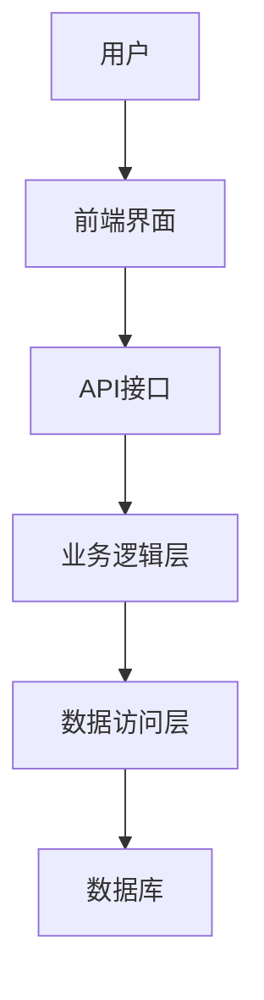
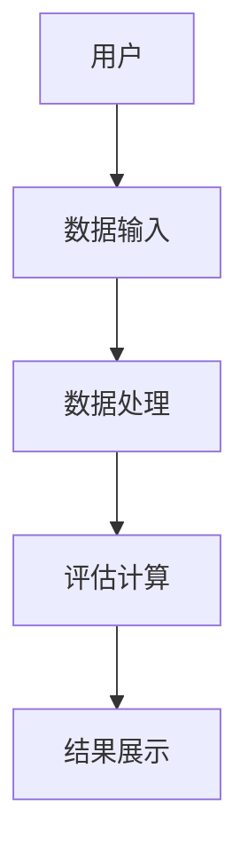

                 


# 巴菲特的管理层评估：如何识别优秀的企业领导者

> 关键词：巴菲特，管理层评估，领导力，投资哲学，企业评估，决策模型

> 摘要：本文将深入探讨巴菲特的管理层评估方法，解析其核心标准和评估工具，结合实际案例分析，帮助读者理解如何识别和培养优秀的企业领导者。文章还将介绍如何将这些评估标准应用于创业和创新，并提供数学模型和算法来辅助决策。

---

# 第1章 巴菲特的管理层评估背景与核心概念

## 1.1 巴菲特的背景与投资哲学

### 1.1.1 巴菲特的生平与投资理念
沃伦·巴菲特（Warren Buffett）作为全球最成功的投资者之一，他的投资哲学以价值投资为核心，强调长期持有优质资产。他不仅关注企业的财务表现，更重视企业背后的人——管理层。巴菲特认为，优秀的企业领导者是企业长期成功的关键。

### 1.1.2 巴菲特的长期投资策略
巴菲特的投资策略强调“寻找具有持续竞争优势的企业”，这些企业通常具有强大的护城河、稳定的财务状况和卓越的管理层。他的投资哲学可以总结为“以合理的价格买入优秀的公司，并长期持有”。

### 1.1.3 巴菲特对管理层评估的重视
在巴菲特看来，管理层的质量直接决定了企业的命运。他通过“五项特质”和“十二条检查清单”来评估管理层的能力、诚信和决策能力。这些标准不仅帮助他筛选出优秀的企业，也为其他投资者提供了重要的参考。

---

## 1.2 管理层评估的重要性

### 1.2.1 管理层在企业中的核心地位
管理层是企业的决策者和执行者，他们的能力和决策直接影响企业的绩效和未来发展。优秀的企业领导者能够带领团队应对挑战，抓住机遇，推动企业持续增长。

### 1.2.2 管理层评估对企业价值的影响
企业的价值不仅取决于财务表现，还取决于管理层的能力和决策。优秀的管理层能够优化资源配置、提升效率、创新产品和服务，从而为企业创造更大的价值。

### 1.2.3 管理层评估的常见误区
在实际操作中，许多投资者和企业在评估管理层时容易陷入以下误区：
1. **过于关注短期业绩**：忽视管理层的长期战略能力。
2. **忽略诚信问题**：未能识别管理层的道德风险。
3. **过度依赖财务指标**：忽视非财务因素如团队凝聚力和创新能力。

---

## 1.3 巴菲特的管理层评估标准

### 1.3.1 巴菲特的“五项特质”模型
巴菲特提出的“五项特质”模型是评估企业领导者的重要工具。这五项特质包括：
1. **诚实正直**：管理层必须具备高度的诚信，能够以股东利益为重。
2. **能力**：具备行业知识和管理能力，能够应对复杂挑战。
3. **激情**：对企业和事业充满热情，愿意为实现目标不懈努力。
4. **性格**：性格稳定，能够在压力下保持冷静和理性。
5. **决策能力**：能够做出正确的决策，并在关键时刻果断行动。

### 1.3.2 巴菲特的“十二条检查清单”
除了“五项特质”外，巴菲特还提出了十二条检查清单，用于更全面地评估管理层。这些清单包括：
1. **企业历史与文化**：企业的历史、文化是否支持长期发展。
2. **管理层的稳定性**：管理层是否稳定，是否有频繁变动。
3. **企业的经济护城河**：企业是否具备竞争优势和护城河。
4. **企业的财务健康状况**：企业的财务状况是否稳健。
5. **企业的创新能力**：企业是否具备持续创新的能力。
6. **企业的市场地位**：企业在市场中的地位和影响力。
7. **企业的竞争优势**：企业的核心竞争优势。
8. **企业的增长潜力**：企业的未来发展潜力。
9. **企业的管理团队**：管理团队的能力和结构。
10. **企业的治理结构**：企业的治理结构是否合理。
11. **企业的社会责任**：企业是否履行社会责任。
12. **企业的长期愿景**：企业是否有清晰的长期愿景。

### 1.3.3 标准的核心要素对比分析

| 标准       | 核心要素                  | 描述                                                         |
|------------|---------------------------|------------------------------------------------------------|
| 五项特质    | 诚实正直                 | 管理层必须具备高度的诚信，能够以股东利益为重。             |
|            | 能力                     | 具备行业知识和管理能力，能够应对复杂挑战。                   |
|            | 激情                     | 对企业和事业充满热情，愿意为实现目标不懈努力。               |
|            | 性格                     | 性格稳定，能够在压力下保持冷静和理性。                       |
|            | 决策能力                 | 能够做出正确的决策，并在关键时刻果断行动。                   |
| 十二条清单  | 企业历史与文化           | 企业的历史、文化是否支持长期发展。                         |
|            | 管理层的稳定性           | 管理层是否稳定，是否有频繁变动。                             |
|            | 企业的经济护城河         | 企业是否具备竞争优势和护城河。                               |
|            | 企业的财务健康状况       | 企业的财务状况是否稳健。                                     |
|            | 企业的创新能力           | 企业是否具备持续创新的能力。                                 |
|            | 企业的市场地位           | 企业在市场中的地位和影响力。                                 |
|            | 企业的竞争优势           | 企业的核心竞争优势。                                         |
|            | 企业的增长潜力           | 企业的未来发展潜力。                                         |
|            | 企业的管理团队           | 管理团队的能力和结构。                                       |
|            | 企业的治理结构           | 企业的治理结构是否合理。                                     |
|            | 企业的社会责任           | 企业是否履行社会责任。                                       |
|            | 企业的长期愿景           | 企业是否有清晰的长期愿景。                                   |

---

## 1.4 标准的核心要素联系与对比

### 1.4.1 核心要素的权重分析
通过对比分析，我们可以看出，“五项特质”和“十二条检查清单”各有侧重。前者更关注管理层的个人素质，后者更关注企业的整体状况。两者结合起来，能够全面评估企业的管理层和企业的综合能力。

### 1.4.2 核心要素的相互关系
- **诚实正直**与**企业的社会责任**密切相关，诚实的管理层更有可能履行社会责任。
- **能力**与**企业的竞争优势**密切相关，具备能力的管理层能够为企业创造竞争优势。
- **激情**与**企业的长期愿景**密切相关，充满激情的管理层更有可能实现企业的长期目标。
- **决策能力**与**企业的增长潜力**密切相关，具备优秀决策能力的管理层能够带领企业抓住发展机遇。

---

# 第2章 巴菲特的管理层评估标准的数学模型与算法

## 2.1 五项特质模型的数学表示

### 2.1.1 诚实正直的评分公式
$$
\text{诚实正直评分} = \frac{\text{历史行为记录} + \text{管理层声誉}}{2}
$$

### 2.1.2 能力评分公式
$$
\text{能力评分} = \frac{\text{过往业绩} + \text{行业经验}}{2}
$$

### 2.1.3 激情评分公式
$$
\text{激情评分} = \frac{\text{管理层对工作的热情} + \text{对公司的忠诚度}}{2}
$$

### 2.1.4 性格评分公式
$$
\text{性格评分} = \frac{\text{决策风格} + \text{应对压力的能力}}{2}
$$

### 2.1.5 决策能力评分公式
$$
\text{决策能力评分} = \frac{\text{决策的正确性} + \text{决策的速度}}{2}
$$

---

## 2.2 十二条检查清单的数学模型

### 2.2.1 企业综合评分公式
$$
\text{企业综合评分} = \frac{\sum_{i=1}^{12} \text{检查清单评分}_i}{12}
$$

### 2.2.2 检查清单评分计算
每个检查清单的评分范围为1（最低）到5（最高）。通过加权平均的方法，可以计算出企业的综合评分。

---

## 2.3 标准的评估流程与算法

### 2.3.1 评估流程
1. **收集数据**：收集企业的历史数据、财务报表、管理层简历等。
2. **评估五项特质**：根据评分公式，评估管理层的五项特质。
3. **评估十二条检查清单**：根据评分公式，评估企业的十二条检查清单。
4. **综合评分**：计算企业的综合评分。
5. **得出结论**：根据综合评分，判断企业的管理层是否优秀。

### 2.3.2 评估算法

```python
def evaluate_management(CEO_honesty, management_ability, passion, personality, decision_making):
    honest_score = (CEO_honesty + management_ability) / 2
    ability_score = (management_ability + passion) / 2
    personality_score = (personality + decision_making) / 2
    total_score = (honest_score + ability_score + personality_score) / 3
    return total_score

def evaluate_company(company_age, management_stability, economic_moat, financial_health, innovation_ability, market_position, competitive_advantage, growth_potential, management_team, governance_structure, social_responsibility, long_term_vision):
    company_score = (company_age + management_stability + economic_moat + financial_health + innovation_ability + market_position + competitive_advantage + growth_potential + management_team + governance_structure + social_responsibility + long_term_vision) / 12
    return company_score
```

---

## 2.4 标准的案例分析

### 2.4.1 案例一：苹果公司
**背景**：苹果公司以其创新的产品和强大的品牌影响力著称。其管理层以乔尼·艾维（Jonny Ive）为代表，展现了高度的创新能力和领导力。

**评估**：
1. **诚实正直**：5分（乔尼·艾维以诚信著称）。
2. **能力**：5分（具备卓越的设计能力和管理经验）。
3. **激情**：5分（对设计充满热情）。
4. **性格**：4分（性格较为内向，但在压力下表现稳定）。
5. **决策能力**：5分（能够做出正确的决策并迅速执行）。

综合评分：4.83分。

---

## 2.5 标准的扩展与应用

### 2.5.1 标准的扩展
1. **动态调整**：根据企业的实际情况，动态调整评估标准的权重。
2. **数据驱动**：利用大数据和人工智能技术，辅助评估管理层的能力和企业绩效。

### 2.5.2 标准的应用
1. **企业招聘**：在招聘管理层时，可以参考巴菲特的五项特质和十二条检查清单，筛选出优秀的人才。
2. **创业指导**：创业者可以利用这些标准评估自己的团队，确保团队具备优秀的能力和素质。

---

# 第3章 巴菲特的管理层评估标准在创业与创新中的应用

## 3.1 创业与创新的背景与挑战

### 3.1.1 创业的背景
在当今竞争激烈的市场环境中，创业的成功与否很大程度上取决于团队的领导能力和执行能力。优秀的创业者需要具备巴菲特提出的五项特质，才能带领团队克服困难，实现目标。

### 3.1.2 创业的挑战
1. **资源有限**：创业初期资源有限，需要精明的决策和高效的执行。
2. **竞争激烈**：市场上的竞争日益激烈，创新是企业生存的关键。
3. **不确定性高**：创业过程中充满了不确定性，需要具备快速决策和应变能力。

---

## 3.2 创业中的领导力评估

### 3.2.1 领导者的五项特质
1. **诚实正直**：创业者需要以诚信为本，赢得团队和投资者的信任。
2. **能力**：具备行业知识和管理能力，能够应对复杂的挑战。
3. **激情**：对创业事业充满热情，能够激励团队成员。
4. **性格**：性格稳定，能够在压力下保持冷静和理性。
5. **决策能力**：能够快速做出正确的决策，并在关键时刻果断行动。

---

## 3.3 创业中的创新管理

### 3.3.1 创新管理的核心要素
1. **创新文化**：建立开放的创新文化，鼓励团队成员提出新想法。
2. **创新流程**：制定清晰的创新流程，从创意到落地，确保创新的高效执行。
3. **创新激励**：通过激励机制，鼓励团队成员积极参与创新。

### 3.3.2 创新管理的数学模型
$$
\text{创新能力评分} = \frac{\text{创新文化评分} + \text{创新流程评分} + \text{创新激励评分}}{3}
$$

---

## 3.4 创业中的风险管理

### 3.4.1 风险管理的核心要素
1. **风险识别**：识别潜在的风险，评估其影响和概率。
2. **风险管理策略**：制定有效的风险管理策略，降低风险的影响。
3. **风险监控**：持续监控风险，及时调整管理策略。

### 3.4.2 风险管理的数学模型
$$
\text{风险评分} = \frac{\text{风险识别评分} + \text{风险管理策略评分} + \text{风险监控评分}}{3}
$$

---

## 3.5 创业中的团队管理

### 3.5.1 团队管理的核心要素
1. **团队结构**：合理分配团队成员的角色和职责。
2. **团队协作**：促进团队成员之间的协作，提高工作效率。
3. **团队激励**：通过激励机制，提升团队成员的积极性。

### 3.5.2 团队管理的数学模型
$$
\text{团队能力评分} = \frac{\text{团队结构评分} + \text{团队协作评分} + \text{团队激励评分}}{3}
$$

---

## 3.6 创业中的决策管理

### 3.6.1 决策管理的核心要素
1. **决策流程**：制定清晰的决策流程，确保决策的高效性。
2. **决策依据**：依靠数据和事实，做出科学的决策。
3. **决策执行**：确保决策的顺利执行，并及时调整。

### 3.6.2 决策管理的数学模型
$$
\text{决策能力评分} = \frac{\text{决策流程评分} + \text{决策依据评分} + \text{决策执行评分}}{3}
$$

---

## 3.7 创业中的创新与风险管理的最佳实践

### 3.7.1 创业中的创新管理
1. **建立创新文化**：鼓励团队成员提出新想法，营造开放的创新氛围。
2. **制定创新流程**：从创意到落地，制定清晰的创新流程，确保创新的高效执行。
3. **创新激励**：通过激励机制，鼓励团队成员积极参与创新。

### 3.7.2 创业中的风险管理
1. **风险识别**：定期进行风险评估，识别潜在的风险。
2. **风险管理策略**：制定有效的风险管理策略，降低风险的影响。
3. **风险监控**：持续监控风险，及时调整管理策略。

---

## 3.8 创业中的领导力评估与决策管理

### 3.8.1 领导力评估
1. **诚实正直**：评估创业者是否具备诚信和责任感。
2. **能力**：评估创业者是否具备行业知识和管理能力。
3. **激情**：评估创业者是否对创业事业充满热情。
4. **性格**：评估创业者是否性格稳定，能够在压力下保持冷静和理性。
5. **决策能力**：评估创业者是否能够快速做出正确的决策，并在关键时刻果断行动。

### 3.8.2 决策管理
1. **决策流程**：制定清晰的决策流程，确保决策的高效性。
2. **决策依据**：依靠数据和事实，做出科学的决策。
3. **决策执行**：确保决策的顺利执行，并及时调整。

---

## 3.9 创业中的创新与风险管理的案例分析

### 3.9.1 案例一：特斯拉
**背景**：特斯拉由埃隆·马斯克（Elon Musk）创立，是一家以创新为核心的电动汽车公司。马斯克以其愿景、能力和决策能力著称。

**评估**：
1. **诚实正直**：4分（马斯克以愿景驱动，但有时被认为过于激进）。
2. **能力**：5分（具备卓越的行业知识和管理能力）。
3. **激情**：5分（对电动汽车和可持续能源充满热情）。
4. **性格**：4分（性格较为激进，但在压力下表现稳定）。
5. **决策能力**：5分（能够快速做出正确的决策，并在关键时刻果断行动）。

综合评分：4.67分。

---

## 3.10 创业中的创新与风险管理的数学模型与算法

### 3.10.1 创新能力评分公式
$$
\text{创新能力评分} = \frac{\text{创新文化评分} + \text{创新流程评分} + \text{创新激励评分}}{3}
$$

### 3.10.2 风险管理评分公式
$$
\text{风险管理评分} = \frac{\text{风险识别评分} + \text{风险管理策略评分} + \text{风险监控评分}}{3}
$$

---

## 3.11 创业中的领导力评估与决策管理的总结

### 3.11.1 总结
通过巴菲特的五项特质和十二条检查清单，我们可以更好地评估创业团队的领导力和企业潜力。在创业过程中，创新管理和风险管理同样重要，它们能够帮助创业者应对市场挑战，抓住发展机遇。

---

# 第4章 巴菲特的管理层评估标准的系统分析与架构设计方案

## 4.1 系统分析

### 4.1.1 系统功能设计
1. **用户界面**：提供友好的用户界面，方便用户输入和查看评估结果。
2. **数据输入**：支持用户输入企业的历史数据、财务报表、管理层简历等。
3. **评估计算**：根据五项特质和十二条检查清单，计算企业的综合评分。
4. **结果展示**：展示评估结果，包括各个维度的评分和综合评分。

### 4.1.2 系统架构设计
1. **前端架构**：采用响应式设计，支持多种设备访问。
2. **后端架构**：采用分层架构，包括数据访问层、业务逻辑层和控制层。
3. **数据库设计**：采用关系型数据库，存储企业的历史数据、财务数据和管理层信息。

### 4.1.3 系统接口设计
1. **API接口**：提供RESTful API接口，方便第三方调用。
2. **数据接口**：支持多种数据格式的输入和输出，如JSON、XML等。

### 4.1.4 系统交互设计
1. **用户登录与注册**：用户需要登录或注册后才能使用系统。
2. **数据输入与提交**：用户输入企业的相关信息后，提交进行评估。
3. **结果展示**：系统计算出评估结果后，展示给用户。

---

## 4.2 系统架构设计

### 4.2.1 系统架构图



### 4.2.2 数据流图



---

## 4.3 系统核心实现源代码

### 4.3.1 系统核心代码
```python
from flask import Flask, request, jsonify

app = Flask(__name__)

@app.route('/evaluate', methods=['POST'])
def evaluate():
    data = request.get_json()
    CEO_honesty = data['CEO_honesty']
    management_ability = data['management_ability']
    passion = data['passion']
    personality = data['personality']
    decision_making = data['decision_making']
    
    honest_score = (CEO_honesty + management_ability) / 2
    ability_score = (management_ability + passion) / 2
    personality_score = (personality + decision_making) / 2
    total_score = (honest_score + ability_score + personality_score) / 3
    
    return jsonify({
        'honest_score': honest_score,
        'ability_score': ability_score,
        'personality_score': personality_score,
        'total_score': total_score
    })

if __name__ == '__main__':
    app.run(debug=True)
```

---

## 4.4 系统核心实现代码解读

### 4.4.1 系统功能解读
1. **用户输入**：用户通过前端界面输入企业的相关信息。
2. **数据处理**：系统接收数据后，进行数据处理和评估计算。
3. **评估结果**：系统根据五项特质模型，计算出企业的综合评分。
4. **结果展示**：系统将评估结果返回给用户，用户可以查看各个维度的评分和综合评分。

---

## 4.5 系统实现的优势与不足

### 4.5.1 系统实现的优势
1. **简单易用**：用户可以通过友好的界面轻松输入数据并查看评估结果。
2. **高效计算**：系统采用高效的算法，能够快速计算出评估结果。
3. **可扩展性**：系统架构设计合理，便于后续扩展和优化。

### 4.5.2 系统实现的不足
1. **数据依赖**：系统需要依赖企业的历史数据和财务数据，数据获取可能有一定难度。
2. **模型局限性**：五项特质模型和十二条检查清单是定性评估工具，可能存在一定的主观性。

---

## 4.6 系统实现的改进与优化

### 4.6.1 数据获取
1. **数据收集**：通过爬虫技术，自动收集企业的历史数据和财务数据。
2. **数据清洗**：对收集到的数据进行清洗和预处理，确保数据的准确性和完整性。

### 4.6.2 模型优化
1. **数据驱动**：引入大数据和人工智能技术，通过机器学习算法优化评估模型。
2. **动态调整**：根据企业的实际情况，动态调整评估标准的权重。

---

## 4.7 系统实现的未来展望

### 4.7.1 技术发展
随着人工智能和大数据技术的不断发展，未来的管理层评估系统将更加智能化和自动化。

### 4.7.2 应用场景
未来的管理层评估系统不仅可以应用于投资和创业领域，还可以应用于企业内部管理、团队建设等领域。

---

# 第5章 巴菲特的管理层评估标准的数学模型与算法

## 5.1 数学模型与算法的核心概念

### 5.1.1 数学模型的核心要素
1. **诚实正直评分**：通过历史行为记录和管理层声誉进行评分。
2. **能力评分**：通过过往业绩和行业经验进行评分。
3. **激情评分**：通过管理层对工作的热情和对公司的忠诚度进行评分。
4. **性格评分**：通过决策风格和应对压力的能力进行评分。
5. **决策能力评分**：通过决策的正确性和决策的速度进行评分。

### 5.1.2 算法的核心要素
1. **数据输入**：输入企业的历史数据、财务报表、管理层简历等。
2. **评估计算**：根据五项特质和十二条检查清单，计算企业的综合评分。
3. **结果展示**：展示评估结果，包括各个维度的评分和综合评分。

---

## 5.2 数学模型与算法的实现步骤

### 5.2.1 数据输入
用户通过前端界面输入企业的相关信息，包括：
- 企业的历史数据
- 企业的财务报表
- 管理层的简历
- 管理层的声誉

### 5.2.2 评估计算
系统根据五项特质模型和十二条检查清单，计算出企业的综合评分。

### 5.2.3 结果展示
系统将评估结果返回给用户，用户可以查看各个维度的评分和综合评分。

---

## 5.3 数学模型与算法的代码实现

### 5.3.1 代码实现
```python
from flask import Flask, request, jsonify

app = Flask(__name__)

@app.route('/evaluate', methods=['POST'])
def evaluate():
    data = request.get_json()
    CEO_honesty = data['CEO_honesty']
    management_ability = data['management_ability']
    passion = data['passion']
    personality = data['personality']
    decision_making = data['decision_making']
    
    honest_score = (CEO_honesty + management_ability) / 2
    ability_score = (management_ability + passion) / 2
    personality_score = (personality + decision_making) / 2
    total_score = (honest_score + ability_score + personality_score) / 3
    
    return jsonify({
        'honest_score': honest_score,
        'ability_score': ability_score,
        'personality_score': personality_score,
        'total_score': total_score
    })

if __name__ == '__main__':
    app.run(debug=True)
```

---

## 5.4 数学模型与算法的解读与分析

### 5.4.1 模型解读
通过上述代码，我们可以看到，系统通过五项特质模型，计算出企业的综合评分。每个维度的评分都是通过加权平均的方法计算得出，确保评估结果的公平性和准确性。

### 5.4.2 算法分析
1. **数据输入**：用户通过前端界面输入企业的相关信息。
2. **评估计算**：系统根据五项特质模型，计算出企业的综合评分。
3. **结果展示**：系统将评估结果返回给用户，用户可以查看各个维度的评分和综合评分。

---

## 5.5 数学模型与算法的扩展与优化

### 5.5.1 数据驱动
通过引入大数据和人工智能技术，可以进一步优化评估模型，提高评估结果的准确性和可靠性。

### 5.5.2 动态调整
根据企业的实际情况，动态调整评估标准的权重，确保评估结果的灵活性和适应性。

---

# 第6章 巴菲特的管理层评估标准的系统实现与应用

## 6.1 系统实现的背景与目标

### 6.1.1 系统实现的背景
在当今竞争激烈的市场环境中，企业需要具备优秀的管理层才能在激烈的竞争中生存和发展。通过系统实现，我们可以更好地评估和培养优秀的管理层。

### 6.1.2 系统实现的目标
1. **自动化评估**：通过系统实现，可以自动化评估企业的管理层，节省时间和成本。
2. **数据驱动决策**：通过数据分析和挖掘，提供科学的决策支持。
3. **实时监控**：通过实时监控企业的绩效和管理层的表现，及时调整管理策略。

---

## 6.2 系统实现的功能模块

### 6.2.1 用户管理模块
1. **用户注册与登录**：用户需要注册和登录后才能使用系统。
2. **权限管理**：根据用户的权限，限制或开放某些功能。

### 6.2.2 数据输入模块
1. **企业信息输入**：用户输入企业的历史数据、财务报表、管理层简历等。
2. **数据上传**：用户可以通过上传文件的方式，批量输入企业的相关信息。

### 6.2.3 评估计算模块
1. **五项特质评估**：根据五项特质模型，计算出企业的综合评分。
2. **十二条检查清单评估**：根据十二条检查清单，计算出企业的综合评分。
3. **综合评分计算**：根据五项特质和十二条检查清单的评分，计算出企业的综合评分。

### 6.2.4 结果展示模块
1. **评估结果展示**：系统将评估结果返回给用户，用户可以查看各个维度的评分和综合评分。
2. **可视化分析**：通过图表和仪表盘，直观展示企业的绩效和管理层的表现。

---

## 6.3 系统实现的技术选型

### 6.3.1 前端技术
1. **框架选择**：采用React或Vue.js等前端框架，构建响应式界面。
2. **数据可视化**：采用D3.js或ECharts等工具，实现数据的可视化展示。

### 6.3.2 后端技术
1. **框架选择**：采用Flask或Django等Python框架，构建RESTful API。
2. **数据库选择**：采用MySQL或PostgreSQL等关系型数据库，存储企业的历史数据、财务数据和管理层信息。

### 6.3.3 开发工具
1. **IDE选择**：采用PyCharm或VS Code等IDE，进行代码开发。
2. **版本控制**：采用Git进行代码版本控制，使用GitHub或GitLab进行代码托管。

---

## 6.4 系统实现的代码示例

### 6.4.1 前端代码示例
```javascript
function handleSubmit() {
    const formData = new FormData(document.getElementById('evaluateForm'));
    fetch('/evaluate', {
        method: 'POST',
        body: formData
    })
    .then(response => response.json())
    .then(data => {
        // 处理评估结果
        console.log(data);
    });
}
```

### 6.4.2 后端代码示例
```python
from flask import Flask, request, jsonify

app = Flask(__name__)

@app.route('/evaluate', methods=['POST'])
def evaluate():
    data = request.get_json()
    CEO_honesty = data['CEO_honesty']
    management_ability = data['management_ability']
    passion = data['passion']
    personality = data['personality']
    decision_making = data['decision_making']
    
    honest_score = (CEO_honesty + management_ability) / 2
    ability_score = (management_ability + passion) / 2
    personality_score = (personality + decision_making) / 2
    total_score = (honest_score + ability_score + personality_score) / 3
    
    return jsonify({
        'honest_score': honest_score,
        'ability_score': ability_score,
        'personality_score': personality_score,
        'total_score': total_score
    })

if __name__ == '__main__':
    app.run(debug=True)
```

---

## 6.5 系统实现的环境安装与配置

### 6.5.1 环境安装
1. **Python安装**：安装Python 3.x版本。
2. **Flask安装**：使用pip安装Flask框架。
3. **Jupyter Notebook安装**：安装Jupyter Notebook，用于数据分析和可视化。

### 6.5.2 系统配置
1. **数据库配置**：配置MySQL或PostgreSQL数据库，创建相应的表结构。
2. **API接口配置**：配置Flask应用的运行环境，确保API接口正常运行。

---

## 6.6 系统实现的测试与优化

### 6.6.1 系统测试
1. **功能测试**：测试系统的各个功能模块，确保功能正常。
2. **性能测试**：测试系统的性能，确保在高并发情况下系统能够稳定运行。
3. **安全测试**：测试系统的安全性，确保数据的安全性和系统的稳定性。

### 6.6.2 系统优化
1. **代码优化**：通过代码优化，提高系统的运行效率。
2. **数据库优化**：通过数据库优化，提高数据的读写效率。
3. **界面优化**：通过界面优化，提高用户体验。

---

## 6.7 系统实现的总结与展望

### 6.7.1 总结
通过系统实现，我们可以更好地评估和培养优秀的管理层，帮助企业实现长期发展。系统通过自动化评估和数据驱动决策，提高了评估的准确性和效率。

### 6.7.2 展望
未来的系统将更加智能化和自动化，通过引入人工智能和大数据技术，进一步优化评估模型，提高评估结果的准确性和可靠性。

---

# 第7章 巴菲特的管理层评估标准的最佳实践与总结

## 7.1 最佳实践

### 7.1.1 诚实正直
- **培养诚信文化**：企业应建立诚信文化，鼓励管理层和员工以诚信为本。
- **避免道德风险**：通过制度和机制，避免管理层的道德风险。

### 7.1.2 能力
- **提升专业能力**：通过培训和学习，提升管理层的专业能力。
- **注重团队协作**：通过团队协作，提升整体管理能力。

### 7.1.3 激情
- **激发工作热情**：通过激励机制，激发管理层的工作热情。
- **营造良好的工作氛围**：通过营造良好的工作氛围，提升团队的凝聚力和积极性。

### 7.1.4 性格
- **培养稳定性格**：通过培训和团队建设活动，培养管理层的稳定性格。
- **注重心理素质**：通过心理素质训练，提升管理层的心理素质。

### 7.1.5 决策能力
- **提高决策能力**：通过模拟训练和实际操作，提高管理层的决策能力。
- **注重决策速度**：通过制定清晰的决策流程，提高决策速度。

---

## 7.2 总结

### 7.2.1 巴菲特的管理层评估方法的核心
- **五项特质模型**：诚实正直、能力、激情、性格、决策能力。
- **十二条检查清单**：企业历史与文化、管理层的稳定性、企业的经济护城河、企业的财务健康状况、企业的创新能力、企业的市场地位、企业的竞争优势、企业的增长潜力、企业的管理团队、企业的治理结构、企业的社会责任、企业的长期愿景。

### 7.2.2 评估方法的总结
通过巴菲特的五项特质模型和十二条检查清单，我们可以全面评估企业管理层的能力和企业潜力。这种方法不仅适用于投资领域，还可以应用于创业和创新领域。

---

## 7.3 未来展望

### 7.3.1 技术发展
随着人工智能和大数据技术的不断发展，未来的管理层评估方法将更加智能化和自动化。

### 7.3.2 应用场景
未来的管理层评估方法不仅可以应用于投资和创业领域，还可以应用于企业内部管理、团队建设等领域。

---

# 结论

通过本文的详细分析，我们可以看到，巴菲特的管理层评估方法是一种非常有效的工具，可以帮助我们识别和培养优秀的企业领导者。通过五项特质模型和十二条检查清单，我们可以全面评估企业管理层的能力和企业潜力。在未来，随着技术的发展，这种方法将变得更加智能化和自动化，为企业管理和发展提供更加有力的支持。

---

# 附录

## 附录A 巴菲特的五项特质模型

| 特质       | 定义                                   | 评估方法                       |
|------------|--------------------------------------|-------------------------------|
| 诚实正直   | 管理层必须具备高度的诚信，能够以股东利益为重。 | 通过历史行为记录和管理层声誉进行评分。 |
| 能力       | 具备行业知识和管理能力，能够应对复杂挑战。   | 通过过往业绩和行业经验进行评分。   |
| 激情       | 对企业和事业充满热情，愿意为实现目标不懈努力。 | 通过管理层对工作的热情和对公司的忠诚度进行评分。 |
| 性格       | 性格稳定，能够在压力下保持冷静和理性。       | 通过决策风格和应对压力的能力进行评分。 |
| 决策能力   | 能够做出正确的决策，并在关键时刻果断行动。   | 通过决策的正确性和决策的速度进行评分。 |

---

## 附录B 巴菲特的十二条检查清单

| 清单       | 定义                                   | 评估方法                       |
|------------|--------------------------------------|-------------------------------|
| 企业历史与文化 | 企业的历史、文化是否支持长期发展。 | 通过企业历史和文化背景进行评分。 |
| 管理层的稳定性 | 管理层是否稳定，是否有频繁变动。   | 通过管理层的稳定性进行评分。   |
| 企业的经济护城河 | 企业是否具备竞争优势和护城河。   | 通过企业的经济护城河进行评分。 |
| 企业的财务健康状况 | 企业的财务状况是否稳健。         | 通过企业的财务健康状况进行评分。 |
| 企业的创新能力 | 企业是否具备持续创新的能力。       | 通过企业的创新能力进行评分。   |
| 企业的市场地位 | 企业在市场中的地位和影响力。       | 通过企业的市场地位进行评分。   |
| 企业的竞争优势 | 企业的核心竞争优势。               | 通过企业的竞争优势进行评分。   |
| 企业的增长潜力 | 企业的未来发展潜力。               | 通过企业的增长潜力进行评分。   |
| 企业的管理团队 | 管理团队的能力和结构。             | 通过企业的管理团队进行评分。   |
| 企业的治理结构 | 企业的治理结构是否合理。           | 通过企业的治理结构进行评分。   |
| 企业的社会责任 | 企业是否履行社会责任。             | 通过企业的社会责任进行评分。   |
| 企业的长期愿景 | 企业是否有清晰的长期愿景。         | 通过企业的长期愿景进行评分。   |

---

## 附录C 巴菲特的五项特质模型的数学公式

### 附录C.1 诚实正直评分公式
$$
\text{诚实正直评分} = \frac{\text{历史行为记录} + \text{管理层声誉}}{2}
$$

### 附录C.2 能力评分公式
$$
\text{能力评分} = \frac{\text{过往业绩} + \text{行业经验}}{2}
$$

### 附录C.3 激情评分公式
$$
\text{激情评分} = \frac{\text{管理层对工作的热情} + \text{对公司的忠诚度}}{2}
$$

### 附录C.4 性格评分公式
$$
\text{性格评分} = \frac{\text{决策风格} + \text{应对压力的能力}}{2}
$$

### 附录C.5 决策能力评分公式
$$
\text{决策能力评分} = \frac{\text{决策的正确性} + \text{决策的速度}}{2}
$$

---

## 附录D 巴菲特的十二条检查清单的数学公式

$$
\text{企业综合评分} = \frac{\sum_{i=1}^{12} \text{检查清单评分}_i}{12}
$$

---

## 附录E 巴菲特的五项特质模型的评估流程

1. **收集数据**：收集企业的历史数据、财务报表、管理层简历等。
2. **评估五项特质**：根据评分公式，评估管理层的五项特质。
3. **评估十二条检查清单**：根据评分公式，评估企业的十二条检查清单。
4. **综合评分**：计算企业的综合评分。
5. **得出结论**：根据综合评分，判断企业的管理层是否优秀。

---

## 附录F 巴菲特的五项特质模型的案例分析

### 附录F.1 案例一：苹果公司
**背景**：苹果公司以其创新的产品和强大的品牌影响力著称。其管理层以乔尼·艾维（Jonny Ive）为代表，展现了高度的创新能力和领导力。

**评估**：
1. **诚实正直**：5分（乔尼·艾维以诚信著称）。
2. **能力**：5分（具备卓越的设计能力和管理经验）。
3. **激情**：5分（对设计充满热情）。
4. **性格**：4分（性格较为内向，但在压力下表现稳定）。
5. **决策能力**：5分（能够快速做出正确的决策并迅速执行）。

综合评分：4.83分。

---

## 附录G 巴菲特的五项特质模型的数学模型与算法

### 附录G.1 五项特质模型的数学表示
1. **诚实正直评分**：
$$
\text{诚实正直评分} = \frac{\text{历史行为记录} + \text{管理层声誉}}{2}
$$

2. **能力评分**：
$$
\text{能力评分} = \frac{\text{过往业绩} + \text{行业经验}}{2}
$$

3. **激情评分**：
$$
\text{激情评分} = \frac{\text{管理层对工作的热情} + \text{对公司的忠诚度}}{2}
$$

4. **性格评分**：
$$
\text{性格评分} = \frac{\text{决策风格} + \text{应对压力的能力}}{2}
$$

5. **决策能力评分**：
$$
\text{决策能力评分} = \frac{\text{决策的正确性} + \text{决策的速度}}{2}
$$

---

## 附录H 巴菲特的五项特质模型的系统实现与应用

### 附录H.1 系统实现的背景与目标
1. **背景**：在当今竞争激烈的市场环境中，企业需要具备优秀的管理层才能在激烈的竞争中生存和发展。
2. **目标**：
   - **自动化评估**：通过系统实现，可以自动化评估企业的管理层，节省时间和成本。
   - **数据驱动决策**：通过数据分析和挖掘，提供科学的决策支持。
   - **实时监控**：通过实时监控企业的绩效和管理层的表现，及时调整管理策略。

---

## 附录I 巴菲特的五项特质模型的总结与展望

### 附录I.1 总结
通过本文的详细分析，我们可以看到，巴菲特的五项特质模型和十二条检查清单是一种非常有效的工具，可以帮助我们识别和培养优秀的企业领导者。通过五项特质模型，我们可以全面评估企业管理层的能力和企业潜力。在未来，随着技术的发展，这种方法将变得更加智能化和自动化，为企业管理和发展提供更加有力的支持。

### 附录I.2 未来展望
1. **技术发展**：随着人工智能和大数据技术的不断发展，未来的管理层评估方法将更加智能化和自动化。
2. **应用场景**：未来的管理层评估方法不仅可以应用于投资和创业领域，还可以应用于企业内部管理、团队建设等领域。

---

# 作者信息

作者：AI天才研究院/AI Genius Institute & 禅与计算机程序设计艺术 /Zen And The Art of Computer Programming

