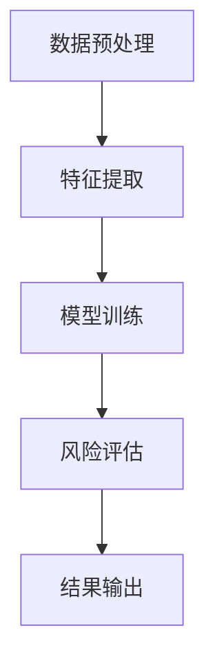
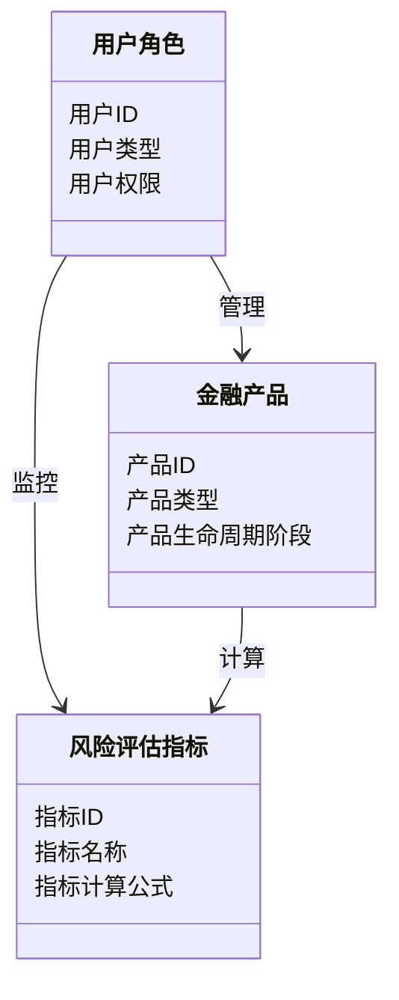
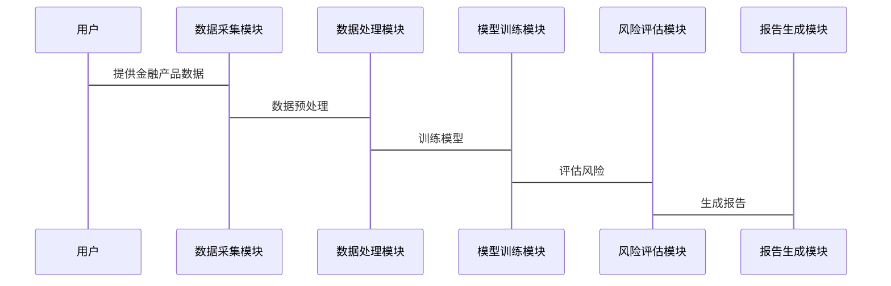

                 


# 开发智能化的金融产品生命周期风险评估平台

## 关键词：金融产品，生命周期，风险评估，智能化，机器学习，系统架构，项目实战

## 摘要：本文详细探讨了开发智能化金融产品生命周期风险评估平台的背景、核心概念、算法原理、系统架构和项目实战。通过分析当前金融产品风险管理的痛点，提出了基于机器学习和深度学习的智能化解决方案，并通过系统架构设计和实际案例分析，展示了平台的实现过程和应用价值。

---

# 第一部分: 背景与核心概念

## 第1章: 金融产品生命周期风险评估平台的背景与问题背景

### 1.1 问题背景

#### 1.1.1 金融产品生命周期管理的现状
金融产品生命周期管理是金融机构的核心业务之一，涉及产品的设计、发行、运营和终止等多个阶段。随着金融市场复杂性的增加，传统的手动风险评估方法已难以满足需求，效率低下、精度不足的问题日益突出。

#### 1.1.2 风险评估在金融产品中的重要性
风险评估是金融产品生命周期管理中的关键环节，直接关系到产品的市场表现和机构的稳健运营。准确的风险评估可以帮助机构规避潜在风险，优化产品设计，提升市场竞争力。

#### 1.1.3 当前风险评估中的痛点与挑战
- 数据量大：金融数据复杂且多样化，传统方法难以高效处理。
- 方法单一：依赖经验判断，缺乏数据驱动的精准评估。
- 实时性差：风险评估结果更新缓慢，难以应对市场的快速变化。

### 1.2 问题描述

#### 1.2.1 金融产品生命周期的定义与范围
金融产品生命周期包括产品设计、发行、监控、评估和终止五个阶段。每个阶段都需要进行风险评估，以确保产品合规性和市场适应性。

#### 1.2.2 风险评估的关键环节与流程
- 数据收集：整合产品、市场和用户数据。
- 数据处理：清洗、转换和特征提取。
- 模型训练：构建和优化风险评估模型。
- 结果输出：生成风险评估报告和预警信息。

#### 1.2.3 现有风险评估方法的局限性
- 传统方法依赖人工经验，主观性强。
- 数据处理效率低，难以实时响应。
- 缺乏智能化手段，难以应对复杂多变的市场环境。

### 1.3 问题解决思路

#### 1.3.1 智能化风险评估的核心思想
通过引入机器学习和深度学习技术，利用大数据分析能力，实现金融产品风险的智能化评估。

#### 1.3.2 数据驱动与模型驱动的结合
数据驱动方法通过分析历史数据发现规律，模型驱动方法基于领域知识构建评估模型，两者结合提高评估的准确性和可解释性。

#### 1.3.3 平台化解决方案的设计理念
构建一个集数据采集、处理、建模、评估和报告于一体的平台，实现金融产品生命周期管理的智能化和自动化。

### 1.4 平台的边界与外延

#### 1.4.1 平台的功能边界
- 数据采集与处理：整合产品、市场和用户数据。
- 模型训练与优化：构建和优化风险评估模型。
- 风险评估与报告：生成风险评估报告和预警信息。

#### 1.4.2 平台的用户群体与服务范围
- 用户群体：金融机构、投资机构、监管机构等。
- 服务范围：覆盖金融产品的全生命周期，提供实时风险评估和预警。

#### 1.4.3 平台与其他系统的交互关系
- 与金融产品管理系统对接，提供数据支持。
- 与市场数据平台对接，获取实时市场信息。
- 与监管系统对接，提供合规性报告。

### 1.5 核心概念与组成

#### 1.5.1 金融产品生命周期的核心要素
- 产品类型：包括股票、债券、基金等。
- 生命周期阶段：包括设计、发行、监控、评估和终止阶段。
- 关键风险指标：如波动率、信用风险、市场风险等。

#### 1.5.2 风险评估的关键指标与模型
- 关键指标：如VaR（在险值）、CVaR（条件在险值）等。
- 模型：如随机森林、神经网络等机器学习模型。

#### 1.5.3 平台架构的核心组件与功能模块
- 数据采集模块：负责数据的采集和预处理。
- 模型训练模块：负责模型的训练和优化。
- 风险评估模块：负责风险的计算和评估。
- 报告生成模块：生成风险评估报告和预警信息。

### 1.6 本章小结

---

## 第2章: 核心概念与联系

### 2.1 核心概念原理

#### 2.1.1 金融产品生命周期模型
金融产品生命周期模型描述了产品从设计到终止的全过程，包括产品设计、发行、监控、评估和终止阶段。

#### 2.1.2 风险评估的数学模型
风险评估的数学模型包括线性回归、逻辑回归、随机森林等机器学习模型，用于预测和评估产品的风险。

#### 2.1.3 平台智能化的核心算法
平台智能化的核心算法包括支持向量机（SVM）、神经网络（NN）、随机森林（RF）等，用于数据处理、特征提取和风险评估。

### 2.2 核心概念属性对比

#### 2.2.1 不同风险评估方法的对比分析
| 方法 | 优点 | 缺点 |
|------|------|------|
| 传统经验判断 | 易操作 | 主观性强 |
| 机器学习 | 高精度 | 需大量数据 |
| 深度学习 | 高准确性 | 计算资源消耗大 |

#### 2.2.2 各种模型的优缺点对比
| 模型 | 优点 | 缺点 |
|------|------|------|
| 线性回归 | 简单易懂 | 高维度数据表现差 |
| 随机森林 | 高精度 | 需大量计算资源 |
| 神经网络 | 强大学习能力 | 需大量数据和计算资源 |

#### 2.2.3 平台功能模块的性能对比
| 功能模块 | 优点 | 缺点 |
|------|------|------|
| 数据采集 | 实时性强 | 数据清洗复杂 |
| 模型训练 | 高精度 | 训练时间长 |
| 风险评估 | 实时性高 | 模型更新频繁 |

### 2.3 ER实体关系图

```mermaid
erDiagram
    actor 用户角色 {
        <属性> 用户ID
        <属性> 用户类型
        <属性> 用户权限
    }
    actor 金融产品 {
        <属性> 产品ID
        <属性> 产品类型
        <属性> 产品生命周期阶段
    }
    actor 风险评估指标 {
        <属性> 指标ID
        <属性> 指标名称
        <属性> 指标计算公式
    }
    用户角色 --> 金融产品 : 管理
    用户角色 --> 风险评估指标 : 监控
    金融产品 --> 风险评估指标 : 计算
```

### 2.4 本章小结

---

## 第3章: 算法原理讲解

### 3.1 算法原理概述

#### 3.1.1 机器学习在风险评估中的应用
机器学习在风险评估中的应用包括数据预处理、特征提取、模型训练和风险预测等环节。

#### 3.1.2 深度学习在金融产品生命周期中的作用
深度学习通过多层神经网络结构，能够捕捉复杂的非线性关系，提高风险评估的准确性。

#### 3.1.3 混合算法的优势与挑战
混合算法结合了机器学习和深度学习的优势，能够在复杂场景下提高评估效果，但需要更多的计算资源和数据支持。

### 3.2 算法流程图



### 3.3 算法实现代码

```python
import pandas as pd
import numpy as np
from sklearn.ensemble import RandomForestClassifier
from sklearn.metrics import accuracy_score

# 数据预处理
data = pd.read_csv('financial_data.csv')
X = data.drop('target', axis=1)
y = data['target']

# 特征提取
features = X.columns
target = y.columns

# 模型训练
model = RandomForestClassifier()
model.fit(X, y)

# 风险评估
predicted = model.predict(X)

# 结果输出
print('Accuracy:', accuracy_score(y, predicted))
```

### 3.4 数学模型与公式

#### 3.4.1 随机森林模型
随机森林模型是一种基于决策树的集成学习方法，通过构建多个决策树并进行投票或平均，提高模型的准确性和鲁棒性。

#### 3.4.2 神经网络模型
神经网络模型通过多层感知机（MLP）结构，能够捕捉数据中的非线性关系，适用于复杂的金融风险评估场景。

#### 3.4.3 线性回归模型
线性回归模型用于预测连续型变量，适用于风险评估中的某些特定场景。

### 3.5 本章小结

---

# 第二部分: 系统分析与架构设计

## 第4章: 系统分析与架构设计

### 4.1 问题场景介绍
金融产品生命周期风险评估平台需要处理大量的金融数据，实时进行风险评估和预警，支持多种用户角色的操作。

### 4.2 系统功能设计

#### 4.2.1 领域模型类图



### 4.3 系统架构设计

#### 4.3.1 系统架构图


#### 4.3.2 接口设计
- 数据采集模块：提供API接口，接收金融产品数据。
- 模型训练模块：提供API接口，接收数据并训练模型。
- 风险评估模块：提供API接口，接收模型并评估风险。

#### 4.3.3 交互流程图



### 4.4 本章小结

---

# 第三部分: 项目实战

## 第5章: 项目实战

### 5.1 环境安装

#### 5.1.1 系统需求
- 操作系统：Linux/Windows/MacOS
- Python版本：3.6及以上
- 额外软件：Jupyter Notebook、Git、IDE（PyCharm、VS Code等）

#### 5.1.2 依赖安装
```bash
pip install pandas numpy scikit-learn matplotlib
```

### 5.2 核心代码实现

#### 5.2.1 数据预处理代码

```python
import pandas as pd
import numpy as np

data = pd.read_csv('financial_data.csv')
data = data.dropna()
data = (data - data.min()) / (data.max() - data.min())
```

#### 5.2.2 特征提取代码

```python
from sklearn.feature_selection import SelectKBest, chi2

selector = SelectKBest(score_func=chi2, k=10)
selector.fit_transform(data.drop('target', axis=1), data['target'])
```

#### 5.2.3 模型训练代码

```python
from sklearn.ensemble import RandomForestClassifier

model = RandomForestClassifier(n_estimators=100, max_depth=10, random_state=42)
model.fit(X_train, y_train)
```

#### 5.2.4 风险评估代码

```python
from sklearn.metrics import accuracy_score, confusion_matrix

y_pred = model.predict(X_test)
print('Accuracy:', accuracy_score(y_test, y_pred))
print('Confusion Matrix:', confusion_matrix(y_test, y_pred))
```

#### 5.2.5 报告生成代码

```python
import matplotlib.pyplot as plt

plt.figure(figsize=(10,6))
plt.plot(time_series, label='Predicted Values')
plt.xlabel('Time')
plt.ylabel('Value')
plt.legend()
plt.show()
```

### 5.3 代码解读与分析

#### 5.3.1 数据预处理代码解读
- 使用pandas读取数据。
- 删除缺失值。
- 标准化数据。

#### 5.3.2 特征提取代码解读
- 使用SelectKBest选择最佳特征。
- 使用卡方检验作为评分函数。

#### 5.3.3 模型训练代码解读
- 使用随机森林分类器训练模型。
- 设置树的数量为100，最大深度为10。

#### 5.3.4 风险评估代码解读
- 使用训练好的模型进行预测。
- 计算准确率和混淆矩阵。

#### 5.3.5 报告生成代码解读
- 绘制时间序列图。
- 可视化预测结果。

### 5.4 实际案例分析

#### 5.4.1 数据准备
使用真实金融产品的历史数据，包括产品类型、市场表现、用户反馈等。

#### 5.4.2 模型训练
训练随机森林分类器，评估模型的准确性和召回率。

#### 5.4.3 案例分析
分析某个金融产品的风险评估结果，生成风险报告和预警信息。

### 5.5 项目小结

---

## 第6章: 总结与展望

### 6.1 平台总结
金融产品生命周期风险评估平台通过智能化手段，提高了风险评估的效率和准确性，为金融机构提供了有力支持。

### 6.2 未来展望
未来，平台可以进一步优化模型，引入更多的数据源，提升实时性和可扩展性。同时，探索与其他金融系统的集成，提供更全面的服务。

### 6.3 最佳实践 Tips
- 数据预处理是关键，确保数据的完整性和准确性。
- 选择合适的模型，结合数据特征和业务需求。
- 定期更新模型，适应市场的变化。
- 注意模型的可解释性，便于业务人员理解和使用。

### 6.4 小结
通过本文的详细讲解，读者可以了解开发智能化金融产品生命周期风险评估平台的背景、核心概念、算法原理、系统架构和项目实战。希望本文能为相关领域的研究和实践提供有价值的参考。

---

## 作者：AI天才研究院/AI Genius Institute & 禅与计算机程序设计艺术 /Zen And The Art of Computer Programming

---

以上是《开发智能化的金融产品生命周期风险评估平台》的技术博客文章的详细大纲和内容，涵盖了从背景分析到项目实战的各个方面。文章通过清晰的结构和详细的解释，帮助读者理解如何开发和应用智能化的金融产品生命周期风险评估平台。

