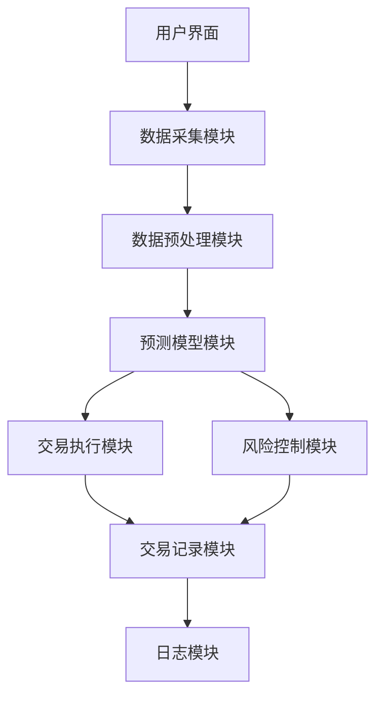
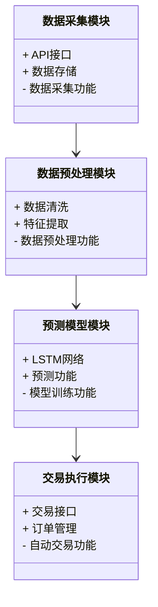

                 


# 智能加密货币投资组合管理

> 关键词：智能加密货币投资、投资组合管理、人工智能、机器学习、区块链技术

> 摘要：本文探讨了如何利用人工智能和现代投资组合理论来优化加密货币投资组合管理。文章从加密货币的基本概念出发，详细分析了智能投资组合管理的核心原理，包括机器学习算法、数学模型和系统架构设计，并通过实际案例展示了如何构建一个智能加密货币投资系统。最后，本文总结了智能投资组合管理的优势和未来发展方向。

---

# 第1章: 加密货币投资组合管理的背景与意义

## 1.1 加密货币的起源与发展

### 1.1.1 加密货币的起源
加密货币的概念可以追溯到20世纪80年代，但比特币的出现标志着加密货币的真正崛起。比特币于2008年由中本聪提出，2009年正式上线，开创了区块链技术的先河。

### 1.1.2 加密货币的核心技术
区块链技术是加密货币的核心，它通过去中心化、不可篡改和透明性等特点，确保了加密货币的安全性和可信度。

### 1.1.3 加密货币的市场现状
截至2023年，加密货币市场市值已超过数万亿美元，比特币、以太坊等主流币种占据了大部分市场份额。然而，加密货币市场的波动性极强，价格受多种因素影响，包括政策、市场情绪和技术发展。

## 1.2 投资组合管理的基本概念

### 1.2.1 投资组合的定义
投资组合是指将资金分配到不同资产（如股票、债券、加密货币等）上的策略，以实现风险与收益的最优平衡。

### 1.2.2 投资组合管理的目标
投资组合管理的目标包括最大化收益、最小化风险、优化资产配置以及及时调整投资策略。

### 1.2.3 投资组合管理的重要性
在传统金融领域，投资组合管理已是一项成熟的技术，但在加密货币市场中，由于其高波动性和复杂性，传统的投资组合管理方法往往显得力不从心。

## 1.3 智能加密货币投资组合管理的背景

### 1.3.1 加密货币市场的波动性
加密货币市场的价格波动远高于传统金融市场，这使得手动投资决策难以应对市场的快速变化。

### 1.3.2 传统投资组合管理的局限性
传统投资组合管理方法依赖于历史数据和统计分析，难以实时捕捉市场动态，尤其在面对加密货币市场的高频交易和复杂因素时显得不足。

### 1.3.3 智能技术在投资组合管理中的应用
人工智能和机器学习技术的快速发展，为加密货币投资组合管理提供了新的可能性。通过实时数据处理、模式识别和预测分析，智能系统能够快速调整投资策略，优化资产配置。

## 1.4 本章小结
本章介绍了加密货币的起源与发展，阐述了投资组合管理的基本概念，并指出了智能技术在加密货币投资组合管理中的重要性。

---

# 第2章: 智能加密货币投资组合管理的核心原理

## 2.1 智能投资组合管理的定义

### 2.1.1 智能投资组合管理的内涵
智能投资组合管理是指利用人工智能技术，通过实时数据处理、预测分析和自动化决策，优化加密货币的投资组合。

### 2.1.2 智能投资组合管理的特点
- **实时性**：能够实时捕捉市场动态，快速调整投资策略。
- **智能化**：通过机器学习算法，实现对市场趋势的自动识别和预测。
- **自动化**：系统能够自动执行交易决策，减少人为干扰。

## 2.2 人工智能在加密货币投资中的应用

### 2.2.1 机器学习在加密货币预测中的作用
机器学习算法（如随机森林、支持向量机）可以用于预测加密货币价格走势，识别市场趋势。

### 2.2.2 自然语言处理在加密货币新闻分析中的应用
通过自然语言处理技术，系统可以自动分析新闻、社交媒体等文本数据，识别市场情绪，从而辅助投资决策。

### 2.2.3 神经网络在加密货币交易决策中的应用
深度学习模型（如LSTM）可以用于时间序列分析，预测加密货币价格波动，优化交易策略。

## 2.3 现代投资组合理论与智能优化

### 2.3.1 现代投资组合理论的基本原理
现代投资组合理论（MPT）通过分散投资降低风险，同时最大化收益。其核心公式包括期望收益和方差的计算。

$$E(r_p) = \sum_{i=1}^{n} w_i E(r_i)$$
$$Var(r_p) = \sum_{i=1}^{n} \sum_{j=1}^{n} w_i w_j Cov(r_i, r_j)$$

### 2.3.2 智能优化算法在投资组合管理中的应用
智能优化算法（如遗传算法、粒子群优化）可以用于求解投资组合的最优配置，满足收益和风险的双重目标。

### 2.3.3 风险与收益的平衡
智能投资组合管理的核心在于在高波动性市场中找到收益与风险的最佳平衡点。

## 2.4 本章小结
本章详细介绍了智能投资组合管理的定义、人工智能在加密货币投资中的应用，以及现代投资组合理论与智能优化的结合。

---

# 第3章: 智能加密货币投资组合管理的算法与数学模型

## 3.1 现代投资组合理论与数学模型

### 3.1.1 均值-方差优化模型
均值-方差优化模型是现代投资组合理论的核心，用于求解投资组合的最优配置。

$$\text{目标函数：} \min \sum_{i=1}^{n} \sum_{j=1}^{n} w_i w_j Cov(r_i, r_j)$$
$$\text{约束条件：} \sum_{i=1}^{n} w_i = 1, w_i \geq 0$$

### 3.1.2 均值-方差优化的步骤
1. **数据收集**：获取加密货币的历史价格数据。
2. **计算期望收益和协方差矩阵**：基于历史数据计算各资产的期望收益和协方差。
3. **求解优化问题**：使用优化算法求解最优权重配置。
4. **风险调整**：根据市场变化动态调整投资组合。

### 3.1.3 示例：比特币与以太坊的投资组合优化
假设我们有比特币（BTC）和以太坊（ETH）两种资产，历史数据如下：

| 资产 | 期望收益 | 方差 | 协方差 |
|------|----------|------|--------|
| BTC  | 0.015    | 0.0016 | 0.0005 |
| ETH  | 0.012    | 0.0025 | 0.0008 |

根据均值-方差优化模型，最优权重配置为：

$$w_{BTC} = \frac{Var(ETH)}{Var(BTC) + Var(ETH) - Cov(BTC, ETH)}$$
$$w_{ETH} = 1 - w_{BTC}$$

通过计算可以得到最优权重配置，从而实现投资组合的最小风险或最大收益。

## 3.2 机器学习算法在加密货币投资中的应用

### 3.2.1 预测模型的构建
使用LSTM神经网络预测加密货币价格走势：

1. **数据预处理**：将历史价格数据进行标准化处理。
2. **构建LSTM模型**：
   ```python
   model = Sequential()
   model.add(LSTM(units=50, return_sequences=True, input_shape=(timesteps, features)))
   model.add(Dense(1))
   model.compile(optimizer='adam', loss='mean_squared_error')
   ```
3. **训练模型**：使用历史数据训练模型，调整超参数以优化预测精度。
4. **预测与回测**：使用训练好的模型预测未来价格，并进行回测验证策略的有效性。

### 3.2.2 交易策略的优化
通过机器学习模型生成交易信号（如买入、卖出），并结合动量策略或均值回归策略优化交易频率和仓位大小。

## 3.3 系统架构设计

### 3.3.1 系统功能模块
1. **数据采集模块**：实时获取加密货币市场数据。
2. **数据预处理模块**：清洗和转换数据，提取特征。
3. **预测模型模块**：运行机器学习模型生成预测信号。
4. **交易执行模块**：根据预测信号自动执行交易指令。
5. **风险控制模块**：实时监控市场风险，动态调整投资组合。

### 3.3.2 系统架构图


## 3.4 本章小结
本章详细介绍了现代投资组合理论中的数学模型，以及机器学习算法在加密货币投资中的具体应用，并展示了系统的架构设计。

---

# 第4章: 智能加密货币投资组合管理的系统设计与实现

## 4.1 系统分析与设计

### 4.1.1 项目介绍
本项目旨在构建一个智能加密货币投资系统，通过实时数据处理和机器学习算法优化投资组合管理。

### 4.1.2 系统功能设计
1. **数据采集**：支持多种加密货币的数据采集，包括比特币、以太坊等。
2. **数据预处理**：清洗和标准化数据，提取特征。
3. **模型训练**：训练机器学习模型，生成交易信号。
4. **交易执行**：根据预测信号自动执行交易指令。
5. **风险控制**：实时监控市场风险，动态调整投资组合。

### 4.1.3 系统架构设计


## 4.2 项目实战：智能加密货币投资系统实现

### 4.2.1 环境安装
安装必要的库：
```bash
pip install numpy pandas keras tensorflow matplotlib
```

### 4.2.2 数据获取与清洗
从CoinMarketCap API获取比特币和以太坊的历史数据：
```python
import requests
import pandas as pd

url = "https://api.coinmarketcap.com/v2/historical/"
params = {'symbol': 'BTC,ETH', 'start_date': '2022-01-01', 'end_date': '2023-01-01'}

response = requests.get(url, params=params)
data = response.json()
df = pd.DataFrame(data['data'])
```

### 4.2.3 模型训练与预测
构建LSTM模型并进行训练：
```python
from tensorflow.keras.models import Sequential
from tensorflow.keras.layers import LSTM, Dense

model = Sequential()
model.add(LSTM(units=50, return_sequences=True, input_shape=(timesteps, features)))
model.add(Dense(1))
model.compile(optimizer='adam', loss='mean_squared_error')

model.fit(X_train, y_train, epochs=50, batch_size=32)
```

### 4.2.4 交易策略与回测
编写交易策略并进行回测：
```python
def backtest(predicted_prices, actual_prices):
    profit = 0
    for i in range(1, len(predicted_prices)):
        if predicted_prices[i] > predicted_prices[i-1]:
            # 买入并持有
            profit += actual_prices[i] - actual_prices[i-1]
    return profit

profit = backtest(predicted_prices, actual_prices)
print("总收益:", profit)
```

## 4.3 本章小结
本章通过实际案例展示了智能加密货币投资系统的实现过程，包括环境安装、数据获取、模型训练和交易策略的制定。

---

# 第5章: 智能加密货币投资组合管理的最佳实践与注意事项

## 5.1 最佳实践

### 5.1.1 数据质量的重要性
确保数据的准确性和及时性，选择可靠的API源。

### 5.1.2 模型的实时性
加密货币市场变化迅速，模型需要实时更新以适应市场变化。

### 5.1.3 风险控制
设置止损和止盈机制，避免过度杠杆和集中投资。

## 5.2 注意事项

### 5.2.1 数据偏差
避免过度依赖历史数据，考虑市场外部因素的影响。

### 5.2.2 模型过拟合
在训练过程中防止模型过拟合，保持模型的泛化能力。

### 5.2.3 法律合规
确保投资行为符合当地法律法规，避免法律风险。

## 5.3 未来发展方向

### 5.3.1 多模态数据融合
结合文本、图像等多种数据源，提升预测的准确性。

### 5.3.2 自适应算法优化
开发自适应算法，动态调整投资策略。

### 5.3.3 去中心化金融（DeFi）的结合
探索智能投资组合管理在DeFi中的应用，实现更加自动化的金融管理。

## 5.4 本章小结
本章总结了智能加密货币投资组合管理的最佳实践，指出了实际操作中的注意事项，并展望了未来的发展方向。

---

# 作者：AI天才研究院/AI Genius Institute & 禅与计算机程序设计艺术 /Zen And The Art of Computer Programming

---

本文通过系统化的分析和实践，展示了如何利用人工智能技术优化加密货币投资组合管理。从理论到实践，从算法到系统设计，本文为读者提供了全面的指导和深刻的见解。希望本文能为加密货币投资者和研究人员提供有价值的参考。

