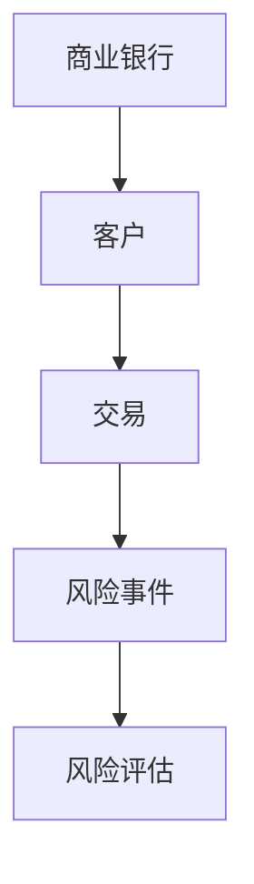
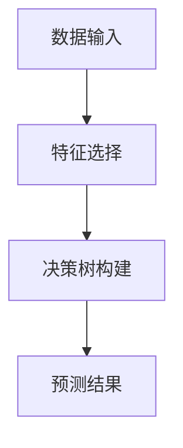
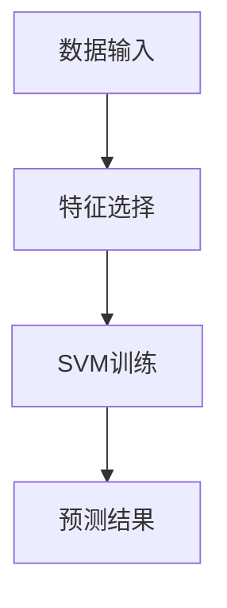
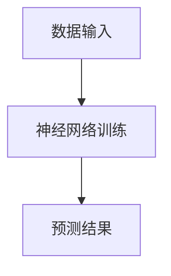
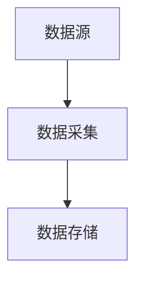
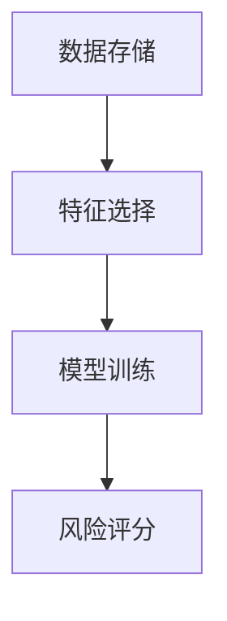
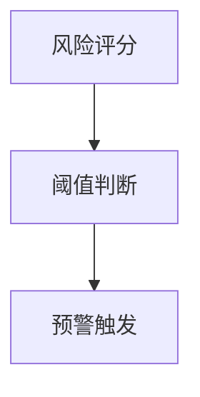
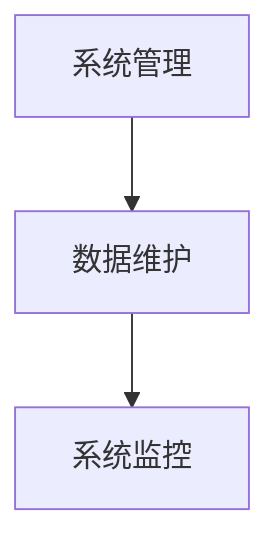
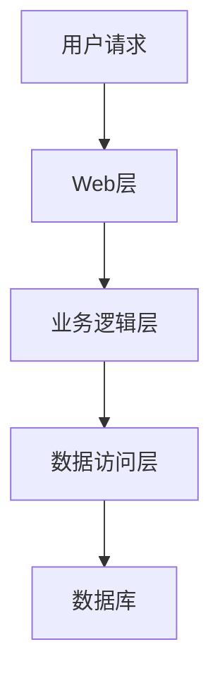
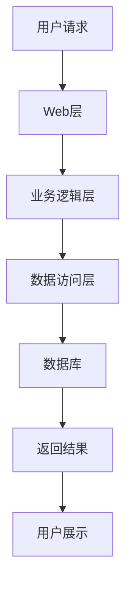

                 


# 智能商业银行风险管理系统

> 关键词：智能商业银行，风险管理，机器学习，系统架构，项目实战

> 摘要：本文深入探讨智能商业银行风险管理系统的构建与应用，分析其在商业银行中的重要性，结合实际案例，详细讲解系统设计、算法实现、系统架构以及项目实战，为商业银行风险管理提供新的思路和解决方案。

---

# 第1章: 智能商业银行风险管理的背景与挑战

## 1.1 商业银行风险管理的现状与挑战

### 1.1.1 商业银行风险管理的现状

商业银行作为金融体系的核心机构，承担着重要的资金流动和风险控制职责。传统风险管理主要依赖人工审核和简单的统计模型，存在效率低、覆盖面窄、响应慢等问题。随着金融市场的复杂化和客户需求的多样化，传统方法已难以应对日益复杂的金融风险。

### 1.1.2 智能化风险管理的必要性

智能化风险管理能够通过大数据分析和人工智能技术，实时监控和预测潜在风险，提升风险控制的准确性和效率。智能化系统能够处理海量数据，发现隐藏在数据中的风险信号，帮助银行在风险发生前采取预防措施。

### 1.1.3 当前风险管理的主要问题与痛点

- 数据孤岛：不同部门和系统之间的数据难以整合，影响风险评估的全面性。
- 响应延迟：传统方法依赖人工审核，导致风险识别和应对存在时间差。
- 模型单一：传统统计模型难以捕捉复杂的风险特征，预测精度有限。

---

## 1.2 智能商业银行的概念与特点

### 1.2.1 智能商业银行的定义

智能商业银行是指利用人工智能、大数据、区块链等先进技术，实现业务流程智能化、服务个性化、风险管理精准化的现代商业银行。

### 1.2.2 智能商业银行的核心特征

- **智能化**：通过AI技术实现自动化决策和智能推荐。
- **数据驱动**：基于海量数据进行精准分析和预测。
- **实时性**：能够实时监控和响应金融市场变化。
- **个性化**：为客户提供定制化的金融服务。

### 1.2.3 智能商业银行与传统商业银行的对比

| 特性                | 智能商业银行                  | 传统商业银行                |
|---------------------|-----------------------------|-----------------------------|
| 风险管理方式        | 基于AI和大数据的实时分析     | 依赖人工审核和简单统计模型  |
| 服务效率            | 高效、自动化                 | 低效、依赖人工               |
| 客户体验            | 个性化、智能化               | 标准化、流程化               |

---

## 1.3 智能商业银行风险管理系统的必要性

### 1.3.1 风险管理在商业银行中的重要性

风险管理是商业银行的核心竞争力之一。有效的风险管理能够降低银行的损失，提升客户信任度，增强银行的市场竞争力。

### 1.3.2 智能化风险管理的优势

- **高效性**：AI算法能够快速处理大量数据，实时识别潜在风险。
- **精准性**：通过机器学习模型，能够更准确地预测和评估风险。
- **适应性**：系统能够根据市场变化动态调整风险管理策略。

### 1.3.3 系统化风险管理的必要性

通过系统化管理，能够实现风险的全面覆盖，避免人工管理中的疏漏，提升风险管理的可靠性和稳定性。

---

## 1.4 本章小结

本章主要介绍了智能商业银行风险管理的背景与挑战，探讨了智能化风险管理的必要性及其在商业银行中的重要性。通过对比分析，明确了智能商业银行的核心特征和优势，为后续章节的深入探讨奠定了基础。

---

# 第2章: 智能商业银行风险管理系统的概念与核心要素

## 2.1 智能商业银行风险管理系统的定义

智能商业银行风险管理系统是一种基于人工智能和大数据技术的智能化管理系统，能够实时监控和评估银行的各类风险，包括信用风险、市场风险、操作风险等。

---

## 2.2 系统的核心要素与组成

### 2.2.1 数据采集模块

数据采集模块负责从银行内部和外部获取相关数据，包括客户信息、交易记录、市场数据等。

### 2.2.2 风险评估模块

风险评估模块通过机器学习算法对数据进行分析，评估潜在风险并生成风险评分。

### 2.2.3 风险预警模块

风险预警模块根据风险评估结果，触发预警机制，通知相关业务部门采取应对措施。

### 2.2.4 系统管理模块

系统管理模块负责系统的日常维护、数据存储和安全防护。

---

## 2.3 系统的核心概念与联系

### 2.3.1 ER实体关系图



### 2.3.2 核心概念属性对比表

| 概念 | 属性 | 描述 |
|------|------|------|
| 客户 | ID | 唯一标识符 |
| 交易 | 时间 | 交易发生的时间 |
| 风险事件 | 类型 | 风险事件的类型（如信用风险、市场风险） |
| 风险评估 | 评分 | 风险评估的评分结果 |

---

## 2.4 本章小结

本章详细介绍了智能商业银行风险管理系统的定义、核心要素及其组成，并通过ER实体关系图和属性对比表，展示了系统各部分之间的关系和联系。这为后续章节的算法实现和系统设计奠定了基础。

---

# 第3章: 智能商业银行风险管理系统的算法实现

## 3.1 传统机器学习算法

### 3.1.1 随机森林

随机森林是一种基于决策树的集成学习算法，通过构建多棵决策树并对结果进行投票或平均，能够有效降低模型过拟合的风险。



#### 代码实现

```python
from sklearn.ensemble import RandomForestClassifier
import pandas as pd

# 加载数据
data = pd.read_csv('data.csv')

# 特征选择
features = data[['age', 'income', 'credit_score']]
target = data['risk_score']

# 模型训练
model = RandomForestClassifier()
model.fit(features, target)

# 预测
new_data = pd.DataFrame({'age': 30, 'income': 60000, 'credit_score': 700}, index=[0])
prediction = model.predict(new_data)
print('预测结果:', prediction)
```

---

## 3.2 支持向量机（SVM）

支持向量机是一种监督学习算法，适用于分类和回归问题。通过构建超平面，能够有效区分不同类别的数据。



#### 代码实现

```python
from sklearn import svm

# 加载数据
data = pd.read_csv('data.csv')

# 特征选择
features = data[['age', 'income', 'credit_score']]
target = data['risk_score']

# 模型训练
model = svm.SVC()
model.fit(features, target)

# 预测
new_data = pd.DataFrame({'age': 30, 'income': 60000, 'credit_score': 700}, index=[0])
prediction = model.predict(new_data)
print('预测结果:', prediction)
```

---

## 3.3 神经网络

神经网络是一种模仿人脑结构和功能的机器学习算法，适用于处理复杂的非线性关系。



#### 神经网络数学模型

神经网络的核心在于其损失函数和优化函数：

$$ \text{损失函数} = \sum_{i=1}^{n} (y_i - \hat{y_i})^2 $$

$$ \text{优化函数} = \text{Adam优化器} $$

---

## 3.4 本章小结

本章详细介绍了智能商业银行风险管理系统的算法实现，包括随机森林、支持向量机和神经网络三种算法，并通过代码示例和数学公式，展示了算法的核心原理和实现步骤。

---

# 第4章: 智能商业银行风险管理系统的系统架构设计

## 4.1 系统功能设计

系统功能设计包括数据采集、风险评估、风险预警和系统管理四大模块。

### 4.1.1 数据采集模块



### 4.1.2 风险评估模块



### 4.1.3 风险预警模块



### 4.1.4 系统管理模块



---

## 4.2 系统架构设计

### 4.2.1 系统架构图



---

## 4.3 系统接口设计

系统接口设计包括API接口和数据库接口，确保系统各部分之间的高效交互。

---

## 4.4 系统交互设计

### 4.4.1 交互流程图



---

## 4.5 本章小结

本章详细介绍了智能商业银行风险管理系统的系统架构设计，包括功能模块、系统架构、接口设计和系统交互设计，为后续章节的项目实战奠定了基础。

---

# 第5章: 智能商业银行风险管理系统的项目实战

## 5.1 项目背景与目标

项目目标是开发一个智能商业银行贷款风险管理系统，通过机器学习算法实现客户贷款风险评估和预警。

---

## 5.2 环境安装与配置

- **Python版本**：Python 3.8及以上
- **依赖库安装**：scikit-learn、pandas、numpy

```bash
pip install scikit-learn pandas numpy
```

---

## 5.3 系统核心实现

### 5.3.1 数据预处理

```python
import pandas as pd

# 加载数据
data = pd.read_csv('loan_data.csv')

# 数据清洗
data.dropna(inplace=True)
```

### 5.3.2 模型训练与评估

```python
from sklearn.model_selection import train_test_split
from sklearn.metrics import accuracy_score

# 数据分割
X_train, X_test, y_train, y_test = train_test_split(data.drop('risk_score', axis=1), data['risk_score'], test_size=0.2)

# 模型训练
model = RandomForestClassifier()
model.fit(X_train, y_train)

# 模型评估
prediction = model.predict(X_test)
print('准确率:', accuracy_score(y_test, prediction))
```

---

## 5.4 实际案例分析

通过实际案例分析，验证系统的风险评估和预警功能，确保系统在实际应用中的有效性和准确性。

---

## 5.5 项目总结与优化建议

项目总结包括系统实现的效果、存在的问题和优化方向。优化建议包括进一步优化算法、提升系统的实时性和扩展性。

---

## 5.6 本章小结

本章通过项目实战，详细介绍了智能商业银行风险管理系统的环境配置、核心实现、案例分析和项目总结，为读者提供了实际操作的经验和参考。

---

# 第6章: 智能商业银行风险管理系统的总结与展望

## 6.1 本章总结

本文详细探讨了智能商业银行风险管理系统的构建与应用，分析了其在商业银行中的重要性，并通过实际案例展示了系统的实现和应用效果。

---

## 6.2 应用价值与实际意义

智能商业银行风险管理系统的应用能够显著提升银行的风险控制能力，降低风险损失，增强客户信任度，为银行的稳健发展提供有力支持。

---

## 6.3 未来展望

未来，随着人工智能和大数据技术的不断发展，智能商业银行风险管理系统将更加智能化、自动化和精准化，为商业银行的风险管理带来更大的变革和创新。

---

## 6.4 本章小结

本章总结了本文的主要内容，并展望了智能商业银行风险管理系统的未来发展方向，为读者提供了进一步研究和实践的方向。

---

# 作者：AI天才研究院/AI Genius Institute & 禅与计算机程序设计艺术 /Zen And The Art of Computer Programming

