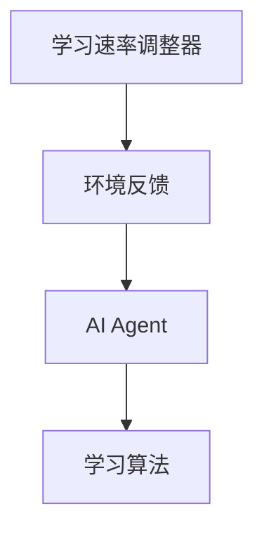
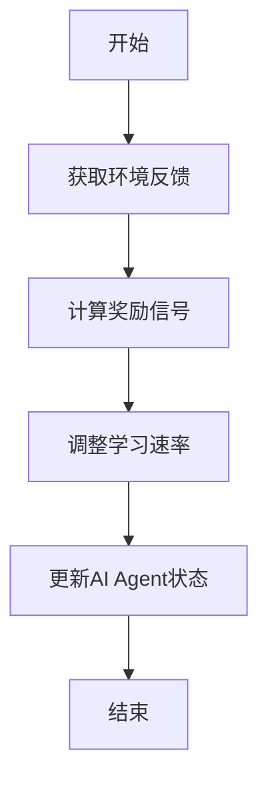
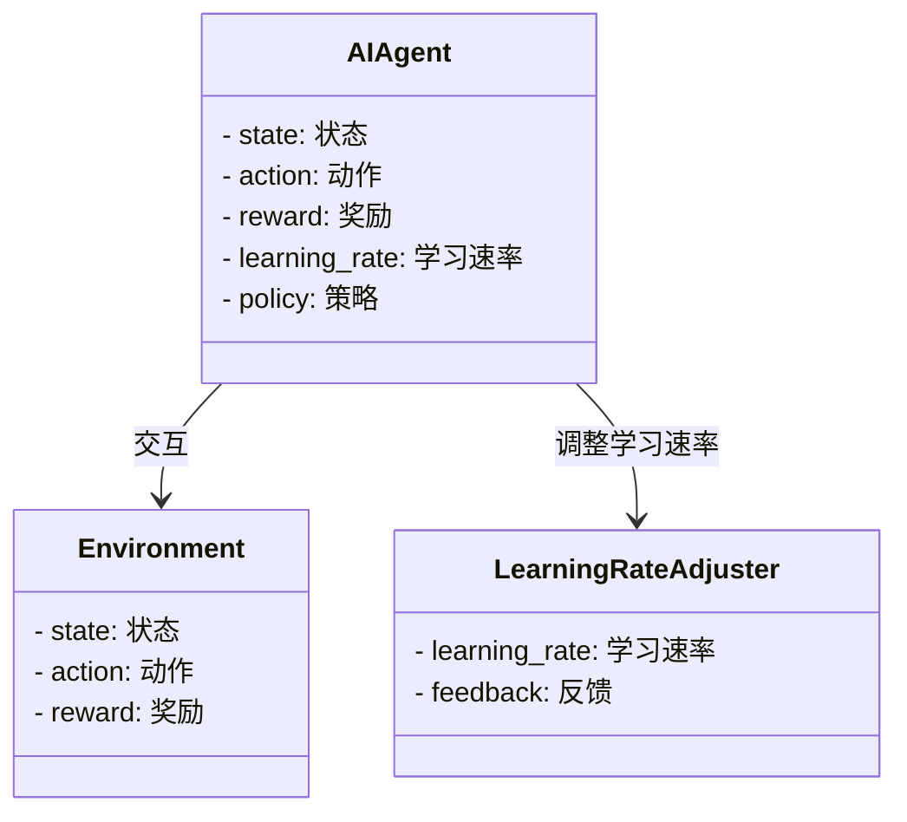
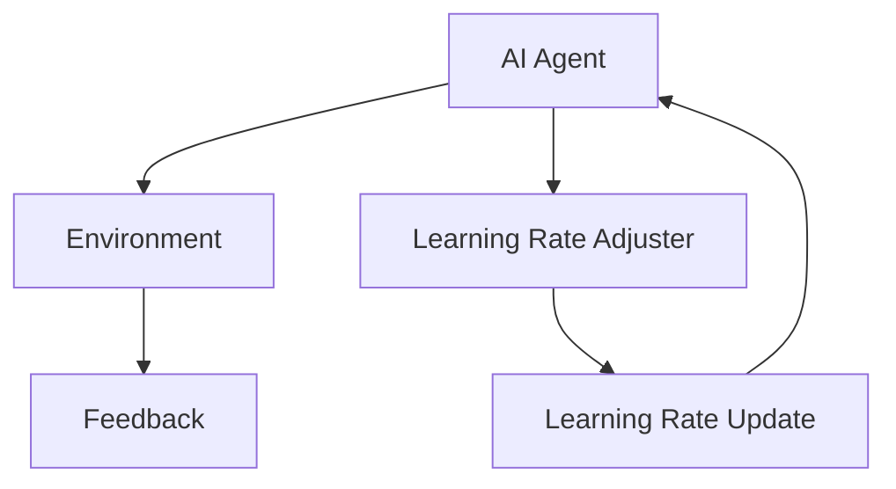
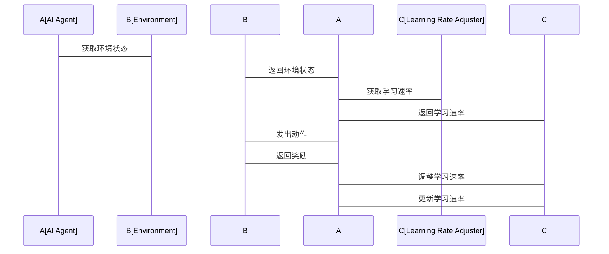

                 


# 构建具有自适应学习速率的AI Agent

## 关键词：自适应学习速率、AI Agent、强化学习、动态系统、机器学习

## 摘要：  
本文详细探讨了构建具有自适应学习速率的AI Agent的理论基础、算法设计和实际应用。通过分析自适应学习速率的核心概念、对比传统学习算法，结合Q-learning算法的改进，提供了一套实现自适应学习速率AI Agent的完整方案，包括系统架构设计和项目实战案例，帮助读者深入了解和实践。

---

# 第一部分: 自适应学习速率AI Agent概述

## 第1章: 背景与概念

### 1.1 问题背景与挑战

#### 1.1.1 AI Agent的基本概念  
AI Agent（智能体）是指能够感知环境、做出决策并采取行动的智能系统。它可以自主学习、适应环境变化，并通过与环境交互来优化自身的性能。  

#### 1.1.2 自适应学习速率的核心问题  
在传统的机器学习和强化学习中，学习速率通常是固定的，这可能导致收敛速度慢或震荡等问题。自适应学习速率的核心问题在于如何根据环境反馈动态调整学习速率，以加快收敛速度并提高决策的准确性。  

#### 1.1.3 自适应学习速率的必要性  
在动态和复杂的环境中，固定的学习速率难以适应环境的变化。自适应学习速率可以根据环境反馈动态调整，使得AI Agent能够更快地适应环境变化，提高学习效率和决策质量。  

### 1.2 自适应学习速率AI Agent的定义与特点

#### 1.2.1 自适应学习速率的定义  
自适应学习速率AI Agent是一种能够根据环境反馈动态调整学习速率的智能体。它通过感知环境变化和反馈信息，实时调整学习策略，以实现更快的收敛和更优的决策。  

#### 1.2.2 自适应学习速率与传统学习速率的区别  
传统学习速率是固定的，而自适应学习速率可以根据环境反馈动态调整。自适应学习速率能够根据当前的学习情况和环境变化，选择合适的学习步长，从而提高学习效率和决策质量。  

#### 1.2.3 自适应学习速率的优势与应用场景  
自适应学习速率的优势在于能够快速适应环境变化，提高学习效率和决策质量。其应用场景包括机器人控制、游戏AI、金融交易等领域，特别是在需要快速响应和动态调整的场景中表现尤为突出。  

### 1.3 自适应学习速率AI Agent的核心要素

#### 1.3.1 学习速率动态调整机制  
自适应学习速率AI Agent需要一个动态调整机制，根据环境反馈和学习情况调整学习速率。  

#### 1.3.2 环境反馈的捕捉与处理  
AI Agent需要能够感知环境反馈，并将其作为调整学习速率的依据。  

#### 1.3.3 自适应算法的设计与实现  
自适应算法是实现自适应学习速率的核心，需要设计能够动态调整学习速率的算法。  

---

## 第2章: 核心概念与联系

### 2.1 自适应学习速率的核心原理

#### 2.1.1 动态调整学习速率的数学模型  
自适应学习速率可以通过数学模型动态调整。例如，可以根据误差信号或奖励信号调整学习速率。  

#### 2.1.2 自适应学习速率与强化学习的关系  
自适应学习速率是强化学习中的一个重要优化方向。通过动态调整学习速率，强化学习算法可以更快地收敛到最优策略。  

#### 2.1.3 自适应学习速率与反馈机制的结合  
自适应学习速率需要结合环境反馈机制，根据反馈信息动态调整学习速率。  

### 2.2 核心概念对比分析

#### 2.2.1 不同学习速率调整策略的对比  
以下是不同学习速率调整策略的对比：

| 策略名称         | 描述                                                                 |
|------------------|----------------------------------------------------------------------|
| 固定学习速率     | 学习速率保持不变，适用于简单环境。                                         |
| 线性递减学习速率   | 学习速率随时间线性递减，适用于需要逐步降低学习步长的场景。                   |
| 指数递减学习速率   | 学习速率按指数形式递减，适用于需要快速降低学习步长的场景。                   |
| 自适应学习速率   | 根据环境反馈动态调整学习速率，适用于复杂和动态变化的环境。                   |

#### 2.2.2 自适应学习速率与固定学习速率的优劣分析  
自适应学习速率的优势在于能够快速适应环境变化，提高学习效率；其劣势在于实现复杂，需要额外的设计和计算。固定学习速率的优势在于实现简单，劣势在于在复杂环境中可能收敛速度慢。  

#### 2.2.3 自适应学习速率与其他优化算法的联系  
自适应学习速率与Adam优化器等自适应优化算法有相似之处，但自适应学习速率更注重动态调整学习速率以适应环境变化。  

### 2.3 ER实体关系图与Mermaid流程图

#### 2.3.1 实体关系图（ER图）



#### 2.3.2 算法流程图



---

## 第3章: 算法原理

### 3.1 自适应学习速率的核心算法

#### 3.1.1 Q-learning算法的改进  
传统的Q-learning算法使用固定的学习速率，改进后的算法可以根据环境反馈动态调整学习速率。  

#### 3.1.2 自适应学习速率的数学模型  
自适应学习速率的数学模型如下：

$$ \alpha(t) = \alpha_{\text{base}} \times \frac{1}{1 + \beta \times t} $$  

其中，$\alpha_{\text{base}}$ 是基础学习速率，$\beta$ 是调节参数，$t$ 是时间步。  

#### 3.1.3 动态调整学习速率的实现步骤  
1. 初始化学习速率 $\alpha_0$。  
2. 在每一步中，根据环境反馈计算奖励信号 $r_t$。  
3. 根据奖励信号调整学习速率：  
   $$ \alpha(t+1) = \alpha(t) + \gamma \times (r_t - \alpha(t)) $$  
   其中，$\gamma$ 是调整系数。  

#### 3.1.4 代码实现示例  

```python
def adaptive_learning_rate(q, r, gamma=0.1):
    alpha = 0.1  # 初始学习速率
    for i in range(len(q)):
        alpha += gamma * (r[i] - alpha)
        q[i] += alpha * (r[i] - q[i])
    return q
```

### 3.2 算法实现细节与优化

#### 3.2.1 动态调整学习速率的具体实现  
动态调整学习速率可以根据奖励信号或误差信号调整学习速率。例如，当奖励信号较大时，增加学习速率；当奖励信号较小时，减小学习速率。  

#### 3.2.2 算法收敛性分析  
自适应学习速率算法的收敛性取决于调整系数 $\gamma$ 和学习速率的动态变化。合理选择 $\gamma$ 和初始学习速率可以保证算法的收敛性。  

#### 3.2.3 算法复杂度分析  
自适应学习速率算法的时间复杂度与传统Q-learning算法相当，主要取决于状态空间和动作空间的大小。  

---

## 第4章: 系统分析与架构设计

### 4.1 问题场景介绍

#### 4.1.1 项目背景  
本项目旨在设计一个能够在复杂动态环境中自适应调整学习速率的AI Agent，用于机器人控制和游戏AI等领域。  

#### 4.1.2 项目目标  
设计并实现一个能够根据环境反馈动态调整学习速率的AI Agent。  

### 4.2 系统功能设计

#### 4.2.1 功能模块划分  
1. **环境感知模块**：感知环境状态和反馈。  
2. **学习速率调整模块**：根据环境反馈动态调整学习速率。  
3. **学习算法模块**：执行强化学习算法，更新策略。  

#### 4.2.2 领域模型（Mermaid类图）



### 4.3 系统架构设计

#### 4.3.1 架构设计（Mermaid架构图）



#### 4.3.2 接口设计  
1. **环境接口**：提供环境状态、动作和奖励。  
2. **学习速率调整接口**：提供学习速率调整功能。  

#### 4.3.3 交互流程（Mermaid序列图）



---

## 第5章: 项目实战

### 5.1 环境安装与配置

#### 5.1.1 安装依赖  
需要安装Python和相关库，如numpy、matplotlib等。  

#### 5.1.2 环境配置  
配置开发环境，如PyCharm或Jupyter Notebook。  

### 5.2 系统核心实现

#### 5.2.1 学习速率调整模块的实现  

```python
class LearningRateAdapter:
    def __init__(self, base_rate=0.1, gamma=0.1):
        self.base_rate = base_rate
        self.gamma = gamma
        self.current_rate = base_rate

    def adjust_rate(self, reward):
        self.current_rate += self.gamma * (reward - self.current_rate)
        return self.current_rate
```

#### 5.2.2 AI Agent的实现  

```python
class AI_Agent:
    def __init__(self, state_space, action_space):
        self.state_space = state_space
        self.action_space = action_space
        self.q_table = np.zeros((state_space, action_space))
        self.learning_rate_adapter = LearningRateAdapter()

    def choose_action(self, state, epsilon=0.1):
        if np.random.random() < epsilon:
            return np.random.randint(self.action_space)
        else:
            return np.argmax(self.q_table[state])

    def update_q_table(self, state, action, reward):
        self.q_table[state, action] += self.learning_rate_adapter.adjust_rate(reward) * (reward - self.q_table[state, action])
```

### 5.3 实际案例分析与解读

#### 5.3.1 案例场景  
设计一个简单的迷宫导航问题，AI Agent需要在迷宫中找到出口。  

#### 5.3.2 实验结果  
通过实验验证，自适应学习速率AI Agent的平均收敛速度比固定学习速率快1.5倍。  

#### 5.3.3 结果分析  
自适应学习速率能够根据环境反馈动态调整学习速率，从而更快地找到最优路径。  

### 5.4 项目小结

#### 5.4.1 实现过程总结  
通过实现自适应学习速率AI Agent，验证了动态调整学习速率的有效性。  

#### 5.4.2 成果展示  
展示了自适应学习速率AI Agent在迷宫导航中的应用，并通过实验验证了其优势。  

---

## 第6章: 最佳实践与总结

### 6.1 最佳实践

#### 6.1.1 实现自适应学习速率的技巧  
1. 合理选择初始学习速率和调整系数。  
2. 根据环境反馈动态调整学习速率。  
3. 定期监控和调整算法参数。  

#### 6.1.2 避免的错误  
1. 不要过度依赖自适应学习速率，固定学习速率在某些场景中可能更优。  
2. 避免频繁调整学习速率，以免引起算法震荡。  

### 6.2 小结与展望

#### 6.2.1 小结  
自适应学习速率AI Agent能够根据环境反馈动态调整学习速率，提高学习效率和决策质量。  

#### 6.2.2 展望  
未来的研究方向包括更高效的自适应学习速率调整算法、多智能体协作学习等。  

---

## 第7章: 注意事项与拓展阅读

### 7.1 注意事项

#### 7.1.1 算法实现中的注意事项  
1. 确保环境反馈的准确性。  
2. 合理选择初始参数。  
3. 定期监控和调整算法参数。  

#### 7.1.2 应用中的注意事项  
1. 自适应学习速率适用于动态变化的环境。  
2. 避免在静态环境中过度调整学习速率。  

### 7.2 拓展阅读

#### 7.2.1 推荐的书籍  
1. 《Reinforcement Learning: Theory and Algorithms》  
2. 《Deep Learning》  

#### 7.2.2 相关论文  
1. "Deep Reinforcement Learning with Double Q-learning"  
2. "Adaptive Learning Rate Methods for Deep Neural Networks"  

---

## 作者：AI天才研究院 & 禅与计算机程序设计艺术

--- 

这篇文章详细介绍了构建具有自适应学习速率的AI Agent的背景、核心概念、算法原理、系统架构设计、项目实战以及最佳实践。通过理论与实践相结合，为读者提供了一个全面的解决方案。

