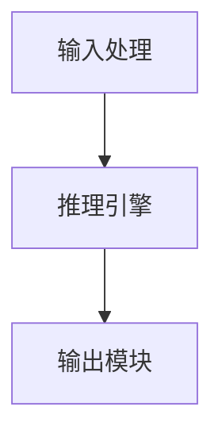
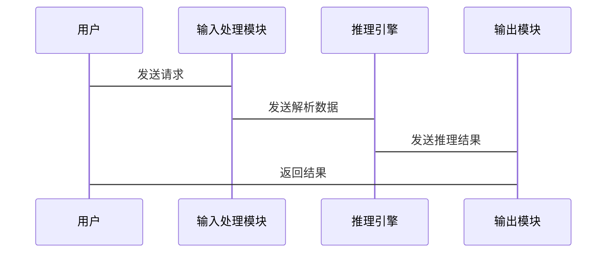

                 


# 《构建具有道德推理能力的AI Agent》

> 关键词：AI Agent, 道德推理, 伦理学, 人工智能, 神经网络

> 摘要：本文详细探讨了如何构建具有道德推理能力的AI Agent，从理论基础到算法实现，再到系统架构设计，结合实际项目案例，全面分析了AI Agent在道德推理中的应用与挑战。通过系统的知识讲解和实战案例分析，读者将能够理解并掌握构建具备道德推理能力AI Agent的核心技术与方法。

---

# 第1章: AI Agent与道德推理概述

## 1.1 AI Agent的基本概念

### 1.1.1 AI Agent的定义与分类

AI Agent（人工智能代理）是指能够感知环境、自主决策并执行任务的智能实体。根据其智能水平和功能复杂度，AI Agent可以分为：

1. **简单反射型AI Agent**：基于预设规则做出反应，如简单的自动回复系统。
2. **基于模型的AI Agent**：利用内部模型进行状态推理和决策，如自动驾驶系统。
3. **目标驱动型AI Agent**：根据明确的目标进行规划和行动，如智能客服系统。
4. **效用驱动型AI Agent**：通过最大化效用函数来优化决策，如智能推荐系统。

### 1.1.2 道德推理在AI Agent中的重要性

AI Agent的决策过程需要考虑伦理和道德因素，尤其是在涉及人类生命、隐私和利益的场景中。道德推理能力使AI Agent能够：

1. **遵守伦理规范**：在医疗、法律等领域，AI Agent需要遵循特定的伦理准则。
2. **处理伦理冲突**：在复杂场景中，AI Agent需要权衡不同利益，做出符合伦理的决策。
3. **提升可信度**：具备道德推理能力的AI Agent更容易被人类信任和接受。

### 1.1.3 当前AI Agent的发展现状

目前，AI Agent在多个领域展现出强大的能力，但也面临诸多挑战：

1. **技术局限**：AI Agent的决策过程往往缺乏透明性和可解释性。
2. **伦理难题**：如何在复杂场景中实现道德推理仍是一个开放性问题。
3. **应用局限**：许多AI Agent仅能处理单一任务，难以应对复杂的伦理场景。

---

## 1.2 道德推理的核心概念

### 1.2.1 道德推理的定义与特点

道德推理是指通过伦理原则和逻辑推理，对复杂情景中的行为进行分析和判断的过程。其特点包括：

1. **情境性**：道德推理依赖于具体的情境和背景。
2. **复杂性**：涉及多个利益相关者的权衡。
3. **动态性**：随着环境变化，道德推理的结果可能需要调整。

### 1.2.2 道德推理与传统AI决策的区别

传统AI决策基于数据和规则，而道德推理则引入了伦理判断和价值评估。两者的区别主要体现在以下几个方面：

| 对比维度         | 传统AI决策                 | 道德推理                     |
|------------------|-----------------------------|------------------------------|
| 决策依据         | 数据、规则                 | 伦理原则、逻辑推理           |
| 决策目标         | 最优化目标值               | 符合伦理规范                 |
| 复杂性           | 较低                       | 较高                         |
| 可解释性         | 较高                       | 较低                         |

### 1.2.3 道德推理的边界与外延

道德推理的边界在于其适用范围和决策权限。外延则包括：

1. **伦理框架**：如功利主义、义务论等。
2. **社会规范**：如法律、道德准则。
3. **文化差异**：不同文化背景下的道德标准不同。

---

## 1.3 本章小结

本章从AI Agent的基本概念出发，探讨了道德推理的重要性及其在AI Agent中的应用价值。通过分析当前AI Agent的发展现状，明确了道德推理在技术与伦理双重维度上的挑战。

---

# 第2章: 道德推理的理论基础

## 2.1 伦理学基础

### 2.1.1 约翰·斯图亚特·密尔的功利主义

密尔的功利主义主张，行为的正确性取决于其带来的最大幸福。公式化为：

$$
\text{效用} = \sum_{i=1}^{n} u_i
$$

其中，$u_i$ 表示每个个体的效用值。

### 2.1.2 康德的义务论

康德的义务论强调行为的道德性取决于其是否遵循道德律。核心公式：

$$
\text{道德行为} = f(\text{行为} \mid \text{道德律})
$$

### 2.1.3 罗尔斯的正义论

罗尔斯的正义论主张，社会的基本原则是确保每个人的基本权利得到平等保护。其正义原则可以用以下公式表示：

$$
\text{正义} = \argmax_{x} \sum_{i=1}^{n} w_i x_i
$$

其中，$w_i$ 是权重，$x_i$ 是各个原则的实现程度。

---

## 2.2 道德推理的模型构建

### 2.2.1 基于规则的道德推理模型

基于规则的模型通过预定义的伦理规则进行推理。规则表示为：

$$
R = \{ r_1, r_2, \dots, r_m \}
$$

其中，$r_i$ 是具体规则。

### 2.2.2 基于案例的道德推理模型

基于案例的模型通过匹配相似案例进行推理。案例匹配公式为：

$$
\text{相似度} = \sum_{j=1}^{k} |a_j - b_j|
$$

其中，$a_j$ 和 $b_j$ 分别是当前案例和历史案例的特征。

### 2.2.3 基于效用的道德推理模型

基于效用的模型通过最大化效用函数进行决策。效用函数为：

$$
U = \sum_{i=1}^{n} w_i a_i
$$

其中，$w_i$ 是权重，$a_i$ 是行动的效用值。

---

## 2.3 道德推理与AI的结合

### 2.3.1 道德推理在AI决策中的应用

通过将伦理原则嵌入AI算法，实现道德决策。例如，在自动驾驶中，AI Agent需要在碰撞不可避免时选择最小化伤害的方案。

### 2.3.2 道德推理的不确定性与复杂性

道德推理涉及模糊性和主观性，导致决策过程的不确定性。例如，在隐私保护与公共利益之间如何权衡。

### 2.3.3 道德推理的可解释性问题

AI Agent的决策过程需要对人类用户透明，以便理解和信任。可解释性公式化为：

$$
\text{可解释性} = \frac{\text{决策的透明度}}{\text{决策的复杂度}}
$$

---

## 2.4 本章小结

本章从伦理学基础出发，探讨了三种主要的道德推理模型，并分析了道德推理在AI中的应用与挑战。通过理论与实践的结合，为后续算法实现奠定了基础。

---

# 第3章: 道德推理算法原理

## 3.1 基于规则的道德推理算法

### 3.1.1 规则的定义与表示

规则可以用逻辑表达式表示：

$$
R: P \rightarrow Q
$$

其中，$P$ 是前提，$Q$ 是结论。

### 3.1.2 规则的冲突解决

在多规则冲突时，优先级规则用于选择最优规则。优先级公式为：

$$
\text{优先级} = \sum_{i=1}^{m} p_i r_i
$$

其中，$p_i$ 是规则的优先级权重，$r_i$ 是规则的权重。

### 3.1.3 规则的动态更新

规则可以根据新数据动态调整。更新公式为：

$$
R_{\text{new}} = R \cup \{ r_{\text{new}} \}
$$

---

## 3.2 基于案例的道德推理算法

### 3.2.1 案例库的构建与管理

案例库管理涉及案例的存储、索引和检索。案例表示为：

$$
C = \{ c_1, c_2, \dots, c_n \}
$$

其中，$c_i$ 是具体案例。

### 3.2.2 案例的相似性度量

相似性度量公式为：

$$
\text{相似度} = \sum_{j=1}^{k} w_j |a_j - b_j|
$$

其中，$w_j$ 是特征权重，$a_j$ 和 $b_j$ 分别是当前案例和目标案例的特征值。

### 3.2.3 案例的推理过程

基于相似案例的推理过程包括：

1. 案例匹配
2. 案例分析
3. 决策推导

---

## 3.3 基于神经网络的道德推理算法

### 3.3.1 神经网络的基本结构

神经网络由输入层、隐藏层和输出层组成。网络结构可以用以下公式表示：

$$
y = f(W x + b)
$$

其中，$W$ 是权重矩阵，$x$ 是输入向量，$b$ 是偏置向量，$f$ 是激活函数。

### 3.3.2 道德推理的神经网络模型

深度神经网络（DNN）用于道德推理的实现。模型训练公式为：

$$
\theta = \argmin_{\theta} \sum_{i=1}^{n} (y_i - \hat{y}_i)^2
$$

其中，$\theta$ 是模型参数，$y_i$ 是真实标签，$\hat{y}_i$ 是预测标签。

### 3.3.3 模型的训练与优化

训练过程包括正向传播和反向传播。优化算法通常使用梯度下降：

$$
\theta_{\text{new}} = \theta - \eta \frac{\partial L}{\partial \theta}
$$

其中，$\eta$ 是学习率，$L$ 是损失函数。

---

## 3.4 算法对比与选择

### 3.4.1 不同算法的优缺点分析

| 算法类型         | 优点                           | 缺点                           |
|------------------|--------------------------------|--------------------------------|
| 基于规则         | 明确性高，易于解释             | 需要大量人工规则               |
| 基于案例         | 灵活性高，适用于非结构化问题   | 对案例库依赖性强               |
| 基于神经网络     | 自适应性强，适合复杂场景       | 黑箱问题，可解释性差           |

### 3.4.2 算法选择的依据

根据具体场景选择算法。例如：

- **规则算法**适用于伦理规范明确的场景。
- **案例算法**适用于具有大量相似案例的场景。
- **神经网络算法**适用于复杂且动态变化的场景。

### 3.4.3 算法的适用场景

- **规则算法**：医疗伦理决策。
- **案例算法**：法律案例分析。
- **神经网络算法**：自动驾驶中的伦理决策。

---

## 3.5 本章小结

本章详细介绍了三种道德推理算法，并分析了它们的优缺点及适用场景。通过对比，为实际应用中的算法选择提供了参考。

---

# 第4章: 道德推理系统的架构设计

## 4.1 系统架构概述

### 4.1.1 系统功能设计

系统功能包括：

1. **输入处理**：接收外部输入并解析。
2. **推理引擎**：执行道德推理并生成决策。
3. **输出模块**：将决策结果输出给用户。

系统功能可以用以下公式表示：

$$
\text{系统输出} = f(\text{系统输入})
$$

其中，$f$ 是推理函数。

### 4.1.2 系统架构图

系统架构图如下：



### 4.1.3 系统交互流程

系统交互流程如下：

1. 用户输入请求。
2. 输入处理模块解析请求。
3. 推理引擎执行道德推理。
4. 输出模块返回结果。

---

## 4.2 系统组件详解

### 4.2.1 输入处理模块

输入处理模块负责接收和解析输入数据。输入数据格式为：

$$
\text{输入} = \{ x_1, x_2, \dots, x_n \}
$$

其中，$x_i$ 是输入特征。

### 4.2.2 推理引擎

推理引擎是系统的核心，负责执行道德推理。推理过程包括：

1. **特征提取**：从输入中提取关键特征。
2. **推理逻辑**：根据规则或模型进行推理。
3. **决策生成**：生成最终决策。

### 4.2.3 输出模块

输出模块将推理结果以用户可读的形式输出。输出格式可以是文本、语音或动作。

---

## 4.3 系统实现细节

### 4.3.1 系统接口设计

系统接口包括：

1. **输入接口**：接收用户输入。
2. **输出接口**：返回推理结果。
3. **配置接口**：设置系统参数。

### 4.3.2 系统交互序列图

系统交互序列图如下：



---

## 4.4 本章小结

本章从系统架构的角度，详细设计了道德推理系统的各个模块和交互流程。通过架构图和交互图，明确了系统的实现细节。

---

# 第5章: 项目实战

## 5.1 项目概述

### 5.1.1 项目背景

本项目旨在构建一个具备道德推理能力的AI Agent，用于医疗伦理决策场景。

### 5.1.2 项目目标

实现一个能够处理医疗伦理问题的AI Agent，能够在患者救治与资源分配中做出道德决策。

---

## 5.2 环境安装

### 5.2.1 系统需求

- 操作系统：Linux/Windows/MacOS
- Python版本：3.8+
- 依赖库：TensorFlow, Keras, scikit-learn

### 5.2.2 安装步骤

1. 安装Python和pip。
2. 安装依赖库：

   ```bash
   pip install tensorflow scikit-learn
   ```

---

## 5.3 系统核心实现

### 5.3.1 核心代码实现

以下是基于规则的道德推理实现代码：

```python
class MoralAgent:
    def __init__(self, rules):
        self.rules = rules

    def decide(self, case):
        for rule in self.rules:
            if rule.apply(case):
                return rule.result
        return None
```

### 5.3.2 代码应用解读

- **规则类**定义了每个规则的条件和结果。
- **MoralAgent**类负责根据输入案例匹配适用的规则。
- **decide**方法遍历规则，返回匹配规则的结果。

---

## 5.4 实际案例分析

### 5.4.1 案例描述

患者A需要紧急手术，但医院资源有限，手术可能影响其他患者的治疗。

### 5.4.2 推理过程

1. 输入处理模块接收案例。
2. 推理引擎匹配适用规则。
3. 输出模块返回决策结果。

---

## 5.5 项目小结

本章通过一个医疗伦理决策的项目，详细展示了道德推理系统的实现过程。通过代码实现和案例分析，读者可以更好地理解理论知识的实际应用。

---

# 第6章: 扩展与展望

## 6.1 前沿技术

### 6.1.1 道德学习

通过强化学习实现道德决策。奖励函数设计为：

$$
R = \sum_{i=1}^{n} r_i a_i
$$

其中，$r_i$ 是奖励权重，$a_i$ 是行动。

### 6.1.2 道德增强学习

结合深度学习和强化学习，实现自适应的道德推理。

### 6.1.3 道德知识图谱

构建伦理知识图谱，用于支持道德推理。

---

## 6.2 挑战与未来方向

### 6.2.1 当前挑战

1. **可解释性**：如何提高AI Agent的决策透明度。
2. **动态性**：如何应对不断变化的伦理规范。
3. **多样性**：如何处理不同文化和价值观的冲突。

### 6.2.2 未来方向

1. **跨领域应用**：将道德推理应用于更多领域。
2. **人机协作**：实现人机协同决策。
3. **伦理框架标准化**：制定统一的伦理推理框架。

---

## 6.3 最佳实践 tips

- **从小规模项目开始**：逐步积累经验。
- **注重可解释性**：确保决策过程透明。
- **持续更新规则库**：适应伦理规范的变化。

---

## 6.4 本章小结

本章展望了道德推理技术的未来发展方向，并提出了应对挑战的最佳实践建议。

---

# 作者：AI天才研究院/AI Genius Institute & 禅与计算机程序设计艺术/Zen And The Art of Computer Programming

---

**摘要**：本文详细探讨了如何构建具有道德推理能力的AI Agent，从理论基础到算法实现，再到系统架构设计，结合实际项目案例，全面分析了AI Agent在道德推理中的应用与挑战。通过系统的知识讲解和实战案例分析，读者将能够理解并掌握构建具备道德推理能力AI Agent的核心技术与方法。

