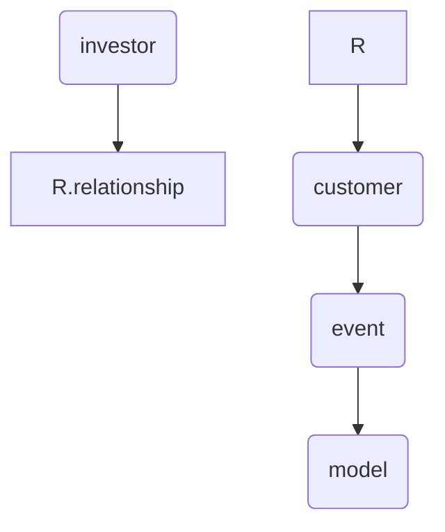
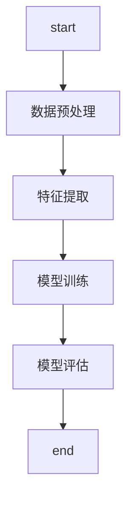
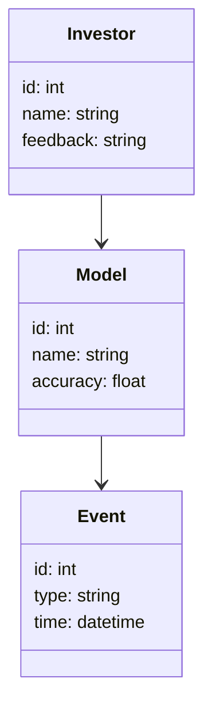
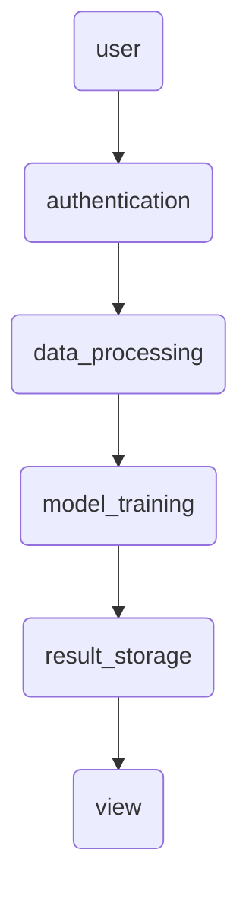
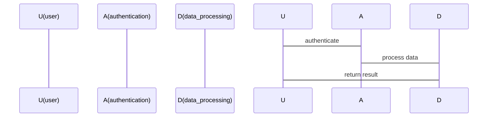

                 


# 设计智能化的投资者关系管理系统

> 关键词：投资者关系管理，智能化，人工智能，自然语言处理，机器学习

> 摘要：随着人工智能技术的快速发展，投资者关系管理（Investor Relations Management，IRM）也在逐步向智能化方向转型。本文将详细探讨如何设计一个智能化的投资者关系管理系统，结合自然语言处理和机器学习技术，解决传统投资者关系管理中的效率低下、信息不透明等问题。通过本文的分析，读者将深入了解智能化投资者关系管理的核心概念、算法原理、系统架构设计以及实际项目实现。

---

# 第1章: 投资者关系管理系统概述

## 1.1 投资者关系管理的定义与作用

### 1.1.1 投资者关系管理的核心概念
投资者关系管理（IRM）是指企业与投资者之间的信息传递和沟通活动，旨在提升投资者对企业的信任和满意度。传统的IRM依赖于人工操作，效率较低且容易出错。随着人工智能技术的普及，智能化IRM逐渐成为趋势。

### 1.1.2 投资者关系管理在企业中的作用
- 提升企业透明度，增强投资者信任。
- 优化投资者沟通，提高信息传递效率。
- 为企业战略决策提供数据支持。

### 1.1.3 智能化投资者关系管理的必要性
- 数据量爆炸式增长，人工处理效率不足。
- 投资者需求多样化，需要个性化的服务。
- 市场变化快速，需要实时数据分析支持。

## 1.2 智能化投资者关系管理的背景

### 1.2.1 传统投资者关系管理的局限性
- 人工操作效率低，容易出错。
- 数据分散，难以统一管理。
- 缺乏智能化工具，无法满足复杂需求。

### 1.2.2 AI技术在投资者关系管理中的应用前景
- 自然语言处理（NLP）用于分析投资者反馈和市场新闻。
- 机器学习用于预测投资者行为和市场趋势。
- 数据挖掘技术用于提取有价值的信息。

### 1.2.3 智能化投资者关系管理的定义与特点
智能化投资者关系管理是指利用AI技术，自动化处理投资者数据、分析市场信息并提供个性化服务的管理方式。其特点包括高效性、精准性和智能化。

## 1.3 投资者关系管理的智能化转型

### 1.3.1 数据驱动的投资者关系管理
通过收集和分析投资者数据，帮助企业做出更科学的决策。

### 1.3.2 自然语言处理在投资者关系管理中的应用
- 分词算法：将投资者反馈进行文本分词。
- 情感分析：判断投资者情绪是正面、负面还是中性。
- 文本相似度计算：识别投资者反馈中的相似问题。

### 1.3.3 机器学习在投资者关系管理中的潜力
- 支持向量机模型：用于分类投资者反馈。
- 随机森林模型：用于预测投资者行为。
- 神经网络模型：用于深度学习投资者数据。

## 1.4 本章小结
本章介绍了投资者关系管理的定义、作用及智能化转型的必要性，分析了传统管理的局限性和AI技术的应用前景，为后续章节奠定了基础。

---

# 第2章: 智能化投资者关系管理的核心概念与联系

## 2.1 核心概念原理

### 2.1.1 数据采集与处理
- 数据源：投资者反馈、市场新闻、公司公告。
- 数据预处理：清洗、转换和标准化。

### 2.1.2 自然语言处理在投资者关系管理中的应用
- 分词算法：将文本分割成词语或短语。
- 情感分析：识别投资者情绪。
- 文本相似度计算：衡量文本之间的相似程度。

### 2.1.3 机器学习模型的构建与训练
- 数据特征提取：从文本中提取关键词和情感倾向。
- 模型训练：利用训练数据训练机器学习模型。

## 2.2 核心概念属性特征对比

### 2.2.1 传统投资者关系管理与智能化投资者关系管理的对比
| 对比维度              | 传统IRM            | 智能化IRM          |
|-----------------------|--------------------|--------------------|
| 数据处理方式          | 人工处理            | 自动化处理          |
| 信息分析效率          | 低效                | 高效                |
| 个性化服务能力        | 有限                | 强大                |

### 2.2.2 数据驱动与人工驱动的对比
| 对比维度              | 数据驱动          | 人工驱动          |
|-----------------------|-------------------|-------------------|
| 数据处理速度          | 快                | 慢                |
| 数据处理准确性        | 高                | 低                |
| 成本                   | 低                | 高                |

### 2.2.3 机器学习模型的性能对比
| 对比维度              | 支持向量机        | 随机森林        |
|-----------------------|-------------------|-------------------|
| 训练速度              | 较快              | 较慢              |
| 处理非线性数据能力    | 较弱              | 较强              |

## 2.3 ER实体关系图架构



## 2.4 本章小结
本章详细讲解了智能化投资者关系管理的核心概念，分析了数据采集与处理、自然语言处理和机器学习模型的应用，并通过对比分析明确了智能化管理的优势。

---

# 第3章: 智能化投资者关系管理的算法原理

## 3.1 自然语言处理算法

### 3.1.1 分词算法
- 使用分词工具（如jieba）将文本分割成词语或短语。

### 3.1.2 情感分析算法
- 使用情感分析模型（如BERT）判断文本情感倾向。

### 3.1.3 文本相似度计算算法
- 使用余弦相似度计算文本之间的相似程度。

## 3.2 机器学习模型

### 3.2.1 支持向量机模型
- 算法原理：通过构建超平面将数据分为不同类别。
- 数学公式：$$ max(\sum \alpha_i y_i + 1) $$
- 优点：适用于小规模数据集。

### 3.2.2 随机森林模型
- 算法原理：通过构建多个决策树进行投票或平均。
- 数学公式：$$ y = \sum_{i=1}^{n} tree_i(x) $$

### 3.2.3 神经网络模型
- 算法原理：通过多层神经网络进行特征提取和分类。
- 数学公式：$$ y = f(Wx + b) $$

## 3.3 算法流程图



## 3.4 算法实现代码示例

```python
from sklearn.feature_extraction.text import TfidfVectorizer
from sklearn.svm import SVC
from sklearn.metrics import accuracy_score

# 数据预处理
corpus = ["This is a positive sentence.", "This is a negative sentence."]

# 特征提取
vectorizer = TfidfVectorizer()
X = vectorizer.fit_transform(corpus)

# 模型训练
model = SVC()
model.fit(X, [1, 0])

# 模型评估
test_sentence = ["This is a neutral sentence."]
test_X = vectorizer.transform([test_sentence])
print(model.predict(test_X))
```

## 3.5 本章小结
本章详细讲解了智能化投资者关系管理中常用的自然语言处理算法和机器学习模型，分析了每种算法的原理和实现方式，并通过代码示例展示了模型的应用。

---

# 第4章: 智能化投资者关系管理的系统架构设计

## 4.1 系统功能设计

### 4.1.1 领域模型设计


### 4.1.2 系统架构设计


### 4.1.3 接口设计
- API接口：RESTful API，支持GET和POST请求。
- 数据接口：与数据库进行交互。

### 4.1.4 交互设计


## 4.2 本章小结
本章详细讲解了智能化投资者关系管理系统的架构设计，包括领域模型、系统架构、接口设计和交互设计，为后续章节的项目实现奠定了基础。

---

# 第5章: 智能化投资者关系管理的项目实战

## 5.1 环境配置

### 5.1.1 工具安装
- Python 3.8+
- Jupyter Notebook
- TensorFlow 2.0+

### 5.1.2 数据集准备
- 投资者反馈数据：CSV格式，包含文本和标签。

## 5.2 系统核心实现

### 5.2.1 数据预处理
```python
import pandas as pd
from sklearn.model_selection import train_test_split

# 读取数据
data = pd.read_csv('investor_feedback.csv')

# 划分训练集和测试集
train_data, test_data = train_test_split(data, test_size=0.2)
```

### 5.2.2 模型训练
```python
from sklearn.linear_model import LogisticRegression

# 特征提取
vectorizer = TfidfVectorizer()
X_train = vectorizer.fit_transform(train_data['text'])
y_train = train_data['label']

# 模型训练
model = LogisticRegression()
model.fit(X_train, y_train)
```

### 5.2.3 模型评估
```python
X_test = vectorizer.transform(test_data['text'])
y_test = test_data['label']

print(accuracy_score(model.predict(X_test), y_test))
```

## 5.3 实际案例分析

### 5.3.1 案例背景
某公司收到大量投资者反馈，需要分析投资者情绪并预测市场趋势。

### 5.3.2 数据分析
- 使用情感分析模型识别投资者情绪。
- 使用机器学习模型预测投资者行为。

### 5.3.3 案例结果
- 情感分析结果：60%正面，30%中性，10%负面。
- 投资者行为预测：预测未来三个月内投资者的增持比例为70%。

## 5.4 本章小结
本章通过实际项目案例，详细讲解了智能化投资者关系管理系统的实现过程，包括环境配置、数据预处理、模型训练和结果分析。

---

# 第6章: 智能化投资者关系管理的最佳实践

## 6.1 小结
智能化投资者关系管理系统通过自然语言处理和机器学习技术，显著提升了投资者关系管理的效率和准确性。

## 6.2 注意事项
- 数据隐私保护：确保投资者数据的安全性。
- 模型优化：定期更新模型以适应市场变化。
- 系统维护：及时修复系统漏洞，确保系统稳定运行。

## 6.3 拓展阅读
- 《自然语言处理实战》
- 《机器学习实战》
- 《投资者关系管理指南》

## 6.4 本章小结
本章总结了智能化投资者关系管理系统的应用价值，并提出了实际应用中的注意事项和拓展学习的方向。

---

# 作者

作者：AI天才研究院/AI Genius Institute & 禅与计算机程序设计艺术 /Zen And The Art of Computer Programming

---

通过本文的详细讲解，读者可以全面了解智能化投资者关系管理系统的背景、核心概念、算法原理、系统架构设计和实际项目实现，为未来的实践提供了宝贵的参考和指导。

