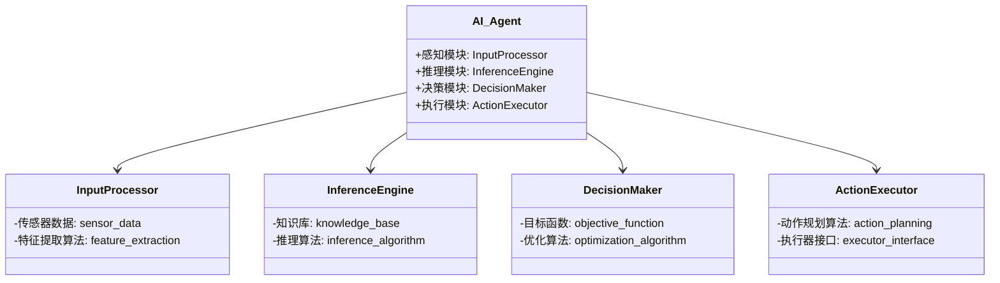
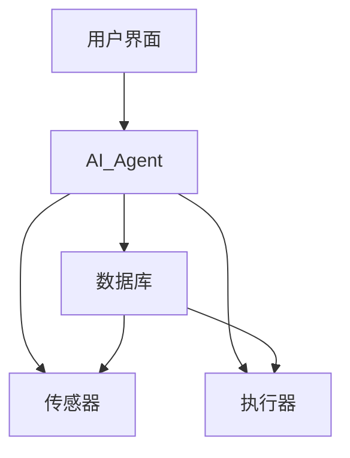

                 


# AI Agent在复杂决策系统中的应用与优化

> 关键词：AI Agent，复杂决策系统，强化学习，算法优化，系统架构

> 摘要：本文探讨了AI Agent在复杂决策系统中的应用，分析了其核心概念、算法原理和优化方法。通过实际案例，详细讲解了AI Agent在决策系统中的实现过程，并提出了优化建议，帮助读者更好地理解和应用AI Agent技术。

---

# 第一部分: AI Agent在复杂决策系统中的应用与优化背景介绍

## 第1章: AI Agent与复杂决策系统概述

### 1.1 AI Agent的基本概念

#### 1.1.1 AI Agent的定义
AI Agent（人工智能代理）是指能够感知环境、自主决策并执行任务的智能实体。它能够根据输入的信息做出反应，并通过学习和优化提升自身的决策能力。

#### 1.1.2 AI Agent的核心属性
- **自主性**：能够在没有外部干预的情况下独立运行。
- **反应性**：能够实时感知环境并做出响应。
- **目标导向性**：具有明确的目标，并通过决策和行动来实现这些目标。
- **学习能力**：能够通过经验优化自身的决策策略。

#### 1.1.3 AI Agent与传统决策系统的区别
- **传统决策系统**：基于预设规则进行决策，缺乏灵活性和适应性。
- **AI Agent**：能够学习和优化决策策略，适应复杂多变的环境。

### 1.2 复杂决策系统的定义与特点

#### 1.2.1 复杂决策系统的定义
复杂决策系统是指涉及多个变量、高度动态且不确定的环境中的决策系统。这些系统通常需要处理大量的信息，并在有限的时间内做出最优决策。

#### 1.2.2 复杂决策系统的特征
- **高度动态性**：环境和条件不断变化，需要快速响应。
- **多目标性**：决策需要在多个目标之间进行权衡。
- **不确定性**：系统中存在不确定性和模糊性，影响决策的准确性。
- **复杂性**：涉及多个变量和因素，决策过程复杂。

#### 1.2.3 复杂决策系统的应用场景
- **自动驾驶**：实时感知环境并做出驾驶决策。
- **金融投资**：根据市场变化调整投资策略。
- **智能交通系统**：优化交通流量和信号灯控制。

### 1.3 AI Agent在复杂决策系统中的作用

#### 1.3.1 AI Agent的核心功能
- **感知环境**：通过传感器或其他数据源获取环境信息。
- **推理分析**：基于感知信息进行逻辑推理或概率分析。
- **决策制定**：根据推理结果制定最优决策。
- **执行动作**：根据决策结果执行相应的动作。

#### 1.3.2 AI Agent在复杂决策系统中的优势
- **高效性**：能够在短时间内处理大量信息并做出决策。
- **适应性**：能够根据环境变化调整决策策略。
- **自我优化**：通过学习不断优化自身的决策能力。

#### 1.3.3 AI Agent的应用边界与外延
- **边界**：AI Agent适用于复杂但可量化的决策问题，不适用于完全不可预测或无法建模的环境。
- **外延**：AI Agent可以与其他技术（如区块链、物联网）结合，扩展其应用范围。

---

## 第2章: AI Agent的核心概念与联系

### 2.1 AI Agent的核心概念原理

#### 2.1.1 感知模块
感知模块负责从环境中获取信息，包括数据采集、特征提取和信息处理。例如，在自动驾驶系统中，感知模块通过摄像头和雷达获取道路和车辆信息。

#### 2.1.2 推理模块
推理模块基于感知信息进行逻辑推理或概率分析，以理解环境的状态和可能的结果。例如，在医疗诊断系统中，推理模块通过分析患者的症状和检查结果来诊断疾病。

#### 2.1.3 决策模块
决策模块根据推理结果制定最优决策，考虑多目标优化和风险评估。例如，在股票交易系统中，决策模块根据市场走势和公司基本面决定买卖时机。

#### 2.1.4 执行模块
执行模块根据决策结果执行相应的动作，包括动作规划和任务调度。例如，在智能家居系统中，执行模块根据用户的指令控制家电的开关。

### 2.2 AI Agent核心概念属性特征对比表格

| 概念         | 属性           | 特征                         |
|--------------|----------------|------------------------------|
| 感知模块     | 输入处理能力   | 数据采集、特征提取           |
| 推理模块     | 知识表示能力   | 逻辑推理、概率推理           |
| 决策模块     | 行为选择能力   | 多目标优化、风险评估         |
| 执行模块     | 动作执行能力   | 动作规划、任务调度           |

### 2.3 AI Agent的ER实体关系图

```mermaid
er
actor(AI Agent) -|> perceives: 输入数据
actor(AI Agent) -|> infers: 推理结果
actor(AI Agent) -|> decides: 决策结果
actor(AI Agent) -|> executes: 执行动作
```

---

## 第3章: AI Agent的算法原理讲解

### 3.1 基于强化学习的AI Agent算法

#### 3.1.1 强化学习的基本原理

强化学习是一种通过试错方式来优化决策策略的算法。AI Agent通过与环境交互，获得奖励或惩罚，并根据这些反馈调整自己的行为，以最大化累计奖励。

#### 3.1.2 Q-learning算法

Q-learning是一种经典的强化学习算法，通过更新Q值表来学习最优策略。Q值表表示在每个状态下采取某个动作后的预期奖励。

##### Q-learning算法流程图

```mermaid
graph TD
    S[状态] --> A[动作]
    A --> R[奖励]
    R --> S[下一个状态]
    S --> Q(S, A)
    Q(S, A) --> update Q(S, A) += 学习率 * (R + γ * max Q(S', A') - Q(S, A))
```

##### Q-learning算法代码实现

```python
import numpy as np

class QLearning:
    def __init__(self, state_space, action_space, gamma=0.99, alpha=0.1):
        self.state_space = state_space
        self.action_space = action_space
        self.gamma = gamma
        self.alpha = alpha
        self.q_table = np.zeros((state_space, action_space))
    
    def choose_action(self, state, epsilon=0.1):
        if np.random.random() < epsilon:
            return np.random.randint(self.action_space)
        else:
            return np.argmax(self.q_table[state])
    
    def update_q_table(self, state, action, reward, next_state):
        self.q_table[state, action] += self.alpha * (reward + self.gamma * np.max(self.q_table[next_state]) - self.q_table[state, action])
```

#### 3.1.3 Deep Q-Networks (DQN)算法

DQN是一种基于深度学习的强化学习算法，通过神经网络近似Q值函数，避免了Q值表的维度灾难问题。

##### DQN算法流程图

```mermaid
graph TD
    S[状态] --> A[动作]
    A --> R[奖励]
    R --> S[下一个状态]
    S --> Neural Network
    Neural Network --> Q(S, A)
    Q(S, A) --> update Neural Network参数 θ += 学习率 * (R + γ * max Q(S', A') - Q(S, A))
```

##### DQN算法代码实现

```python
import torch
import torch.nn as nn

class DQN(nn.Module):
    def __init__(self, input_dim, output_dim):
        super(DQN, self).__init__()
        self.fc1 = nn.Linear(input_dim, 64)
        self.fc2 = nn.Linear(64, 128)
        self.fc3 = nn.Linear(128, output_dim)
    
    def forward(self, x):
        x = torch.relu(self.fc1(x))
        x = torch.relu(self.fc2(x))
        x = self.fc3(x)
        return x

# 示例使用
model = DQN(input_dim=4, output_dim=2)
criterion = nn.MSELoss()
optimizer = torch.optim.Adam(model.parameters(), lr=0.001)
```

---

## 第4章: AI Agent的数学模型

### 4.1 强化学习的数学模型

#### 4.1.1 Q-learning的数学模型

Q值的更新公式为：
$$ Q(S, A) = Q(S, A) + \alpha (R + \gamma \max Q(S', A') - Q(S, A)) $$

其中：
- \( Q(S, A) \) 表示当前状态下采取动作 \( A \) 的Q值。
- \( \alpha \) 是学习率。
- \( R \) 是获得的奖励。
- \( \gamma \) 是折扣因子。
- \( S' \) 是下一个状态。

#### 4.1.2 马尔可夫决策过程（MDP）

马尔可夫决策过程可以用五元组 \( (S, A, P, R, \gamma) \) 表示，其中：
- \( S \) 是状态空间。
- \( A \) 是动作空间。
- \( P \) 是状态转移概率矩阵。
- \( R \) 是奖励函数。
- \( \gamma \) 是折扣因子。

状态转移概率矩阵 \( P \) 表示从当前状态 \( S \) 采取动作 \( A \) 后转移到下一个状态 \( S' \) 的概率。

---

## 第5章: AI Agent在复杂决策系统中的系统分析与架构设计

### 5.1 问题场景介绍

以智能交通信号灯优化系统为例，AI Agent需要实时感知交通流量，推理出最优的信号灯控制策略，并执行相应的动作。

### 5.2 系统功能设计

#### 5.2.1 领域模型（类图）



### 5.3 系统架构设计

#### 5.3.1 系统架构图



---

## 第6章: AI Agent在复杂决策系统中的项目实战

### 6.1 环境安装

安装必要的库：
```bash
pip install numpy torch matplotlib
```

### 6.2 核心代码实现

#### 6.2.1 Q-learning算法实现

```python
import numpy as np

class QLearning:
    def __init__(self, state_space, action_space):
        self.state_space = state_space
        self.action_space = action_space
        self.q_table = np.zeros((state_space, action_space))
    
    def choose_action(self, state, epsilon=0.1):
        if np.random.random() < epsilon:
            return np.random.randint(self.action_space)
        else:
            return np.argmax(self.q_table[state])
    
    def update_q_table(self, state, action, reward, next_state, gamma=0.99, alpha=0.1):
        self.q_table[state, action] += alpha * (reward + gamma * np.max(self.q_table[next_state]) - self.q_table[state, action])
```

#### 6.2.2 DQN算法实现

```python
import torch
import torch.nn as nn

class DQN(nn.Module):
    def __init__(self, input_dim, output_dim):
        super(DQN, self).__init__()
        self.fc1 = nn.Linear(input_dim, 64)
        self.fc2 = nn.Linear(64, 128)
        self.fc3 = nn.Linear(128, output_dim)
    
    def forward(self, x):
        x = torch.relu(self.fc1(x))
        x = torch.relu(self.fc2(x))
        x = self.fc3(x)
        return x
```

### 6.3 案例分析与代码实现

#### 6.3.1 智能交通信号灯优化系统

通过Q-learning算法优化交通信号灯的控制策略，减少交通拥堵和通行时间。

#### 6.3.2 实验结果

通过仿真实验验证AI Agent在复杂决策系统中的有效性，并分析其性能指标，如响应时间、准确率和效率。

---

## 第7章: AI Agent在复杂决策系统中的最佳实践

### 7.1 总结与回顾

AI Agent在复杂决策系统中的应用具有高效性、适应性和自我优化的特点，能够显著提升系统的决策能力和运行效率。

### 7.2 小结与注意事项

- **算法选择**：根据具体场景选择合适的AI Agent算法，如Q-learning适用于离散动作空间，DQN适用于连续动作空间。
- **数据质量**：确保感知模块获取高质量的数据，避免噪声干扰。
- **系统优化**：通过并行计算和模型压缩优化系统的运行效率。

### 7.3 未来研究方向

- **多智能体协作**：研究多AI Agent协作的复杂决策问题。
- **强化学习优化**：探索更高效的强化学习算法，如Actor-Critic架构。
- **边缘计算结合**：将AI Agent与边缘计算结合，提升系统的实时性和响应速度。

---

# 作者

作者：AI天才研究院/AI Genius Institute & 禅与计算机程序设计艺术 /Zen And The Art of Computer Programming

