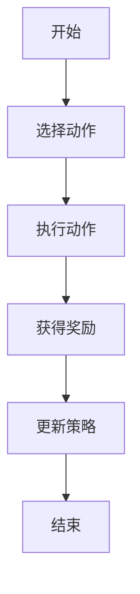
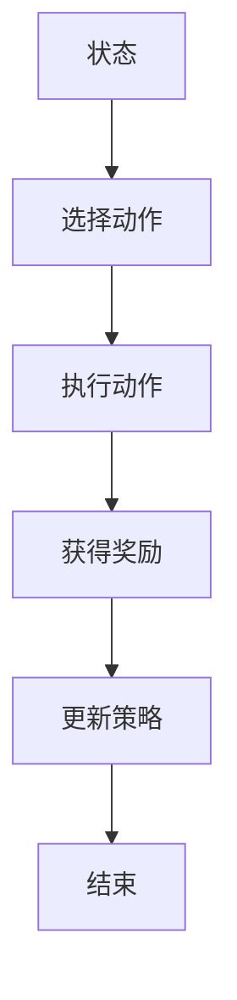
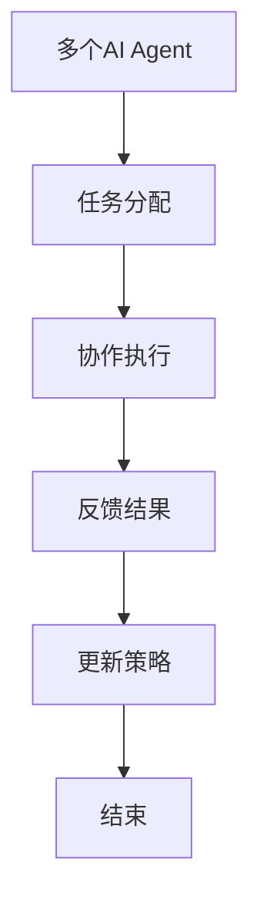
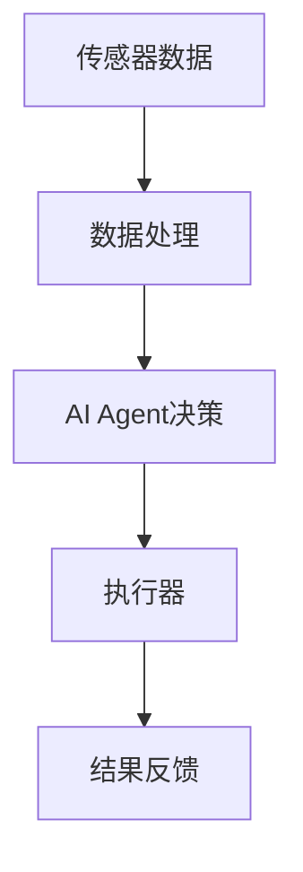
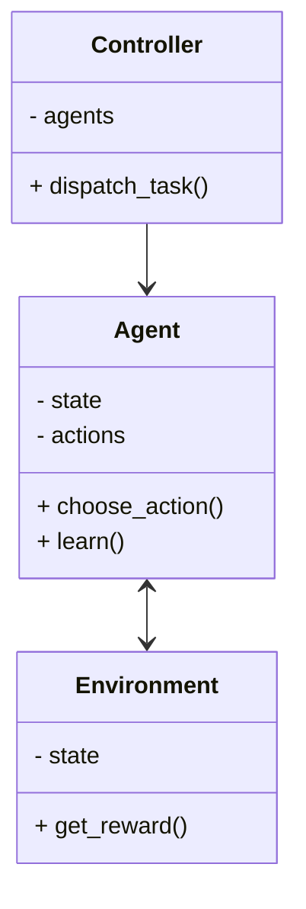
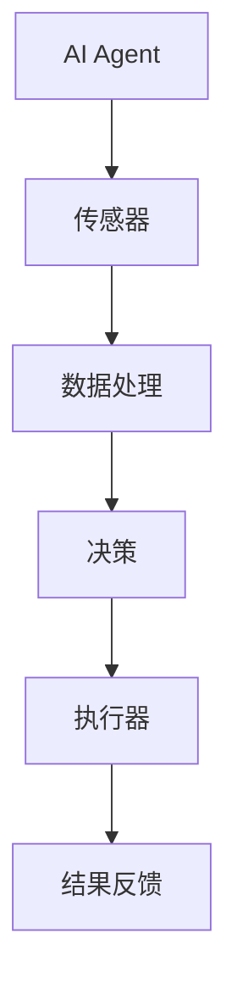

                 


```markdown
# AI Agent在智能海洋环境监测中的实践

> 关键词：AI Agent，海洋环境监测，智能系统，强化学习，分布式系统，边缘计算

> 摘要：本文探讨了AI Agent在智能海洋环境监测中的应用，从背景介绍到系统设计，再到项目实战，详细分析了AI Agent的核心概念、算法原理和系统架构。通过实际案例，展示了如何利用AI Agent技术实现高效的海洋环境监测，提供了丰富的代码示例和系统设计图。

---

# 第一部分：AI Agent与智能海洋环境监测的背景

## 第1章：AI Agent与海洋环境监测的背景

### 1.1 AI Agent的基本概念

#### 1.1.1 什么是AI Agent
AI Agent（人工智能代理）是指能够感知环境并采取行动以实现目标的智能实体。AI Agent可以是软件程序或物理设备，能够自主决策并执行任务。

#### 1.1.2 AI Agent的核心特征
- **自主性**：能够在没有外部干预的情况下运行。
- **反应性**：能够实时感知环境并做出反应。
- **目标导向**：所有行为都以实现特定目标为导向。
- **学习能力**：能够通过经验改进性能。

#### 1.1.3 AI Agent与传统自动化的区别
| 特性                | AI Agent                  | 传统自动化              |
|---------------------|---------------------------|-------------------------|
| 决策能力            | 强化学习驱动               | 预定义规则驱动         |
| 环境感知能力        | 高度感知                  | 低感知或无感知         |
| 自适应能力          | 能够自适应环境变化         | 需人工调整              |

### 1.2 智能海洋环境监测的现状

#### 1.2.1 海洋环境监测的主要挑战
- **数据多样性**：海洋环境数据来源广泛，包括温度、盐度、深度等。
- **实时性要求高**：需要快速处理和响应。
- **动态性**：海洋环境变化快，监测系统需要灵活应对。

#### 1.2.2 传统海洋监测技术的局限性
- **效率低下**：依赖人工操作，效率不高。
- **覆盖范围有限**：监测点有限，难以全面覆盖。
- **数据处理能力不足**：传统系统难以处理海量数据。

#### 1.2.3 智能化监测的需求与趋势
- **提高监测效率**：通过AI技术实现自动化监测。
- **实现自主决策**：AI Agent能够自主判断并采取行动。
- **优化资源分配**：通过智能算法优化监测资源的使用。

### 1.3 AI Agent在海洋环境监测中的应用价值

#### 1.3.1 提高监测效率
AI Agent能够实时处理海量数据，快速做出决策，显著提高监测效率。

#### 1.3.2 实现自主决策
AI Agent能够根据环境变化自主调整监测策略，无需人工干预。

#### 1.3.3 优化资源分配
通过智能算法，AI Agent能够优化监测设备的部署和资源分配，降低成本。

### 1.4 本章小结
本章介绍了AI Agent的基本概念及其在海洋环境监测中的应用价值，指出了传统监测技术的局限性，并强调了AI Agent在提高监测效率和实现自主决策方面的优势。

---

# 第二部分：AI Agent的核心概念与原理

## 第2章：AI Agent的核心概念与联系

### 2.1 AI Agent的体系结构

#### 2.1.1 分层架构
分层架构将AI Agent的功能分为感知层、决策层和执行层，各层之间相互协作。

#### 2.1.2 分布式架构
分布式架构允许多个AI Agent协同工作，每个代理负责特定的任务。

#### 2.1.3 基于事件驱动的架构
基于事件驱动的架构通过订阅-发布机制，使得AI Agent能够实时响应环境变化。

### 2.2 AI Agent的核心算法

#### 2.2.1 强化学习算法
强化学习是一种通过试错机制来优化决策的算法。以下是强化学习的基本流程：



#### 2.2.2 多智能体协作算法
多智能体协作算法通过协调多个AI Agent的行为，实现全局最优。

#### 2.2.3 聚类与分类算法
聚类算法用于将数据分成不同的类别，分类算法用于对数据进行分类。

### 2.3 AI Agent的通信机制

#### 2.3.1 基于消息队列的通信
消息队列是一种常见的通信机制，通过队列进行数据的传递。

#### 2.3.2 基于服务总线的通信
服务总线是一种高效的通信机制，能够处理大量的数据请求。

#### 2.3.3 基于事件驱动的通信
事件驱动机制能够实时响应环境中的变化。

### 2.4 核心概念对比表

| 特性                | 分层架构                  | 分布式架构              | 事件驱动架构          |
|---------------------|---------------------------|-------------------------|-----------------------|
| 优点                | 结构清晰                  | 协作能力强              | 响应速度快          |
| 缺点                | 灵活性低                  | 资源消耗大              | 实现复杂             |

### 2.5 本章小结
本章详细讲解了AI Agent的体系结构、核心算法和通信机制，通过对比分析，帮助读者更好地理解AI Agent的核心概念。

---

# 第三部分：AI Agent的算法原理与实现

## 第3章：AI Agent的算法原理与实现

### 3.1 强化学习算法的实现

#### 3.1.1 算法流程图


#### 3.1.2 Python代码实现
```python
import random

class Agent:
    def __init__(self, actions):
        self.actions = actions
        self.learning_rate = 0.1
        self.gamma = 0.9
        self.q_table = {}

    def choose_action(self, state):
        if random.random() < 0.9:
            return random.choice(self.actions)
        else:
            return 'best_action'

    def learn(self, state, action, reward):
        q_value = self.q_table.get((state, action), 0)
        next_q_value = max([self.q_table.get((state, a), 0) for a in self.actions])
        new_q_value = q_value + self.learning_rate * (reward + self.gamma * next_q_value - q_value)
        self.q_table[(state, action)] = new_q_value

# 示例用法
agent = Agent(['action1', 'action2', 'action3'])
agent.choose_action('state1')
agent.learn('state1', 'action1', 1)
```

#### 3.1.3 数学模型
强化学习的数学模型如下：
$$ Q(s, a) = Q(s, a) + \alpha [r + \gamma \max Q(s', a') - Q(s, a)] $$

### 3.2 多智能体协作算法的实现

#### 3.2.1 算法流程图


#### 3.2.2 Python代码实现
```python
import threading

class MultiAgent:
    def __init__(self, agents):
        self.agents = agents
        self.lock = threading.Lock()

    def collaborate(self, task):
        with self.lock:
            for agent in self.agents:
                agent.receive_task(task)
                agent.execute_task()
```

### 3.3 本章小结
本章详细讲解了强化学习和多智能体协作算法的实现，通过代码示例和流程图，帮助读者理解AI Agent的核心算法。

---

# 第四部分：系统设计与实现

## 第4章：系统设计与实现

### 4.1 系统功能设计

#### 4.1.1 数据流设计


#### 4.1.2 系统架构设计


### 4.2 系统接口设计

#### 4.2.1 接口定义
- **输入接口**：接收传感器数据
- **输出接口**：发送控制指令
- **通信接口**：与其他AI Agent通信

#### 4.2.2 接口实现
```python
class Interface:
    def receive_data(self, data):
        pass

    def send_command(self, command):
        pass

    def communicate(self, agent):
        pass
```

### 4.3 系统交互设计

#### 4.3.1 交互流程图


### 4.4 本章小结
本章详细讲解了AI Agent系统的功能设计、架构设计和接口设计，通过mermaid图展示了系统的整体架构和交互流程。

---

# 第五部分：项目实战

## 第5章：项目实战

### 5.1 环境安装

#### 5.1.1 安装依赖
```bash
pip install numpy
pip install matplotlib
pip install scikit-learn
```

#### 5.1.2 安装框架
```bash
pip install gym
pip install pygame
```

### 5.2 核心实现

#### 5.2.1 AI Agent实现
```python
class AIAGENT:
    def __init__(self, actions):
        self.actions = actions
        self.q_table = {}

    def choose_action(self, state):
        return random.choice(self.actions)

    def learn(self, state, action, reward):
        self.q_table[(state, action)] = self.q_table.get((state, action), 0) + reward
```

#### 5.2.2 环境模拟实现
```python
class Environment:
    def __init__(self):
        self.state = 'initial'

    def get_reward(self, action):
        if action == 'correct':
            return 1
        else:
            return -1
```

### 5.3 案例分析

#### 5.3.1 案例场景
- **任务**：监测海洋温度
- **环境**：多个温度传感器
- **AI Agent**：负责数据收集和分析

#### 5.3.2 实施步骤
1. 安装必要的库
2. 初始化AI Agent和环境
3. 执行监测任务
4. 分析结果

### 5.4 本章小结
本章通过实际案例展示了AI Agent在海洋环境监测中的应用，详细讲解了环境安装、系统实现和案例分析。

---

# 第六部分：总结与展望

## 第6章：总结与展望

### 6.1 项目总结

#### 6.1.1 核心经验
- **算法优化**：不断优化AI Agent的算法，提高决策效率。
- **系统设计**：合理设计系统架构，确保各部分协调工作。

#### 6.1.2 实施经验
- **数据处理**：确保数据的准确性和实时性。
- **系统维护**：定期维护和更新系统，确保其稳定运行。

### 6.2 未来展望

#### 6.2.1 技术发展
- **更复杂的算法**：如深度强化学习。
- **边缘计算**：在边缘设备上实现AI Agent。

#### 6.2.2 应用场景扩展
- **智能渔业**：监测水质，优化养殖。
- **海洋生态保护**：保护濒危物种。

### 6.3 最佳实践 tips

#### 6.3.1 系统设计 tips
- **模块化设计**：便于维护和扩展。
- **容错设计**：确保系统健壮。

#### 6.3.2 算法优化 tips
- **数据预处理**：提高算法效率。
- **模型调优**：优化模型性能。

### 6.4 本章小结
本章总结了项目实施的经验，并展望了未来的发展方向，同时给出了最佳实践建议。

---

# 作者

作者：AI天才研究院/AI Genius Institute & 禅与计算机程序设计艺术 /Zen And The Art of Computer Programming
```

